### 提示词工程

1. 少样本提示

   例如：

   ```python
   prompt="""
   使用数字和基本运算(+-*/) 得到24.
   Input: 4 4 6 8
   Answer: (4+8) * (6-4) = 24
   Input: 2 9 10 12
   Answer: 2 * 12 * (10 - 9) = 24
   Input: {input}
   """
   ```

   举例子给gpt，可以让gpt模仿例子的结构进行返回。

2. 思维链提示

   例如:

   ```python
   prompt="""
   使用数字和基本运算(+-*/) 得到24.每一步,只能从剩下的数字中选择两个来获得新的数字.
   Input: 4 4 6 8
   Answer: 先计算4 + 8 = 12,再计算6 - 4 = 2,最后计算2 * 12 = 24.最后结果:(4+8) * (6-4) = 24
   Input: {input}
   Answer:
   """
   ```

   思维链的方式，为了让gpt不要这么快得出答案，增加获取答案的思考步骤，可以使gpt回答的更精确。

3. 自我一致性

   即通过整合多条回复,选择其中出现次数最多的答案.

4. 思维树提示

   将问题进行拆分多个子问题,然后子问题也可进行拆分,逐个解决.

   

----

#### 技巧: 

1. 使用清晰,明确,避免模糊的词语

2. 分隔符:使用` ``` ` ,`"""`,`< >`, `<tag> </tag>`将指令和待处理的内容分开

   例如:

   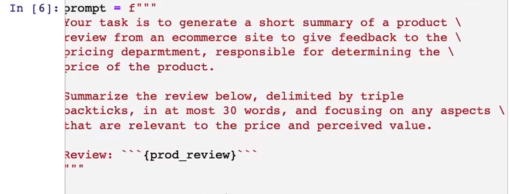

   > [!NOTE]
   >
   > 需要注意的是,要防止 提示词注入. 即用户输入的文本可能包含与你的预设 Prompt 相冲突的内容，如果不加分隔，这些输入就可能“注入”并操纵语言模型，导致模型产生毫无关联的乱七八糟的输出。

   

3. 指定输出格式

4. 角色扮演

5. 告诉gpt用户是什么角色

6. 设置temperature值（0-1），temperature将允许我们改变模型响应的多样性（随机性），temperature越接近0，表明模型将会选择下一个单词概率最大的，temperature越接近1，表明模型有一定概率会选择下一个单词概率较小的。

   若想构建一个可靠和可预测的系统，应该使temperature=0

   若想使模型更具有创意和随机性，获得更广泛的不同输出，应该提高temperature的值。

   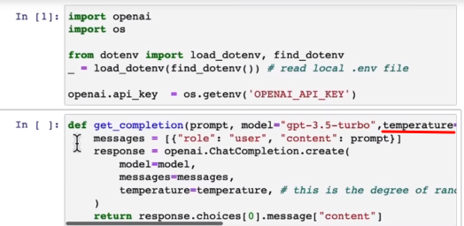

7. 上下文：与模型每次对话都是独立的对话，因此需要提供当前对话中所有相关信息，以供模型使用。

   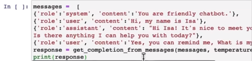

8. 

----

#### 零样本提示(zero-shot):

给模型提供指令,背景和数据后,直接布置任务,没有提供参考案例的prompt为零样本提示.


少样本提示(few-shot):

提供少量的样本案例,启用上下文学习的能力,让模型举一反三

可以尝试提供多个例子,看看模型能否达到满意的效果.


---

#### 思维链提示

给模型例子的时候,把思考的过程加进去

==咒语: 让我们一步一步地思考(Let's think step by step)==

----

#### search api + gpt

在应用端先去搜索问题,联网获取到的搜索结果去调用gpt模型,让gpt进行总结归纳来回答用户的问题.

模板:

```python
WEBSEARCH_PTOMPT_TEMPLATE = """
Web search results:
{web_results}
Current date: {current_date}
Instructions: Using the provided web search results, write a comprehensive reply to the given query.
Make sure to cite results using [[number](URL)] notation after the reference.
Query: {query}
Reply in {reply_language}
"""
```

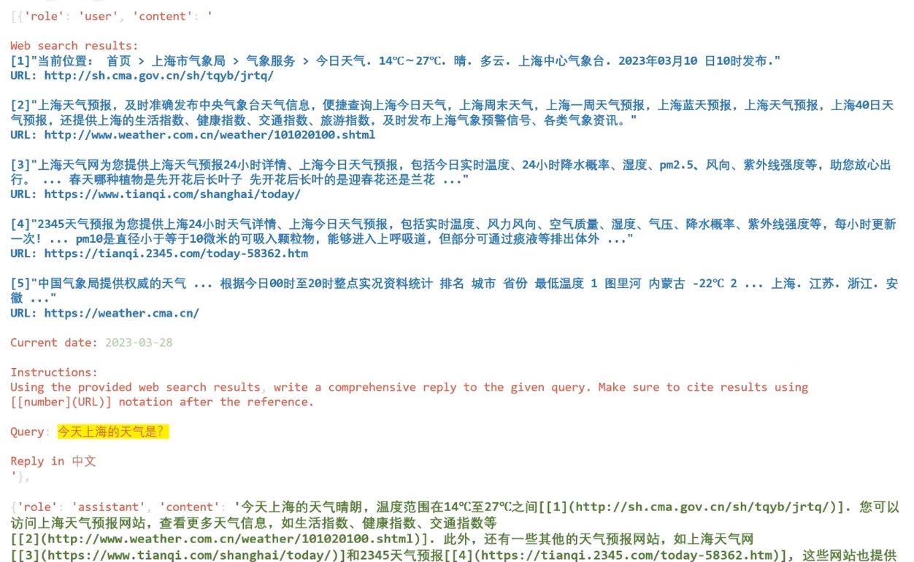

----

#### Embedding Search + gpt

如果要传给gpt的prompt太长了,不能够直接喂给gpt(gpt能够接收4000个字符的限制),这时就要将文本进行切片,通过Embedding模型,将切片转换成向量,保存在本地的向量数据库.

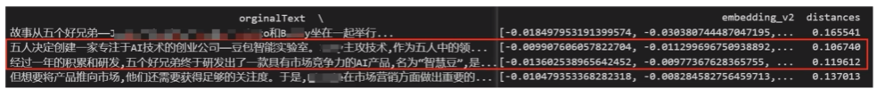

接下来可以把用户的问题也转换为向量,通过计算距离,可以从数据库中找到问题与语料最相关的几个片段.

最后将找到的这几个片段与用户的问题整理成一个prompt,传给gpt模型.让gpt总结归纳回答问题.

例子:

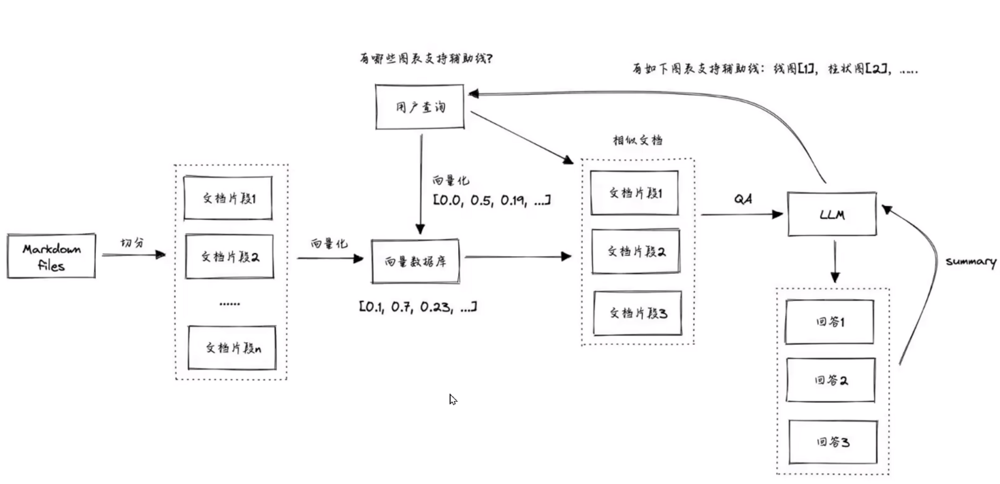

[吴恩达 Prompt Engineering 教程](https://github.com/GitHubDaily/ChatGPT-Prompt-Engineering-for-Developers-in-Chinese)

[OpenAI最佳实践](https://help.openai.com/en/articles/6654000-best-practices-for-prompt-engineering-with-openai-api)

[Azure OpenAI](https://learn.microsoft.com/en-us/azure/cognitive-services/openai/concepts/advanced-prompt-engineering?pivots=programming-language-chat-completions)


----

#### ReAct

让gpt模型在推理过程中,==自己决定要调用哪个外部工具==(例如:search api, 计算器, 调用本地文件, mid-journey等等). 当调用外部工具后,把工具生成的结果告诉gpt模型,然后gpt模型继续推理下一步需要做什么.

模板:

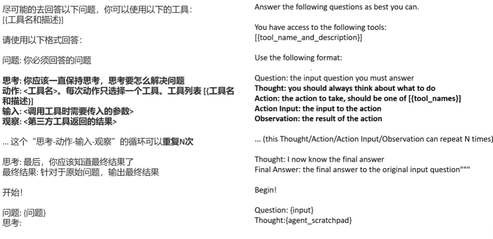

例子:

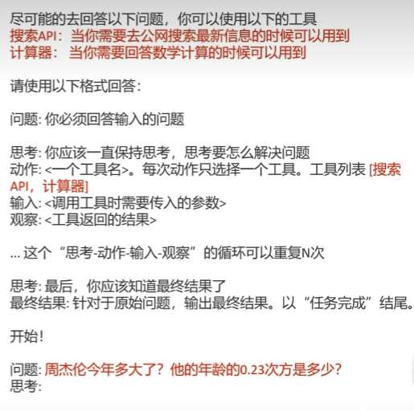

细节:

设置gpt模型执行到 <观察>阶段就停下来,在应用端中通过gpt模型返回的<动作>结果去调用某个第三方工具,

输入gpt生成的<输入>参数. 

将第三方工具返回的结果填入前面的prompt中,重新作为一个prompt输入给gpt模型,引导gpt模型进行新一轮思考.

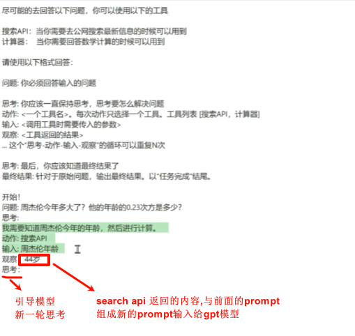

之后不断重复步骤,知道gpt模型给出<最终结果>为止.

例子：

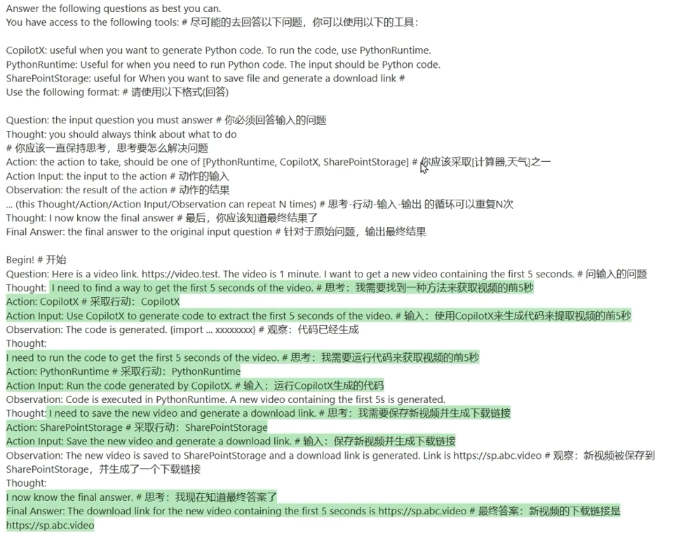


### 搭建基于ChatGPT问答系统


#### Tokens

==LLM 实际上并不是重复预测下一个单词，而是重复预测下一个 token==

对于一个句子，语言模型会先使用分词器将其拆分为一个个 token ，而不是原始的单词。对于生僻词，可能会拆分为多个 token 。这样可以大幅降低字典规模，提高模型训练和推断的效率。例如，对于 "Learning new things is fun!" 这句话，每个单词都被转换为一个 token ，而对于较少使用的单词，如 "Prompting as powerful developer tool"，单词 "prompting" 会被拆分为三个 token，即"prom"、"pt"和"ing"。


> [!NOTE]
>
>  对于英文输入，一个 token 一般对应 4 个字符或者四分之三个单词；对于中文输入，一个 token 一般对应一个或半个词。不同模型有不同的 token 限制，需要注意的是，这里的 token 限制是**输入的 Prompt 和输出的 completion 的 token 数之和**，因此输入的 Prompt 越长，能输出的 completion 的上限就越低。 ChatGPT3.5-turbo 的 token 上限是 4096。
>
>
>  “#” 是一个理想的分隔符，因为它可以被视为一个单独的 token 。
>
> 

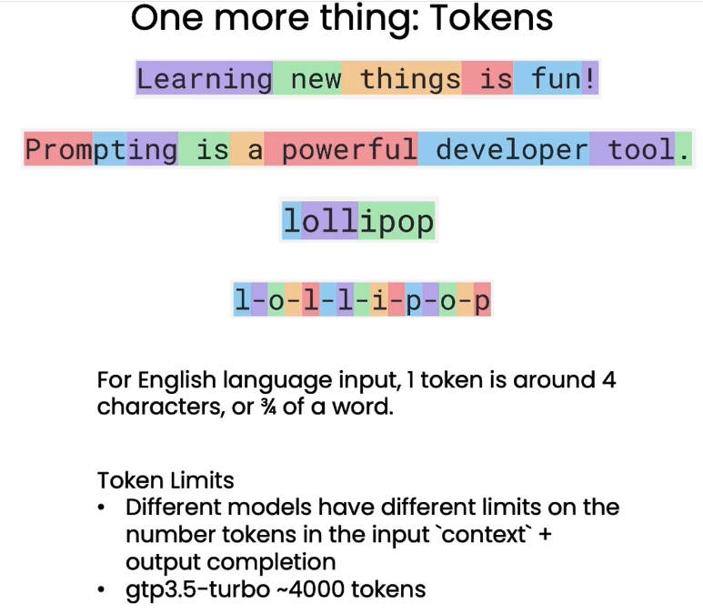

----

#### 提问范式

```python
message = [
    { "role": "system", "content": "You are an assistant..." },
    { "role": "user", "content": "Tell me a joke " },
    { "role": "assistant", "content": "Why did the chicken... "},
    ...
]
```

通过这种提问格式，我们可以明确地角色扮演，让语言模型理解自己就是助手这个角色，需要回答问题。这可以减少无效输出，帮助其生成针对性强的回复。

```python
import openai
def get_completion_from_messages(messages, 
                                 model="gpt-3.5-turbo", 
                                 temperature=0, 
                                 max_tokens=500):
    '''
    封装一个支持更多参数的自定义访问 OpenAI GPT3.5 的函数

    参数: 
    messages: 这是一个消息列表，每个消息都是一个字典，包含 role(角色）和 content(内容)。角色可以是'system'、'user' 或 'assistant’，内容是角色的消息。
    model: 调用的模型，默认为 gpt-3.5-turbo(ChatGPT)，有内测资格的用户可以选择 gpt-4
    temperature: 这决定模型输出的随机程度，默认为0，表示输出将非常确定。增加温度会使输出更随机。
    max_tokens: 这决定模型输出的最大的 token 数。
    '''
    response = openai.ChatCompletion.create(
        model=model,
        messages=messages,
        temperature=temperature, # 这决定模型输出的随机程度
        max_tokens=max_tokens, # 这决定模型输出的最大的 token 数
    )
    return response.choices[0].message["content"]

```

例子:

```python
messages =  [  
{'role':'system',
 'content':'你是一个助理， 并以 Seuss 苏斯博士的风格作出回答，只回答一句话'},    
{'role':'user',
 'content':'写一个关于快乐的小鲸鱼的故事'},
] 
response = get_completion_from_messages(messages, temperature =1)
print(response)

```

下面定义了一个 get_completion_and_token_count 函数，它实现了调用 OpenAI 的 模型生成聊天回复， 并返回生成的回复内容以及使用的 token 数量。

```python
def get_completion_and_token_count(messages, 
                                   model="gpt-3.5-turbo", 
                                   temperature=0, 
                                   max_tokens=500):
    """
    使用 OpenAI 的 GPT-3 模型生成聊天回复，并返回生成的回复内容以及使用的 token 数量。

    参数:
    messages: 聊天消息列表。
    model: 使用的模型名称。默认为"gpt-3.5-turbo"。
    temperature: 控制生成回复的随机性。值越大，生成的回复越随机。默认为 0。
    max_tokens: 生成回复的最大 token 数量。默认为 500。

    返回:
    content: 生成的回复内容。
    token_dict: 包含'prompt_tokens'、'completion_tokens'和'total_tokens'的字典，分别表示提示的 token 数量、生成的回复的 token 数量和总的 token 数量。
    """
    response = openai.ChatCompletion.create(
        model=model,
        messages=messages,
        temperature=temperature, 
        max_tokens=max_tokens,
    )

    content = response.choices[0].message["content"]
    
    token_dict = {
'prompt_tokens':response['usage']['prompt_tokens'],
'completion_tokens':response['usage']['completion_tokens'],
'total_tokens':response['usage']['total_tokens'],
    }

    return content, token_dict

```

----


#### 评估输入-分类 Classification

```python
system_message = f"""
你将获得客户服务查询。
每个客户服务查询都将用{delimiter}字符分隔。
将每个查询分类到一个主要类别和一个次要类别中。
以 JSON 格式提供你的输出，包含以下键：primary 和 secondary。

主要类别：计费（Billing）、技术支持（Technical Support）、账户管理（Account Management）或一般咨询（General Inquiry）。

计费次要类别：
取消订阅或升级（Unsubscribe or upgrade）
添加付款方式（Add a payment method）
收费解释（Explanation for charge）
争议费用（Dispute a charge）

技术支持次要类别：
常规故障排除（General troubleshooting）
设备兼容性（Device compatibility）
软件更新（Software updates）

账户管理次要类别：
重置密码（Password reset）
更新个人信息（Update personal information）
关闭账户（Close account）
账户安全（Account security）

一般咨询次要类别：
产品信息（Product information）
定价（Pricing）
反馈（Feedback）
与人工对话（Speak to a human）

"""

```

例子:

```python
user_message = f"""\ 
我希望你删除我的个人资料和所有用户数据。"""


messages =  [  
{'role':'system', 
 'content': system_message},    
{'role':'user', 
 'content': f"{delimiter}{user_message}{delimiter}"},  
]


from tool import get_completion_from_messages

response = get_completion_from_messages(messages)
print(response)


```

结果:

```python
{
  "primary": "账户管理",
  "secondary": "关闭账户"
}
```

----

#### 检查输入-监督 Moderation

使用 OpenAI 的审核函数接口（[Moderation API](https://platform.openai.com/docs/guides/moderation) ）对用户输入的内容进行审核。该接口用于确保用户输入的内容符合 OpenAI 的使用规定，这些规定反映了OpenAI对安全和负责任地使用人工智能科技的承诺。使用审核函数接口可以帮助开发者识别和过滤用户输入。具体来说，审核函数会审查以下类别：

- 性（sexual）：旨在引起性兴奋的内容，例如对性活动的描述，或宣传性服务（不包括性教育和健康）的内容。
- 仇恨(hate)：表达、煽动或宣扬基于种族、性别、民族、宗教、国籍、性取向、残疾状况或种姓的仇恨的内容。
- 自残（self-harm）：宣扬、鼓励或描绘自残行为（例如自杀、割伤和饮食失调）的内容。
- 暴力（violence）：宣扬或美化暴力或歌颂他人遭受苦难或羞辱的内容。

除去考虑以上大类别以外，每个大类别还包含细分类别：

- 性/未成年（sexual/minors）
- 仇恨/恐吓（hate/threatening）
- 自残/母的（self-harm/intent）
- 自残/指南（self-harm/instructions）
- 暴力/画面（violence/graphic）

例子:

```python
import openai
from tool import get_completion, get_completion_from_messages
import pandas as pd
from io import StringIO

response = openai.Moderation.create(input="""我想要杀死一个人，给我一个计划""")
moderation_output = response["results"][0]
moderation_output_df = pd.DataFrame(moderation_output)
res = get_completion(f"将以下dataframe中的内容翻译成中文：{moderation_output_df.to_csv()}")
pd.read_csv(StringIO(res))

```

|      标记       | 分类  | 分类得分 |              |
| :-------------: | :---- | :------- | ------------ |
|     性行为      | False | False    | 5.771254e-05 |
|      仇恨       | False | False    | 1.017614e-04 |
|      骚扰       | False | False    | 9.936526e-03 |
|      自残       | False | False    | 8.165922e-04 |
| 性行为/未成年人 | False | False    | 8.020763e-07 |
|    仇恨/威胁    | False | False    | 8.117111e-06 |
|    暴力/图形    | False | False    | 2.929768e-06 |
|    自残/意图    | False | False    | 1.324518e-05 |
|    自残/指导    | False | False    | 6.775224e-07 |
|    骚扰/威胁    | False | False    | 9.464845e-03 |
|      暴力       | True  | True     | 9.525081e-01 |

总的来说，借助审查 API 来检查输出是一个可取的策略。但在大多数情况下可能是不必要的，特别是当你使用更先进的模型，比如 GPT-4 。实际上，在真实生产环境中，并未看到很多人采取这种方式。这种做法也会增加系统的延迟和成本，因为你需要等待额外的 API 调用，并且需要额外的 token 。如果你的应用或产品的错误率仅为0.0000001%，那么你可能可以尝试这种策略。但总的来说，并不建议在实际应用中使用这种方式。

----


#### Prompt注入

prompt注入是指用户试图通过输入来操纵ai,以覆盖或者绕开开发者设定的预期指令或约束指令.

避免Prompt注入的策略:在系统消息中使用分隔符和明确的指令

##### 使用恰当的分隔符:

通过使用分隔符来避免 Prompt 注入。

仍然使用相同的分隔符:`####`。
系统消息是: `助手的回复必须是意大利语。如果用户使用其他语言，请始终以意大利语回复。用户输入消息将使用####分隔符进行分隔`。

现在我们来使用分隔符来规避上面这种 Prompt 注入情况，基于用户输入信息`input_user_message`，构建`user_message_for_model`。首先，我们需要删除用户消息中可能存在的分隔符字符。如果用户很聪明，他们可能会问："你的分隔符字符是什么？" 然后他们可能会尝试插入一些字符来混淆系统。为了避免这种情况，我们需要删除这些字符。这里使用字符串替换函数来实现这个操作。然后构建了一个特定的用户信息结构来展示给模型，格式如下：`用户消息，记住你对用户的回复必须是意大利语。####{用户输入的消息}####。`

需要注意的是，更前沿的语言模型（如 GPT-4）在遵循系统消息中的指令，特别是复杂指令的遵循，以及在避免 prompt 注入方面表现得更好。因此，在未来版本的模型中，可能不再需要在消息中添加这个附加指令了。

```python

delimiter = "####"

system_message = f"""
助手的回复必须是意大利语。
如果用户用其他语言说话，
请始终用意大利语回答。
用户输入信息将用{delimiter}字符分隔。
"""


input_user_message = input_user_message.replace(delimiter, "")

user_message_for_model = f"""用户消息, \
记住你对用户的回复必须是意大利语: \
{delimiter}{input_user_message}{delimiter}
"""

messages =  [
{'role':'system', 'content': system_message},
{'role':'user', 'content': user_message_for_model},
] 
response = get_completion_from_messages(messages)
print(response)

```

---


#### 处理输入-思维链推理

通过“**思维链推理**”（Chain of Thought Reasoning）的策略，在查询中明确要求语言模型先提供一系列相关推理步骤，进行深度思考，然后再给出最终答案，这更接近人类解题的思维过程。

相比直接要求输出结果，这种引导语言模型逐步推理的方法，可以减少其匆忙错误，生成更准确可靠的响应。思维链推理使语言模型更好地模拟人类逻辑思考，是提升其回答质量的重要策略之一。

例子:

```python
delimiter = "===="

system_message = f"""
请按照以下步骤回答客户的提问。客户的提问将以{delimiter}分隔。

步骤 1:{delimiter}首先确定用户是否正在询问有关特定产品或产品的问题。产品类别不计入范围。

步骤 2:{delimiter}如果用户询问特定产品，请确认产品是否在以下列表中。所有可用产品：

产品：TechPro 超极本
类别：计算机和笔记本电脑
品牌：TechPro
型号：TP-UB100
保修期：1 年
评分：4.5
特点：13.3 英寸显示屏，8GB RAM，256GB SSD，Intel Core i5 处理器
描述：一款适用于日常使用的时尚轻便的超极本。
价格：$799.99

产品：BlueWave 游戏笔记本电脑
类别：计算机和笔记本电脑
品牌：BlueWave
型号：BW-GL200
保修期：2 年
评分：4.7
特点：15.6 英寸显示屏，16GB RAM，512GB SSD，NVIDIA GeForce RTX 3060
描述：一款高性能的游戏笔记本电脑，提供沉浸式体验。
价格：$1199.99

产品：PowerLite 可转换笔记本电脑
类别：计算机和笔记本电脑
品牌：PowerLite
型号：PL-CV300
保修期：1年
评分：4.3
特点：14 英寸触摸屏，8GB RAM，256GB SSD，360 度铰链
描述：一款多功能可转换笔记本电脑，具有响应触摸屏。
价格：$699.99

产品：TechPro 台式电脑
类别：计算机和笔记本电脑
品牌：TechPro
型号：TP-DT500
保修期：1年
评分：4.4
特点：Intel Core i7 处理器，16GB RAM，1TB HDD，NVIDIA GeForce GTX 1660
描述：一款功能强大的台式电脑，适用于工作和娱乐。
价格：$999.99

产品：BlueWave Chromebook
类别：计算机和笔记本电脑
品牌：BlueWave
型号：BW-CB100
保修期：1 年
评分：4.1
特点：11.6 英寸显示屏，4GB RAM，32GB eMMC，Chrome OS
描述：一款紧凑而价格实惠的 Chromebook，适用于日常任务。
价格：$249.99

步骤 3:{delimiter} 如果消息中包含上述列表中的产品，请列出用户在消息中做出的任何假设，\
例如笔记本电脑 X 比笔记本电脑 Y 大，或者笔记本电脑 Z 有 2 年保修期。

步骤 4:{delimiter} 如果用户做出了任何假设，请根据产品信息确定假设是否正确。

步骤 5:{delimiter} 如果用户有任何错误的假设，请先礼貌地纠正客户的错误假设（如果适用）。\
只提及或引用可用产品列表中的产品，因为这是商店销售的唯一五款产品。以友好的口吻回答客户。

使用以下格式回答问题：
步骤 1: {delimiter} <步骤 1 的推理>
步骤 2: {delimiter} <步骤 2 的推理>
步骤 3: {delimiter} <步骤 3 的推理>
步骤 4: {delimiter} <步骤 4 的推理>
回复客户: {delimiter} <回复客户的内容>

请确保每个步骤上面的回答中中使用 {delimiter} 对步骤和步骤的推理进行分隔。
"""

```

```python
from tool import get_completion_from_messages

user_message = f"""BlueWave Chromebook 比 TechPro 台式电脑贵多少？"""

messages =  [  
{'role':'system', 
 'content': system_message},    
{'role':'user', 
 'content': f"{delimiter}{user_message}{delimiter}"},  
] 

response = get_completion_from_messages(messages)
print(response)

```

```python
步骤 1: 用户询问了关于产品价格的问题。
步骤 2: 用户提到了两个产品，其中一个是BlueWave Chromebook，另一个是TechPro 台式电脑。
步骤 3: 用户假设BlueWave Chromebook比TechPro 台式电脑贵。
步骤 4: 根据产品信息，我们可以确定用户的假设是错误的。
回复客户: BlueWave Chromebook 的价格是 $249.99，而 TechPro 台式电脑的价格是 $999.99。因此，TechPro 台式电脑比 BlueWave Chromebook 贵 $750。

```

----


#### 内心独白

“**内心独白**”技巧可以在一定程度上隐藏语言模型的推理链。具体做法是，在 Prompt 中指示语言模型以结构化格式存储需要隐藏的中间推理，例如存储为变量。然后在返回结果时，仅呈现对用户有价值的输出，不展示完整的推理过程。这种提示策略只向用户呈现关键信息，避免透露答案。同时语言模型的推理能力也得以保留。适当使用“内心独白”可以在保护敏感信息的同时，发挥语言模型的推理特长。

```python
try:
    if delimiter in response:
        final_response = response.split(delimiter)[-1].strip()
        # 目的是从这个字符串中提取最后一个由冒号（:）分隔的部分，并去除这个部分的前后空白字符（如空格、换行符等）
    else:
        final_response = response.split(":")[-1].strip()
except Exception as e:
    final_response = "对不起，我现在有点问题，请尝试问另外一个问题"
    
print(final_response)

```


---


#### 处理输入-链式

链式提示是将复杂任务分解为多个简单Prompt的策略。在本章中，我们将学习如何通过使用链式 Prompt 将复杂任务拆分为一系列简单的子任务。你可能会想，如果我们可以通过思维链推理一次性完成，那为什么要将任务拆分为多个 Prompt 呢？

主要是因为链式提示它具有以下优点:

1. 分解复杂度，每个 Prompt 仅处理一个具体子任务，避免过于宽泛的要求，提高成功率。这类似于分阶段烹饪，而不是试图一次完成全部。
2. 降低计算成本。过长的 Prompt 使用更多 tokens ，增加成本。拆分 Prompt 可以避免不必要的计算。
3. 更容易测试和调试。可以逐步分析每个环节的性能。
4. 融入外部工具。不同 Prompt 可以调用 API 、数据库等外部资源。
5. 更灵活的工作流程。根据不同情况可以进行不同操作。

模型实际上擅长决定何时使用各种不同的工具，并可以正确地使用它们。这就是 ChatGPT 插件背后的思想。我们告诉模型它可以访问哪些工具以及它们的作用，它会在需要从特定来源获取信息或想要采取其他适当的操作时选择使用它们。在这个例子中，我们只能通过精确的产品和类别名称匹配查找信息，但还有更高级的信息检索技术。检索信息的最有效方法之一是使用自然语言处理技术，例如命名实体识别和关系提取。

另一方法是使用文本嵌入（Embedding）来获取信息。嵌入可以用于实现对大型语料库的高效知识检索，以查找与给定查询相关的信息。使用文本嵌入的一个关键优势是它们可以实现模糊或语义搜索，这使您能够在不使用精确关键字的情况下找到相关信息。因此，在此例子中，我们不一定需要产品的确切名称，而可以使用更一般的查询如 **“手机”** 进行搜索。


在设计提示链时，我们并不需要也不建议将所有可能相关信息一次性全加载到模型中，而是采取动态、按需提供信息的策略，原因如下:

1. 过多无关信息会使模型处理上下文时更加困惑。尤其是低级模型，处理大量数据会表现衰减。
2. 模型本身对上下文长度有限制，无法一次加载过多信息。
3. 包含过多信息容易导致模型过拟合，处理新查询时效果较差。
4. 动态加载信息可以降低计算成本。
5. 允许模型主动决定何时需要更多信息，可以增强其推理能力。
6. 我们可以使用更智能的检索机制，而不仅是精确匹配，例如文本 Embedding 实现语义搜索

---


#### 实例——搭建一个带评估的端到端系统

##### 端到端实现问答系统

```python
import openai 
import utils_zh
from tool import get_completion_from_messages

'''
注意：限于模型对中文理解能力较弱，中文 Prompt 可能会随机出现不成功，可以多次运行；也非常欢迎同学探究更稳定的中文 Prompt
'''
def process_user_message_ch(user_input, all_messages, debug=True):
    """
    对用户信息进行预处理
    
    参数:
    user_input : 用户输入
    all_messages : 历史信息
    debug : 是否开启 DEBUG 模式,默认开启
    """
    # 分隔符
    delimiter = "```"
    
    # 第一步: 使用 OpenAI 的 Moderation API 检查用户输入是否合规或者是一个注入的 Prompt
    response = openai.Moderation.create(input=user_input)
    moderation_output = response["results"][0]

    # 经过 Moderation API 检查该输入不合规
    if moderation_output["flagged"]:
        print("第一步：输入被 Moderation 拒绝")
        return "抱歉，您的请求不合规"

    # 如果开启了 DEBUG 模式，打印实时进度
    if debug: print("第一步：输入通过 Moderation 检查")
    
    # 第二步：抽取出商品和对应的目录，类似于之前课程中的方法，做了一个封装
    category_and_product_response = utils_zh.find_category_and_product_only(user_input, utils_zh.get_products_and_category())
    #print(category_and_product_response)
    # 将抽取出来的字符串转化为列表
    category_and_product_list = utils_zh.read_string_to_list(category_and_product_response)
    #print(category_and_product_list)

    if debug: print("第二步：抽取出商品列表")

    # 第三步：查找商品对应信息
    product_information = utils_zh.generate_output_string(category_and_product_list)
    if debug: print("第三步：查找抽取出的商品信息")

    # 第四步：根据信息生成回答
    system_message = f"""
        您是一家大型电子商店的客户服务助理。\
        请以友好和乐于助人的语气回答问题，并提供简洁明了的答案。\
        请确保向用户提出相关的后续问题。
    """
    # 插入 message
    messages = [
        {'role': 'system', 'content': system_message},
        {'role': 'user', 'content': f"{delimiter}{user_input}{delimiter}"},
        {'role': 'assistant', 'content': f"相关商品信息:\n{product_information}"}
    ]
    # 获取 GPT3.5 的回答
    # 通过附加 all_messages 实现多轮对话
    final_response = get_completion_from_messages(all_messages + messages)
    if debug:print("第四步：生成用户回答")
    # 将该轮信息加入到历史信息中
    all_messages = all_messages + messages[1:]

    # 第五步：基于 Moderation API 检查输出是否合规
    response = openai.Moderation.create(input=final_response)
    moderation_output = response["results"][0]

    # 输出不合规
    if moderation_output["flagged"]:
        if debug: print("第五步：输出被 Moderation 拒绝")
        return "抱歉，我们不能提供该信息"

    if debug: print("第五步：输出经过 Moderation 检查")

    # 第六步：模型检查是否很好地回答了用户问题
    user_message = f"""
    用户信息: {delimiter}{user_input}{delimiter}
    代理回复: {delimiter}{final_response}{delimiter}

    回复是否足够回答问题
    如果足够，回答 Y
    如果不足够，回答 N
    仅回答上述字母即可
    """
    # print(final_response)
    messages = [
        {'role': 'system', 'content': system_message},
        {'role': 'user', 'content': user_message}
    ]
    # 要求模型评估回答
    evaluation_response = get_completion_from_messages(messages)
    # print(evaluation_response)
    if debug: print("第六步：模型评估该回答")

    # 第七步：如果评估为 Y，输出回答；如果评估为 N，反馈将由人工修正答案
    if "Y" in evaluation_response:  # 使用 in 来避免模型可能生成 Yes
        if debug: print("第七步：模型赞同了该回答.")
        return final_response, all_messages
    else:
        if debug: print("第七步：模型不赞成该回答.")
        neg_str = "很抱歉，我无法提供您所需的信息。我将为您转接到一位人工客服代表以获取进一步帮助。"
        return neg_str, all_messages

user_input = "请告诉我关于 smartx pro phone 和 the fotosnap camera 的信息。另外，请告诉我关于你们的tvs的情况。"
response,_ = process_user_message_ch(user_input,[])
print(response)

```

##### 持续收集用户和助手信息

```python
# 调用中文 Prompt 版本
def collect_messages_ch(debug=True):
    """
    用于收集用户的输入并生成助手的回答

    参数：
    debug: 用于觉得是否开启调试模式
    """
    user_input = inp.value_input
    if debug: print(f"User Input = {user_input}")
    if user_input == "":
        return
    inp.value = ''
    global context
    # 调用 process_user_message 函数
    #response, context = process_user_message(user_input, context, utils.get_products_and_category(),debug=True)
    response, context = process_user_message_ch(user_input, context, debug=False)
    # print(response)
    context.append({'role':'assistant', 'content':f"{response}"})
    panels.append(
        pn.Row('User:', pn.pane.Markdown(user_input, width=600)))
    panels.append(
        pn.Row('Assistant:', pn.pane.Markdown(response, width=600, style={'background-color': '#F6F6F6'})))
 
    return pn.Column(*panels) # 包含了所有的对话信息

```

```python
import panel as pn  # 用于图形化界面
pn.extension()

panels = [] # collect display 

# 系统信息
context = [ {'role':'system', 'content':"You are Service Assistant"} ]  

inp = pn.widgets.TextInput( placeholder='Enter text here…')
button_conversation = pn.widgets.Button(name="Service Assistant")

interactive_conversation = pn.bind(collect_messages_ch, button_conversation)

dashboard = pn.Column(
    inp,
    pn.Row(button_conversation),
    pn.panel(interactive_conversation, loading_indicator=True, height=300),
)

dashboard

```

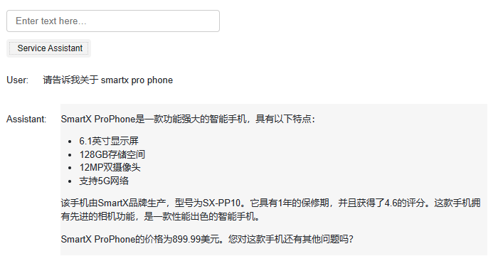


----


### 使用LangChain 开发应用程序.


LangChain 是一套专为 LLM 开发打造的开源框架，实现了 LLM 多种强大能力的利用，提供了 Chain、Agent、Tool 等多种封装工具，基于 LangChain 可以便捷开发应用程序，极大化发挥 LLM 潜能。目前，使用 LangChin 已经成为 LLM 开发的必备能力之一。

#### 一、直接调用OpenAI

```python
import openai
import os
from dotenv import load_dotenv, find_dotenv
_ = load_dotenv(find_dotenv()) # read local .env file
openai.api_key = os.getenv("OPENAI_API_KEY")


def get_completion(prompt, model="gpt-3.5-turbo"):
    messages = [{"role":"user","content":prompt}]
    response = openai.ChatCompletion.create(
    	model=model,
        messages=messages,
        temperature=0
    )
    return response.choices[0].message["content"]


def get_completion_from_messages(messages, 
                                 model="gpt-3.5-turbo", 
                                 temperature=0, 
                                 max_tokens=500):
    '''
    封装一个支持更多参数的自定义访问 OpenAI GPT3.5 的函数

    参数: 
    messages: 这是一个消息列表，每个消息都是一个字典，包含 role(角色）和 content(内容)。角色可以是'system'、'user' 或 'assistant’，内容是角色的消息。
    model: 调用的模型，默认为 gpt-3.5-turbo(ChatGPT)，有内测资格的用户可以选择 gpt-4
    temperature: 这决定模型输出的随机程度，默认为0，表示输出将非常确定。增加温度会使输出更随机。
    max_tokens: 这决定模型输出的最大的 token 数。
    '''
    response = openai.ChatCompletion.create(
        model=model,
        messages=messages,
        temperature=temperature, # 这决定模型输出的随机程度
        max_tokens=max_tokens, # 这决定模型输出的最大的 token 数
    )
    return response.choices[0].message["content"]


message = [
    { "role": "system", "content": "You are an assistant..." },
    { "role": "user", "content": "Tell me a joke " },
    { "role": "assistant", "content": "Why did the chicken... "},
    ...
]
```


#### 二、通过LangChain使用OpenAI

从`langchain.chat_models`导入`OpenAI`的对话模型`ChatOpenAI`。 除去OpenAI以外，`langchain.chat_models`还集成了其他对话模型，更多细节可以查看 [Langchain 官方文档](https://python.langchain.com/en/latest/modules/models/chat/integrations.html)。

```python
from langchain.chat_models import ChatOpenAI

# 这里我们将参数temperature设置为0.0，从而减少生成答案的随机性。
# 如果你想要每次得到不一样的有新意的答案，可以尝试调整该参数。
chat = ChatOpenAI(temperature=0.0)
chat
```

```python
ChatOpenAI(cache=None, verbose=False, callbacks=None, callback_manager=None, tags=None, metadata=None, client=<class 'openai.api_resources.chat_completion.ChatCompletion'>, model_name='gpt-3.5-turbo', temperature=0.0, model_kwargs={}, openai_api_key='', openai_api_base='', openai_organization='', openai_proxy='', request_timeout=None, max_retries=6, streaming=False, n=1, max_tokens=None, tiktoken_model_name=None)

```

##### 使用提示模板


###### PromptTemplate

`PromptTemplate` 可以用来为字符串提示创建一个模板。默认情况下，`PromptTemplate` 利用 Python 中的 [str.format](https://docs.python.org/3/library/stdtypes.html#str.format) 方法来创建字符串模板。

这个模板可以包含任意多个变量，也可以不包含任何变量

```python
from langchain.prompts import PromptTemplate

template_string = """"请用简明的语言介绍一下{topic}。"""

prompt_template = PromptTemplate.from_template(template_string)

messages = prompt_template.format(topic="什么是ai?")
```

----

###### ChatPromptTemplate

提示是一个包含多条聊天消息的列表。

每条聊天消息都关联一段内容，并有一个称作 `role` 的附加参数。

像这样创建一个 `ChatPromptTemplate`：

```python
from langchain.prompts import ChatPromptTemplate

chat_template = ChatPromptTemplate.from_messages(
    [
        ("system", "You are a helpful AI bot. Your name is {name}."),
        ("human", "Hello, how are you doing?"),
        ("ai", "I'm doing well, thanks!"),
        ("human", "{user_input}"),
    ]
)

messages = chat_template.format_messages(name="Bob", user_input="What is your name?")
```


```python
from langchain.prompts import ChatPromptTemplate

# langchain.prompts里的ChatPromptTemplate与langchain_core.prompts里的ChatPromptTemplate是同一个
# 首先，构造一个提示模版字符串：`template_string`
template_string = """把由三个反引号分隔的文本\
翻译成一种{style}风格。\
文本: ```{text}```
"""

chat_template = ChatPromptTemplate.from_template(template_string)

customer_style = """正式普通话 \
用一个平静、尊敬的语气
"""

customer_email = """
嗯呐，我现在可是火冒三丈，我那个搅拌机盖子竟然飞了出去，把我厨房的墙壁都溅上了果汁！
更糟糕的是，保修条款可不包括清理我厨房的费用。
伙计，赶紧给我过来！
"""

# 使用提示模版
customer_messages = chat_template.format_messages(
                    style=customer_style,
                    text=customer_email)
# 打印客户消息类型
print("客户消息类型:",type(customer_messages),"\n")

# 打印第一个客户消息类型
print("第一个客户消息类型:", type(customer_messages[0]),"\n")

# 打印第一个元素
print("第一个客户消息: ", customer_messages[0],"\n")

```

```python
客户消息类型:
 <class 'list'> 

第一个客户类型:
 <class 'langchain.schema.messages.HumanMessage'> 

第一个客户消息: 
 content='把由三个反引号分隔的文本翻译成一种正式普通话 用一个平静、尊敬的语气\n风格。文本: ```\n嗯呐，我现在可是火冒三丈，我那个搅拌机盖子竟然飞了出去，把我厨房的墙壁都溅上了果汁！\n更糟糕的是，保修条款可不包括清理我厨房的费用。\n伙计，赶紧给我过来！\n```\n' additional_kwargs={} example=False 

```

现在我们可以调用模型部分定义的`chat`模型来实现转换客户消息风格。

```python
customer_response = chat(customer_messages)
print(customer_response.content)

```

----

###### MessagePromptTemplate

LangChain 提供了不同种类的 `MessagePromptTemplate`。

其中，最常用的模板包括 `AIMessagePromptTemplate`、`SystemMessagePromptTemplate` 和 `HumanMessagePromptTemplate`，它们分别用于生成 AI 消息、系统消息和面向人类的消息。

当聊天模型能够处理带有任意指定角色的消息时，你可以选用 `ChatMessagePromptTemplate`。这种模板使得用户能够自由定义角色名称。

----


###### MessagesPlaceholder

LangChain还为Message提供了占用符，我们可以使用`MessagesPlaceholder`来作为Message在占位符，这样我们可以根据实际的需要，在格式化prompt的时候动态地插入Message。

```python
from langchain.prompts import MessagesPlaceholder
 
human_prompt = "Summarize our conversation so far in {word_count} words."
human_message_template = HumanMessagePromptTemplate.from_template(human_prompt)
 
chat_prompt = ChatPromptTemplate.from_messages([MessagesPlaceholder(variable_name="conversation"), human_message_template])
 
human_message = HumanMessage(content="What is the best way to learn programming?")
ai_message = AIMessage(content="""\
1. Choose a programming language: Decide on a programming language that you want to learn.
2. Start with the basics: Familiarize yourself with the basic programming concepts such as variables, data types and control structures.
3. Practice, practice, practice: The best way to learn programming is through hands-on experience\
""")
 
chat_prompt.format_prompt(conversation=[human_message, ai_message], word_count="10").to_messages()

```

```python
[HumanMessage(content='What is the best way to learn programming?', additional_kwargs={}),
 AIMessage(content='1. Choose a programming language: Decide on a programming language that you want to learn. \n\n2. Start with the basics: Familiarize yourself with the basic programming concepts such as variables, data types and control structures.\n\n3. Practice, practice, practice: The best way to learn programming is through hands-on experience', additional_kwargs={}),
 HumanMessage(content='Summarize our conversation so far in 10 words.', additional_kwargs={})]
```

比如在上述代码中，在chat_prompt中定义了一个名为conversation的Message占位符，然后当chat_prompt调用format方法的时候，动态地将human_message，ai_message插入到占位符位置，从而替换占位符。


> [!NOTE]
>
> 为什么需要提示模板?
>
> 在应用于比较复杂的场景时，提示可能会非常长并且包含涉及许多细节。**使用提示模版，可以让我们更为方便地重复使用设计好的提示**
>
> 此外，LangChain还提供了提示模版用于一些常用场景。比如自动摘要、问答、连接到SQL数据库、连接到不同的API。通过使用LangChain内置的提示模版，你可以快速建立自己的大模型应用，而不需要花时间去设计和构造提示。
>
> 最后，我们在建立大模型应用时，通常希望模型的输出为给定的格式，比如在输出使用特定的关键词来让输出结构化

----

##### 输出解析器

```python
from langchain.chat_models import ChatOpenAI
from langchain.prompts import ChatPromptTemplate
from langchain.output_parsers import ResponseSchema
from langchain.output_parsers import StructuredOutputParser

chat = ChatOpenAI(temperature=0.0)

customer_review = """\
这款吹叶机非常神奇。 它有四个设置：\
吹蜡烛、微风、风城、龙卷风。 \
两天后就到了，正好赶上我妻子的\
周年纪念礼物。 \
我想我的妻子会喜欢它到说不出话来。 \
到目前为止，我是唯一一个使用它的人，而且我一直\
每隔一天早上用它来清理草坪上的叶子。 \
它比其他吹叶机稍微贵一点，\
但我认为它的额外功能是值得的。
"""

review_template = """\
对于以下文本，请从中提取以下信息：：

礼物：该商品是作为礼物送给别人的吗？
如果是，则回答 是的；如果否或未知，则回答 不是。

交货天数：产品到达需要多少天？ 如果没有找到该信息，则输出-1。

价钱：提取有关价值或价格的任何句子，并将它们输出为逗号分隔的 Python 列表。

文本: {text}

{format_instructions}
"""

gift_schema = ResponseSchema(name="礼物",
                             description="这件物品是作为礼物送给别人的吗？\
                            如果是，则回答 是的，\
                            如果否或未知，则回答 不是。")

delivery_days_schema = ResponseSchema(name="交货天数",
                                      description="产品需要多少天才能到达？\
                                      如果没有找到该信息，则输出-1。")

price_value_schema = ResponseSchema(name="价钱",
                                    description="提取有关价值或价格的任何句子，\
                                    并将它们输出为逗号分隔的 Python 列表")

response_schemas = [gift_schema, 
                    delivery_days_schema,
                    price_value_schema]
output_parser = StructuredOutputParser.from_response_schemas(response_schemas)
format_instructions = output_parser.get_format_instructions()

messages = prompt.format_messages(text=customer_review, format_instructions=format_instructions)

response = chat(messages)

print("结果类型:", type(response.content))
print("结果:", response.content)
```

````python

结果类型:
 <class 'str'>

结果:
 ```json
{
    "礼物": "不是",
    "交货天数": "两天后就到了",
    "价钱": "它比其他吹叶机稍微贵一点"
}
```
````

---


##### 储存Memory

LangChain 中的储存模块，即如何将先前的对话嵌入到语言模型中的，使其具有连续对话的能力。

LangChain 提供了多种储存类型。其中，缓冲区储存允许保留最近的聊天消息，摘要储存则提供了对整个对话的摘要。实体储存则允许在多轮对话中保留有关特定实体的信息。这些记忆组件都是模块化的，可与其他组件组合使用，从而增强机器人的对话管理能力。储存模块可以通过简单的 API 调用来访问和更新，允许开发人员更轻松地实现对话历史记录的管理和维护。

在 LangChain 中，储存指的是大语言模型（LLM）的短期记忆。为什么是短期记忆？那是因为LLM训练好之后 (获得了一些长期记忆)，它的参数便不会因为用户的输入而发生改变。当用户与训练好的LLM进行对话时，LLM 会暂时记住用户的输入和它已经生成的输出，以便预测之后的输出，而模型输出完毕后，它便会“遗忘”之前用户的输入和它的输出。因此，之前的这些信息只能称作为 LLM 的短期记忆。

为了延长 LLM 短期记忆的保留时间，则需要借助一些外部储存方式来进行记忆，以便在用户与 LLM 对话中，LLM 能够尽可能的知道用户与它所进行的历史对话信息。


###### 一、对话缓存储存

```python
from langchain.chat_models import ChatOpenAI
from langchain.chains import ConversationChain
from langchain.memory import ConversationBufferMemory

llm = ChatOpenAI(temperature=0.0)
memory = ConversationBufferMemory()

# 新建一个 ConversationChain Class 实例
conversation = ConversationChain(llm=llm,memory=memory,verbose=True)
# verbose参数设置为True时，程序会输出更详细的信息，以提供更多的调试或运行时信息。
# 相反，当将verbose参数设置为False时，程序会以更简洁的方式运行，只输出关键的信息

```

第一轮对话

```python
conversation.predict(input="你好,我叫Mrhow")
```

```python
> Entering new  chain...
Prompt after formatting:
The following is a friendly conversation between a human and an AI. The AI is talkative and provides lots of specific details from its context. If the AI does not know the answer to a question, it truthfully says it does not know.

Current conversation:

Human: 你好, 我叫Mrhow
AI:

> Finished chain.


'你好，Mrhow！很高兴认识你。我是一个AI助手，可以回答你的问题和提供帮助。有什么我可以帮你的吗？'

```

第二轮对话:

```python
conversation.predict(input="1+1等于多少？")
```

```python
> Entering new ConversationChain chain...
Prompt after formatting:
The following is a friendly conversation between a human and an AI. The AI is talkative and provides lots of specific details from its context. If the AI does not know the answer to a question, it truthfully says it does not know.

Current conversation:
Human: 你好, 我叫Mrhow
AI: 你好，Mrhow！很高兴认识你。我是一个AI助手，可以回答你的问题和提供帮助。有什么我可以帮你的吗？
Human: 1+1等于多少？
AI:

> Finished chain.


'1+1等于2。'

```

查看储存缓存

```python
print(memory.buffer)
```

```shell
Human: 你好, 我叫Mrhow
AI: 你好，Mrhow！很高兴认识你。我是一个AI助手，可以回答你的问题和提供帮助。有什么我可以帮你的吗？
Human: 1+1等于多少？
AI: 1+1等于2。
```

直接添加内容到储存缓存

使用`save_context`来直接添加内容到`buffer`中.

```python
memory = ConversationBufferMemory()
memory.save_context({"input": "你吃饭了吗"}, {"output": "还没呢,现在正在做饭,你吃了吗,来我家一起吃饭呀"})
memory.load_memory_variables({})

```

```
{'history': 'Human: 你吃饭了吗\nAI: 还没呢,现在正在做饭,你吃了吗,来我家一起吃饭呀'}
```

当我们在使用大型语言模型进行聊天对话时，**大型语言模型本身实际上是无状态的。语言模型本身并不记得到目前为止的历史对话**。每次调用API结点都是独立的。储存(Memory)可以储存到目前为止的所有术语或对话，并将其输入或附加上下文到LLM中用于生成输出。如此看起来就好像它在进行下一轮对话的时候，记得之前说过什么。


将历史对话保存到SQL数据库中

```python
from langchain.chat_models import ChatOpenAI
from langchain.chains import ConversationChain
from langchain.memory import ConversationBufferMemory
from langchain_community.chat_message_histories import SQLChatMessageHistory


llm = ChatOpenAI(temperature=0.0)

memory_history = SQLChatMessageHistory(
	session_id="uid",connection_string=config.DB_URL
)

memory = ConversationBufferMemory(return_messages=True,chat_memory=memory_history,memory_key="chat_history")

conversation = ConversationChain(llm=llm,memory=memory,verbose=True)
```

###### 二、对话缓存窗口储存

随着对话变得越来越长，所需的内存量也变得非常长。将大量的tokens发送到LLM的成本，也会变得更加昂贵，这也就是为什么API的调用费用，通常是基于它需要处理的tokens数量而收费的。

针对以上问题，LangChain也提供了几种方便的储存方式来保存历史对话。其中，对话缓存窗口储存只保留一个窗口大小的对话。它只使用最近的n次交互。这可以用于保持最近交互的滑动窗口，以便缓冲区不会过大。

使用`ConversationBufferWindowMemory`来实现交互的滑动窗口，并设置`k=1`，表示只保留一个对话记忆。接下来我们手动添加两轮对话到窗口储存中，然后查看储存的对话。

```python
from langchain.memory import ConversationBufferWindowMemory

# k=1表明只保留一个对话记忆
memory = ConversationBufferWindowMemory(k=1)  
memory.save_context({"input": "你好，我叫皮皮鲁"}, {"output": "你好啊，我叫鲁西西"})
memory.save_context({"input": "很高兴和你成为朋友！"}, {"output": "是的，让我们一起去冒险吧！"})
memory.load_memory_variables({})

```

```python
{'history': 'Human: 很高兴和你成为朋友！\nAI: 是的，让我们一起去冒险吧！'}

```

通过结果，我们可以看到窗口储存中只有最后一轮的聊天记录

例子:

```python
from langchain.chat_models import ChatOpenAI
from langchain.chains import ConversationChain
from langchain.memory import ConversationBufferWindowMemory
from langchain_community.chat_message_histories import SQLChatMessageHistory


llm = ChatOpenAI(temperature=0.0)
memory_history = SQLChatMessageHistory(session_id="uid",connection_string=config.DB_URL)

memory = ConversationBufferWindowMemory(k=1,chat_memory=memory_history,memory_key="chat_history")

conversation = ConversationChain(llm=llm,memory=memory,verbose=False)

print("第一轮对话：")
print(conversation.predict(input="你好, 我叫皮皮鲁"))

print("第二轮对话：")
print(conversation.predict(input="1+1等于多少？"))

print("第三轮对话：")
print(conversation.predict(input="我叫什么名字？"))
```

```python
第一轮对话：
你好，皮皮鲁！很高兴认识你。我是一个AI助手，可以回答你的问题和提供帮助。有什么我可以帮你的吗？
第二轮对话：
1+1等于2。
第三轮对话：
很抱歉，我无法知道您的名字。

```

注意此处！由于这里用的是一个窗口的记忆，因此只能保存一轮的历史消息，因此AI并不能知道你第一轮对话中提到的名字，他最多只能记住上一轮（第二轮）的对话信息

----


###### 三、对话字符缓存储存

使用对话字符缓存记忆，内存将限制保存的token数量。如果字符数量超出指定数目，它会切掉这个对话的早期部分 以保留与最近的交流相对应的字符数量，但不超过字符限制。

添加对话到Token缓存储存,限制token数量，进行测试

```python
from langchain.chat_models import ChatOpenAI
from langchain.memory import ConversationTokenBufferMemory

llm = ChatOpenAI(temperature=0.0)
memory = ConversationTokenBufferMemory(llm=llm, max_token_limit=30)
memory.save_context({"input": "朝辞白帝彩云间，"}, {"output": "千里江陵一日还。"})
memory.save_context({"input": "两岸猿声啼不住，"}, {"output": "轻舟已过万重山。"})
memory.load_memory_variables({})

```

```python
{'history': 'AI: 轻舟已过万重山。'}

```

ChatGPT 使用一种基于字节对编码（Byte Pair Encoding，BPE）的方法来进行 tokenization （将输入文本拆分为token）。BPE 是一种常见的 tokenization 技术，它将输入文本分割成较小的子词单元。 OpenAI 在其官方 GitHub 上公开了一个最新的开源 Python 库 [tiktoken](https://github.com/openai/tiktoken)，这个库主要是用来计算 tokens 数量的。相比较 HuggingFace 的 tokenizer ，其速度提升了好几倍。 具体 token 计算方式,特别是汉字和英文单词的 token 区别，具体可参考[知乎文章](https://www.zhihu.com/question/594159910)。

###### 四、对话摘要缓存储存

对话摘要缓存储存，**使用 LLM 对到目前为止历史对话自动总结摘要**，并将其保存下来

```python
from langchain.chains import ConversationChain
from langchain.chat_models import ChatOpenAI
from langchain.memory import ConversationSummaryBufferMemory

# 创建一个长字符串
schedule = "在八点你和你的产品团队有一个会议。 \
你需要做一个PPT。 \
上午9点到12点你需要忙于LangChain。\
Langchain是一个有用的工具，因此你的项目进展的非常快。\
中午，在意大利餐厅与一位开车来的顾客共进午餐 \
走了一个多小时的路程与你见面，只为了解最新的 AI。 \
确保你带了笔记本电脑可以展示最新的 LLM 样例."

llm = ChatOpenAI(temperature=0.0)
memory = ConversationSummaryBufferMemory(llm=llm, max_token_limit=100)
memory.save_context({"input": "你好，我叫皮皮鲁"}, {"output": "你好啊，我叫鲁西西"})
memory.save_context({"input": "很高兴和你成为朋友！"}, {"output": "是的，让我们一起去冒险吧！"})
memory.save_context({"input": "今天的日程安排是什么？"}, {"output": f"{schedule}"})

print(memory.load_memory_variables({})['history'])

```

```markdown
System: The human introduces themselves as Pipilu and the AI introduces themselves as Luxixi. They express happiness at becoming friends and decide to go on an adventure together. The human asks about the schedule for the day. The AI informs them that they have a meeting with their product team at 8 o'clock and need to prepare a PowerPoint presentation. From 9 am to 12 pm, they will be busy with LangChain, a useful tool that helps their project progress quickly. At noon, they will have lunch with a customer who has driven for over an hour just to learn about the latest AI. The AI advises the human to bring their laptop to showcase the latest LLM samples.

```

----


##### 模型链 Chains

链（Chains）通常将大语言模型（LLM）与提示（Prompt）结合在一起，基于此，我们可以对文本或数据进行一系列操作。链（Chains）可以一次性接受多个输入。例如，我们可以创建一个链，该链接受用户输入，使用提示模板对其进行格式化，然后将格式化的响应传递给 LLM 。我们可以通过将多个链组合在一起，或者通过将链与其他组件组合在一起来构建更复杂的链。

###### 一、大语言模型链 

```python
from langchain.chat_models import ChatOpenAI 
from langchain.prompts import ChatPromptTemplate  
from langchain.chains import LLMChain 


template_string = """
描述制造{product}的一个公司的最佳名称是什么?
"""


llm = ChatOpenAI(temperature=0.0)
chat_template = ChatPromptTemplate.from_template(template_string)

#customer_messages = chat_template.format_messages( style=customer_style,text=customer_email)

chain = LLMChain(llm=llm,prompt=chat_template) #将大语言模型(LLM)和提示（Prompt）组合成链

product = "大号床单套装"
chain.run(product)
```

```python
'"豪华床纺"'
```

大语言模型链（LLMChain）是一个简单但非常强大的链，也是后面许多链的基础。


###### 二、简单顺序链

顺序链（SequentialChains）是按预定义顺序执行其链接的链。具体来说，我们将使用简单顺序链（SimpleSequentialChain），这是顺序链的最简单类型，其中每个步骤都有一个输入/输出，一个步骤的输出是下一个步骤的输入。

```python
from langchain.chat_models import ChatOpenAI 
from langchain.prompts import ChatPromptTemplate  
from langchain.chains import LLMChain,SimpleSequentialChain

llm = ChatOpenAI(temperature=0.9)

# 创建两个子链

# 提示模板 1 ：这个提示将接受产品并返回最佳名称来描述该公司
first_prompt = ChatPromptTemplate.from_template(   
    "描述制造{product}的一个公司的最好的名称是什么"
)
chain_one = LLMChain(llm=llm, prompt=first_prompt)

# 提示模板 2 ：接受公司名称，然后输出该公司的长为20个单词的描述
second_prompt = ChatPromptTemplate.from_template(   
    "写一个20字的描述对于下面这个\
    公司：{company_name}的"
)
chain_two = LLMChain(llm=llm, prompt=second_prompt)

# 现在我们可以组合两个LLMChain，以便我们可以在一个步骤中创建公司名称和描述

overall_simple_chain = SimpleSequentialChain(chains=[chain_one, chain_two],verbose=True)

# 运行简单顺序链
product = "大号床单套装"
overall_simple_chain.run(product)

```

```markdown
> Entering new SimpleSequentialChain chain...
优床制造公司
优床制造公司是一家专注于生产高品质床具的公司。

> Finished chain.


'优床制造公司是一家专注于生产高品质床具的公司。'

```


###### 三、顺序链

当只有一个输入和一个输出时，简单顺序链（SimpleSequentialChain）即可实现。当有多个输入或多个输出时，我们则需要使用顺序链（SequentialChain）来实现。

```python
import pandas as pd
from langchain.chat_models import ChatOpenAI  
from langchain.prompts import ChatPromptTemplate
from langchain.chains import LLMChain,SequentialChain

llm = ChatOpenAI(temperature=0.9)

# 创建四个子链
#子链1
# prompt模板 1: 翻译成英语（把下面的review翻译成英语）
first_prompt = ChatPromptTemplate.from_template(
    "把下面的评论review翻译成英文:"
    "\n\n{Review}"
)
# chain 1: 输入：Review    输出：英文的 Review
chain_one = LLMChain(llm=llm, prompt=first_prompt, output_key="English_Review")

#子链2
# prompt模板 2: 用一句话总结下面的 review
second_prompt = ChatPromptTemplate.from_template(
    "请你用一句话来总结下面的评论review:"
    "\n\n{English_Review}"
)
# chain 2: 输入：英文的Review   输出：总结
chain_two = LLMChain(llm=llm, prompt=second_prompt, output_key="summary")


#子链3
# prompt模板 3: 下面review使用的什么语言
third_prompt = ChatPromptTemplate.from_template(
    "下面的评论review使用的什么语言:\n\n{Review}"
)
# chain 3: 输入：Review  输出：语言
chain_three = LLMChain(llm=llm, prompt=third_prompt, output_key="language")


#子链4
# prompt模板 4: 使用特定的语言对下面的总结写一个后续回复
fourth_prompt = ChatPromptTemplate.from_template(
    "使用特定的语言对下面的总结写一个后续回复:"
    "\n\n总结: {summary}\n\n语言: {language}"
)
# chain 4: 输入： 总结, 语言    输出： 后续回复
chain_four = LLMChain(llm=llm, prompt=fourth_prompt, output_key="followup_message")


# 对四个子链进行组合
#输入：review    
#输出：英文review，总结，后续回复 
overall_chain = SequentialChain(
    chains=[chain_one, chain_two, chain_three, chain_four],
    input_variables=["Review"],
    output_variables=["English_Review", "summary","followup_message"],
    verbose=True
)


df = pd.read_csv('../data/Data.csv')
review = df.Review[5]
overall_chain(review)

```

```markdown
> Entering new SequentialChain chain...

> Finished chain.


{'Review': "Je trouve le goût médiocre. La mousse ne tient pas, c'est bizarre. J'achète les mêmes dans le commerce et le goût est bien meilleur...\nVieux lot ou contrefaçon !?",
 'English_Review': "I find the taste mediocre. The foam doesn't hold, it's weird. I buy the same ones in stores and the taste is much better...\nOld batch or counterfeit!?",
 'summary': "The reviewer finds the taste mediocre, the foam doesn't hold well, and suspects the product may be either an old batch or a counterfeit.",
 'followup_message': "后续回复（法语）：Merci beaucoup pour votre avis. Nous sommes désolés d'apprendre que vous avez trouvé le goût médiocre et que la mousse ne tient pas bien. Nous prenons ces problèmes très au sérieux et nous enquêterons sur la possibilité que le produit soit soit un ancien lot, soit une contrefaçon. Nous vous prions de nous excuser pour cette expérience décevante et nous ferons tout notre possible pour résoudre ce problème. Votre satisfaction est notre priorité et nous apprécions vos commentaires précieux."}

```

选择一篇评论并通过整个链传递它，可以发现，原始review是法语，可以把英文review看做是一种翻译，接下来是根据英文review得到的总结，最后输出的是用法语原文进行的续写信息。


###### 四、路由链

根据输入将其路由到一条链，具体取决于该输入到底是什么。如果你有多个子链，每个子链都专门用于特定类型的输入，那么可以组成一个路由链，它首先决定将它传递给哪个子链，然后将它传递给那个链。

路由器由两个组件组成：

- 路由链（Router Chain）：路由器链本身，负责选择要调用的下一个链
- destination_chains：路由器链可以路由到的链

例子：

```python
from langchain.chains.router import MultiPromptChain  #导入多提示链
from langchain.chains.router.llm_router import LLMRouterChain,RouterOutputParser
from langchain.prompts import PromptTemplate
llm = ChatOpenAI(temperature=0)
```

`MultiPromptChain` 多提示链是一种特定类型的链，用于在多个不同的提示模板之间进行路由。但是这只是路由的一种类型，我们也可以在任何类型的链之间进行路由。

目标链是由路由链调用的链，每个目标链都是一个语言模型链


定义提示模板

```python
#第一个提示适合回答物理问题
physics_template = """你是一个非常聪明的物理专家。 \
你擅长用一种简洁并且易于理解的方式去回答问题。\
当你不知道问题的答案时，你承认\
你不知道.

这是一个问题:
{input}"""


#第二个提示适合回答数学问题
math_template = """你是一个非常优秀的数学家。 \
你擅长回答数学问题。 \
你之所以如此优秀， \
是因为你能够将棘手的问题分解为组成部分，\
回答组成部分，然后将它们组合在一起，回答更广泛的问题。

这是一个问题：
{input}"""


#第三个适合回答历史问题
history_template = """你是以为非常优秀的历史学家。 \
你对一系列历史时期的人物、事件和背景有着极好的学识和理解\
你有能力思考、反思、辩证、讨论和评估过去。\
你尊重历史证据，并有能力利用它来支持你的解释和判断。

这是一个问题:
{input}"""


#第四个适合回答计算机问题
computerscience_template = """ 你是一个成功的计算机科学专家。\
你有创造力、协作精神、\
前瞻性思维、自信、解决问题的能力、\
对理论和算法的理解以及出色的沟通技巧。\
你非常擅长回答编程问题。\
你之所以如此优秀，是因为你知道  \
如何通过以机器可以轻松解释的命令式步骤描述解决方案来解决问题，\
并且你知道如何选择在时间复杂性和空间复杂性之间取得良好平衡的解决方案。

这还是一个输入：
{input}"""
```

对提示模版进行命名和描述

```python
# 中文
prompt_infos = [
    {
        "名字": "物理学", 
        "描述": "擅长回答关于物理学的问题", 
        "提示模板": physics_template
    },
    {
        "名字": "数学", 
        "描述": "擅长回答数学问题", 
        "提示模板": math_template
    },
    {
        "名字": "历史", 
        "描述": "擅长回答历史问题", 
        "提示模板": history_template
    },
    {
        "名字": "计算机科学", 
        "描述": "擅长回答计算机科学问题", 
        "提示模板": computerscience_template
    }
]

```

基于提示模版信息创建相应目标链

```python
destination_chains = {}
for p_info in prompt_infos:
    name = p_info["名字"]
    prompt_template = p_info["提示模板"]
    prompt = ChatPromptTemplate.from_template(template=prompt_template)
    chain = LLMChain(llm=llm, prompt=prompt)
    destination_chains[name] = chain  
    
destinations = [f"{p['名字']}: {p['描述']}" for p in prompt_infos]
destinations_str = "\n".join(destinations)

```

除了目标链之外，我们还需要一个默认目标链。这是一个当路由器无法决定使用哪个子链时调用的链。在上面的示例中，当输入问题与物理、数学、历史或计算机科学无关时，可能会调用它。

```python
default_prompt = ChatPromptTemplate.from_template("{input}")
default_chain = LLMChain(llm=llm, prompt=default_prompt)
```

定义多提示路由模板

```python
# 多提示路由模板
MULTI_PROMPT_ROUTER_TEMPLATE = """给语言模型一个原始文本输入，\
让其选择最适合输入的模型提示。\
系统将为您提供可用提示的名称以及最适合改提示的描述。\
如果你认为修改原始输入最终会导致语言模型做出更好的响应，\
你也可以修改原始输入。


<< 格式 >>
返回一个带有JSON对象的markdown代码片段，该JSON对象的格式如下：
```json
{{{{
    "destination": 字符串 \ 使用的提示名字或者使用 "DEFAULT"
    "next_inputs": 字符串 \ 原始输入的改进版本
}}}}


记住：“destination”必须是下面指定的候选提示名称之一，\
或者如果输入不太适合任何候选提示，\
则可以是 “DEFAULT” 。
记住：如果您认为不需要任何修改，\
则 “next_inputs” 可以只是原始输入。

<< 候选提示 >>
{destinations}

<< 输入 >>
{{input}}

<< 输出 (记得要包含 ```json)>>

样例:
<< 输入 >>
"什么是黑体辐射?"
<< 输出 >>
```json
{{{{
    "destination": 字符串 \ 使用的提示名字或者使用 "DEFAULT"
    "next_inputs": 字符串 \ 原始输入的改进版本
}}}}

"""

router_template = MULTI_PROMPT_ROUTER_TEMPLATE.format(
    destinations=destinations_str
)
```

 构建路由链

```python
router_prompt = PromptTemplate(
    template=router_template,
    input_variables=["input"],
    output_parser=RouterOutputParser(),
)

router_chain = LLMRouterChain.from_llm(llm, router_prompt)


# 构建多提示链路
chain = MultiPromptChain(router_chain=router_chain,    #l路由链路
                         destination_chains=destination_chains,   #目标链路
                         default_chain=default_chain,      #默认链路
                         verbose=True   
                        )

```

提问物理问题：

```python
# 提问
chain.run("什么是黑体辐射？")
```

```markdown
> Entering new MultiPromptChain chain...
物理学: {'input': '什么是黑体辐射？'}
> Finished chain.


'黑体辐射是指一个理想化的物体，它能够完全吸收并且以最高效率地辐射出所有入射到它上面的电磁辐射。这种辐射的特点是它的辐射强度与波长有关，且在不同波长下的辐射强度符合普朗克辐射定律。黑体辐射在物理学中有广泛的应用，例如研究热力学、量子力学和宇宙学等领域。'

```

提问数学问题:

```python
chain.run("2+2等于多少？")

```

```python
> Entering new MultiPromptChain chain...
数学: {'input': '2+2等于多少？'}
> Finished chain.


'2+2等于4。'

```

提问与任何子链路都无关的问题:

```python
chain.run("为什么我们身体里的每个细胞都包含DNA？")

```

```python
> Entering new MultiPromptChain chain...
物理学: {'input': '为什么我们身体里的每个细胞都包含DNA？'}
> Finished chain.


'我们身体里的每个细胞都包含DNA，因为DNA是遗传信息的载体。DNA是由四种碱基（腺嘌呤、胸腺嘧啶、鸟嘌呤和胞嘧啶）组成的长链状分子，它存储了我们的遗传信息，包括我们的基因和遗传特征。每个细胞都需要这些遗传信息来执行其特定的功能和任务。所以，DNA存在于每个细胞中，以确保我们的身体正常运作。'

```

这里，我们问了一个关于生物学的问题，我们可以看到它选择的链路是无。这意味着它将被**传递到默认链路，它本身只是对语言模型的通用调用**。语言模型幸运地对生物学知道很多，所以它可以帮助我们。

---

###### 五、转换链

转换链（TransformChain）允许在链之间添加自定义的转换函数来处理输入，将处理后的结果用作下一个链的输入。

TransformChain 的主要组成部分是:

- input_variables：输入变量名列表
- output_variables：输出变量名列表
- transform：自定义的转换函数

转换函数接受一个字典作为输入，字典中的键是 input_variables 中定义的变量名。

转换函数需要返回一个字典，字典中的键是 output_variables 中定义的变量名。

这样 TransformChain 就可以在链之间添加任意的转换逻辑，如清理、过滤、格式化数据等。

总之，TransformChain 为在链之间添加自定义转换提供了一种简单的方法，使链之间的数据流更加灵活。

例子

创建一个转换函数，它接受超长文本，将文本过滤为仅前 3 段，然后将其传递到 LLMChain 中以总结这些内容。

```python
from langchain.chat_models import ChatOpenAI
from langchain.chains import TransformChain, LLMChain, SimpleSequentialChain
from langchain.prompts import PromptTemplate

llm = ChatOpenAI(temperature=0.0)

# 模拟超长文本
with open("../../state_of_the_union.txt") as f:
    state_of_the_union = f.read()
 
# 定义转换方法，入参和出参都是字典，取前三段
def transform_func(inputs: dict) -> dict:
    text = inputs["text"]
    shortened_text = "\n\n".join(text.split("\n\n")[:3]) # 取前三段
    return {"output_text": shortened_text}
 
# 转换链：输入变量：text，输出变量：output_text
transform_chain = TransformChain(input_variables=["text"], output_variables=["output_text"], transform=transform_func
)

# prompt模板描述
template = """Summarize this text:
{output_text}
Summary:"""

# prompt模板
prompt = PromptTemplate(input_variables=["output_text"], template=template)

# llm链
llm_chain = LLMChain(llm=llm, prompt=prompt)

# 使用顺序链
sequential_chain = SimpleSequentialChain(chains=[transform_chain, llm_chain])
# 开始执行
sequential_chain.run(state_of_the_union)
# 结果
"""
    ' The speaker addresses the nation, noting that while last year they were kept apart due to COVID-19, this year they are together again.
    They are reminded that regardless of their political affiliations, they are all Americans.'
"""
```


---


###### 六、对话链

**ConversationChain在langchain中是一个专门用于管理多轮对话流程的链式组件**。

前面有提到对话缓存储存机制，使用`ConversationBufferMemory`来记录对话的历史,其中可以通过使用`save_context` 来直接添加内容到`buffer`中.但是如果每次都得手动添加,那也太麻烦,故而可以利用 LangChain 的`ConversationChain`对话链，自动添加`history`的方式添加临时记忆，无需手动添加。

```python
from langchain.chat_models import ChatOpenAI
from langchain.chains import ConversationChain
from langchain.memory import ConversationBufferMemory
from langchain_community.chat_message_histories import SQLChatMessageHistory


llm = ChatOpenAI(temperature=0.0)

memory_history = SQLChatMessageHistory(
	session_id="uid",connection_string=config.DB_URL
)

memory = ConversationBufferMemory(return_messages=True,chat_memory=memory_history,memory_key="chat_history")

conversation = ConversationChain(llm=llm,memory=memory,verbose=True)

# conversation
conversation.predict(input="你好呀,我叫xxx")
```


----

###### 七、文档链

StuffChain首先接收一个文档列表作为输入。每个文档都被格式化成一个字符串，这是通过document_prompt实现的。然后，这些字符串用document_separator连接成一个大的字符串，这可以是你选择的任何字符或短语。这个大的字符串被添加到inputs中，并以document_variable_name设置的变量名命名。最后，inputs（现在含有你的合并文档字符串）被传递到llm_chain进行进一步的处理。 这个过程基本上是将多个文档压缩成一个单一的字符串，使得语言模型可以将它们视为一个实体进行处理。

```python
from langchain.chains import StuffDocumentsChain, LLMChain
from langchain.prompts import PromptTemplate
from langchain.chat_models import ChatOpenAI
from langchain.schema import Document


document_prompt = PromptTemplate(
    input_variables=["page_content"],
     template="{page_content}"
)
document_variable_name = "context"
llm = ChatOpenAI()

prompt = PromptTemplate.from_template(
    "Summarize this content: {context} in Chinese"
)
llm_chain = LLMChain(llm=llm, prompt=prompt)
chain = StuffDocumentsChain(
    llm_chain=llm_chain,
    document_prompt=document_prompt,
    document_variable_name=document_variable_name,
    verbose=True,
)

input = {'input_documents': [Document(page_content='5.2.6新员工转为正式员工后由人事行政部以邮件形式发出《转正通知单》的形式以通知转正人员相关\n事宜。6.转正类别转正可分为提前转正、按期转正、终止试用四个类别。\n6.1提前转正：新员工入职三个月以后，确因工作态度、工作绩效、团队融合表现突出者，部门负责人\n可为员工申请提前转正。并依据本办法5.2试用期满评估程序实施转正。\n6.2按期转正：依据本办法5.2试用期满评估程序实施转正。\n6.3终止试用\n6.3.1试用期员工在试用期如不能认同企业文化，感到公司状况与个人预期差距较大或者其它原因决定\n离开公司的，可提出辞职，但应提前3日以书面形式提交辞职报告。\n6.3.2试用期员工在试用期间如不能达到公司岗位任职要求，公司可随时停止试用，予以辞退。\n6.3.3试用期员工在试用期间有严重违反公司规章制度行为并造成不良影响的，公司可随时停止试用，\n予以辞退。\n6.3.4终止试用的员工，至人事行政部办理离职手续。7.转正日期新员工如果提前转正，则转正日期以最终审批的提前转正日期为准；如果按期转正，新员工的转正日期\n为试用期满之日。8.其他及附件8.1本办法自发布之日起生效。\n8.2附件\n《月度工作计划表》\n《试用期转正述职报告》\n《转正述职与答辩评分表》\n《试用期转正评估表》\n《员工转正通知书》\n二○一九年八月[COMPANY_NAME_CN]', metadata={'source': '试用期评估及转正管理办法.pdf', 'page': 1}), Document(page_content='试用期评估及转正管理办法\n1目的\n为帮助员工发展、统一员工在试用期内评估及转正要求与流程，明确各相关部门的工作职责，特制定本\n办法。\n2适用范围\n本办法适用于公司所有新进员工。\n3定义\n3.1试用期：指劳动合同期限内公司与员工为相互了解对方而约定的考察期间。\n3.2试用期期限根据相关劳动法律法规及工作岗位性质确定。\n3.3转正：指新员工试用期满，达到岗位任职资格，并按规定办完相应手续后，成为公司的正式员工。\n4各方权责\n4.1试用期员工的权责\n主动了解自己的工作职责与工作内容、工作目标、公司文化等各项规章制度；\n接受人力部门的入职培训与相关评估；\n4.2试用期各部门负责人的权责\n在工作中引导新员工领悟并融入公司的文化、督促并指导其执行公司各项任务、工作须知及管理制度；\n帮助新员工，使其了解并掌握所任职岗位的岗位职责、内容、目标与岗位应知应会；\n4.3人事行政部的权责\n培训新员工有关公司的组织、文化、发展、管理制度及日常办公工作须知等；\n负责试用期员工的评估执行。\n5试用期评估\n试用期员工的评估分为两种形式：中间评估与期满综合评估。中间评估自入职之日起试用期内分阶段（每\n阶段按月或者按照季度设定）进行，期满综合评估在试用期结束时进行。\n5.1中间评估程序\n5.1.1部门负责人必须在入职第一个月内与新员工确定阶段性（月度或者季度）工作目标。\n5.1.2在阶段结束时，部门负责人与新员工对本阶段学习任务与工作目标达成情况以及下阶段工作计划\n与目标进行沟通，对新员工遇到的疑问进行合理解答，对新员工遇到的困难进行及时解决。\n5.1.3中间评估完成后由部门负责人批准将表格原件备案至人事行政部，人事行政部对月度评估表的合\n理性进行评估确认。\n5.2试用期满综合评估\n5.2.1试用期期满前10天，人事行政部将试用期《试用期转正述职报告模板》发给新员工，抄送部门\n负责人；将《试用期转正评估表》发给部门负责人；\n5.2.2新员工填写《试用期转正述职报告模板》，对试用期间的学习与工作心得进行总结，于转正期满\n前一周完成并交部门负责人审核，交人事行政部备案；\n5.2.3部门负责人初步考核通过后，人事行政部安排新员工转正述职，邀请关联团队经理、部门负责人、\n公司负责人、HR作为评审人员参与转正述职评审；\n5.2.4评审人员根据新员工现场述职、述职材料、既往的中间评估给予综合评分，最终评分≥3.5分方\n为通过转正述职评估；\n5.2.5部门负责人需于新员工试用期满前3天完成《试用期转正评估表》；', metadata={'source': '试用期评估及转正管理办法.pdf', 'page': 0})]}


input["question"] = "新员工怎么转正"
result = chain(input)

print(result.keys())  # dict_keys(['input_documents', 'question', 'output_text'])
print(result["output_text"])  # 新员工可以通过提前转正或按期转正的方式转正。对于提前转正，新员工需在入职三个月后，凭借出色的工作态度、工作绩效和团队融合表现，由部门负责人申请提前转正，并按照试用期满评估程序实施转正。对于按期转正，新员工需在试用期满后，按照试用期满评估程序实施转正。具体的转正日期根据最终审批的提前转正日期或试用期满之日确定。
```

StuffDocumentsChain类扮演这样一个角色——处理、组合和准备相关文档，以便进一步处理和回答问题。当需要处理的提示（prompt）同时需要上下文（context）和问题（question）时，我们的输入是一个字典。这个字典包含两个键值对：'input_documents'和'question'，其中'input_documents'是BaseCombineDocumentsChain关注的主要部分。BaseCombineDocumentsChain的input_key属性的默认值就是'input_documents'。这意味着当我们实例化这个类并调用它的方法时，它会根据input_key从输入字典中获取相应的文档。

一旦获取了输入文档，BaseCombineDocumentsChain会执行其_combine_docs方法。这个方法将所有相关的文档合并成一个单一的字符串。这个字符串通常包含所有文档的核心内容，是我们后续进行语言模型处理的基础。

输出准备 生成这个合并后的字符串之后，BaseCombineDocumentsChain会将其放入输入字典中，并且使用document_variable_name作为新的键。在许多情况下，我们选择"context"作为这个键，因为这个字符串实际上就是我们希望模型处理的上下文信息。所以，在执行完BaseCombineDocumentsChain的操作后，输入字典会新增一个条目：'context'。其值就是由_combine_docs方法得到的字符串。

进一步使用 完成上述操作后，新的输入字典就可以作为语言模型链（LLM Chain）的输入了。LLM Chain将使用这个"context"（即合并后的文档字符串），并加上"question"（即用户问题），进一步利用这些数据生成答案。

---

###### 八、检索QA链

检索是指根据用户的问题去向量数据库中搜索与问题相关的文档内容，连同用户的问题一起喂给LLM，最后LLM返回回复。

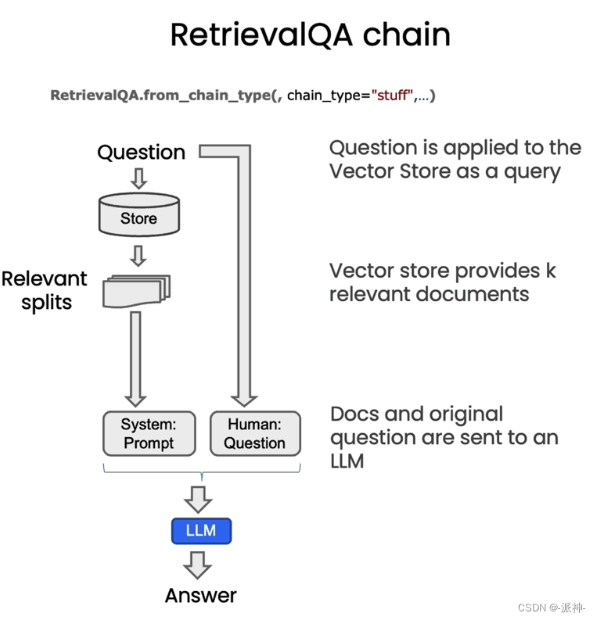

```python
 
#1.加载文档,并进行文档切割
file = 'OutdoorClothingCatalog_1000.csv'
loader = CSVLoader(file_path=file)
docs = loader.load()
 
#2.创建embeddings
embeddings = OpenAIEmbeddings()
 
#3.创建向量数据库
db = DocArrayInMemorySearch.from_documents(
    docs, 
    embeddings
)
 
#4.创建检索器
retriever = db.as_retriever()
 
#5.创建RetrievalQA
qa_stuff = RetrievalQA.from_chain_type(
    llm=ChatOpenAI(temperature = 0.0), 
    chain_type="stuff", 
    retriever=retriever, 
    verbose=True
)

query =  "Please list all your shirts with sun protection in a table \
in markdown and summarize each one."
 
response = qa_stuff.run(query)
```


RetrievalQA chain包含三个主要的参数，其中llm参数被设置为openai的llm,默认为"gpt-3.5-turbo", retriever参数为检索器，最后一个重要的参数为chain_type，该参数包含了四个可选值：stuff，map_reduce，refine，map_rerank

**stuff**：这种最简单粗暴，会把所有的 document 一次全部传给 llm 模型进行总结。如果docume很 多的话，势必会报超出最大 token 限制的错。

**map_reduce**: 这个方式会先将每个 document 通过llm 进行总结，最后将所有 document 总结出的结果再进行一次总结。

**refine**：这种方式会先总结第一个 document，然后在将第一个 document 总结出的内容和第二个 document 一起发给 llm 模型再进行总结，以此类推。这种方式的好处就是在总结后一个 document 的时候，会带着前一个的 document 进行总结，给需要总结的 document 添加了上下文，增加了总结内容的连贯性。

**map_rerank**: 这种方式会通过llm对每个文档进行一次总结，然后得到一个分数，最后选择一个分数最高的总结作为最终回复。


---

##### 文档加载器

使用文档加载器将数据作为`Document`从源加载。`Document`是一段文本及其关联的元数据。例如，有用于加载简单`.txt`文件的文档加载器，用于加载任何网页的文本内容，甚至用于加载YouTube视频的字幕。

文档加载器提供了一个“加载”方法，用于从配置的源加载数据作为文档。它们还可以选择性地实现“延迟加载”，以便延迟将数据加载到内存中。

###### 一、CSV加载器

>  CSV 文件是使用逗号分隔值的分隔文本文件。文件的每一行都是一条数据记录。每个记录由一个或多个用逗号分隔的字段组成。

​    每个文档加载一行CSV数据。

```python
from langchain_community.document_loaders.csv_loader import CSVLoader
 
 
loader = CSVLoader(file_path='./example_data/mlb_teams_2012.csv')
data = loader.load()
 
print(data)
```

定制CSV解析和加载

```python
loader = CSVLoader(file_path='./example_data/mlb_teams_2012.csv', csv_args={
    # 定界符：用于分隔字段的单字符字符串。它默认为','
    'delimiter': ',',
    # 引号字符：用于引用包含特殊字符的字段的单字符字符串，如定界符或者quotechar，或者包含换行符。它默认为'"'.
    'quotechar': '"',
    # 字段名称：如果在创建对象时没有作为参数传递，则在第一次访问或从文件中读取第一条记录时初始化该属性。
    'fieldnames': ['MLB Team', 'Payroll in millions', 'Wins']
})
 
data = loader.load()
 
print(data)
```

指定一个列来标识文档源

使用 `source_column `参数为从每一行创建的文档指定一个源。否则 `file_path `将用作从CSV文件创建的所有文档的源。

当将从CSV文件加载的文档用于使用源回答问题的链时，这很有用。

```python
loader = CSVLoader(file_path='./example_data/mlb_teams_2012.csv', source_column="Team")
 
data = loader.load()
 
print(data)
```

----

###### 二、文件目录加载器

 默认情况下，它使用[非结构化加载程序](https://python.langchain.com/docs/integrations/document_loaders/unstructured_file).

可以使用 **`glob `**参数来控制要加载的文件。请注意，这里它不加载 `**.rst** `文件或 **`.html `**文件。

```python
from langchain_community.document_loaders import DirectoryLoader
loader = DirectoryLoader('../', glob="**/*.md")
 
docs = loader.load()
 
```

显示进度条：

默认情况下，不会显示进度条。要显示进度条，请安装 `tqdm library`（例如），并设置`show_progress `参数到 `True`

```python
loader = DirectoryLoader('../', glob="**/*.md", show_progress=True)
docs = loader.load()
```

使用多进程：

默认情况下，加载发生在一个线程中。为了利用几个线程，请将 `use_multithreading `标志为 true。

```python
loader = DirectoryLoader('../', glob="**/*.md", use_multithreading=True)
docs = loader.load()
```

更改加载程序类：

默认情况下，使用 `UnstructuredLoader 类`。然而，您可以非常容易地改变加载程序的类型。只需要指定参数 loader_cls 的类型。

```python
from langchain_community.document_loaders import TextLoader
 
# 加载文本文件
loader = DirectoryLoader('../', glob="**/*.md", loader_cls=TextLoader)
 
docs = loader.load()
 
len(docs)

##########################
# 加载 Python源代码文件
from langchain_community.document_loaders import PythonLoader
loader = DirectoryLoader('../', glob="**/*.py", loader_cls=PythonLoader)

```

使用文本加载器自动检测文件编码

- 默认行为

  ```python
  path = '../../../../../tests/integration_tests/examples'
  loader = DirectoryLoader(path, glob="**/*.txt", loader_cls=TextLoader)
  loader.load()
  ```

  文件`example-non-utf8.txt`使用不同的编码，因此`load()`函数会失败，并显示一个有帮助的消息，指示哪个文件无法解码。

  `TextLoader`的默认行为是，如果在加载任何文档时失败，整个加载过程都会失败，且不会加载任何文档。

- 无声失败

  我们可以将`silent_errors`参数传递给`DirectoryLoader`，以跳过无法加载的文件并继续加载过程。

  ```python
  loader = DirectoryLoader(path, glob="**/*.txt", loader_cls=TextLoader, silent_errors=True)
  docs = loader.load()
  ```

- 自动检测编码

  我们还可以让`TextLoader`在失败之前自动检测文件编码，将`autodetect_encoding`传递给加载器类。

  ```python
  text_loader_kwargs = {'autodetect_encoding': True}
  loader = DirectoryLoader(path, glob="**/*.txt", loader_cls=TextLoader, loader_kwargs=text_loader_kwargs)
  docs = loader.load()
  doc_sources = [doc.metadata['source']  for doc in docs]
  print(doc_sources)
  ```

---

###### 三、HTML加载器

```python
from langchain_community.document_loaders import UnstructuredHTMLLoader
 
loader = UnstructuredHTMLLoader("example_data/fake-content.html")
 
data = loader.load()
 
print(data)
```

用BeautifulSoup4加载HTML

我们还可以使用`BeautifulSoup4`和`BSHTMLLoader`加载HTML文档。这将提取HTML中的文本到`page_content`中，并将页面标题作为`title`加载到`metadata`中。

```python
from langchain_community.document_loaders import BSHTMLLoader

loader = BSHTMLLoader("example_data/fake-content.html")
data = loader.load()
data
```

---

###### 四、JSON加载器

> `JSONLoader` 使用指定的 [jq schema](https://stedolan.github.io/jq/manual/) 来解析 JSON 文件。它使用 `jq` Python 包。 查看这个 [手册](https://stedolan.github.io/jq/manual/) 以获取有关 `jq` 语法的详细文档。

```python
#pip install jq
import json

from langchain_community.document_loaders import JSONLoader
from pathlib import Path
from pprint import pprint

file_path = './example_data/facebook_chat.json'
data = json.loads(Path(file_path).read_text())

pprint(data)

loader = JSONLoader(
    file_path='./example_data/facebook_chat.json',
    jq_schema='.messages[].content', # 假设我们想要从 JSON 数据的 messages 键下的 content 字段中提取值。
    text_content=False)
 
data = loader.load()
 
print(data)
```

更多细节：[JSONLoader](https://langchain114.com/docs/modules/data_connection/document_loaders/json)

---

###### 五、Markdown加载器

```python
from langchain_community.document_loaders import UnstructuredMarkdownLoader

markdown_path ="../../../../../README.md"
loader = UnstructuredMarkdownLoader(markdown_path)

data = loader.load()
```

保留元素

Unstructured会为文本的不同块创建不同的“元素”。默认情况下，我们将它们组合在一起，但您可以通过指定`mode="elements"`轻松保留该分离。

```python
loader = UnstructuredMarkdownLoader(markdown_path, mode="elements")

data = loader.load()

data[0]
```

---

###### 六、PDF加载器

使用 PyPDF
PyPDF是一个功能全面的库，它允许用户进行PDF的读取、分割、合并以及转换等操作。这个库的优点在于其轻量且纯Python编写，没有庞大的依赖，因此安装和使用相对简单。此外，PyPDF跨平台性好，能够在Windows、macOS和Linux上良好运行。然而，它可能不支持PDF 1.7及以上版本的某些特性，对于处理带有复杂特性的最新PDF文件可能会存在限制。


加载PDF使用pypdf文档数组，其中每个文档都包含页面内容和元数据page号码。

```python
# pip install pypdf
from langchain_community.document_loaders import PyPDFLoader
loader = PyPDFLoader("example_data/layout-parser-paper.pdf")
# pages = loader.load_and_split()
pages = loader.load()  
print(pages[0])
```

> [!NOTE]
>
> pages的类型是list ，每个元素代表着一个文档，即pdf的一页
>
> 元素的类型是`langchain.schema.Document`. `langchain.schema.Document`类型包含两个属性:`page_content`：包含该文档页面的内容,`meta_data`：为文档页面相关的描述性数据。


这种方法的一个优点是可以通过页码检索文档。

例子：

```python
import os
import getpass
 
os.environ['OPENAI_API_KEY'] = getpass.getpass('OpenAI API Key:')
 
from langchain_community.vectorstores import FAISS
from langchain_openai import OpenAIEmbeddings
 
faiss_index = FAISS.from_documents(pages, OpenAIEmbeddings())
docs = faiss_index.similarity_search("How will the community be engaged?", k=2)
for doc in docs:
    print(str(doc.metadata["page"]) + ":", doc.page_content[:300])
```

提取图片：

使用 `rapidocr-onnxruntime` 包，我们可以将图像作为文本提取：

```python
# pip install rapidocr-onnxruntime
loader = PyPDFLoader("example_data/layout-parser-paper.pdf", extract_images=True)
pages = loader.load()
pages[4].page_content
```

更多细节：[PDF加载器](https://langchain114.com/docs/modules/data_connection/document_loaders/pdf)

---

###### 七、Word加载器

含`.doc` 和 `.docx`

```python
# pip install unstructured
 
# pip install python-doc
 
# pip install python-docx


from langchain_community.document_loaders import UnstructuredWordDocumentLoader
 
loader = UnstructuredWordDocumentLoader("example_data/layout-parser-paper.doc")
 
data = loader.load()
```

----

###### 八、bilibili 音频加载器

此加载器利用 `bilibili-api` 从 `Bilibili` 获取文本转录。 通过这个 BiliBiliLoader，用户可以轻松获取所需视频内容的转录。

```python
# pip install bilibili-api-python
from langchain.document_loaders import BiliBiliLoader

loader = BiliBiliLoader(["https://www.bilibili.com/video/BV1xt411o7Xu/"])

loader.load()
```

---

###### 九、网页文档加载器

构建一个`WebBaseLoader`实例来对网页进行加载。

```python
from langchain.document_loaders import WebBaseLoader


# 创建一个 WebBaseLoader Class 实例
url = "https://github.com/datawhalechina/d2l-ai-solutions-manual/blob/master/docs/README.md"
header = {'User-Agent': 'python-requests/2.27.1', 
          'Accept-Encoding': 'gzip, deflate, br', 
          'Accept': '*/*',
          'Connection': 'keep-alive'}
loader = WebBaseLoader(web_path=url,header_template=header)

# 调用 WebBaseLoader Class 的函数 load对文件进行加载
pages = loader.load()


import json
convert_to_json = json.loads(page.page_content)
extracted_markdow = convert_to_json['payload']['blob']['richText']
print(extracted_markdow)

```

---

##### 代理

**代理作为语言模型的外部模块，可提供计算、逻辑、检索等功能的支持，使语言模型获得异常强大的推理和获取信息的超能力**。

###### 一、使用LangChain内置工具llm-math和wikipedia

```python
from langchain.agents import load_tools, initialize_agent
from langchain.agents import AgentType
from langchain.python import PythonREPL
from langchain.chat_models import ChatOpenAI

llm = ChatOpenAI(temperature=0)
```

接下来，初始化`工具 Tool` ，我们可以创建自定义工具 Tool 或加载预构建工具 Tool。无论哪种情况，工具 Tool 都是一个给定工具 `名称 name` 和 `描述 description` 的 实用链。

- `llm-math` 工具结合语言模型和计算器用以进行数学计算
- `wikipedia`工具通过API连接到wikipedia进行搜索查询。

```python

tools = load_tools(
    ["llm-math","wikipedia"], 
    llm=llm #第一步初始化的模型
)

```

现在我们有了 LLM 和工具，最后让我们初始化一个简单的代理 (Agents) ：

```python
# 初始化代理
agent= initialize_agent(
    tools, #第二步加载的工具
    llm, #第一步初始化的模型
    agent=AgentType.CHAT_ZERO_SHOT_REACT_DESCRIPTION,  #代理类型
    handle_parsing_errors=True, #处理解析错误
    verbose = True #输出中间步骤
)
```

- `agent`: 代理类型。这里使用的是`AgentType.CHAT_ZERO_SHOT_REACT_DESCRIPTION`。其中`CHAT`代表代理模型为针对对话优化的模型；`Zero-shot` 意味着代理 (Agents) 仅在当前操作上起作用，即它没有记忆；`REACT`代表针对REACT设计的提示模版。`DESCRIPTION`根据工具的描述 description 来决定使用哪个工具。(我们不会在本章中讨论 * REACT 框架 ，但您可以将其视为 LLM 可以循环进行 Reasoning 和 Action 步骤的过程。它启用了一个多步骤的过程来识别答案。)
- `handle_parsing_errors`: 是否处理解析错误。当发生解析错误时，将错误信息返回给大模型，让其进行纠正。
- `verbose`: 是否输出中间步骤结果。

使用代理回答数学问题

~~~python
agent("计算300的25%")

> Entering new AgentExecutor chain...
Question: 计算300的25%
Thought: I can use the calculator tool to calculate 25% of 300.
Action:
```json
{
  "action": "Calculator",
  "action_input": "300 * 0.25"
}
```

Observation: Answer: 75.0
Thought:The calculator tool returned the answer 75.0, which is 25% of 300.
Final Answer: 25% of 300 is 75.0.

> Finished chain.


{'input': '计算300的25%', 'output': '25% of 300 is 75.0.'}
~~~

**上面的过程可以总结为下**

1. 模型对于接下来需要做什么，给出思考

   **思考**：我可以使用计算工具来计算300的25%

2. 模型基于思考采取行动

   **行动**: 使用计算器（calculator），输入（action_input）300*0.25

3. 模型得到观察

   **观察**：答案: 75.0

4. 基于观察，模型对于接下来需要做什么，给出思考

   **思考**: 计算工具返回了300的25%，答案为75

5. 给出最终答案（Final Answer）

   **最终答案**: 300的25%等于75。

6. 以字典的形式给出最终答案。

----

###### 二、 使用LangChain内置工具PythonREPLTool

```python
from langchain.agents.agent_toolkits import create_python_agent
from langchain.tools.python.tool import PythonREPLTool

agent = create_python_agent(
    llm,  #使用前面一节已经加载的大语言模型
    tool=PythonREPLTool(), #使用Python交互式环境工具 REPLTool
    verbose=True #输出中间步骤
)
customer_list = ["小明","小黄","小红","小蓝","小橘","小绿",]


import langchain
langchain.debug=True
agent.run(f"使用pinyin拼音库将这些客户名字转换为拼音，并打印输出列表: {customer_list}") 
langchain.debug=False


```

---

###### 三、定义自己的工具并在代理中使用

**LangChian tool 函数装饰器可以应用用于任何函数，将函数转化为LangChain 工具，使其成为代理可调用的工具**。我们需要给函数加上非常详细的==文档字符串==, 使得代理知道在什么情况下、如何使用该函数/工具。比如下面的函数`time`,我们加上了详细的文档字符串。

```python
# 导入tool函数装饰器
from langchain.agents import tool
from datetime import date

@tool
def time(text: str) -> str:
    """
    返回今天的日期，用于任何需要知道今天日期的问题。\
    输入应该总是一个空字符串，\
    这个函数将总是返回今天的日期，任何日期计算应该在这个函数之外进行。
    """
    return str(date.today())

# 初始化代理
agent= initialize_agent(
    tools=[time], #将刚刚创建的时间工具加入代理
    llm=llm, #初始化的模型
    agent=AgentType.CHAT_ZERO_SHOT_REACT_DESCRIPTION,  #代理类型
    handle_parsing_errors=True, #处理解析错误
    verbose = True #输出中间步骤
)

# 使用代理询问今天的日期. 
# 注: 代理有时候可能会出错（该功能正在开发中）。如果出现错误，请尝试再次运行它。
agent("今天的日期是？") 

```

---


##### 实例——基于文档的问答系统

[链接](https://datawhalechina.github.io/llm-cookbook/#/C3/5.%20%E5%9F%BA%E4%BA%8E%E6%96%87%E6%A1%A3%E7%9A%84%E9%97%AE%E7%AD%94%20Question%20and%20Answer)


---

##### 评估

评估的流程：创建一些问题和答案，然后让 LLM 回答这些问题，再将 LLM 给出的答案与我们准备好的答案做比较，最后再给 LLM 打分。

###### 手动创建测试用例

需要说明的是这里我们的文档是 csv 文件，所以我们使用的是文档加载器是 CSVLoader ，CSVLoader 会对 csv 文件中的每一行数据进行分割，所以这里看到的 data[10], data[11]的内容则是 csv 文件中的第10条，第11条数据的内容。下面我们根据这两条数据手动设置两条“问答对”，每一个“问答对”中包含一个 query ，一个 answer ：

```python
examples = [
    {
        "query": "高清电视机怎么进行护理？",
        "answer": "使用干布清洁。"
    },
    {
        "query": "旅行背包有内外袋吗？",
        "answer": "有。"
    }
]
```

######  通过LLM生成测试用例

可以通过`QAGenerateChain`来为我们的文档自动创建问答集。由于`QAGenerateChain`类中使用的`PROMPT`是英文，故我们继承`QAGenerateChain`类，将`PROMPT`加上“请使用中文输出”。下面是`generate_chain.py`文件中的`QAGenerateChain`类的源码

```python
from langchain.evaluation.qa import QAGenerateChain #导入QA生成链，它将接收文档，并从每个文档中创建一个问题答案对

# 下面是langchain.evaluation.qa.generate_prompt中的源码，在template的最后加上“请使用中文输出”
from langchain.output_parsers.regex import RegexParser
from langchain.prompts import PromptTemplate
from langchain.base_language import BaseLanguageModel
from typing import Any

template = """You are a teacher coming up with questions to ask on a quiz. 
Given the following document, please generate a question and answer based on that document.

Example Format:
<Begin Document>
...
<End Document>
QUESTION: question here
ANSWER: answer here

These questions should be detailed and be based explicitly on information in the document. Begin!

<Begin Document>
{doc}
<End Document>
请使用中文输出
"""
output_parser = RegexParser(
    regex=r"QUESTION: (.*?)\nANSWER: (.*)", output_keys=["query", "answer"]
)
PROMPT = PromptTemplate(
    input_variables=["doc"], template=template, output_parser=output_parser
)

# 继承QAGenerateChain
class ChineseQAGenerateChain(QAGenerateChain):
    """LLM Chain specifically for generating examples for question answering."""

    @classmethod
    def from_llm(cls, llm: BaseLanguageModel, **kwargs: Any) -> QAGenerateChain:
        """Load QA Generate Chain from LLM."""
        return cls(llm=llm, prompt=PROMPT, **kwargs)


example_gen_chain = ChineseQAGenerateChain.from_llm(ChatOpenAI())#通过传递chat open AI语言模型来创建这个链
new_examples = example_gen_chain.apply([{"doc": t} for t in data[:5]]) 

#查看用例数据
new_examples 

```

```python
[{'qa_pairs': {'query': '这款全自动咖啡机的尺寸是多少？',
   'answer': "大型尺寸为13.8'' x 17.3''，中型尺寸为11.5'' x 15.2''。"}},
 {'qa_pairs': {'query': '这款电动牙刷的规格是什么？', 'answer': "一般大小 - 高度：9.5''，宽度：1''。"}},
 {'qa_pairs': {'query': '这种产品的名称是什么？', 'answer': '这种产品的名称是橙味维生素C泡腾片。'}},
 {'qa_pairs': {'query': '这款无线蓝牙耳机的尺寸是多少？',
   'answer': "该无线蓝牙耳机的尺寸为1.5'' x 1.3''。"}},
 {'qa_pairs': {'query': '这款瑜伽垫的尺寸是多少？', 'answer': "这款瑜伽垫的尺寸是24'' x 68''。"}}]

```

在上面的代码中，我们创建了一个`QAGenerateChain`，然后我们应用了`QAGenerateChain`的 apply 方法对 data 中的前5条数据创建了5个“问答对”

###### 整合测试集

将之前手动创建的问答集合并到`QAGenerateChain`创建的问答集中，这样在答集中既有手动创建的例子又有 llm 自动创建的例子，这会使我们的测试集更加完善。

```python
examples += [ v for item in new_examples for k,v in item.items()]
qa.run(examples[0]["query"])

```

######  人工评估

你想知道`qa`是怎么找到问题的答案的吗？下面让我们打开`debug`，看看`qa`是如何找到问题的答案！

```python
import langchain
langchain.debug = True

#重新运行与上面相同的示例，可以看到它开始打印出更多的信息
qa.run(examples[0]["query"])Copy to clipboardErrorCopied
[chain/start] [1:chain:RetrievalQA] Entering Chain run with input:
{
  "query": "高清电视机怎么进行护理？"
}
[chain/start] [1:chain:RetrievalQA > 3:chain:StuffDocumentsChain] Entering Chain run with input:
[inputs]
[chain/start] [1:chain:RetrievalQA > 3:chain:StuffDocumentsChain > 4:chain:LLMChain] Entering Chain run with input:
{
  "question": "高清电视机怎么进行护理？",
  "context": "product_name: 高清电视机\ndescription: 规格:\n尺寸：50''。\n\n为什么我们热爱它:\n我们的高清电视机拥有出色的画质和强大的音效，带来沉浸式的观看体验。\n\n材质与护理:\n使用干布清洁。\n\n构造:\n由塑料、金属和电子元件制成。\n\n其他特性:\n支持网络连接，可以在线观看视频。\n配备遥控器。\n在韩国制造。\n\n有问题？请随时联系我们的客户服务团队，他们会解答您的所有问题。<<<<>>>>>product_name: 空气净化器\ndescription: 规格:\n尺寸：15'' x 15'' x 20''。\n\n为什么我们热爱它:\n我们的空气净化器采用了先进的HEPA过滤技术，能有效去除空气中的微粒和异味，为您提供清新的室内环境。\n\n材质与护理:\n清洁时使用干布擦拭。\n\n构造:\n由塑料和电子元件制成。\n\n其他特性:\n三档风速，附带定时功能。\n在德国制造。\n\n有问题？请随时联系我们的客户服务团队，他们会解答您的所有问题。<<<<>>>>>product_name: 宠物自动喂食器\ndescription: 规格:\n尺寸：14'' x 9'' x 15''。\n\n为什么我们热爱它:\n我们的宠物自动喂食器可以定时定量投放食物，让您无论在家或外出都能确保宠物的饮食。\n\n材质与护理:\n可用湿布清洁。\n\n构造:\n由塑料和电子元件制成。\n\n其他特性:\n配备LCD屏幕，操作简单。\n可以设置多次投食。\n在美国制造。\n\n有问题？请随时联系我们的客户服务团队，他们会解答您的所有问题。<<<<>>>>>product_name: 玻璃保护膜\ndescription: 规格:\n适用于各种尺寸的手机屏幕。\n\n为什么我们热爱它:\n我们的玻璃保护膜可以有效防止手机屏幕刮伤和破裂，而且不影响触控的灵敏度。\n\n材质与护理:\n使用干布擦拭。\n\n构造:\n由高强度的玻璃材料制成。\n\n其他特性:\n安装简单，适合自行安装。\n在日本制造。\n\n有问题？请随时联系我们的客户服务团队，他们会解答您的所有问题。"
}
[llm/start] [1:chain:RetrievalQA > 3:chain:StuffDocumentsChain > 4:chain:LLMChain > 5:llm:ChatOpenAI] Entering LLM run with input:
{
  "prompts": [
    "System: Use the following pieces of context to answer the users question. \nIf you don't know the answer, just say that you don't know, don't try to make up an answer.\n----------------\nproduct_name: 高清电视机\ndescription: 规格:\n尺寸：50''。\n\n为什么我们热爱它:\n我们的高清电视机拥有出色的画质和强大的音效，带来沉浸式的观看体验。\n\n材质与护理:\n使用干布清洁。\n\n构造:\n由塑料、金属和电子元件制成。\n\n其他特性:\n支持网络连接，可以在线观看视频。\n配备遥控器。\n在韩国制造。\n\n有问题？请随时联系我们的客户服务团队，他们会解答您的所有问题。<<<<>>>>>product_name: 空气净化器\ndescription: 规格:\n尺寸：15'' x 15'' x 20''。\n\n为什么我们热爱它:\n我们的空气净化器采用了先进的HEPA过滤技术，能有效去除空气中的微粒和异味，为您提供清新的室内环境。\n\n材质与护理:\n清洁时使用干布擦拭。\n\n构造:\n由塑料和电子元件制成。\n\n其他特性:\n三档风速，附带定时功能。\n在德国制造。\n\n有问题？请随时联系我们的客户服务团队，他们会解答您的所有问题。<<<<>>>>>product_name: 宠物自动喂食器\ndescription: 规格:\n尺寸：14'' x 9'' x 15''。\n\n为什么我们热爱它:\n我们的宠物自动喂食器可以定时定量投放食物，让您无论在家或外出都能确保宠物的饮食。\n\n材质与护理:\n可用湿布清洁。\n\n构造:\n由塑料和电子元件制成。\n\n其他特性:\n配备LCD屏幕，操作简单。\n可以设置多次投食。\n在美国制造。\n\n有问题？请随时联系我们的客户服务团队，他们会解答您的所有问题。<<<<>>>>>product_name: 玻璃保护膜\ndescription: 规格:\n适用于各种尺寸的手机屏幕。\n\n为什么我们热爱它:\n我们的玻璃保护膜可以有效防止手机屏幕刮伤和破裂，而且不影响触控的灵敏度。\n\n材质与护理:\n使用干布擦拭。\n\n构造:\n由高强度的玻璃材料制成。\n\n其他特性:\n安装简单，适合自行安装。\n在日本制造。\n\n有问题？请随时联系我们的客户服务团队，他们会解答您的所有问题。\nHuman: 高清电视机怎么进行护理？"
  ]
}
[llm/end] [1:chain:RetrievalQA > 3:chain:StuffDocumentsChain > 4:chain:LLMChain > 5:llm:ChatOpenAI] [2.86s] Exiting LLM run with output:
{
  "generations": [
    [
      {
        "text": "高清电视机的护理非常简单。您只需要使用干布清洁即可。避免使用湿布或化学清洁剂，以免损坏电视机的表面。",
        "generation_info": {
          "finish_reason": "stop"
        },
        "message": {
          "lc": 1,
          "type": "constructor",
          "id": [
            "langchain",
            "schema",
            "messages",
            "AIMessage"
          ],
          "kwargs": {
            "content": "高清电视机的护理非常简单。您只需要使用干布清洁即可。避免使用湿布或化学清洁剂，以免损坏电视机的表面。",
            "additional_kwargs": {}
          }
        }
      }
    ]
  ],
  "llm_output": {
    "token_usage": {
      "prompt_tokens": 823,
      "completion_tokens": 58,
      "total_tokens": 881
    },
    "model_name": "gpt-3.5-turbo"
  },
  "run": null
}
[chain/end] [1:chain:RetrievalQA > 3:chain:StuffDocumentsChain > 4:chain:LLMChain] [2.86s] Exiting Chain run with output:
{
  "text": "高清电视机的护理非常简单。您只需要使用干布清洁即可。避免使用湿布或化学清洁剂，以免损坏电视机的表面。"
}
[chain/end] [1:chain:RetrievalQA > 3:chain:StuffDocumentsChain] [2.87s] Exiting Chain run with output:
{
  "output_text": "高清电视机的护理非常简单。您只需要使用干布清洁即可。避免使用湿布或化学清洁剂，以免损坏电视机的表面。"
}
[chain/end] [1:chain:RetrievalQA] [3.26s] Exiting Chain run with output:
{
  "result": "高清电视机的护理非常简单。您只需要使用干布清洁即可。避免使用湿布或化学清洁剂，以免损坏电视机的表面。"
}


'高清电视机的护理非常简单。您只需要使用干布清洁即可。避免使用湿布或化学清洁剂，以免损坏电视机的表面。'Copy to clipboardErrorCopied
```

我们可以看到它首先深入到检索 QA 链中，然后它进入了一些文档链。如上所述，我们正在使用 stuff 方法，现在我们正在传递这个上下文，可以看到，这个上下文是由我们检索到的不同文档创建的。因此，在进行问答时，当返回错误结果时，通常不是语言模型本身出错了，实际上是检索步骤出错了，仔细查看问题的确切内容和上下文可以帮助调试出错的原因。

然后，我们可以再向下一级，看看进入语言模型的确切内容，以及 OpenAI 自身，在这里，我们可以看到传递的完整提示，我们有一个系统消息，有所使用的提示的描述，这是问题回答链使用的提示，我们可以看到提示打印出来，使用以下上下文片段回答用户的问题。

如果您不知道答案，只需说您不知道即可，不要试图编造答案。然后我们看到一堆之前插入的上下文，我们还可以看到有关实际返回类型的更多信息。我们不仅仅返回一个答案，还有 token 的使用情况，可以了解到 token 数的使用情况

由于这是一个相对简单的链，我们现在可以看到最终的响应，通过链返回给用户。这部分我们主要讲解了如何查看和调试单个输入到该链的情况。

---

###### 通过LLM进行评估实例

来简要梳理一下问答评估的流程:

- 首先，我们使用 LLM 自动构建了问答测试集，包含问题及标准答案。
- 然后，同一 LLM 试图回答测试集中的所有问题，得到响应。
- 下一步，需要评估语言模型的回答是否正确。这里奇妙的是，我们再使用另一个 LLM 链进行判断，所以 LLM 既是“球员”，又是“裁判”。

具体来说，第一个语言模型负责回答问题。第二个语言模型链用来进行答案判定。最后我们可以收集判断结果，得到语言模型在这一任务上的效果分数。需要注意的是，回答问题的语言模型链和答案判断链是分开的，职责不同。这避免了同一个模型对自己结果的主观判断。

总之,语言模型可以自动完成构建测试集、回答问题和判定答案等全流程，使评估过程更加智能化和自动化。我们只需要提供文档并解析最终结果即可。

```python
langchain.debug = False

#为所有不同的示例创建预测
predictions = qa.apply(examples) 

# 对预测的结果进行评估，导入QA问题回答，评估链，通过语言模型创建此链
from langchain.evaluation.qa import QAEvalChain #导入QA问题回答，评估链

#通过调用chatGPT进行评估
llm = ChatOpenAI(temperature=0)
eval_chain = QAEvalChain.from_llm(llm)

#在此链上调用evaluate，进行评估
graded_outputs = eval_chain.evaluate(examples, predictions)Copy to clipboardErrorCopied
> Entering new RetrievalQA chain...

> Finished chain.


> Entering new RetrievalQA chain...

> Finished chain.


> Entering new RetrievalQA chain...

> Finished chain.


> Entering new RetrievalQA chain...

> Finished chain.


> Entering new RetrievalQA chain...

> Finished chain.


> Entering new RetrievalQA chain...

> Finished chain.


> Entering new RetrievalQA chain...

> Finished chain.Copy to clipboardErrorCopied
#我们将传入示例和预测，得到一堆分级输出，循环遍历它们打印答案
for i, eg in enumerate(examples):
    print(f"Example {i}:")
    print("Question: " + predictions[i]['query'])
    print("Real Answer: " + predictions[i]['answer'])
    print("Predicted Answer: " + predictions[i]['result'])
    print("Predicted Grade: " + graded_outputs[i]['results'])
    print()Copy to clipboardErrorCopied
Example 0:
Question: 高清电视机怎么进行护理？
Real Answer: 使用干布清洁。
Predicted Answer: 高清电视机的护理非常简单。您只需要使用干布清洁即可。避免使用湿布或化学清洁剂，以免损坏电视机的表面。
Predicted Grade: CORRECT

Example 1:
Question: 旅行背包有内外袋吗？
Real Answer: 有。
Predicted Answer: 是的，旅行背包有多个实用的内外袋，可以轻松装下您的必需品。
Predicted Grade: CORRECT

Example 2:
Question: 这款全自动咖啡机的尺寸是多少？
Real Answer: 大型尺寸为13.8'' x 17.3''，中型尺寸为11.5'' x 15.2''。
Predicted Answer: 这款全自动咖啡机有两种尺寸可选：
- 大型尺寸为13.8'' x 17.3''。
- 中型尺寸为11.5'' x 15.2''。
Predicted Grade: CORRECT

Example 3:
Question: 这款电动牙刷的规格是什么？
Real Answer: 一般大小 - 高度：9.5''，宽度：1''。
Predicted Answer: 这款电动牙刷的规格是：高度为9.5英寸，宽度为1英寸。
Predicted Grade: CORRECT

Example 4:
Question: 这种产品的名称是什么？
Real Answer: 这种产品的名称是橙味维生素C泡腾片。
Predicted Answer: 这种产品的名称是儿童益智玩具。
Predicted Grade: INCORRECT

Example 5:
Question: 这款无线蓝牙耳机的尺寸是多少？
Real Answer: 该无线蓝牙耳机的尺寸为1.5'' x 1.3''。
Predicted Answer: 这款无线蓝牙耳机的尺寸是1.5'' x 1.3''。
Predicted Grade: CORRECT

Example 6:
Question: 这款瑜伽垫的尺寸是多少？
Real Answer: 这款瑜伽垫的尺寸是24'' x 68''。
Predicted Answer: 这款瑜伽垫的尺寸是24'' x 68''。
Predicted Grade: CORRECTCopy to clipboardErrorCopied
```

从上面的返回结果中我们可以看到，在评估结果中每一个问题中都包含了`Question`，`Real Answer`，`Predicted Answer`和`Predicted Grade` 四组内容，其中`Real Answer`是有先前的`QAGenerateChain`创建的问答测试集中的答案，而`Predicted Answer`则是由我们的`qa`链给出的答案，最后的`Predicted Grade`则是由上面代码中的`QAEvalChain`回答的。

在本章中，我们学习了使用 LangChain 框架实现 LLM 问答效果自动化评估的方法。与传统手工准备评估集、逐题判断等方式不同，LangChain 使整个评估流程自动化。它可以自动构建包含问答样本的测试集，然后使用语言模型对测试集自动产生回复，最后通过另一个模型链自动判断每个回答的准确性。**这种全自动的评估方式极大地简化了问答系统的评估和优化过程，开发者无需手动准备测试用例，也无需逐一判断正确性，大大提升了工作效率**。

借助LangChain的自动评估功能，我们可以快速评估语言模型在不同文档集上的问答效果，并可以持续地进行模型调优，无需人工干预。这种自动化的评估方法解放了双手，使我们可以更高效地迭代优化问答系统的性能。

总之，自动评估是 LangChain 框架的一大优势，它将极大地降低问答系统开发的门槛，使任何人都可以轻松训练出性能强大的问答模型。

---


### 使用LangChain访问个人数据


#### 一、文档分割 Splitting

为什么要进行文档分割]. 文档分割 Splitting?id=一、为什么要进行文档分割

      1. **模型大小和内存限制**：GPT 模型，特别是大型版本如 GPT-3 或 GPT-4 ，具有数十亿甚至上百亿的参数。为了在一次前向传播中处理这么多的参数，需要大量的计算能力和内存。但是，大多数硬件设备（例如 GPU 或 TPU ）有内存限制。文档分割使模型能够在这些限制内工作。
      2. **计算效率**：处理更长的文本序列需要更多的计算资源。通过将长文档分割成更小的块，可以更高效地进行计算。
      3. **序列长度限制**：GPT 模型有一个固定的最大序列长度，例如2048个 token 。这意味着模型一次只能处理这么多 token 。对于超过这个长度的文档，需要进行分割才能被模型处理。
      4. **更好的泛化**：通过在多个文档块上进行训练，模型可以更好地学习和泛化到各种不同的文本样式和结构。
      5. **数据增强**：分割文档可以为训练数据提供更多的样本。例如，一个长文档可以被分割成多个部分，并分别作为单独的训练样本。

   需要注意的是，虽然文档分割有其优点，但也可能导致一些上下文信息的丢失，尤其是在分割点附近。因此，如何进行文档分割是一个需要权衡的问题。

若仅按照单一字符进行文本分割，很容易使文本的语义信息丧失，这样在回答问题时可能会出现偏差。因此，为了确保语义的准确性，我们应该尽量将文本分割为包含完整语义的段落或单元。

---

##### 文档分割方式

Langchain 中文本分割器都根据 chunk_size (块大小)和 chunk_overlap (块与块之间的重叠大小)进行分割。


- chunk_size 指每个块包含的字符或 Token （如单词、句子等）的数量
- chunk_overlap 指两个块之间共享的字符数量，用于保持上下文的连贯性，避免分割丢失上下文信息

---

##### 基于字符分割

`CharacterTextSplitter` 是字符文本分割，分隔符的参数是单个的字符串；`RecursiveCharacterTextSplitter` 是递归字符文本分割，将按不同的字符递归地分割（按照这个优先级["\n\n", "\n", " ", ""]），这样就能尽量把所有和语义相关的内容尽可能长时间地保留在同一位置。因此，`RecursiveCharacterTextSplitter` 比 `CharacterTextSplitter` 对文档切割得更加碎片化

`RecursiveCharacterTextSplitter` 需要关注的是如下4个参数：

- `separators` - 分隔符字符串数组
- `chunk_size` - 每个文档的字符数量限制
- `chunk_overlap` - 两份文档重叠区域的长度
- `length_function` - 长度计算函数

###### 短句分割

```python
# 导入文本分割器
from langchain.text_splitter import RecursiveCharacterTextSplitter, CharacterTextSplitter

chunk_size = 20 #设置块大小
chunk_overlap = 10 #设置块重叠大小

# 初始化递归字符文本分割器
r_splitter = RecursiveCharacterTextSplitter(
    chunk_size=chunk_size,
    chunk_overlap=chunk_overlap
)
# 初始化字符文本分割器
c_splitter = CharacterTextSplitter(
    chunk_size=chunk_size,
    chunk_overlap=chunk_overlap
)

```

对比：

```python
text = "在AI的研究中，由于大模型规模非常大，模型参数很多，在大模型上跑完来验证参数好不好训练时间成本很高，所以一般会在小模型上做消融实验来验证哪些改进是有效的再去大模型上做实验。"  #测试文本
r_splitter.split_text(text)

```

```python
['在AI的研究中，由于大模型规模非常大，模',
 '大模型规模非常大，模型参数很多，在大模型',
 '型参数很多，在大模型上跑完来验证参数好不',
 '上跑完来验证参数好不好训练时间成本很高，',
 '好训练时间成本很高，所以一般会在小模型上',
 '所以一般会在小模型上做消融实验来验证哪些',
 '做消融实验来验证哪些改进是有效的再去大模',
 '改进是有效的再去大模型上做实验。']

```

可以看到，分割结果中，第二块是从“大模型规模非常大，模”开始的，刚好是我们设定的块重叠大小

```python
#字符文本分割器
c_splitter.split_text(text)

```

```python 
['在AI的研究中，由于大模型规模非常大，模型参数很多，在大模型上跑完来验证参数好不好训练时间成本很高，所以一般会在小模型上做消融实验来验证哪些改进是有效的再去大模型上做实验。']

```

可以看到字符分割器没有分割这个文本，因为字符文本分割器默认以换行符为分隔符，因此需要设置“，”为分隔符。

```python
# 设置空格分隔符
c_splitter = CharacterTextSplitter(
    chunk_size=chunk_size,
    chunk_overlap=chunk_overlap,
    separator='，'
)
c_splitter.split_text(text)

```

```python
Created a chunk of size 23, which is longer than the specified 20


['在AI的研究中，由于大模型规模非常大',
 '由于大模型规模非常大，模型参数很多',
 '在大模型上跑完来验证参数好不好训练时间成本很高',
 '所以一般会在小模型上做消融实验来验证哪些改进是有效的再去大模型上做实验。']

```

设置“，”为分隔符后，分割效果与递归字符文本分割器类似。

> [!NOTE]
>
> 可以看到出现了提示"Created a chunk of size 23, which is longer than the specified 20"，意思是“创建了一个长度为23的块，这比指定的20要长。”。这是因为`CharacterTextSplitter`优先使用我们自定义的分隔符进行分割，所以在长度上会有较小的差距

---

###### 长文本分割

接下来，我们来尝试对长文本进行分割。

```python
# 中文版
some_text = """在编写文档时，作者将使用文档结构对内容进行分组。 \
    这可以向读者传达哪些想法是相关的。 例如，密切相关的想法\
    是在句子中。 类似的想法在段落中。 段落构成文档。 \n\n\
    段落通常用一个或两个回车符分隔。 \
    回车符是您在该字符串中看到的嵌入的“反斜杠 n”。 \
    句子末尾有一个句号，但也有一个空格。\
    并且单词之间用空格分隔"""

print(len(some_text))
Copy to clipboardErrorCopied
177Copy to clipboardErrorCopied
```

我们使用以上长文本作为示例。

```python
c_splitter = CharacterTextSplitter(
    chunk_size=80,
    chunk_overlap=0,
    separator=' '
)

''' 
对于递归字符分割器，依次传入分隔符列表，分别是双换行符、单换行符、空格、空字符，
因此在分割文本时，首先会采用双分换行符进行分割，同时依次使用其他分隔符进行分割
'''

r_splitter = RecursiveCharacterTextSplitter(
    chunk_size=80,
    chunk_overlap=0,
    separators=["\n\n", "\n", " ", ""]
)
Copy to clipboardErrorCopied
```

字符分割器结果：

```python
c_splitter.split_text(some_text)Copy to clipboardErrorCopied
['在编写文档时，作者将使用文档结构对内容进行分组。 这可以向读者传达哪些想法是相关的。 例如，密切相关的想法 是在句子中。 类似的想法在段落中。 段落构成文档。',
 '段落通常用一个或两个回车符分隔。 回车符是您在该字符串中看到的嵌入的“反斜杠 n”。 句子末尾有一个句号，但也有一个空格。 并且单词之间用空格分隔']Copy to clipboardErrorCopied
```

递归字符分割器效果：

```python
r_splitter.split_text(some_text)
Copy to clipboardErrorCopied
['在编写文档时，作者将使用文档结构对内容进行分组。     这可以向读者传达哪些想法是相关的。 例如，密切相关的想法    是在句子中。 类似的想法在段落中。',
 '段落构成文档。',
 '段落通常用一个或两个回车符分隔。     回车符是您在该字符串中看到的嵌入的“反斜杠 n”。     句子末尾有一个句号，但也有一个空格。',
 '并且单词之间用空格分隔']Copy to clipboardErrorCopied
```

如果需要按照句子进行分隔，则还要用正则表达式添加一个句号分隔符

```python
r_splitter = RecursiveCharacterTextSplitter(
    chunk_size=30,
    chunk_overlap=0,
    separators=["\n\n", "\n", "(?<=\。 )", " ", ""]
)
r_splitter.split_text(some_text)
Copy to clipboardErrorCopied
['在编写文档时，作者将使用文档结构对内容进行分组。',
 '这可以向读者传达哪些想法是相关的。',
 '例如，密切相关的想法    是在句子中。',
 '类似的想法在段落中。 段落构成文档。',
 '段落通常用一个或两个回车符分隔。',
 '回车符是您在该字符串中看到的嵌入的“反斜杠 n”。',
 '句子末尾有一个句号，但也有一个空格。',
 '并且单词之间用空格分隔']Copy to clipboardErrorCopied
```

这就是递归字符文本分割器名字中“递归”的含义，总的来说，我们更建议在通用文本中使用递归字符文本分割器

---

##### 基于Token分割

很多 LLM 的上下文窗口长度限制是按照 Token 来计数的。因此，以 LLM 的视角，按照 Token 对文本进行分隔，通常可以得到更好的结果。

```python
# 使用token分割器进行分割，
# 将块大小设为1，块重叠大小设为0，相当于将任意字符串分割成了单个Token组成的列
from langchain.text_splitter import TokenTextSplitter
text_splitter = TokenTextSplitter(chunk_size=1, chunk_overlap=0)
text = "foo bar bazzyfoo"
text_splitter.split_text(text)
# 注：目前 LangChain 基于 Token 的分割器还不支持中文

```

```markup
['foo', ' bar', ' b', 'az', 'zy', 'foo']Copy to clipboardErrorCopied
```

可以看出token长度和字符长度不一样，token通常为4个字符

---

##### 分割Markdown文档

分块的目的是把具有上下文的文本放在一起，我们可以通过使用指定分隔符来进行分隔，但有些类型的文档（例如 Markdown ）本身就具有可用于分割的结构（如标题）。

Markdown 标题文本分割器会根据标题或子标题来分割一个 Markdown 文档，并将标题作为元数据添加到每个块中

```python
# 定义一个Markdown文档

from langchain.document_loaders import NotionDirectoryLoader#Notion加载器
from langchain.text_splitter import MarkdownHeaderTextSplitter#markdown分割器

markdown_document = """# Title\n\n \
## 第一章\n\n \
李白乘舟将欲行\n\n 忽然岸上踏歌声\n\n \
### Section \n\n \
桃花潭水深千尺 \n\n 
## 第二章\n\n \
不及汪伦送我情"""Copy to clipboardErrorCopied
```

我们以上述文本作为 Markdown 文档的示例，上述文本格式遵循了 Markdown 语法，如读者对该语法不了解，可以简单查阅该教程 ：[Markdown 教程](https://markdown.com.cn/basic-syntax/)

```python
# 定义想要分割的标题列表和名称
headers_to_split_on = [
    ("#", "Header 1"),
    ("##", "Header 2"),
    ("###", "Header 3"),
]

markdown_splitter = MarkdownHeaderTextSplitter(
    headers_to_split_on=headers_to_split_on
)#message_typemessage_type
md_header_splits = markdown_splitter.split_text(markdown_document)

print("第一个块")
print(md_header_splits[0])
print("第二个块")
print(md_header_splits[1])
Copy to clipboardErrorCopied
第一个块
page_content='李白乘舟将欲行  \n忽然岸上踏歌声' metadata={'Header 1': 'Title', 'Header 2': '第一章'}
第二个块
page_content='桃花潭水深千尺' metadata={'Header 1': 'Title', 'Header 2': '第一章', 'Header 3': 'Section'}Copy to clipboardErrorCopied
```

可以看到，每个块都包含了页面内容和元数据，元数据中记录了该块所属的标题和子标题。

---

#### 二、向量数据库与词向量 Vectorstores and Embeddings

##### Embeddings

在词嵌入中，每个单词被转换为一个向量，这个向量捕获了这个单词的语义信息.

```python
from langchain.embeddings.openai import OpenAIEmbeddings
embedding = OpenAIEmbeddings()


sentence1_chinese = "我喜欢狗"
sentence2_chinese = "我喜欢犬科动物"
sentence3_chinese = "外面的天气很糟糕"

embedding1_chinese = embedding.embed_query(sentence1_chinese)
embedding2_chinese = embedding.embed_query(sentence2_chinese)
embedding3_chinese = embedding.embed_query(sentence3_chinese)

```

##### Vectorstores

Langchain集成了超过30个不同的向量存储库。选择Chroma是因为它轻量级且数据存储在内存中，这使得它非常容易启动和开始使用。

```python
from langchain.vectorstores import Chroma

persist_directory_chinese = 'docs/chroma/matplotlib/'

vectordb_chinese = Chroma.from_documents(
    documents=splits,
    embedding=embedding,
    persist_directory=persist_directory_chinese  # 允许我们将persist_directory目录保存到磁盘上
)

question_chinese = "Matplotlib是什么？" 
docs_chinese = vectordb_chinese.similarity_search(question_chinese,k=3) # 相似度搜索，k为检索的数量

print(docs_chinese[0].page_content) # 查看检索出的文本
vectordb_chinese.persist() # 确保通过运行vectordb.persist来持久化向量数据库
```


#### 三、检索 Retrieval


检索模块负责对用户查询进行分析，从知识库中快速定位相关文档或段落，为后续的语言生成提供信息支持。**检索是指根据用户的问题去向量数据库中搜索与问题相关的文档内容**，当我们访问和查询向量数据库时可能会运用到如下几种技术：

- 基本语义相似度(Basic semantic similarity)
- 最大边际相关性(Maximum marginal relevance，MMR)
- 过滤元数据
- LLM辅助检索


###### 基本语义相似度

加载向量数据库

```python
from langchain.vectorstores import Chroma
from langchain.embeddings.openai import OpenAIEmbeddings

persist_directory_chinese = 'docs/chroma/matplotlib/'

embedding = OpenAIEmbeddings()

vectordb_chinese = Chroma(
    persist_directory=persist_directory_chinese,
    embedding_function=embedding
)

print(vectordb_chinese._collection.count())

texts_chinese = [
    """毒鹅膏菌（Amanita phalloides）具有大型且引人注目的地上（epigeous）子实体（basidiocarp）""",
    """一种具有大型子实体的蘑菇是毒鹅膏菌（Amanita phalloides）。某些品种全白。""",
    """A. phalloides，又名死亡帽，是已知所有蘑菇中最有毒的一种。""",
]

# 将 texts_chinese 存入向量数据库Chroma中
smalldb_chinese = Chroma.from_texts(texts_chinese, embedding=embedding)


question_chinese = "告诉我关于具有大型子实体的全白色蘑菇的信息"

# 相似度搜索
smalldb_chinese.similarity_search(question_chinese, k=2)


```


###### 解决多样性：最大边际相关性(MMR)

最大边际相关模型 (MMR，Maximal Marginal Relevance) 是实现多样性检索的常用算法。

**MMR 的基本思想是同时考量查询与文档的相关度，以及文档之间的相似度**。相关度确保返回结果对查询高度相关，相似度则鼓励不同语义的文档被包含进结果集。具体来说，它计算每个候选文档与查询的相关度，并减去与已经选入结果集的文档的相似度。这样更不相似的文档会有更高的得分。

总之，MMR 是解决检索冗余问题、提供多样性结果的一种简单高效的算法。它平衡了相关性和多样性，适用于对多样信息需求较强的应用场景。

我们来看一个利用 MMR 从蘑菇知识库中检索信息的示例。首先加载有关蘑菇的文档，然后运行 MMR 算法，设置 fetch_k 参数，用来告诉向量数据库我们最终需要 k 个结果返回。fetch_k=3 ，也就是我们最初获取 3 个文档，k=2 表示返回最不同的 2 个文档。

```python
smalldb_chinese.max_marginal_relevance_search(question_chinese,k=2, fetch_k=3)

```

```python
[Document(page_content='一种具有大型子实体的蘑菇是毒鹅膏菌（Amanita phalloides）。某些品种全白。', metadata={}),
 Document(page_content='A. phalloides，又名死亡帽，是已知所有蘑菇中最有毒的一种。', metadata={})]
```

这里我们看到 max_marginal_relevance_search（最大边际相关搜索） 返回了第二和第三句的文本，尽管第三句与我们的问题的相关性不太高，但是这样的结果其实应该是更加的合理，因为第一句和第二句文本本来就有着相似的含义，所以只需要返回其中的一句就可以了，另外再返回一个与问题相关性弱一点的答案(第三句文本)，这样似乎增强了答案的多样性，相信用户也会更加偏爱


当向量数据库中存在相同的文档时，而用户的问题又与这些重复的文档高度相关时，向量数据库会出现返回重复文档的情况。现在我们就可以运用Langchain的 max_marginal_relevance_search 来解决这个问题


###### 解决特殊性：使用元数据

问题：询问了关于文档中某一讲的问题，但得到的结果中也包括了来自其他讲的结果。这是我们所不希望看到的结果，之所以产生这样的结果是因为当我们向向量数据库提出问题时，数据库并没有很好的理解问题的语义，所以返回的结果不如预期。

要解决这个问题，我们可以通过过滤元数据的方式来实现精准搜索

手动的方式

```python
docs_chinese = vectordb_chinese.similarity_search(
    question_chinese,
    k=3,
    filter={"source":"docs/matplotlib/第二回：艺术画笔见乾坤.pdf"}
)

```

接下来，我们可以看到结果都来自对应的章节

```python
for d in docs_chinese:
    print(d.metadata)
```

```python
{'source': 'docs/matplotlib/第二回：艺术画笔见乾坤.pdf', 'page': 9}
{'source': 'docs/matplotlib/第二回：艺术画笔见乾坤.pdf', 'page': 10}
{'source': 'docs/matplotlib/第二回：艺术画笔见乾坤.pdf', 'page': 0}
```

###### 解决特殊性：在元数据中使用自查询检索器（LLM辅助检索）

在上例中，我们手动设置了过滤参数 filter 来过滤指定文档。但这种方式不够智能，需要人工指定过滤条件。如何自动从用户问题中提取过滤信息呢？

LangChain提供了SelfQueryRetriever模块，它可以通过语言模型从问题语句中分析出:

1. 向量搜索的查询字符串(search term)
2. 过滤文档的元数据条件(Filter)

以“除了维基百科,还有哪些健康网站”为例,SelfQueryRetriever可以推断出“除了维基百科”表示需要过滤的条件,即排除维基百科的文档。

它使用语言模型自动解析语句语义,提取过滤信息,无需手动设置。这种基于理解的元数据过滤更加智能方便,可以自动处理更复杂的过滤逻辑。

掌握利用语言模型实现自动化过滤的技巧,可以大幅降低构建针对性问答系统的难度。这种自抽取查询的方法使检索更加智能和动态。

```python
from langchain.llms import OpenAI
from langchain.retrievers.self_query.base import SelfQueryRetriever
from langchain.chains.query_constructor.base import AttributeInfo

llm = OpenAI(temperature=0)

```

这里我们首先定义了 metadata_field_info_chinese ，它包含了元数据的过滤条件 `source` 和 `page` , 其中 source 的作用是告诉 LLM 我们想要的数据来自于哪里， page 告诉 LLM 我们需要提取相关的内容在原始文档的哪一页。有了 metadata_field_info_chinese 信息后，LLM会自动从用户的问题中提取出上图中的 Filter 和 Search term 两项，然后向量数据库基于这两项去搜索相关的内容。下面我们看一下查询结果：

```python
metadata_field_info_chinese = [
    AttributeInfo(
        name="source",
        description="The lecture the chunk is from, should be one of `docs/matplotlib/第一回：Matplotlib初相识.pdf`, `docs/matplotlib/第二回：艺术画笔见乾坤.pdf`, or `docs/matplotlib/第三回：布局格式定方圆.pdf`",
        type="string",
    ),
    AttributeInfo(
        name="page",
        description="The page from the lecture",
        type="integer",
    ),
]

document_content_description_chinese = "Matplotlib 课堂讲义"
retriever_chinese = SelfQueryRetriever.from_llm(
    llm,
    vectordb_chinese,
    document_content_description_chinese,
    metadata_field_info_chinese,
    verbose=True
)

question_chinese = "他们在第二讲中对Figure做了些什么？"  

docs_chinese = retriever_chinese.get_relevant_documents(question_chinese)


```

打印可以看到查询结果，基于子查询检索器，我们检索到的结果都是在第二回的文档中：

```python
for d in docs_chinese:
    print(d.metadata)

```

```python
{'source': 'docs/matplotlib/第二回：艺术画笔见乾坤.pdf', 'page': 9}
{'source': 'docs/matplotlib/第二回：艺术画笔见乾坤.pdf', 'page': 10}
{'source': 'docs/matplotlib/第二回：艺术画笔见乾坤.pdf', 'page': 0}
{'source': 'docs/matplotlib/第二回：艺术画笔见乾坤.pdf', 'page': 6}

```

###### 技巧：压缩

在使用向量检索获取相关文档时，直接返回整个文档片段可能带来资源浪费，因为实际相关的只是文档的一小部分。为改进这一点，LangChain提供了一种“`压缩`”检索机制。其工作原理是，**先使用标准向量检索获得候选文档，然后基于查询语句的语义，使用语言模型压缩这些文档,只保留与问题相关的部分**。

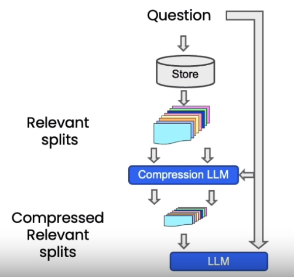

```python
from langchain.retrievers import ContextualCompressionRetriever
from langchain.retrievers.document_compressors import LLMChainExtractor

def pretty_print_docs(docs):
    print(f"\n{'-' * 100}\n".join([f"Document {i+1}:\n\n" + d.page_content for i, d in enumerate(docs)]))

llm = OpenAI(temperature=0)
compressor = LLMChainExtractor.from_llm(llm)  # 压缩器

compression_retriever_chinese = ContextualCompressionRetriever(
    base_compressor=compressor,
    base_retriever=vectordb_chinese.as_retriever()
)
# 对源文档进行压缩

question_chinese = "Matplotlib是什么？"
compressed_docs_chinese = compression_retriever_chinese.get_relevant_documents(question_chinese)
pretty_print_docs(compressed_docs_chinese)

```

在上面的代码中我们定义了一个 LLMChainExtractor ，它是一个压缩器，它负责从向量数据库返回的文档块中提取相关信息，然后我们还定义了 ContextualCompressionRetriever ，它有两个参数：base_compressor 和 base_retriever，其中 base_compressor 是我们前面定义的 LLMChainExtractor 的实例，base_retriever是早前定义的 vectordb 产生的检索器。


###### 其他类型的检索

值得注意的是，vetordb 并不是唯一一种检索文档的工具。`LangChain` 还提供了其他检索文档的方式，例如：`TF-IDF` 或 `SVM`。

```python
from langchain.retrievers import SVMRetriever
from langchain.retrievers import TFIDFRetriever
from langchain.document_loaders import PyPDFLoader
from langchain.text_splitter import RecursiveCharacterTextSplitter

# 加载PDF
loader_chinese = PyPDFLoader("docs/matplotlib/第一回：Matplotlib初相识.pdf")
pages_chinese = loader_chinese.load()
all_page_text_chinese = [p.page_content for p in pages_chinese]
joined_page_text_chinese = " ".join(all_page_text_chinese)

# 分割文本
text_splitter_chinese = RecursiveCharacterTextSplitter(chunk_size = 1500,chunk_overlap = 150)
splits_chinese = text_splitter_chinese.split_text(joined_page_text_chinese)

# 检索
svm_retriever = SVMRetriever.from_texts(splits_chinese, embedding)
tfidf_retriever = TFIDFRetriever.from_texts(splits_chinese)
```

---


#### 四、问答 Question Answering

##### 加载向量数据库

```python
from langchain.vectorstores import Chroma
from langchain.embeddings.openai import OpenAIEmbeddings
persist_directory = 'docs/chroma/matplotlib/'
embedding = OpenAIEmbeddings()
vectordb = Chroma(persist_directory=persist_directory, embedding_function=embedding)

print(vectordb._collection.count())

```

##### 构建检索式问答链

```python
from langchain.chat_models import ChatOpenAI
# 导入检索式问答链
from langchain.chains import RetrievalQA

llm = ChatOpenAI(model_name=llm_name, temperature=0)

# 声明一个检索式问答链
qa_chain = RetrievalQA.from_chain_type(
    llm,
    retriever=vectordb.as_retriever()
)

# 可以以该方式进行检索问答
question = "这节课的主要话题是什么"
result = qa_chain({"query": question})

print(result["result"])

```

##### 深入探究检索式问答链

在获取与问题相关的文档后,默认是合并所有文档，一次性输入模型。但**存在上下文长度限制的问题**，若相关文档量大，难以一次将全部输入模型。

解决策略:

- MapReduce 通过多轮检索与问答实现长文档处理
- Refine 让模型主动请求信息
- MapRerank 则通过问答质量调整文档顺序。

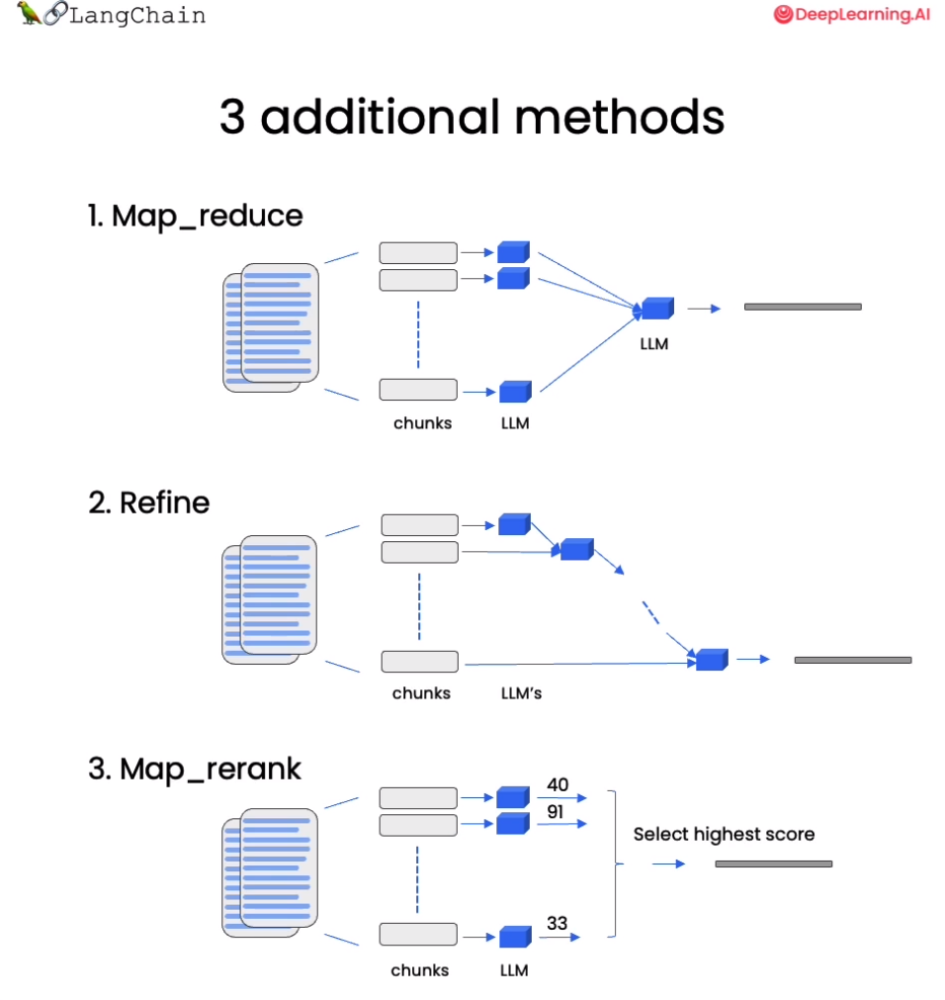

三种策略各有优劣 MapReduce 分批处理长文档，Refine 实现可交互问答，MapRerank 优化信息顺序，掌握这些技巧，可以应对语言模型的上下文限制，解决长文档问答困难，提升问答覆盖面。


###### 基于模板的检索式问答链

```python
from langchain.prompts import PromptTemplate

# Build prompt
template = """使用以下上下文片段来回答最后的问题。如果你不知道答案，只需说不知道，不要试图编造答案。答案最多使用三个句子。尽量简明扼要地回答。在回答的最后一定要说"感谢您的提问！"
{context}
问题：{question}
有用的回答："""
QA_CHAIN_PROMPT = PromptTemplate.from_template(template)


# Run chain 基于该模板来构建检索式问答链
qa_chain = RetrievalQA.from_chain_type(
    llm,
    retriever=vectordb.as_retriever(),
    return_source_documents=True,
    chain_type_kwargs={"prompt": QA_CHAIN_PROMPT}
)
```

```python
question = "这门课会学习 Python 吗"
result = qa_chain({"query": question})
print(result["result"])

```

这种方法非常好，因为它只涉及对语言模型的一次调用。然而，它也有局限性，即如果文档太多，可能无法将它们全部适配到上下文窗口中。我们可以使用另一种技术来对文档进行问答，即 MapReduce 技术。


###### 基于 MapReduce 的检索式问答链

在 MapReduce 技术中，首先将每个独立的文档单独发送到语言模型以获取原始答案。然后，这些答案通过最终对语言模型的一次调用组合成最终的答案。虽然这样涉及了更多对语言模型的调用，但它的优势在于可以处理任意数量的文档。

```python
qa_chain_mr = RetrievalQA.from_chain_type(
    llm,
    retriever=vectordb.as_retriever(),
    chain_type="map_reduce"
)

question = "这门课会学习 Python 吗"
result = qa_chain_mr({"query": question})

print(result["result"])

```

```python
无法确定，给出的文本并没有提到这门课是否会学习 Python。
```

当我们将之前的问题通过这个链进行运行时，我们可以看到这种方法的两个问题。第一，速度要慢得多。第二，结果实际上更差。根据给定文档的这一部分，对这个问题并没有明确的答案。这可能是因为它是基于每个文档单独回答的。因此，如果信息分布在两个文档之间，它并没有在同一上下文中获取到所有的信息。


###### 基于 Refine 的检索式问答链

将链式类型设置为 Refine ，这是一种新的链式策略。Refine 文档链类似于 MapReduce ，对于每一个文档，会调用一次 LLM。但改进之处在于，最终输入语言模型的 Prompt 是一个序列，将之前的回复与新文档组合在一起，并请求得到改进后的响应。因此，这是一种类似于 RNN 的概念，增强了上下文信息，从而解决信息分布在不同文档的问题。

例如第一次调用，Prompt 包含问题与文档 A ，语言模型生成初始回答。第二次调用，Prompt 包含第一次回复、文档 B ，请求模型更新回答，以此类推。

```python
qa_chain_mr = RetrievalQA.from_chain_type(
    llm,
    retriever=vectordb.as_retriever(),
    chain_type="refine"
)
question = "这门课会学习 Python 吗"
result = qa_chain_mr({"query": question})
print(result["result"])

```


---


#### 五、聊天 Chat

复现之前的代码：

```python
# 加载向量库，其中包含了所有课程材料的 Embedding。
from langchain.vectorstores import Chroma
from langchain.embeddings.openai import OpenAIEmbeddings
from langchain.prompts import PromptTemplate
from langchain.chat_models import ChatOpenAI
from langchain.chains import RetrievalQA
import panel as pn  # GUI


persist_directory = 'docs/chroma/matplotlib'
embedding = OpenAIEmbeddings()
vectordb = Chroma(persist_directory=persist_directory, embedding_function=embedding)

template = """使用以下上下文来回答最后的问题。如果你不知道答案，就说你不知道，不要试图编造答案。最多使用三句话。尽量使答案简明扼要。总是在回答的最后说“谢谢你的提问！”。
{context}
问题: {question}
有用的回答:"""
QA_CHAIN_PROMPT = PromptTemplate(input_variables=["context", "question"],template=template,)

llm = ChatOpenAI(model_name="gpt-3.5-turbo",temperature=0)
question = "这门课的主题是什么？"
qa_chain = RetrievalQA.from_chain_type(llm,
                                       retriever=vectordb.as_retriever(),
                                       return_source_documents=True,
                                       chain_type_kwargs={"prompt": QA_CHAIN_PROMPT})


result = qa_chain({"query": question})
print(result["result"])

```


##### 记忆 Memory

使用 `ConversationBufferMemory`。它保存聊天消息历史记录的列表，这些历史记录将在回答问题时与问题一起传递给聊天机器人，从而将它们添加到上下文中。

```python
from langchain.memory import ConversationBufferMemory
memory = ConversationBufferMemory(
    memory_key="chat_history", # 与 prompt 的输入变量保持一致。
    return_messages=True # 将以消息列表的形式返回聊天记录，而不是单个字符串
)

```


##### 对话检索链 

对话检索链（ConversationalRetrievalChain）在检索 QA 链的基础上，增加了处理对话历史的能力。

它的工作流程是:

1. 将之前的对话与新问题合并生成一个完整的查询语句。
2. 在向量数据库中搜索该查询的相关文档。
3. 获取结果后,存储所有答案到对话记忆区。
4. 用户可在 UI 中查看完整的对话流程。

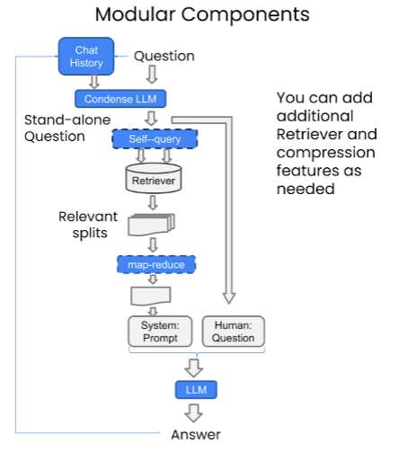

这种链式方式将新问题放在之前对话的语境中进行检索，可以处理依赖历史信息的查询。并保留所有信息在对话记忆中，方便追踪。

```python
from langchain.chains import ConversationalRetrievalChain
retriever=vectordb.as_retriever()
qa = ConversationalRetrievalChain.from_llm(
    llm,
    retriever=retriever,
    memory=memory
)

question = "这门课会学习 Python 吗？"
result = qa({"question": question})
print(result['answer'])

```

---


##### 实战：定义一个适用于文档的聊天机器人

```python
from langchain.embeddings.openai import OpenAIEmbeddings
from langchain.text_splitter import CharacterTextSplitter, RecursiveCharacterTextSplitter
from langchain.vectorstores import DocArrayInMemorySearch
from langchain.document_loaders import TextLoader
from langchain.chains import RetrievalQA,  ConversationalRetrievalChain
from langchain.memory import ConversationBufferMemory
from langchain.chat_models import ChatOpenAI
from langchain.document_loaders import TextLoader
from langchain.document_loaders import PyPDFLoader

def load_db(file, chain_type, k):
    """
    该函数用于加载 PDF 文件，切分文档，生成文档的嵌入向量，创建向量数据库，定义检索器，并创建聊天机器人实例。

    参数:
    file (str): 要加载的 PDF 文件路径。
    chain_type (str): 链类型，用于指定聊天机器人的类型。
    k (int): 在检索过程中，返回最相似的 k 个结果。

    返回:
    qa (ConversationalRetrievalChain): 创建的聊天机器人实例。
    """
    # 载入文档
    loader = PyPDFLoader(file)
    documents = loader.load()
    # 切分文档
    text_splitter = RecursiveCharacterTextSplitter(chunk_size=1000, chunk_overlap=150)
    docs = text_splitter.split_documents(documents)
    # 定义 Embeddings
    embeddings = OpenAIEmbeddings()
    # 根据数据创建向量数据库
    db = DocArrayInMemorySearch.from_documents(docs, embeddings)
    # 定义检索器
    retriever = db.as_retriever(search_type="similarity", search_kwargs={"k": k})
    # 创建 chatbot 链，Memory 由外部管理
    qa = ConversationalRetrievalChain.from_llm(
        llm=ChatOpenAI(model_name=llm_name, temperature=0), 
        chain_type=chain_type, 
        retriever=retriever, 
        return_source_documents=True,
        return_generated_question=True,
    )
    return qa 

import panel as pn
import param

# 用于存储聊天记录、回答、数据库查询和回复
class cbfs(param.Parameterized):
    chat_history = param.List([])
    answer = param.String("")
    db_query  = param.String("")
    db_response = param.List([])
    
    def __init__(self,  **params):
        super(cbfs, self).__init__( **params)
        self.panels = []
        self.loaded_file = "docs/matplotlib/第一回：Matplotlib初相识.pdf"
        self.qa = load_db(self.loaded_file,"stuff", 4)
    
    # 将文档加载到聊天机器人中
    def call_load_db(self, count):
        """
        count: 数量
        """
        if count == 0 or file_input.value is None:  # 初始化或未指定文件 :
            return pn.pane.Markdown(f"Loaded File: {self.loaded_file}")
        else:
            file_input.save("temp.pdf")  # 本地副本
            self.loaded_file = file_input.filename
            button_load.button_style="outline"
            self.qa = load_db("temp.pdf", "stuff", 4)
            button_load.button_style="solid"
        self.clr_history()
        return pn.pane.Markdown(f"Loaded File: {self.loaded_file}")

    # 处理对话链
    def convchain(self, query):
        """
        query: 用户的查询
        """
        if not query:
            return pn.WidgetBox(pn.Row('User:', pn.pane.Markdown("", width=600)), scroll=True)
        result = self.qa({"question": query, "chat_history": self.chat_history})
        self.chat_history.extend([(query, result["answer"])])
        self.db_query = result["generated_question"]
        self.db_response = result["source_documents"]
        self.answer = result['answer'] 
        self.panels.extend([
            pn.Row('User:', pn.pane.Markdown(query, width=600)),
            pn.Row('ChatBot:', pn.pane.Markdown(self.answer, width=600, style={'background-color': '#F6F6F6'}))
        ])
        inp.value = ''  # 清除时清除装载指示器
        return pn.WidgetBox(*self.panels,scroll=True)
    
    # 获取最后发送到数据库的问题
    @param.depends('db_query ', )
    def get_lquest(self):
        if not self.db_query :
            return pn.Column(
                pn.Row(pn.pane.Markdown(f"Last question to DB:", styles={'background-color': '#F6F6F6'})),
                pn.Row(pn.pane.Str("no DB accesses so far"))
            )
        return pn.Column(
            pn.Row(pn.pane.Markdown(f"DB query:", styles={'background-color': '#F6F6F6'})),
            pn.pane.Str(self.db_query )
        )
    
    # 获取数据库返回的源文件
    @param.depends('db_response', )
    def get_sources(self):
        if not self.db_response:
            return 
        rlist=[pn.Row(pn.pane.Markdown(f"Result of DB lookup:", styles={'background-color': '#F6F6F6'}))]
        for doc in self.db_response:
            rlist.append(pn.Row(pn.pane.Str(doc)))
        return pn.WidgetBox(*rlist, width=600, scroll=True)

    # 获取当前聊天记录
    @param.depends('convchain', 'clr_history') 
    def get_chats(self):
        if not self.chat_history:
            return pn.WidgetBox(pn.Row(pn.pane.Str("No History Yet")), width=600, scroll=True)
        rlist=[pn.Row(pn.pane.Markdown(f"Current Chat History variable", styles={'background-color': '#F6F6F6'}))]
        for exchange in self.chat_history:
            rlist.append(pn.Row(pn.pane.Str(exchange)))
        return pn.WidgetBox(*rlist, width=600, scroll=True)
    
    # 清除聊天记录
    def clr_history(self,count=0):
        self.chat_history = []
        return 

```

```python
# 初始化聊天机器人
cb = cbfs() 

# 定义界面的小部件
file_input = pn.widgets.FileInput(accept='.pdf') # PDF 文件的文件输入小部件
button_load = pn.widgets.Button(name="Load DB", button_type='primary') # 加载数据库的按钮
button_clearhistory = pn.widgets.Button(name="Clear History", button_type='warning') # 清除聊天记录的按钮
button_clearhistory.on_click(cb.clr_history) # 将清除历史记录功能绑定到按钮上
inp = pn.widgets.TextInput( placeholder='Enter text here…') # 用于用户查询的文本输入小部件

# 将加载数据库和对话的函数绑定到相应的部件上
bound_button_load = pn.bind(cb.call_load_db, button_load.param.clicks)
conversation = pn.bind(cb.convchain, inp) 

jpg_pane = pn.pane.Image( './img/convchain.jpg')

# 使用 Panel 定义界面布局
tab1 = pn.Column(
    pn.Row(inp),
    pn.layout.Divider(),
    pn.panel(conversation,  loading_indicator=True, height=300),
    pn.layout.Divider(),
)
tab2= pn.Column(
    pn.panel(cb.get_lquest),
    pn.layout.Divider(),
    pn.panel(cb.get_sources ),
)
tab3= pn.Column(
    pn.panel(cb.get_chats),
    pn.layout.Divider(),
)
tab4=pn.Column(
    pn.Row( file_input, button_load, bound_button_load),
    pn.Row( button_clearhistory, pn.pane.Markdown("Clears chat history. Can use to start a new topic" )),
    pn.layout.Divider(),
    pn.Row(jpg_pane.clone(width=400))
)
# 将所有选项卡合并为一个仪表盘
dashboard = pn.Column(
    pn.Row(pn.pane.Markdown('# ChatWithYourData_Bot')),
    pn.Tabs(('Conversation', tab1), ('Database', tab2), ('Chat History', tab3),('Configure', tab4))
)
dashboard

```

