### Maven

Maven是一款用于管理和构建Java项目的工具，是apache旗下的一个开源项目。

#### maven 安装

官方地址：https://maven.apache.org/download.cgi

安装教程：https://blog.csdn.net/weixin_46081857/article/details/121719684


#### IDEA 配置Maven

 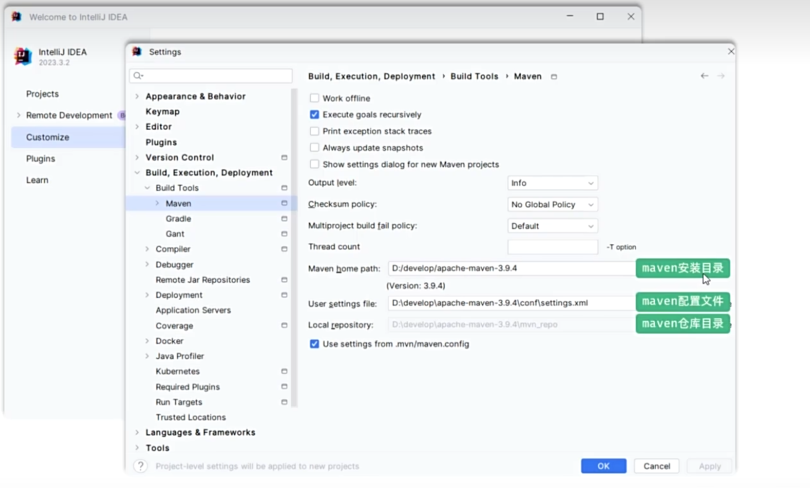

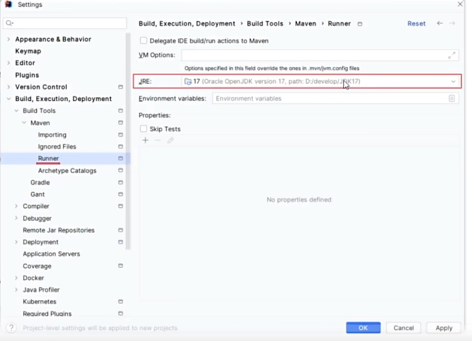

之后配置项目设置，sdk选择自己的java版本。

 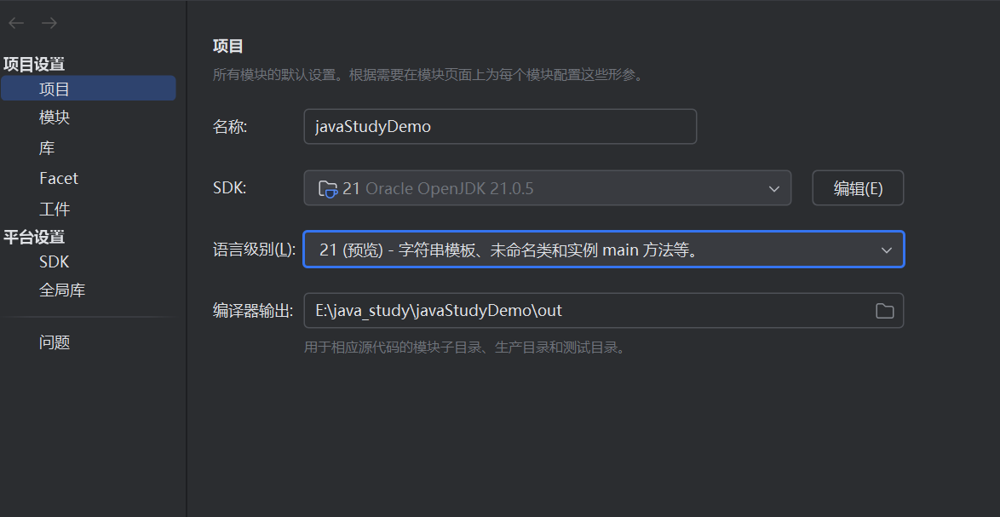


#### 创建Maven 项目

 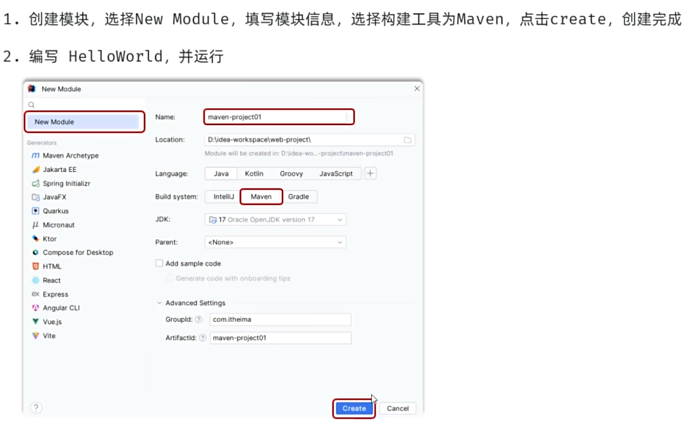


#### pom.xml 解析

```xml
<project xmlns="http://maven.apache.org/POM/4.0.0" xmlns:xsi="http://www.w3.org/2001/XMLSchema-instance"
  xsi:schemaLocation="http://maven.apache.org/POM/4.0.0 http://maven.apache.org/maven-v4_0_0.xsd">
  <!-- 描述当前项目信息  -->
     <modelVersion>4.0.0</modelVersion>

    <groupId>com.itheima</groupId>
    <artifactId>project_01</artifactId>
    <version>1.0-SNAPSHOT</version>
  <!-- 当前项目依赖包 -->
  <dependencies>
    <dependency>
      <groupId>junit</groupId>
      <artifactId>junit</artifactId>
      <version>3.8.1</version>
      <scope>test</scope>
    </dependency>
  </dependencies>
  <build>
    <finalName>studyDemo</finalName>
  </build>
  <properties>
        <maven.compiler.source>21</maven.compiler.source>
        <maven.compiler.target>21</maven.compiler.target>
        <project.build.sourceEncoding>UTF-8</project.build.sourceEncoding>
    </properties>
</project>

```

- `<groupId>org.example</groupId> ` 是组织名，填域名的倒写。

- `<artifactId>studyDemo</artifactId>` 是当前项目的名称

- 依赖管理

  ```xml
    <dependencies>
      <dependency>
        <groupId>junit</groupId>
        <artifactId>junit</artifactId>
        <version>3.8.1</version>
        <scope>test</scope>
      </dependency>
    </dependencies>
  ```

  配置好依赖后，Maven会去仓库里下载jar包。

  仓库分三类：

  - 本地仓库： 自己计算机上的目录
  - 中央仓库：由Maven管理的仓库 https://repol.maven,org/maven2
  - 远程仓库（私服）: 一般由公司团队搭建的私有仓库。

#### Maven 坐标

Maven中的坐标是资源(jar)的唯一标识，通过该坐标可以唯一定位资源位置。

使用坐标来定义项目或引入项目中需要的依赖。

Maven坐标主要组成

- groupId：定义当前Maven项目隶属组织名称（通常是域名反写，例如：com.itheima）
- artifactId：定义当前Maven项目名称（通常是模块名称，例如 order-service、goods-service）
- version：定义当前项目版本号
  - SNAPSHOT ：功能不稳定、尚处于开发中的版本，即快照版本
  - RELEASE ：功能趋于稳定，当前更新停止，可以用于发行的版本


#### 导入Maven项目

方式一

 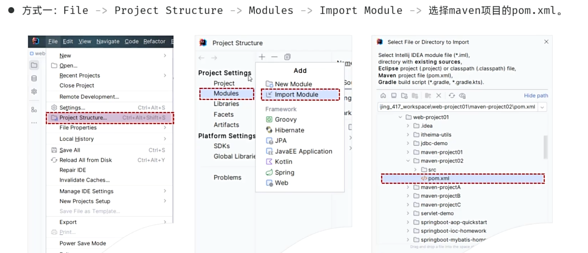

方式二

 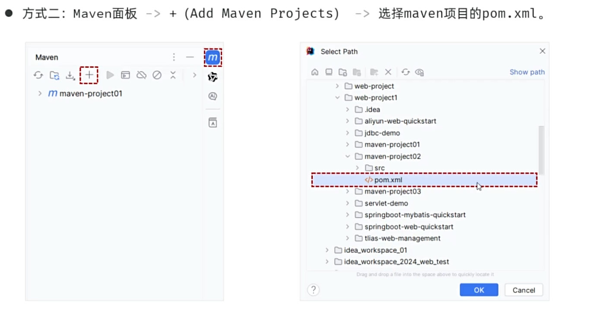


#### Maven 依赖管理

依赖：指当前项目运行所需要的jar 包，一个项目中可以引入多个依赖

配置：

- 在 pom.xml  中编写  `<dependencies>`  标签
- 在  `<dependencies>`  标签中 使用 `<dependency>` 引入坐标
- 定义坐标的 groupId, artifactId, version
- 点击刷新按钮，引入最新加入的坐标


##### 依赖传递

当我们引入一个依赖后，可能会发现它里面包含了多个其他的依赖，例如

 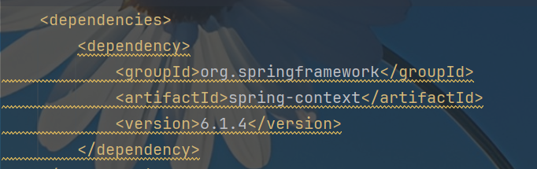

 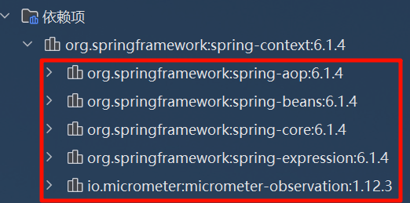

也就是说我们引入的依赖，它还需要依赖其他的各种依赖，一同安装进来，这就是依赖传递。

##### 排除依赖

指主动断开依赖的资源，被排除的资源无需指定版本

需要使用的标签 `<exclusion></exclusion>` 来指定需要排除的依赖

 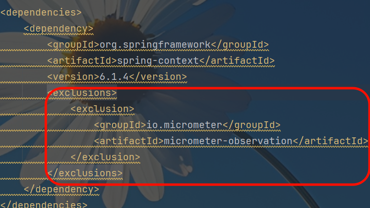


#### Maven 生命周期

相互独立的生命周期

- clean ： 清理工作，清理上一次编译的字节码文件，清理上一次打包的打包文件等。
- default ：核心工作， 如：编译、测试、打包、安装、部署等
- site ：生成报告、发布站点等

  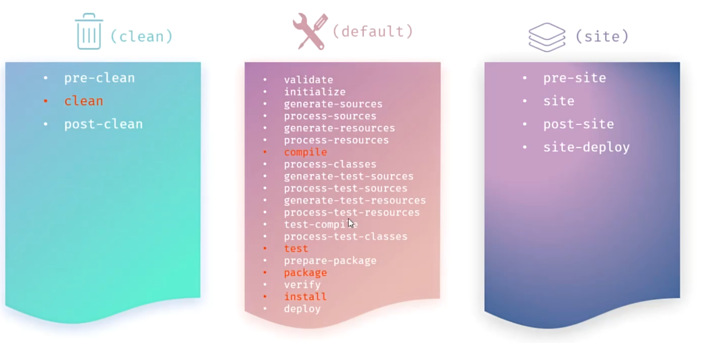

各个阶段的生命周期都是按照顺序的，后面的阶段依赖于前面的阶段

主要关注 `clean`、`compile`、`test`、`package`、`install` 阶段即可

- clean ： 移除上一次构建生成的文件
- compile：编译项目源代码
- test：使用合适的单元测试框架运行测试（junit）
- package：将编译后的文件打包，如：jar，war等
- install： 安装项目到本地仓库

执行指定生命周期的两种方式：

- 在idea中，右侧maven工具栏，选中对应生命周期，双击执行

 	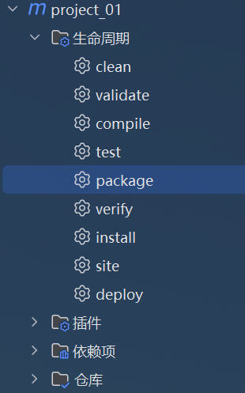

- 在命令行中，使用命令执行

  ```shell
  mvn <生命周期-name>
  ```

   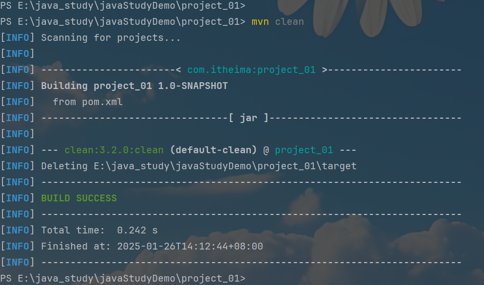


执行clean 生命周期，会将 target 文件夹 删除

执行compile 生命周期，会编译出字节码文件到 target 文件夹中。

执行test 生命周期， 会将编写的所有单元测试都进行运行。

执行package 生命周期， 会打包出 jar 包到 target 文件夹中。

执行install 生命周期， 将项目安装到本地仓库中。

 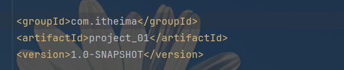

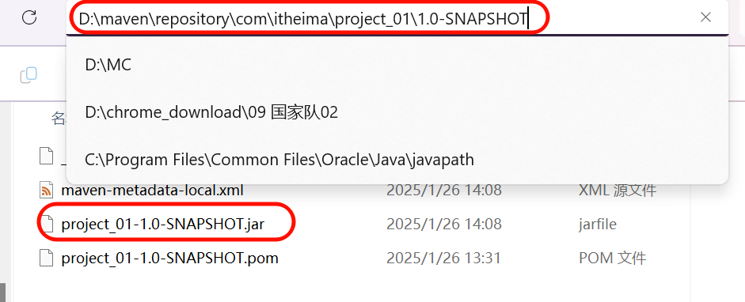


#### Maven 依赖范围

依赖的jar 包， 默认情况下，可以在任何地方使用。 可以通过 `<scope>...</scope>` 设置其作用范围

作用范围：

- 主程序范围有效。 （main文件夹范围内）
- 测试程序范围有效。 （test文件夹范围内）
- 是否参与打包运行。 （package指令范围内）

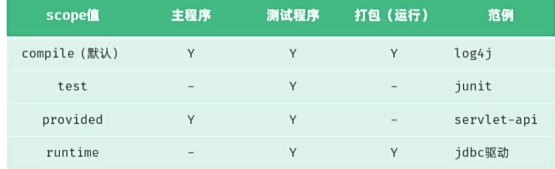


#### Maven 常见问题

- 依赖库中飘红，点击刷新无法重新下载

  这可能是由于网络原因，下载某个依赖包没有下载完整，仓库中残留有该依赖包，刷新后无法重新下载。

  解决方法：依赖没有下载完整，在maven仓库中生成了xxx.lastUpdated文件，该文件不删除，不会再重新下载。

  需要手动去删除该文件，然后重新刷新下载依赖即可。

  如果有很多文件需要删除，可以使用指令：`del /s *.lastUpdated` 进行批量递归删除特定文件

- 


### 单元测试

将测试分为不同的阶段：

- 单元测试

  对软件的基本组成单位(方法)进行测试， 检验软件基本组成单位的正确性， 测试人员：开发人员

- 集成测试

  将已分别通过测试的单元，按照设计要求组合成系统或子系统，再进行测试，检查单元之间的协作是否正确， 测试人员：开发人员

- 系统测试

  对已经集成好的软件系统进行彻底的测试，验证软件系统的正确性，性能是否满足指定要求， 测试人员：专业的测试工程师

- 验收测试

  交付测试，针对用户需求，业务流程进行的正式测试， 验证软件系统是否满足验收标准，测试人员：客户/需求方


#### 软件测试的方法

- 白盒测试

  测试人员清楚软件内部结构、代码逻辑。用于验证代码、逻辑正确性

- 黑盒测试

  测试人员不清楚软件内部结构，代码逻辑。用于验证软件的功能、兼容性等方面

- 灰盒测试

  结合白盒测试与黑盒测试的特点，即关注软件的内部结构又要考虑外部表现（功能）

 


#### JUnit

JUnit 是最流行的Java测试框架之一，提供了一些功能，方便程序进行单元测试（第三方公司提供）

 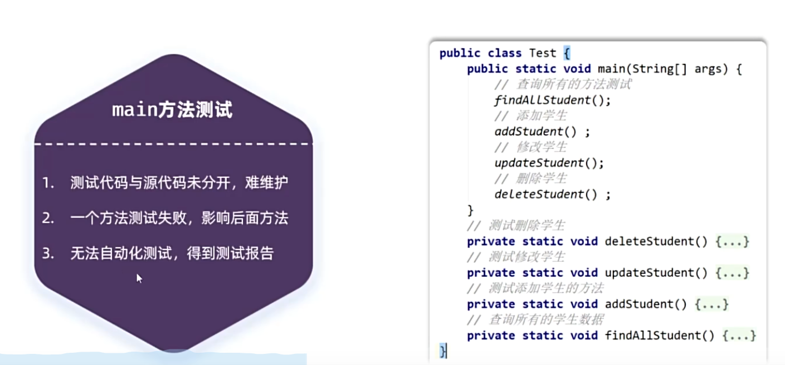

 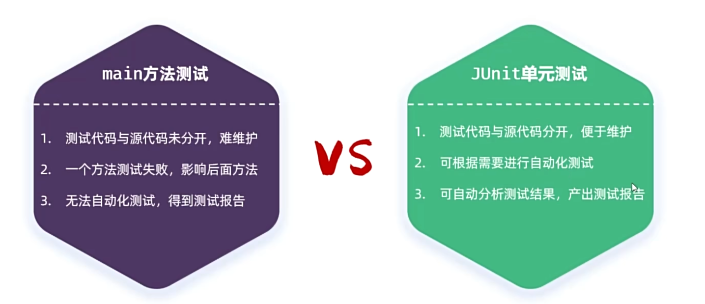

##### 使用案例


```java
// UserService.java

package com.itheima;
import java.time.LocalDate;
import java.time.Period;
import java.time.format.DateTimeFormatter;

public class UserService {
    /**
     * 给定一个身份证号，计算出该用户的年龄
     * @param idCard 身份证号
     */
    public Integer getAge(String idCard){
        if (idCard == null || idCard.length() != 18){
            throw new IllegalArgumentException("无效身份证号码");
        }
        String birthday = idCard.substring(6,14);
        LocalDate parse = LocalDate.parse(birthday, DateTimeFormatter.ofPattern("yyyyMMdd"));
        return Period.between(parse, LocalDate.now()).getYears();
    }

    /**
     * 给定一个身份证号，计算出该用户的性别
     * @param idCard 身份证号
     */
    public String getGender(String idCard){
        if (idCard == null || idCard.length() != 18){
            throw new IllegalArgumentException("无效身份证号码");
        }
        return Integer.parseInt(idCard.substring(16,17)) % 2 == 1 ? "男" : "女";
    }
}
```

使用 JUnit， 对 UserService.java 中业务方法进行单元测试

- 在 `pom.xml` 中，引入 JUnit 的依赖

   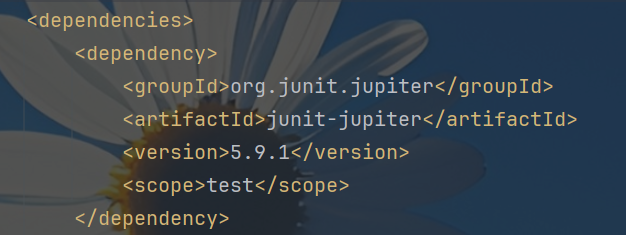

- 在test/ java 目录下， 创建测试类，并编写对应的测试方法，并在方法上声明 @Test注解

  JUnit单元测试类名命名规范为：`XxxxxTest`【规范】。JUnit单元测试的方法，必须声明为`public void`【规定】

   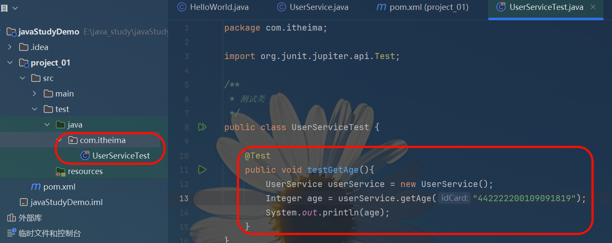

- 运行单元测试，测试通过为 绿色， 测试失败为 红色


##### 断言

   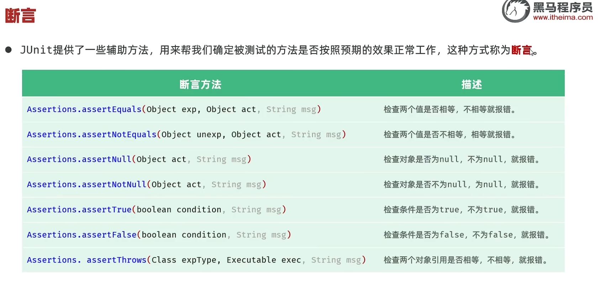

使用断言的示例

 ```java
     /**
      *  断言形式
      */
     @Test
     public void testGenderWithAssert(){
         UserService userService = new UserService();
         String gender = userService.getGender("442222200109092819");
         Assertions.assertEquals("男", gender);
     }
 
 
 	@Test
     public void testGenderWithAssert2(){
         UserService userService = new UserService();
         Assertions.assertThrows(IllegalArgumentException.class, () -> {
             userService.getGender(null);
         });
     }
 ```


##### 常见注解

 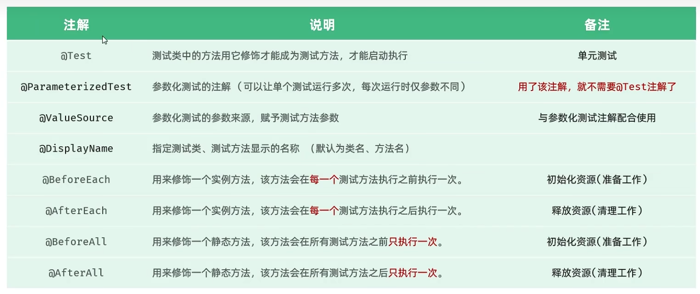


参数化测试

```java
    /**
     * 参数化测试
     */
    @ParameterizedTest
    @ValueSource(strings = {"100000200010011011","100000200010011031","100000200010011051"})
    public void testGetGender2(String idCard){
        UserService userService = new UserService();
        String gender = userService.getGender(idCard);
        Assertions.assertEquals("男", gender,"性别获取逻辑有问题");
    }
```


##### 企业开发规范

- 编写测试方法时，要尽可能的覆盖业务方法中所有可能的情况（尤其是边界值）

  ```java
  public class UserServiceTest {
  
      private UserService userService;
  
      @BeforeEach
      public void setUp() {
          userService = new UserService();
      }
  
      /**
       * 测试获取性别 - null
       */
      @Test
      @DisplayName("获取性别-null值")
      public void testGetGender1(){
          Assertions.assertThrows(IllegalArgumentException.class, () -> {
              userService.getGender(null);
          });
      }
  
      /**
       * 测试获取性别 - ""
       */
      @Test
      @DisplayName("获取性别-空字符串")
      public void testGetGender2(){
          Assertions.assertThrows(IllegalArgumentException.class, () -> {
              userService.getGender("");
          });
      }
  
      /**
       * 测试获取性别 - 长度不足的字符串
       */
      @Test
      @DisplayName("获取性别-长度不足")
      public void testGetGender3(){
          Assertions.assertThrows(IllegalArgumentException.class, () -> {
              userService.getGender("110");
          });
      }
  
      /**
       * 测试获取性别 - 超出长度的字符串
       */
      @Test
      @DisplayName("获取性别-长度超出")
      public void testGetGender4(){
          Assertions.assertThrows(IllegalArgumentException.class, () -> {
              userService.getGender("1000002000100110111100000");
          });
      }
  
      /**
       * 测试获取性别 - 正常： 男
       */
      @Test
      @DisplayName("获取性别-正常男性身份证")
      public void testGetGender5(){
          String gender = userService.getGender("10000020001001101");
          Assertions.assertEquals("男", gender);
      }
  
      /**
       * 测试获取性别 - 正常： 女
       */
      @Test
      @DisplayName("获取性别-正常女性身份证")
      public void testGetGender6(){
          String gender = userService.getGender("100000200010011011");
          Assertions.assertEquals("女", gender);
      }
  }
  ```

- 查看IDEA的单元测试的覆盖率报告，检查哪些方法、哪些分支没有测试到，然后进行补充

   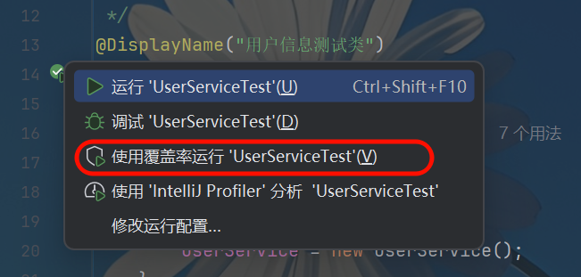

   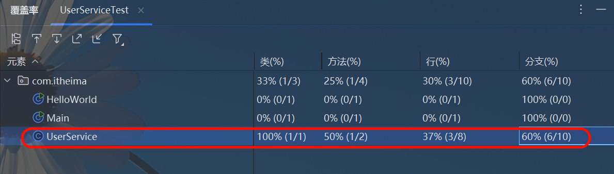

  


### Web 后端开发


B / S 架构（Browser / Server） ： 浏览器 / 服务器架构模式

C / S 架构（Client / Server）:  客户端 / 服务器架构模式


#### SpringBoot Web 

##### 快速入门

需求： 基于 SpringBoot 开发一个Web 应用， 浏览器发起请求 `/hello` 后， 服务端返回 `"Hello world"` 给浏览器

-  创建springboot 工程， 勾选web 开发相关依赖

   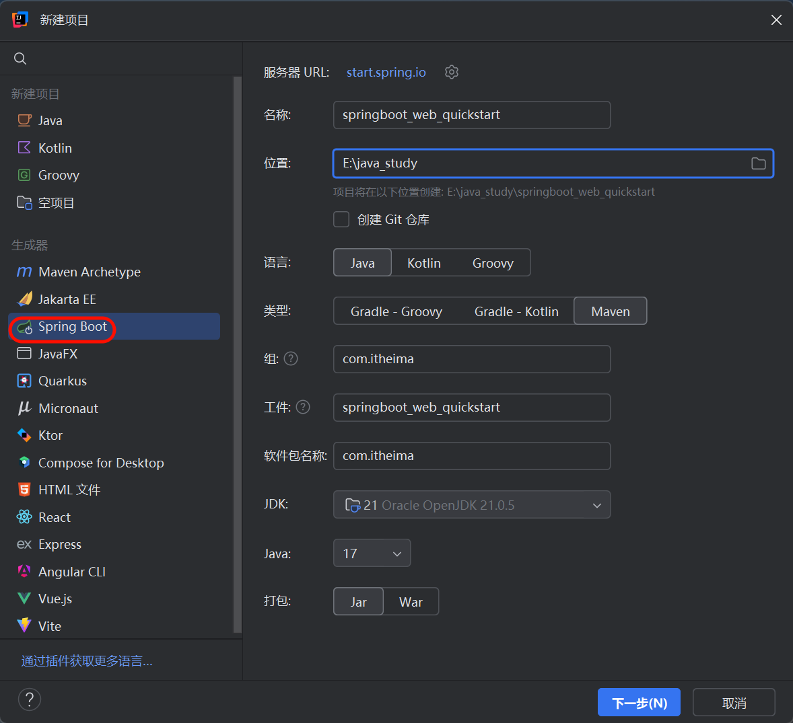

   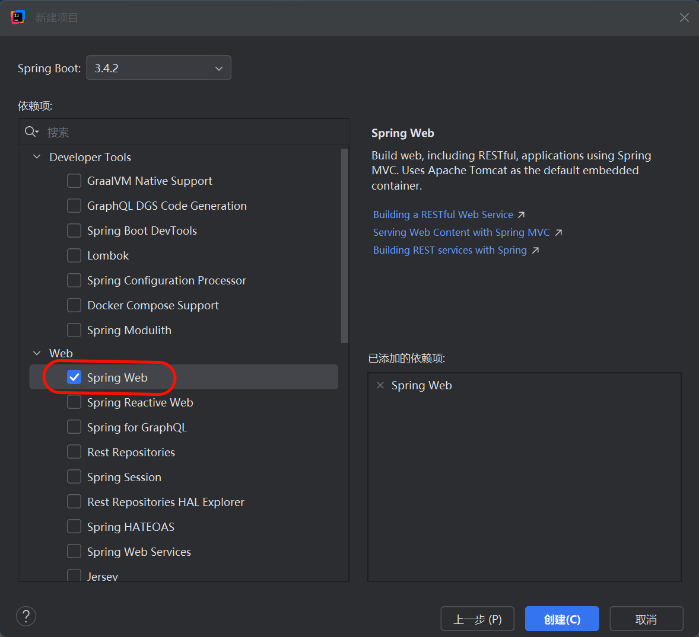

- 定义 HelloController 类， 添加注解

  ```java
  import org.springframework.web.bind.annotation.RequestMapping;
  import org.springframework.web.bind.annotation.RestController;
  
  @RestController // 标识当前类是一个请求处理类
  public class HelloController {
      @RequestMapping("/hello") // 标识请求路径
      public String getHello(){
          System.out.println("HelloController ... hello");
          return "Hello World";
      }
  }
  
  ```

- 启动应用

   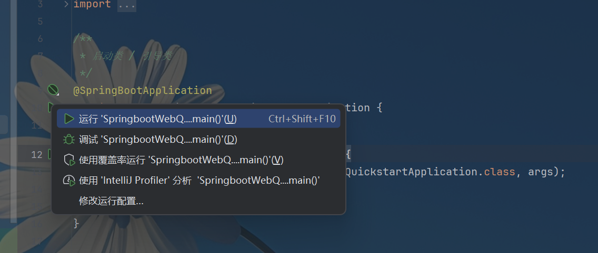

  


##### 获取https请求协议相关数据

```java
@RestController
public class RequestController {
    @RequestMapping("/requst")
    public String getRequestInfo(HttpServletRequest request){
        // 获取请求方式
        String method = request.getMethod(); // GET or POST

        // 获取请求url地址
        String url = request.getRequestURL().toString();
        String uri = request.getRequestURI();

        // 获取请求协议
        String protocol = request.getProtocol();

        // 获取请求参数
        String name = request.getParameter("name");

        // 获取请求头
        String accept = request.getHeader("Accept");

        return "ok";
    }
}
```


##### 设置响应数据

基于 HttpServletResponse 封装

```java
@RestController
public class ResponseController {
    @RequestMapping("/response")
    public void setResponse(HttpServletResponse response) throws IOException {
        //1.设置响应状态码
        response.setStatus(401);
        //2.设置响应头
        response.setHeader("name","itcast");
        //3.设置响应体
        response.setContentType("text/html;charset=utf-8");
        response.setCharacterEncoding("utf-8");
        response.getWriter().write("<h1>hello response</h1>");
    }
}
```


基于 ResponseEntity 封装

```java
@RestController
public class ResponseController {
    @RequestMapping("/response")
    public ResponseEntity<String> setResponse(){
        return ResponseEntity
                .status(401)
                .header("name","itcast")
                .body("<h1>hello response</h1>");
    }
}
```


##### 获取resources文件夹下的静态资源

首先，在开发阶段Java源文件和资源文件被分开存放，但是在编译和构建后，它们都会被整合到类路径下的相同输出目录( `target/classes`) 中

其次就是 每个类都有类加载器，负责将类的字节码加载到Java虚拟机中，并转换为`Class`对象。除此之外，它还可以加载资源文件（同一类路径下的其他资源文件）

那么就可以这样访问到静态资源文件

```java
@RestController
public class UserController {
    @RequestMapping("/list")
    public String list() throws Exception {
        // 加载并读取 resources文件夹下的 user.txt 文件
        InputStream in = this.getClass().getClassLoader().getResourceAsStream(name:"user.txt");
        ArrayList<String> lines = IoUtil.readLines(in, StandardCharsets.UTF_8, new ArrayList<>());
    }
}

```

- **`this.getClass()`**

  这个表达式返回的是调用该方法的对象的运行时类（即对象所属的类）。在Java中，每个对象都有一个`getClass()`方法（由`Object`类定义），它返回一个`Class<?>`对象，这个对象包含了关于类的结构信息（比如类的名字、父类、实现的接口、构造函数、字段和方法等）。

- **`getClassLoader()`**

  `Class`类提供了一个`getClassLoader()`方法，用于获取加载该类的类加载器实例。类加载器负责将类的字节码加载到Java虚拟机中，并转换为`Class`对象。

- **`getResourceAsStream(String name)`**

  类加载器提供了`getResourceAsStream(String name)`方法，用于从类路径中读取资源文件并将其作为InputStream返回。


##### 分层解耦

###### 三层架构

- 表示层，也叫做 控制层（controller）。接受前端发送的请求，对请求进行处理，并响应数据
- 逻辑层（service）。处理具体业务逻辑
- 持久层，也叫做数据访问层（dao）。 负责数据访问操作，包括数据的增删改查


规范：

```java
--java
----com.itheima
------controller // 控制层
------dao // 数据访问层
--------impl // 实现类
------service // 逻辑层
--------impl // 实现类
```


###### 分层与解耦

耦合： 衡量软件中各个层 / 各个模块的依赖关联程度

内聚：软件中各个功能模块内部的功能联系

原则： 高内聚 低耦合


控制反转（IOC）：对象的创建控制权由程序自身转移到外部（容器）

依赖注入（DI）：容器为应用程序提供运行时所依赖的资源

Bean对象： IOC容器中创建和管理的对象，称为Bean


使用IOC 与 DI 可以实现 层与层 之间的解耦合

1. 将Dao 以及 Service 层的实现类， 交给IOC容器管理 （在实现类上加上 `@Component` 注解）
2. 为 Controller 以及 Service注入运行时所依赖的对象 （在所声明的对象上加上`@Autowired` 注解）

 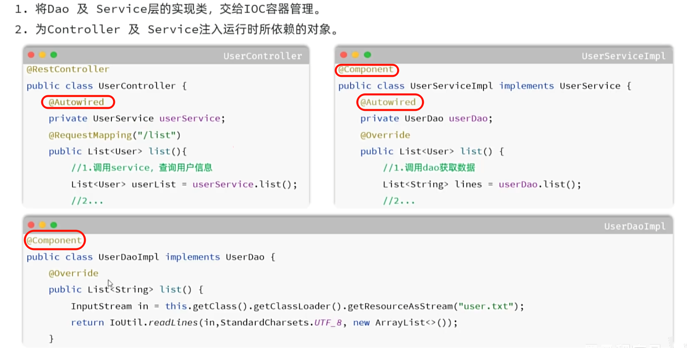


`@Component` : 将实现类交给IOC容器管理， 注意是加在实现类上，而非接口上

`@Autowired` ：应用程序运行时，会自动查询该类型的 bean 对象， 并赋值给该成员变量


##### IOC 详解

衍生注解

 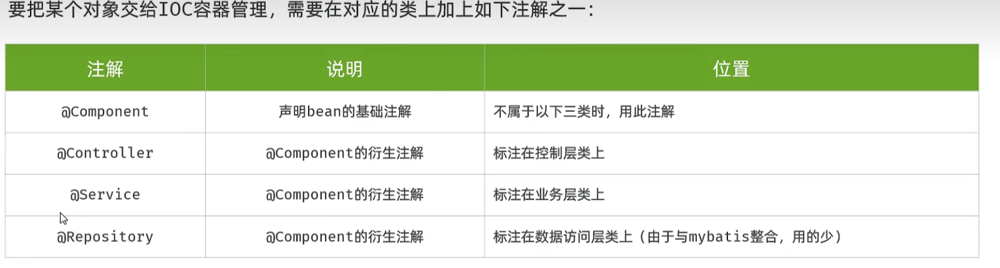

声明bean的时候，可以通过注解的value属性指定bean名字，如果没有指定，默认为类名首字母小写

 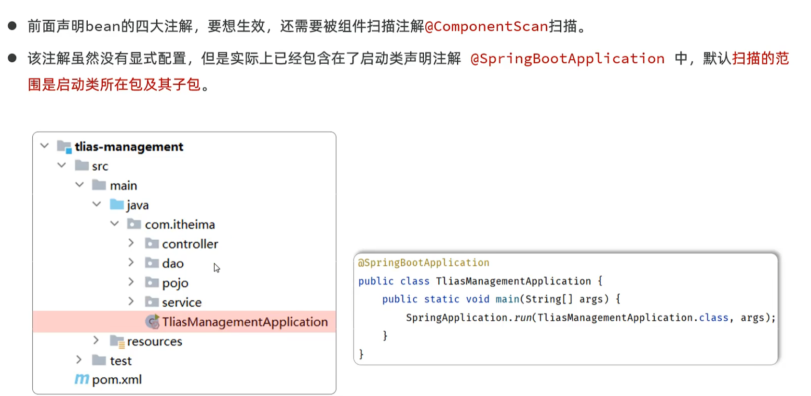


注意事项

- 在Springboot集成web开发中，声明控制器bean只能用@Controller。
- 声明bean的注解要想生效，需要被扫描到，启动类默认扫描当前包及其子包。


##### DI详解

 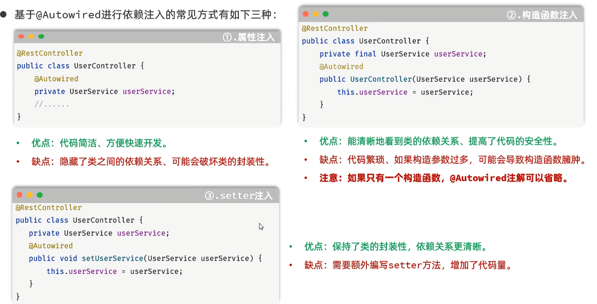

注意： 在构造函数的依赖注入方式中，如果当前类中只存在一个构造函数，@Autowired 可以省略不写

 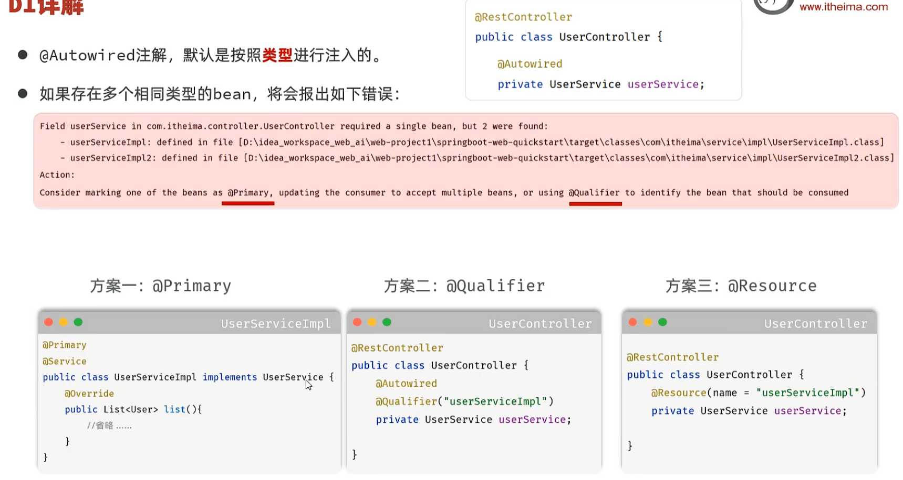

@Resource 与 @Autowired区别:
	@Autowired是Spring框架提供的注解，而@Resource是JavaEE规范提供的
	@Autowired默认是按照类型注入，而@Resource默认是按照名称注入


##### spring 配置文件

springboot 提供了多种属性配置方式，如：`properties` 、`yaml` 、`yml` 文件

 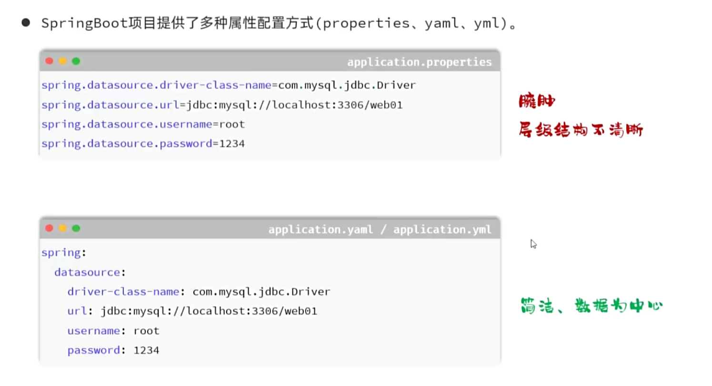

 yaml 与 yml 文件的格式是一模一样的。

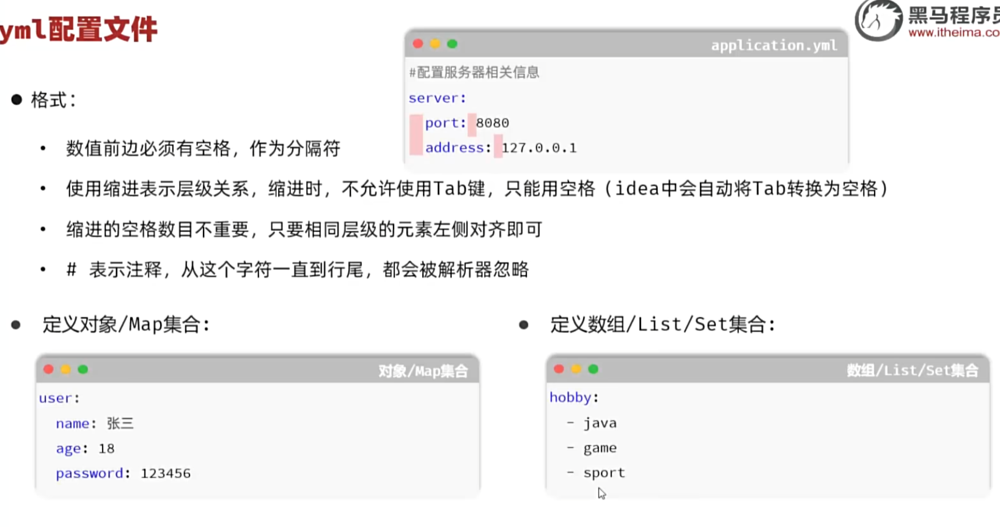

注意：在yml格式的配置文件中，如果配置项的值是以0开头的，值需要使用 `' ' `引起来，因为以0开头在yml中表示8进制的数据。


可以通过@Value注解获取到这些配置项

```yaml
aliyun:
	oss:
		endpoint: https://example.com
		bucketName: java-ai
		region: cn-beijing
```

```java
@Component
public class AliyunOssOperator {
    @Value("${aliyun.oss.enpoint}")
    private String endpoint;
    @Value("${aliyun.oss.bucketName}")
    private String bucketName;
    @Value("${aliyun.oss.region}")
    private String region;
}
```

如果配置项有很多，使用@Value注解就不太方便，这就可以使用@ConfigurationProperties注解进行批量获取

```java
@Data
@Component
@ConfigurationProperties(prefix="aliyun.oss")
public class AliyunOSSProperties {
    private String endpoint;
    private String bucketName;
    private String region;
}
```

```java
@Component
public class AliyunOssOperator {
    @Autowired
    private AliyunOSSProperties aliyunOSSProperties;
    
    private String endpoint = aliyunOSSProperties.getEndpoint();
}
```


#### JDBC

JDBC 是 JAVA 操作关系型数据库的一套 API。

MyBatis 是对 JDBC 进行封装的 框架

 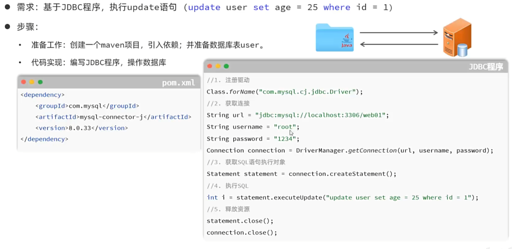

在执行SQL 那句代码中， 返回的int i 是SQL执行完毕 影响的记录数。

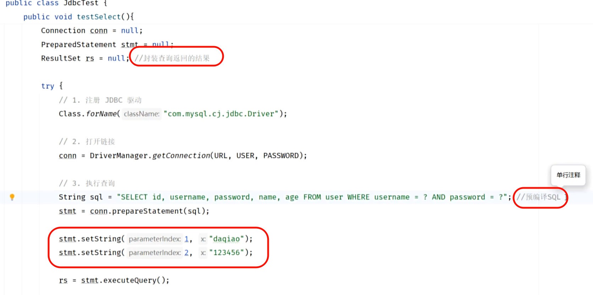

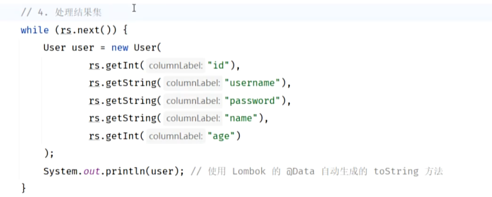

 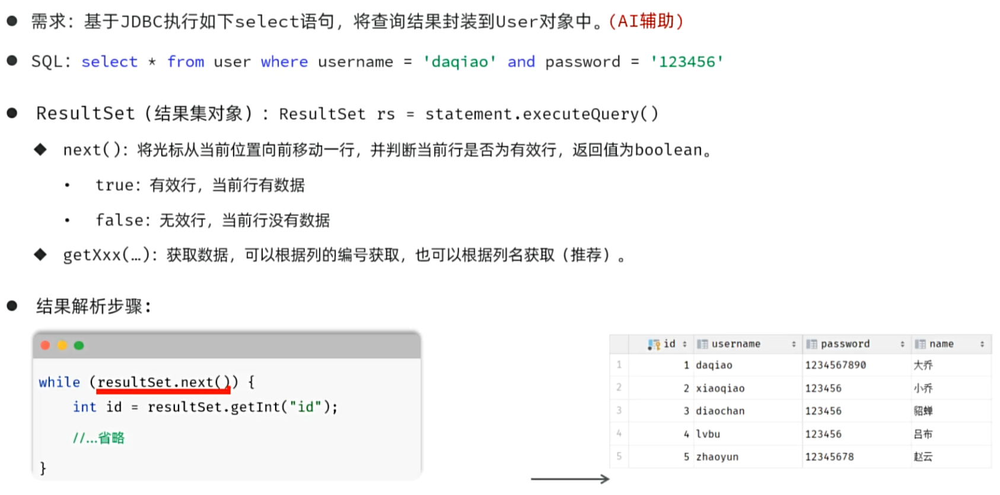


##### 预编译SQL

 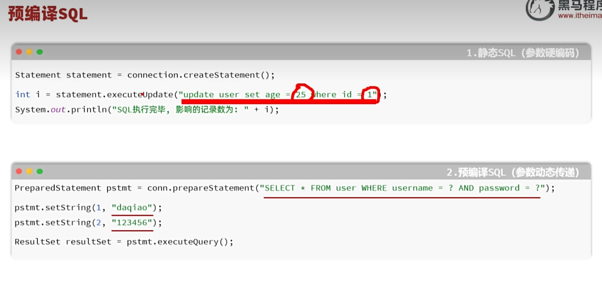


预编译SQL 可以防止SQL注入，更安全，对传入的变量赋值时，会对特殊字符进行转义。


#### Mybatis

mybatis 底层就是jdbc，是对jdbc进行封装，大大简化了JDBC的开发

##### 引入Mybatis 依赖

 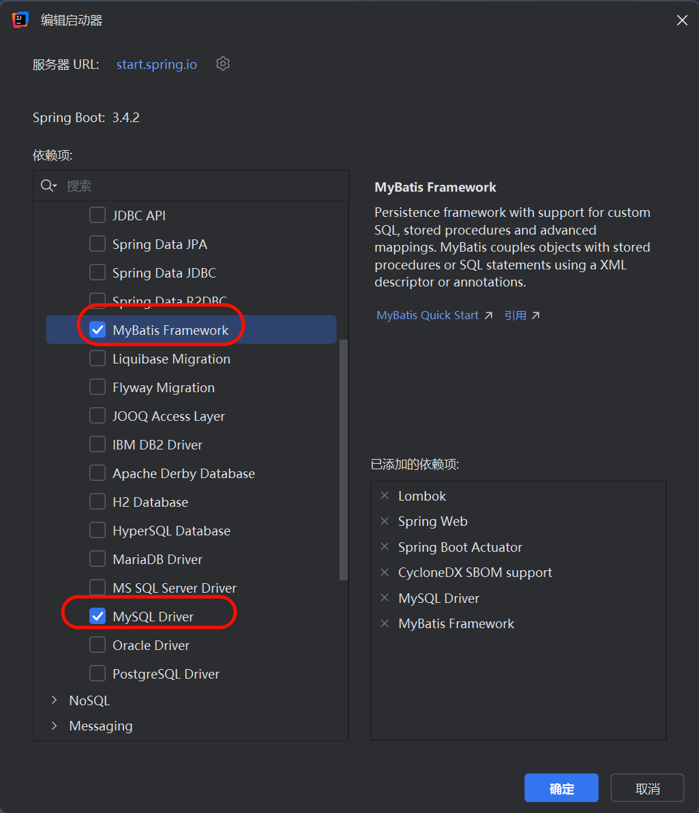

##### 配置mybatis 设置

```properties
# application.properties

spring.application.name=springboot_web_quickstart

# 配置数据库连接信息
spring.datasource.url=jdbc:mysql://localhost:3306/web01
spring.datasource.driver-class-name=com.mysql.cj.jdbc.Driver
spring.datasource.username=root
spring.datasource.password=root

# 配置mybatis 的日志输出
mybatis.configuration.log-impl=org.apache.ibatis.logging.stdout.StdOutImpl
```

##### 编写Mybatis 持久层接口

先创建 mapper 目录，然后在里面创建相应的接口

 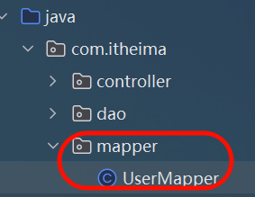

 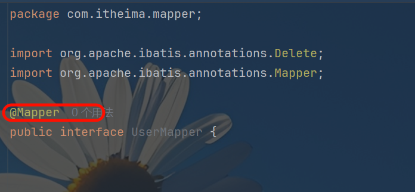

没加上`@Mapper` 注解，就只是一个普通的接口，而加上该注解，那么应用程序在运行时，会自动为该接口创建一个实现类对象（即代理对象），并且会自动将该类对象存入IOC容器，成为bean对象。


##### 数据库连接池

数据库连接池是个容器，负责分配、管理数据库连接（Connection）
它允许应用程序重复使用一个现有的数据库连接，而不是再重新建立一个。
释放空闲时间超过最大空闲时间的连接，来避免因为没有释放连接而引起的数据库连接遗漏。

官方提供了数据连接池的接口，由第三方组织实现此接口

接口名： `DataSource`

功能： 获取连接 `Connection getConnection() throws SQLException;`

第三方：

 

 常用的就只有后两个，一个是spring boot 默认的（Hikari），一个是阿里巴巴提供的（Druid）

切换数据库连接池：

 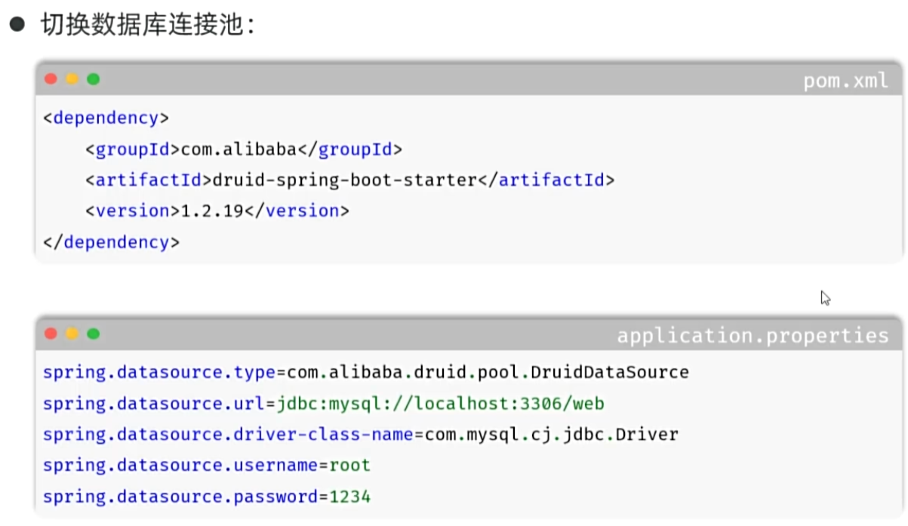


##### 数据库的增删改查

```java
package com.itheima.mapper;

import com.itheima.pojo.User;
import org.apache.ibatis.annotations.*;

import java.util.List;

@Mapper
public interface UserMapper {

    /**
     * 查询所有用户
     * @return
     */
    @Select("select id, username, password, name, age from user")
    public List<User> findAll();

    /**
     * 条件查询
     */
    @Select("select * from user where username=#{username} and password=#{password}")
    // public User findByUsernameAndPassword(String username, String password);
    // 当具有多个形参时，由于java编译成字节码文件后，形参的名称是不保留的，也就是说在字节码文件中，并不知道形参名，只知道形参类型
    // 也就是说#{username} 获取形参时并不知道获取哪个形参，因此需要给每个形参取名字，使用@Param注解
    public User findByUsernameAndPassword(@Param("username") String username,@Param("password") String password);
    // 注意： 如果是基于SpringBoot官方提供的脚手架创建的项目中，接口编译会保留形参名字，也就不需要使用@Param注解。


    /**
     * 删除用户
     * @param id 用户id
     */
    @Delete("delete from user where id = #{id}")
    public void deleteById(Integer id);
    // #{...} 占位符，执行时会将#{...} 替换为？，生成预编译SQL
    // ${...} 拼接符，直接将参数拼接在SQL语句中，存在SQL注入问题。一般用于表名，字段名动态设置使用

    /**
     * 新增用户
     * @param user 用户实体类
     */
    @Insert("insert into user(username,password,name,age) values (#{username}, #{password}, #{name}, #{age})")
    public void insert(User user);
    // 注意 此处的 #{username} 是User实体类的属性名，而不是数据表的字段名

    /**
     * 修改用户信息
     */
    @Update("update user set username=#{username},password=#{password},name=#{name},age=#{age} where id=#{id} ")
    public void update(User user);

}

```


Controller层 公共部分统一抽取

 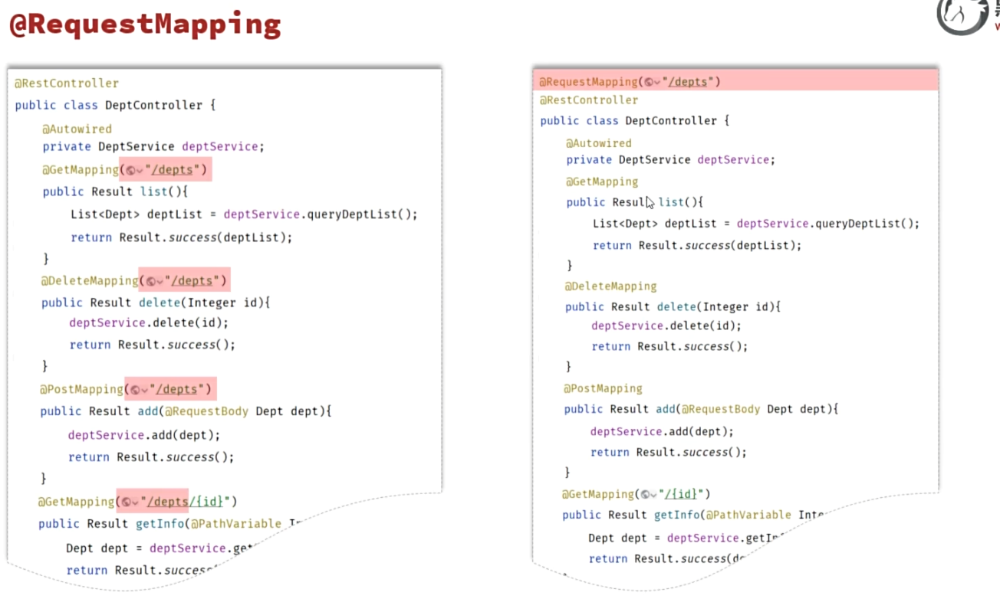

故而 一个完整的请求路径应该是 类上面的@RequestMapping的value值 + 方法上@RequestMapping的value值


##### XML 映射配置

 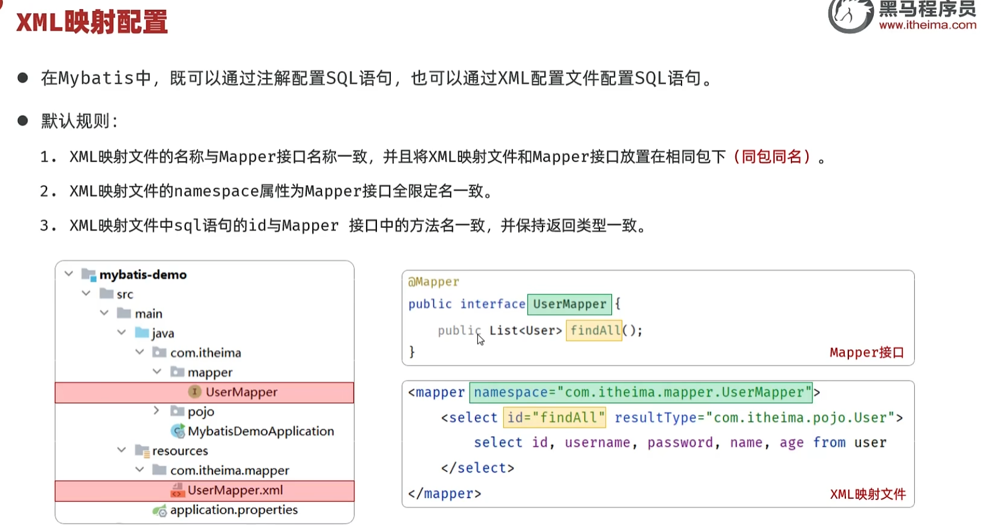

自定义XML配置文件存放位置

```properties
# application.properties

mybatis.mapper-locations=classpath:mapper/*.xml
```

 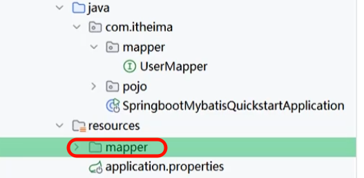


使用 Mybatis X 插件，可以快速定位到相应的xml文件中的sql语句。


##### 数据封装

- 实体类属性名 和 数据库表查询返回的字段名一致， mybatis 会自动封装，反之不会自动封装

- 手动封装

  ```java
  @Mapper
  public interface DeptMapper {
      /**
       * 查询所有部门数据
       */
      @Results({
              @Result(column = "create_time", property = "createTime"),
              @Result(column = "update_time", property = "updateTime"),
      })
      public List<Dept> findAll();
  }
  ```

- 起别名

  在SQL 语句中，将返回的字段名起别名，与实体类的属性名对上即可。

- 开启mybatis 驼峰命名 (推荐)

  如果字段名与属性名符合驼峰命名规则，mybatis会自动通过驼峰命名规则进行转换。

  即 `xxx_abc  ->  xxxAbc`

  ```yaml
  mybatis:
  	configuration:
  		map-underscore-to-camel-case: true
  ```


注意：在GET请求中，如果请求参数很多，可以通过实体类来接受。POST也是使用实体类来接受，但是需要@RequestBody注解，因为是json格式接受。


在Mapper.xml中编写查询SQL语句，将查询到的数据自动封装到实体类中，使用 resultType 属性

```java
@Data
public class Dept {
    private Integer id; // 部门id
    private String name; // 部门名称
    private LocalDateTime createTime; // 创建时间
    private LocalDateTime updateTime; // 更新时间
}

```

```xml
<?xml version="1.0" encoding="UTF-8" ?>
<!DOCTYPE mapper
        PUBLIC "-//mybatis.org//DTD Mapper 3.0//EN"
        "http://mybatis.org/dtd/mybatis-3-mapper.dtd">

<mapper namespace="com.itheima.mapper.DeptMapper">
    <select id="findAll" resultType="com.itheima.pojo.Dept">
        select id, name, create_time, update_time from dept order by update_time desc
    </select>
</mapper>
```

但如果查询SQL语句查到多条记录且需要封装到集合中，需要使用 resultMap 属性

```java
@Data
public class Emp {
    private Integer id; //ID,主键
    private String username; //用户名
    private String password; //密码
    private String name; //姓名
    private Integer gender; //性别，1:男，2:女
    private String phone; //手机号
    private Integer job; //职位，1:班主任，2：讲师,3：学工主管，
    private Integer salary; //薪资
    private String image; //头像
    private LocalDate entryDate；//入职日期
    private Integer deptId；//关联的部门ID
    private LocalDate TimecreateTime；//创建时间
    private LocalDate TimeupdateTime；//修改时间
    //封装员工工作经历
    private List<EmpExpr> exprList；//工作经历列表
}
```

```xml
<?xml version="1.0" encoding="UTF-8" ?>
<!DOCTYPE mapper
        PUBLIC "-//mybatis.org//DTD Mapper 3.0//EN"
        "http://mybatis.org/dtd/mybatis-3-mapper.dtd">

<mapper namespace="com.itheima.mapper.EmpMapper">
    <select id="getById" resultMap="empResultMap">
        select 
        	e.*, ee.id ee_id, ee.emp_id ee_empid, ee.begin ee_begin, 
        	ee.end ee_end, ee.company ee_company, ee.job ee_job
        from emp e left join emp_expr ee on e.id = ee.emp_id
        where e.id = #{id}
    </select>
</mapper>

<!--自定义结果集ResultMap-->
<resultMap id="empResultMap" type="com.itheima.pojo.Emp">
    <id column="id" property="id"/>
    <result column="username" property="username"/>
    <result column="password" property="password" />
    <result column="name" property="name"/>
    <result column="gender" property="gender"/>
    <result column="image" property="image" />
    <result column="entry_date" property="entryDate"/>
    <result column="dept_id" property="deptId" />
    <result column="create_time" property="createTime"/>
    <result column="update_time" property="updateTime"/>
    
    <!--封装exprList-->
    <collection property="exprList" ofType="com.itheima.pojo.EmpExpr">
        <id column="ee_id" property="id"/>
        <result column="ee_company" property="company"/>
        <result column="ee_job" property="job"/>
        <result column="ee_begin" property="begin"/>
        <result column="ee_end" property="end"/>
        <result column="ee_empid" property="empId"/>
    </collection>
</resultMap>
```


##### 动态SQL

`<if>` 判断条件是否成立，如果条件成立，则拼接SQL

```xml
<?xml version="1.0" encoding="UTF-8" ?>
<!DOCTYPE mapper
        PUBLIC "-//mybatis.org//DTD Mapper 3.0//EN"
        "http://mybatis.org/dtd/mybatis-3-mapper.dtd">

<mapper namespace="com.itheima.mapper.EmpMapper">
    <select id="list" resultType="com.itheima.pojo.Emp">
        SELECT e.*, d.name AS deptName FROM emp e LEFT JOIN dept d ON e.dept_id = d.id
        where
        	<if test="name != null and name != ''">
                e.name like concat('%', #{name}, '%')
        	</if>
        	<if test="gender != null">
                and e.gender = #{gender}
        	</if>
        	<if test="begin != null and end != null">
                and e.entry_date between #{begin} and #{end}
        	</if>
        order by e.update_time desc
    </select>
</mapper>
```

 解释： 如果传递进来的name参数不为null并且name也不为空字符，则拼接`<if>`包裹的语句。

前面如果只使用`<if>`标签，会有一个bug， 如果第一条if不成立，而后面的if成立，那么就会拼接成这样

`... where and  e.gender = 1 ...`

这个sql语句显然不正确，因为where后接 and

该如何解决上述问题呢？可以使用`<where>`标签。


`<where>` ：根据查询条件，来生成where 关键字，并且会自动去除条件前面多余的and或or

```xml
<?xml version="1.0" encoding="UTF-8" ?>
<!DOCTYPE mapper
        PUBLIC "-//mybatis.org//DTD Mapper 3.0//EN"
        "http://mybatis.org/dtd/mybatis-3-mapper.dtd">

<mapper namespace="com.itheima.mapper.EmpMapper">
    <select id="list" resultType="com.itheima.pojo.Emp">
        SELECT e.*, d.name AS deptName FROM emp e LEFT JOIN dept d ON e.dept_id = d.id
        <where>
        	<if test="name != null and name != ''">
                e.name like concat('%', #{name}, '%')
        	</if>
        	<if test="gender != null">
                and e.gender = #{gender}
        	</if>
        	<if test="begin != null and end != null">
                and e.entry_date between #{begin} and #{end}
        	</if>
        </where>
        order by e.update_time desc
    </select>
</mapper>
```


`<foreach>`: 循环遍历标签

```xml
<?xml version="1.0" encoding="UTF-8" ?>
<!DOCTYPE mapper
        PUBLIC "-//mybatis.org//DTD Mapper 3.0//EN"
        "http://mybatis.org/dtd/mybatis-3-mapper.dtd">

<mapper namespace="com.itheima.mapper.EmpMapper">
	<insert id="insertBatch">
         insert into emp_expr (emp_id, begin, end, company, job) values
    	<foreach collection="exprList" item="expr" separator=",">
        	(#{expr.empId}, #{expr.begin}, #{expr.end}, #{expr.company}, #{expr.job})
        </foreach>
    </insert>
</mapper>
```

- collection: 集合名称
- item: 集合遍历出来的元素项
- separator: 每一次遍历使用的分割符
- open: 遍历开始前拼接的片段
- close: 遍历结束后拼接的片段


`<set>` 自动生成set 关键字， 自动删除更新字段后多余的逗号


##### 主键返回

如果插入记录后，想要获取刚刚插入的记录的主键id，可以使用`@Options(userGeneratedKey = true, keyProperty = 'id')`来获取数据库生成的主键。

案例：

实体类

```java
@Data
public class EmpExpr {
    private Integer id; // Id
    private Integer empId;
    private LocalDate begin;
    private LocalDate end;
    private String company;
    private String job;
}


@Data
public class Emp {
    private Integer id; // id主键
    private String name; // 名称
    private LocalDateTime createTime; // 创建时间
    private LocalDateTime updateTime; // 更新时间
    
    private List<EmpExpr> exprList;
}
```

controller 层 

 ```java
 public class EmpController {
     @PostMapping
     public Result save(@RequestBody Emp emp){  // 传进来的员工数据是不包含员工id，应由数据库自动生成
         empService.save(emp);
         return Result.success();
     }
 }
 ```

service 层

```java
public interface EmpService {
    void save(Emp emp);
}


@Service
public class EmpServiceImpl implements EmpService {
    @Autowired
    private EmpMapper empMapper;
    
    @Override
    public void save(Emp emp){
        // 先保存员工基本信息
        emp.setCreateTime(LocalDateTime.now());
        emp.setUpdateTime(LocalDateTime.now());
        empMapper.insert(emp);
        
        // 最后保存员工的工作经历
        List<EmpExpr> exprList = emp.getExprList();
        if(!CollectionUtils.isEmpty(exprList)) {
            // 注意，此处保存的员工工作经历记录中是需要员工的id赋值给empId
            // 遍历集合，为empId赋值
            exprList.forEach(empExpr -> {
                empExpr.setEmpId(emp.getId());
            });
            // emp.getId()为什么能取到值，这是因为
            // @Options(userGeneratedKey = true, keyProperty = 'id') 进行封装进来的
            empExprMapper.insertBatch(exprList);
        }
    }
}
```

mapper 层

```java
@Mapper
public interface EmpMapper {
    
    @Options(userGeneratedKey = true, keyProperty = 'id')
    @Insert("insert into emp(name,create_time,update_time) values (#{name}, #{createTime}, #{updateTime})")
    void insert(Emp emp);
    
    /** 使用@Options(userGeneratedKey = true, keyProperty = 'id') 
        userGeneratedKey = true 表示使用数据库生成的主键
        keyProperty = 'id' 表明将生成的id 封装到 emp实体类的id上
    */
    
    /**
    	另外，如果插入的SQL语句不是使用@Insert注解形式，而是使用XML配置sql形式
    	那么就不是使用@Options(userGeneratedKey = true, keyProperty = 'id')
    	而是在XML里面的配置，即<insert id="insert" userGeneratedKey = true, keyProperty = 'id'>
    */
}
```

```xml
<?xml version="1.0" encoding="UTF-8" ?>
<!DOCTYPE mapper
        PUBLIC "-//mybatis.org//DTD Mapper 3.0//EN"
        "http://mybatis.org/dtd/mybatis-3-mapper.dtd">

<mapper namespace="com.itheima.mapper.EmpMapper">
	<insert id="insertBatch">
         insert into emp_expr (emp_id, begin, end, company, job) values
    	<foreach collection="exprList" item="expr" separator=",">
        	(#{expr.empId}, #{expr.begin}, #{expr.end}, #{expr.company}, #{expr.job})
        </foreach>
    </insert>
</mapper>
```


#### 事务管理

事务是一组操作的集合，这些操作要么同时成功，要么同时失败。

例如之前保存员工数据中，如果前面保存员工基本信息成功，但是保存员工工作经历失败，这样是不行的。

注意： 默认MySQL的事务是自动提交的，也就是说，当执行一条DML语句，MySQL会立即隐式提交事务。


##### 事务控制

- 开启事务
- 提交事务 / 回滚事务

```sql
-- 开启事务
start transaction; / begin;

-- 1. 保存员工基本信息
insert into emp values (2, 'Tom', '2025-02-08');

-- 2. 保存员工工作经历
insert into emp_expr(emp_id, begin, end, company, job) values (2, '2019-01-01', '2020-01-01','百度','开发'), (2, '2020-01-01', '2022-01-01', '阿里','架构')

-- 提交事务（全部成功）/ 回滚事务（如有失败）
commit; / rollback;

```


##### Spring事务管理

注解 `@Transactional`

作用：将当前方法交给spring进行事务管理，方法执行前，开启事务，成功执行完毕，提交事务；出现异常，回滚事务。

使用位置： service层的方法上，类上，接口上

如果加在类上，那么这个类的所有的方法都需要进行事务管理

如果加在接口上，那么这个接口的所有的实现类的所有的方法都需要进行事务管理

推荐加在方法上，且方法中有多次对数据库进行增删改的操作。

```java
public interface EmpService {
    void save(Emp emp);
}


@Service
public class EmpServiceImpl implements EmpService {
    @Autowired
    private EmpMapper empMapper;
    
    @Transactional
    @Override
    public void save(Emp emp){ 
        // 先保存员工基本信息
        emp.setCreateTime(LocalDateTime.now());
        emp.setUpdateTime(LocalDateTime.now());
        empMapper.insert(emp);
        
        // 最后保存员工的工作经历
        List<EmpExpr> exprList = emp.getExprList();
        if(!CollectionUtils.isEmpty(exprList)) {
            exprList.forEach(empExpr -> {
                empExpr.setEmpId(emp.getId());
            });
            empExprMapper.insertBatch(exprList);
        }
    }
}
```


rollbackFor 属性用于控制出现何种异常类型，进行回滚操作

请注意，@Transactional 默认是出现运行时异常RuntimeException才会进行回滚，也就是说如果出现其他非运行时异常是不会回滚的。这时就需要使用rollbackFor属性

```java
public interface EmpService {
    void save(Emp emp);
}


@Service
public class EmpServiceImpl implements EmpService {
    @Autowired
    private EmpMapper empMapper;
    
    @Transactional(rollbackFor = {Exception.class}) // 设置对于出现所有的异常都进行回滚
    @Override
    public void save(Emp emp){ 
        // 先保存员工基本信息
        emp.setCreateTime(LocalDateTime.now());
        emp.setUpdateTime(LocalDateTime.now());
        empMapper.insert(emp);
        
        // 最后保存员工的工作经历
        List<EmpExpr> exprList = emp.getExprList();
        if(!CollectionUtils.isEmpty(exprList)) {
            exprList.forEach(empExpr -> {
                empExpr.setEmpId(emp.getId());
            });
            empExprMapper.insertBatch(exprList);
        }
    }
}
```


事务传播 propagation

事务传播行为： 指的是当一个事务方法被另一个事务方法调用时，这个事务方法应该如何进行事务控制

例如

```java
@Transactional
public void a(){
    //...
    testService.b();
    //...
}

@Transactional
public void b() {
    //...
}
```

a方法有自己的事务，b方法也有自己的事务。那么a方法调用b方法，此时b方法运行时，是加入到a方法的事务中去？还是只使用自己独立的事务？

```java
@Transactional(propagation = Propagation.REQUIRED)
public void b() {
    //...
}
```

 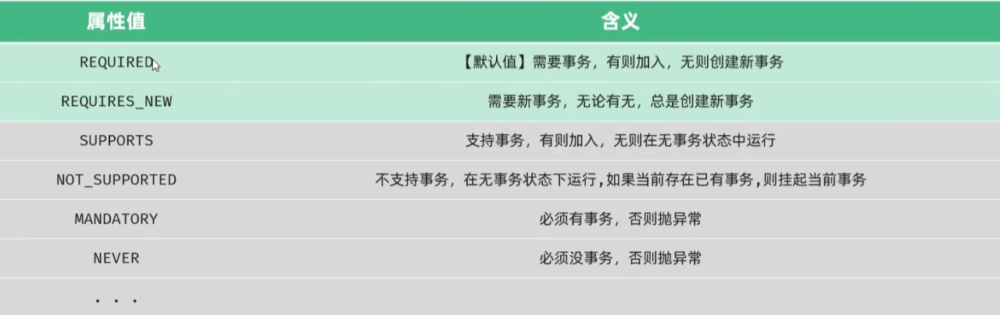

注意，如果想在事务管理的方法中使用 try-finnaly 结构，试图出现异常进行操作，例如新增员工数据，无论是否成功，都进行记录操作日志到数据表中。

但实际上，出现异常是会被事务回滚的，也就是说finnaly并没起到我们想要的效果。

那么具体该如何做呢？

首先，得知道记录操作日志的方法是没有进行事务管理的，当他被别的方法调用（事务控制）后，会自动加入到那个事务管理中。所以出现异常，会被那个事务进行回滚。

所以，记录日志的方法不能加入到那个方法的事务中去，此时需要给记录日志的方法加上它自己的事务管理，又因为事务的传播的默认值是Propagation.REQUIRED，表示会加入到调用方的事务中去，所以需要修改事务传播为Propagation.REQUIRES_NEW。

```java
@Transactional(propagation = Propagation.REQUIRES_NEW)
public void insertLog(EmpLog empLog){
    empLogMapper.insert(empLog);
}
```


#### Logback 日志

##### 介绍

- JUL（`java.util.logging`) ：是javaSE官方平台提供的日志框架，配置相对简单，不够灵活，性能较差
- Log4j ：一个流行的日志框架，提供灵活的配置选项，支持多种输出目标
- Logback: 基于Log4j升级而来， 性能由于Log4j


##### 快速入门

引入依赖

```xml
<dependency>
	<groupId>ch.qos.logback</groupId>
    <artifactId>logback-classic</artifactId>
    <version>1.4.11</version>
</dependency>
```

在springboot 项目中，该依赖已经通过Maven传递下来了，不需要再次引入

 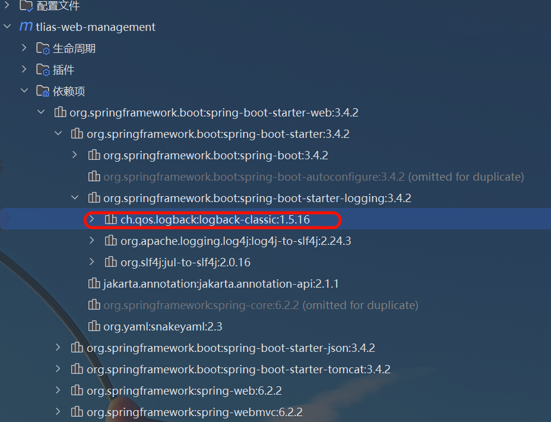

在 resource目录下 创建logback配置文件 `logback.xml`

```xml
<?xml version="1.0" encoding="UTF-8"?>
<configuration>
	<!-- 控制台输出 -->
    <appender name="STDOUT" class="ch.qos.logback.core.ConsoleAppender">
    	<encoder class="ch.qos.logback.classic.encoder.PatternLayoutEncoder">
        	<!-- 格式化输出： %d 表示日期， %thread表示线程名, %-5level: 级别从左显示5个字符宽度 %logger{50}: 最长50个字符（超出截断） -->
            <pattern>%d{yyyy-MM-dd HH:mm:ss.SSS} {%thread} %-5level %logger{50} -%msg%n</pattern>
        </encoder>
    </appender>
    
    <!-- 日志输出级别 -->
    <root level="debug">
    	<appender-ref ref="STDOUT"/>
    </root>
</configuration>
```


使用

```java
package com.itheima;

import org.junit.jupiter.api.Test;
import org.slf4j.Logger;
import org.slf4j.LoggerFactory;

// @Slf4j
public class LogTest {
    private static final Logger log = LoggerFactory.getLogger(LogTest.class);
    // 传递当前类的字节码对象进去
    // 使用logback时，可以在类上使用@Slf4j注解，即可省略
    // private static final Logger log = LoggerFactory.getLogger(LogTest.class);

    @Test
    public void testLog(){
         // 追踪，记录程序运行轨迹（使用很少）
        log.trace("测试trace");
        // 调试，记录程序调试过程的信息，实际应用中一般将其视为最低级别（使用较多）
        log.debug("测试debug");
        // 记录一般信息，描述程序运行的关键事件，如网络连接，io操作（使用较多）
        log.info("测试info");
        // 警告信息， 记录潜在有害的情况（使用较多）
        log.warn("测试warn");
        // 错误信息(使用较多)
        log.error("测试error");
    }

}
```


##### 配置文件详解

配置文件名：`logback.xml`

常用两种输出日志位置：控制台，系统文件

```xml
<!-- 控制台输出 -->
<appender name="STDOUT" class="ch.qos.logback.core.ConsoleAppender"> ... </appender>
```

```xml
<!-- 系统文件输出 -->
<appender name="FILE" class="ch.qos.logback.core.rolling.RollingFileAppender"> ... </appender>
```

开启日志，关闭日志

`level="ALL"`, 开启所有日志输出

`level="OFF"`, 关闭日志输出

```xml
<root level="debug">
	<appender-ref ref="STDOUT"/>
    <appender-ref ref="FILE"/>
</root>
```

完整配置文件

```xml
<?xml version="1.0" encoding="UTF-8"?>
<configuration>
	<!-- 控制台输出 -->
    <appender name="STDOUT" class="ch.qos.logback.core.ConsoleAppender">
    	<encoder class="ch.qos.logback.classic.encoder.PatternLayoutEncoder">
        	<!-- 格式化输出： %d 表示日期， %thread表示线程名, %-5level: 级别从左显示5个字符宽度 %logger{50}: 最长50个字符（超出截断） -->
            <pattern>%d{yyyy-MM-dd HH:mm:ss.SSS} {%thread} %-5level %logger{50} -%msg%n</pattern>
        </encoder>
    </appender>
    
    <!-- 系统文件输出 -->
    <appender name="FILE" class="ch.qos.logback.core.rolling.RollingFileAppender">
    	<rollingPolicy class="ch.qos.logback.core.rolling.SizeAndTimeBasedRollingPolicy">					<!-- 日志文件输出的文件名， %i表示序号-->
            <FileNamePattern>D:/tlias-%d{yyyy-MM-dd}-%i.log</FileNamePattern>
            <!-- 最多保留的历史日志文件数量 -->
            <MaxHistory>30</MaxHistory>
            <!-- 最大文件大小，超过这个大小会触发滚动动新文件，默认为10MB-->
            <maxFileSize>10MB</maxFileSize>
        </rollingPolicy>
        
       	<encoder class="ch.qos.logback.classic.encoder.PatternLayoutEncoder">
        	<!-- 格式化输出： %d 表示日期， %thread表示线程名, %-5level: 级别从左显示5个字符宽度 %logger{50}: 最长50个字符（超出截断） -->
            <pattern>%d{yyyy-MM-dd HH:mm:ss.SSS} {%thread} %-5level %logger{50} -%msg%n</pattern>
        </encoder>
    </appender>
    
    <!-- 日志输出级别 -->
    <root level="ALL">
    	<appender-ref ref="STDOUT"/>
        <appender-ref ref="FILE"/>
    </root>
</configuration>
```


#### 文件上传

```java
@Slf4j
@RestController
public class UploadController {
    @PostMapping("/upload")
    public Result handleFileUpload(String name, Integer age, MultipartFile file) {
        log.info("文件上传：{}", file);
        return Result.success();
    }
}
```

##### 本地存储

```java
@Slf4j
@RestController
public class UploadController {
    @PostMapping("/upload")
    public Result handleFileUpload(String name, Integer age, MultipartFile file) {
        log.info("文件上传：{}", file);
        // 生成唯一文件名
        String uniqueFileName = generateUniqueFileName(file.getOriginalFilename());
        // getOriginalFilename获取原始文件名
        // 保存文件
        file.transferTo(new File("D:/images/" + uniqueFileName));
        return Result.success();
    }
    
    private String generateUniqueFileName(String originalFilename) {
        String randomStr = UUID.randomUUID().toString().replaceAll("-","");
        String extension = originalFilename.substring(originalFilename.lastIndexOf("."));
        return randomStr + extension;
    }
}
```

配置 application.yml

```yaml
  servlet:
    multipart:
      # 最大单个文件大小
      max-file-size: 10MB
      # 最大请求大小 （包括所有文件和表单数据）
      max-request-size: 100MB
```


文件存储系统

- FastDFS 或 MinIo 搭建文件存储系统
- 第三方云服务提供的对象存储系统，例如阿里云OSS


#### 异常处理

- 使用try-catch 捕获异常(不推荐，臃肿)

   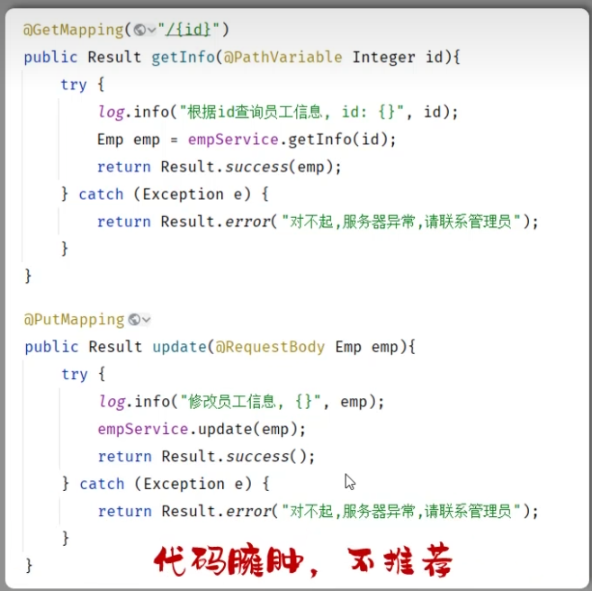

- 全局异常处理器   

   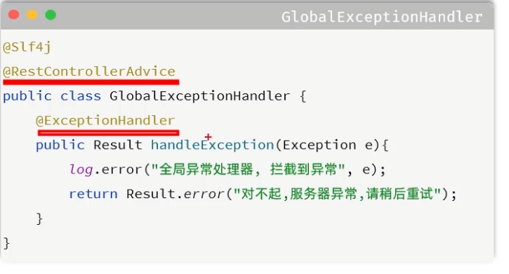

  

#### 登录认证

##### 会话技术

会话：用户打开浏览器，访问web服务器的资源，会话建立，直到有一方断开连接，会话结束。在一次会话中可以包含多次请求和响应。

会话跟踪：一种维护浏览器状态的方法，服务器需要识别多次请求是否来自于同一浏览器，以便在同一次会话的多次请求间共享数据。

会话跟踪方案：

- 客户端会话跟踪技术：Cookie
- 服务端会话跟踪计算：Session
- 令牌技术

###### Cookie

第一步：浏览器请求服务器，服务器生成Cookie响应给浏览器；（在响应头中Set-Cookie设置）

第二步：浏览器保存Cookie；(浏览器检测到Set-Cookie， 进行保存)

第三步：浏览器再次请求服务器并携带Cookie给服务器，服务器进行校验。(在请求头中Cookie设置)

```java
@Sf4j
@RestController
public class SessionController {
    //设置Cookie
	@GetMapping("/c1")
    public Result cookie1(HttpServletResponse response){
        response.addcookie(new Cookie( name:"login_username",value:"itheima")); //设置Cookie/响应Cookie
        return Result.success();
    }

	//获取Cookie
	@GetMapping("/c2")
	public Result cookie2(HttpServletRequest request){
         Cookie[］ cookies = request.getCookies();
		for（Cookie cookie : cookies）{
            if(cookie.getName().equals("login_username")){
				System.out.println("login_username:"+cookie.getValue()); //输出name为login_usernal
            }
        }
		return Result.success();
    }
}
    

```

优点：HTTP协议支持

缺点：移动端APP无法使用Cookie， 不安全，且不能跨域


###### session

第一步：浏览器请求服务器，服务器生成Session，并保存到服务器

第二步：服务器将该session的id值通过响应头的Set-Cookie传给浏览器进行保存Cookie，即Cookie保存Session的唯一标识

第三步：浏览器再次请求服务器，将Cookie携带给服务器，服务器根据里面保存的Session的唯一标识进行校验。

```java
@Sf4j
@RestController
public class SessionController {
    @GetMapping("/s1")
    public Result session(HttpSession session){
        log.info("HttpSession-s1:{}",session.hashCode());
        session.setAttribute("loginUser","tom"); // 往session存储数据
        return Result.success();
    }
    
    @GetMapping("/s2")
    public Result session2(HttpSession session){
        log.info("HttpSession-s2:{}",session.hashCode());
        Object loginUser = session.getAttribute("loginUser"); // 从session获取数据
        log.info("loginUser:{}",loginUser);
        return Result.success(loginUser);
    }
}
```

优点：存储在服务器，安全

缺点：服务器集群环境下无法直接使用Session， 由于需要使用到Cookie，故而Cookie的缺点，它也有。


###### 令牌

第一步：浏览器登录服务器，服务器生成令牌给浏览器存储

第二步：浏览器之后每次请求都携带该令牌给服务器，服务器校验是否有效即可

优点：支持PC端，移动端；解决集群环境下的认证问题；减轻服务器存储的压力

缺点： 需要程序员自己编码实现


##### JWT令牌

 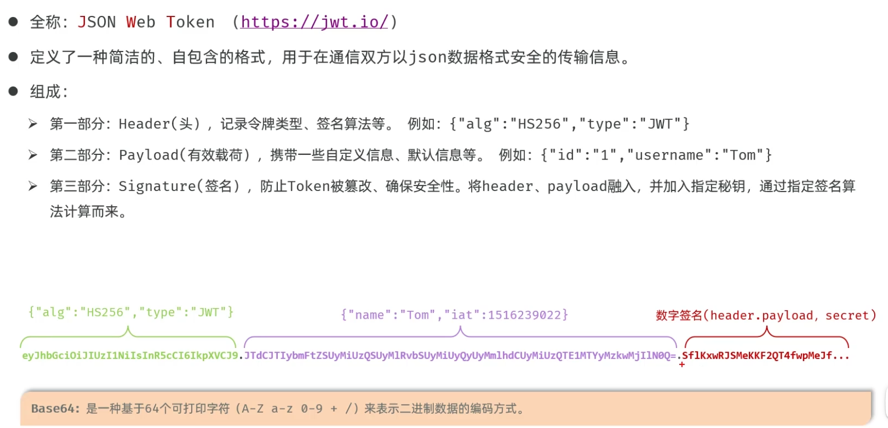

java实现：

引入依赖

```xml
<dependency>
	<groupId>io.jsonwebtoken</groupId>
    <artifactId>jjwt</artifactId>
    <version>0.9.1</version>
</dependency>
```

生成令牌

```java
@Test
public void testGenJwt(）{
	Map<String, Object> claims = new HashMap<>();
	claims.put("id",10);
	claims.put("userame", "itheima");
	String jwt = Jwts.builder().signWith(SignatureAlgorithm.HS256，"SVRIRUlNQQ==") // 指定加密算法以及密钥
			.addclaims(claims)
			.setExpiration(new Date(System.currentTimeMillis(）+ 12*3600*1000)) // 设置过期时间
			.compact();
	System.out.println(jwt);
 }
```

解析令牌

```java
@Test
public void testParseJwt(）throws Exception {
    String jwtToken = "eyJ0eXAiOiJKV1QiLCJhbGciOiJIUzI1NiJ9...'
    Claims claims = Jwts.parser()
            .SetSigningKey("SVRIRULNQQ==")
            .parseClaimsJws(jwtToken)
            ·getBody();
    System.out.println(claims);
}
```

JwtUtils.java

```java
public class JwtUtils {
    private static final String SECRET_KEY = "aXRoZWltYQ==";  // 私钥
    private static final long EXPIRATION_TIME = 12 * 60 * 60 * 1000; // 12个小时
    
    /**
    * 生成JWT令牌
    */
    public static String generateToken(Map<String, Object> claims) {
        return Jwts.builder()
            .signWith(SignatureAlgorithm.HS256, SECRET_KEY)
            .addClaims(claims)
            .setExpiration(new Date(System.currentTimeMillis() + EXPIRATION_TIME))
            .compact();
    }
    
    /**
    * 解析令牌
    */
    public static Claims parseToken(String token) throws Exception{
        return Jwts.parser()
            .setSigningKey(SECRET_KEY)
            .parseClaimsJws(token)
            .getBody();
    }
}
```

login

```java
public LoginInfo login(Emp emp){
    Emp e = empMapper.selectByUernameAndPassword(emp);
    
    if (e!= null){
        log.info("登录成功");
        // 生成JWT令牌
        Map<String,Object> claims = new HashMap<>();
        claims.put("id",e.getId());
        claims.put("username",e.getUsername());
        String jwt = JwtUtils.generateToken(claims);
        return new LoginInfo(e.getId(),e.getUsername(),jwt);
    }
    
    return null;
}
```


##### 过滤器Filter

过滤器可以把对资源的请求拦截下来，从而实现一些特殊的功能。

过滤器一般完成一些通用的操作，比如：登录校验、统一编码处理、敏感字符处理等。

- 定义Filter

  ```java
  public class TokenFilter implements Filter {
      // 初始化方法，web服务器启动，创建Filter实例时调用，只调用一次
      public void init(FilterConfig filterConfig) throws ServletException {
          System.out.println("init ...");
      }
      // 拦截到请求时，调用该方法，可以调用多次
      public void doFilter(ServletRequest servletRequest, ServletResponse servletResponse, FilterChain filterChain) throws Exception{
          System.out.println("拦截到了请求...");
          filterChain.doFilter(servletRequest， servletResponse);
      }
      //销毁方法，web服务器关闭时调用，只调用一次
      public void destroy() {
          System.out.println("destroy ...");
      }
  }
  ```

- 配置Filter

  Filter类上加上@WebFilter注解，配置拦截路径。

  ```java
  @WebFilter(urlPatterns = "/*")
  public class TokenFilter implements Filter { ... }
  ```

  常见拦截配置

  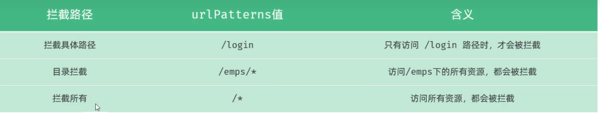

  引导类上加 @ServletComponentScan,开启Servlet组件

  ```java
  @ServletComponentScan
  @SpringBootApplication
  public class TliasWebManagementApplication {
  
      public static void main(String[] args) {
          SpringApplication.run(TliasWebManagementApplication.class, args);
      }
  
  }
  ```

- 令牌校验

  ```java
  @WebFilter(urlPatterns = "/*")
  public class TokenFilter implements Filter {
      // 初始化方法，web服务器启动，创建Filter实例时调用，只调用一次
      public void init(FilterConfig filterConfig) throws ServletException {
          System.out.println("init ...");
      }
      // 拦截到请求时，调用该方法，可以调用多次
      public void doFilter(ServletRequest servletRequest, ServletResponse servletResponse, FilterChain filterChain) throws Exception{
          HttpServletRequest request = (HttpServletRequest) servletRequest;
          HttpServletResponse response = (HttpServletResponse) servletResponse;
          // 获取请求路径
          String requestURI = request.getRequestURI();
          // 判断是否是登录请求，如果是放行
          if (requestURI.contains("/login")){
              filterChain.doFilter(request, response); // 放行
              return ;
          }
          // 获取请求头的token
          String token = request.getHeader("token");
          // 判断token是否存在，如果不存在，说明用户没有登录，返回401
          if (token == null || token.isEmpty()){
              response.setStatus(401);
              return ;
          }
          // 如果token存在，校验jwt令牌，校验失败 返回401
          try {
              JwtUtils.parseToken(token);
          } catch (Exception e){
                 response.setStatus(401);
              return ;
          }
          // 校验通过，放行
          filterChain.doFilter(request, response); // 放行
      }
      //销毁方法，web服务器关闭时调用，只调用一次
      public void destroy() {
          System.out.println("destroy ...");
      }
  }
  ```

- 过滤器链

  一个web应用中，可以配置多个Filter过滤器，多个过滤器形成过滤器链

  顺序： 注解配置的Filter，优先级是按照过滤器类名（字符串）的自然排序。

   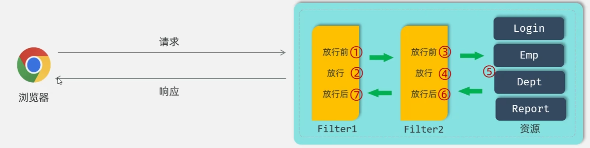

  

##### 拦截器Interceptor

概念：是一种动态拦截方法调用的机制，类似于过滤器。Spring框架中提供的，主要用来动态拦截控制器方法的执行。

作用：拦截请求，在指定的方法调用前后，根据业务需要执行预先设定的代码。

- 定义拦截器

  ```java
  @Component
  public class DemoInterceptor implements HandlerInterceptor {
      @Override
      public boolean preHandle(HttpServletRequest req, HttpServletResponse resp, Object handler) throws Exception {
          // 目标资源方法执行前执行，返回true：放行，返回false：不放行
      	return true;
      }
      @Override
      public void postHandle(HttpServletRequest req,HttpServletResponse resp, Object handler,ModelAndView mv) throws Exception {
          // 放行后，执行完目标资源方法后，执行该方法
          System.out.println("preHandle...");
      }
      @Override
      public void afterCompletion(HttpServletRequest req, HttpServletResponse resp, Object handler, Exception ex) throws Exception {
          // 视图渲染完毕后，最后执行，早期没有前后端分离时，需要进行视图渲染。现在不使用。了解即可
          System.out.println("afterCompletion...");
      }
                             
  }
  ```

- 注册拦截器

  ```java
  @Configuration
  public class WebConfig implements WebMvcConfigure {
      @Autowired
      private DemoInterceptor demoInterceptor;
      @override
      public void addInterceptors(InterceptorRegistry registry) {
          registry.addInterceptor(demoInterceptor).addPathPatterns("/**");
      }
  }
  ```

- 令牌校验

  ```java
  @Component
  public class TokenInterceptor implements HandlerInterceptor {
      @Override
      public boolean preHandle(HttpServletRequest request, HttpServletResponse response, Object handler) throws Exception {
          // 目标资源方法执行前执行，返回true：放行，返回false：不放行
          // 获取请求路径
          String requestURI = request.getRequestURI();
          // 判断是否是登录请求，如果是放行
          if (requestURI.contains("/login")){
              return true;
          }
          // 获取请求头的token
          String token = request.getHeader("token");
          // 判断token是否存在，如果不存在，说明用户没有登录，返回401
          if (token == null || token.isEmpty()){
              response.setStatus(401);
              return false;
          }
          // 如果token存在，校验jwt令牌，校验失败 返回401
          try {
              JwtUtils.parseToken(token);
          } catch (Exception e){
                 response.setStatus(401);
              return false;
          }
          // 校验通过，放行
      	return true;
      }                           
  }
  ```

- 拦截规则

  在注册拦截器的方法里面

  `addPathPatterns()` 表示需要拦截哪些资源

  `excludePathPatterns()` 表示不需要拦截哪些资源

  ```java
  @Configuration
  public class WebConfig implements WebMvcConfigure {
      @Autowired
      private DemoInterceptor demoInterceptor;
      @override
      public void addInterceptors(InterceptorRegistry registry) {
          registry.addInterceptor(demoInterceptor).addPathPatterns("/**").excludePathPatterns("/login");
      }
  }
  ```

   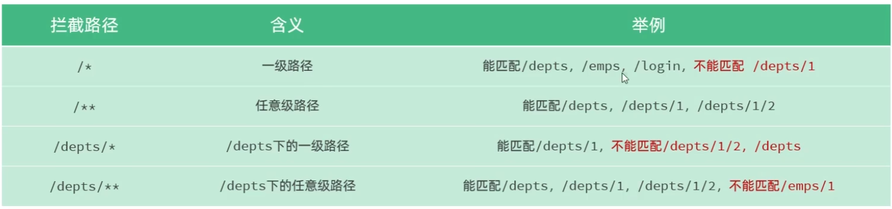


过滤器与拦截器同时存在的情况

先经过过滤器，再经过拦截器。这是因为过滤器是TomCat提供的，而拦截器是Springboot提供的。

 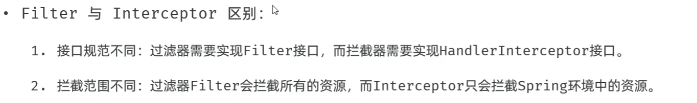


### SpingAOP

 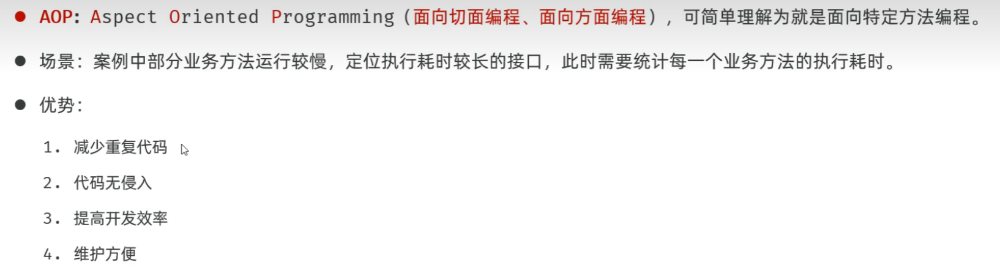


### 工具包

#### Hutool

Hutool 是一个 Java 工具包类库，它可以对文件、流、加密解密、转码、正则、线程、XML等JDK方法进行封装，组成各种 Utils 工具类。

https://gitee.com/dromara/hutool


### 附录： 常见状态码

| 状态码 | 英文描述                        | 解释                                                         |
| ------ | :------------------------------ | ------------------------------------------------------------ |
| 200    | OK                              | 客户端请求成功，即处理成功，这是我们最想看到的状态码         |
| 302    | Found                           | 指示所请求的资源已移动到由Location响应头给定的 URL，浏览器会自动重新访问到这个页面 |
| 304    | Not Modified                    | 告诉客户端，你请求的资源至上次取得后，服务端并未更改，你直接用你本地缓存吧。隐式重定向 |
| 400    | Bad Request                     | 客户端请求有语法错误，不能被服务器所理解                     |
| 403    | Forbidden                       | 服务器收到请求，但是拒绝提供服务，比如：没有权限访问相关资源 |
| 404    | Not Found                       | 请求资源不存在，一般是URL输入有误，或者网站资源被删除了      |
| 405    | Method Not Allowed              | 请求方式有误，比如应该用GET请求方式的资源，用了POST          |
| 428    | Precondition Required           | 服务器要求有条件的请求，告诉客户端要想访问该资源，必须携带特定的请求头 |
| 429    | Too Many Requests               | 指示用户在给定时间内发送了太多请求（“限速”），配合 Retry-After(多长时间后可以请求)响应头一起使用 |
| 431    | Request Header Fields Too Large | 请求头太大，服务器不愿意处理请求，因为它的头部字段太大。请求可以在减少请求头域的大小后重新提交。 |
| 500    | Internal Server Error           | 服务器发生不可预期的错误。服务器出异常了，赶紧看日志去吧     |
| 503    | Service Unavailable             | 服务器尚未准备好处理请求，服务器刚刚启动，还未初始化好       |
