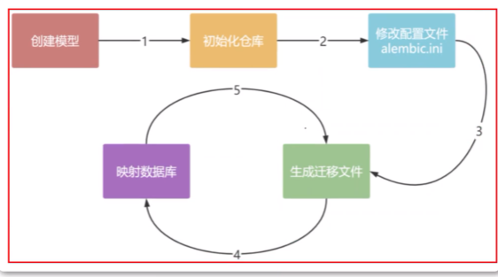

### 一、安装

`pip install alembic`


### 二、alembic使用

流程：

 


#### 创建模型（修改模型）

对 `sqlalchemy` 的模型进行创建或者修改。例如：

```python
from datetime import datetime
from uuid import uuid4
from app.database.engine import Base
from sqlalchemy.orm import relationship
from sqlalchemy import Column, String, Integer, BigInteger, Boolean, ForeignKey, Float, DECIMAL, DateTime, func, Text
from sqlalchemy.dialects.mysql import LONGTEXT


def uuid4_str() -> str:
    return str(uuid4()).replace('-', '')

class Article(Base):
    __tablename__ = "article"
    id = Column(Integer, primary_key=True, comment="id")
    uuid = Column(String(32), default=uuid4_str, unique=True)
    title = Column(String(255), nullable=False, comment="文章标题")
    subTitle = Column(String(255), default="", comment="文章副标题")
    coverImage = Column(LONGTEXT, comment="文章封面图，保存的是图片base64")
    content = Column(LONGTEXT, nullable=False, comment="文章正文")
    views = Column(Integer, default=0, comment="浏览量")
    author = Column(String(255), comment="作者")
    create_time = Column(DateTime, default=datetime.now, comment="添加时间")
    last_update_time = Column(DateTime, onupdate=datetime.now, default=datetime.now, comment="最后修改时间")
```


#### 初始化仓库

一遍只初始化一次，即建立一个 Alembic 脚本环境。在项目的根目录处，输入 `alembic init alembic`

```shell
(xuanzhongyi) root@sanyihe-X99:/home/sanyihe/paddlespeech/wangjige# alembic init alembic
  Creating directory '/home/sanyihe/paddlespeech/wangjige/alembic' ...  done
  Creating directory '/home/sanyihe/paddlespeech/wangjige/alembic/versions' ...  done
  Generating /home/sanyihe/paddlespeech/wangjige/alembic/README ...  done
  Generating /home/sanyihe/paddlespeech/wangjige/alembic.ini ...  done
  Generating /home/sanyihe/paddlespeech/wangjige/alembic/env.py ...  done
  Generating /home/sanyihe/paddlespeech/wangjige/alembic/script.py.mako ...  done
  Please edit configuration/connection/logging settings in '/home/sanyihe/paddlespeech/wangjige/alembic.ini' before proceeding.
(xuanzhongyi) root@sanyihe-X99:/home/sanyihe/paddlespeech/wangjige# 
```

如果sqlalchemy 使用的是异步引擎，那么应该创建异步的模板：`alembic init -t async alembic`


生成的迁移脚本目录如下：

```text
├── alembic
│   ├── README
│   ├── env.py
│   ├── script.py.mako
│   └── versions
```

还生成了 `alembic.ini` 文件。

- **alembic 目录**：迁移脚本的[根目录](https://zhida.zhihu.com/search?content_id=108152807&content_type=Article&match_order=1&q=根目录&zhida_source=entity)，放置在应用程序的根目录下，可以设置为任意名称。在多数据库应用程序可以为每个数据库单独设置一个 Alembic 脚本目录。
- **README 文件**：说明文件，初始化完成时没有什么意义。
- [env.py](https://link.zhihu.com/?target=http%3A//env.py/)**文件**：一个 python 文件，在调用 Alembic 命令时该脚本文件运行。
- **script.py.mako 文件**：是一个 mako 模板文件，用于生成新的迁移脚本文件。
- **versions 目录**：用于存放各个版本的迁移脚本。初始情况下为空目录，通过 `revision` 命令可以生成新的迁移脚本。


#### 修改配置文件

修改 `alembic.ini` 文件中的 `sqlalchemy.url` 指向自己的数据库地址

```python
# init_alembic.py

import configparser
from app.database.engine import DB_URL

if __name__ == "__main__":
    config = configparser.ConfigParser()
    config.read(filenames="alembic.ini")
    config['alembic']['sqlalchemy.url'] = DB_URL

    with open('alembic.ini', 'w') as f:
        config.write(f)

```

修改 `alembic/env.py` 文件中的 ` target_metadata `使其指向应用程序中的元数据对象

```python
# env.py
import os, sys
sys.path.append(os.path.dirname(os.path.dirname(__name__)))
from app.database.engine import Base
from app.models.user import User

target_metadata = Base.metadata
```

注意: 除了要添加基础模型, 还需要将模型类(继承了Base类) 导入进来,  否则**数据库会出现删除原来的表，重新创建新的表，数据全丢失**

例如上面 `from app.models.user import User` 将 User 导入进来.


#### 生成迁移文件

进入项目的根目录， 输入`alembic revision --autogenerate -m 'model update'`


#### 映射数据库

- **`alembic upgrade head`**：将数据库升级到最新版本。
- **`alembic downgrade base`**：将数据库降级到最初版本。
- **`alembic upgrade <version>`**：将数据库升级到指定版本。
- **`alembic downgrade <version>`**：将数据库降级到指定版本。
- **`alembic upgrade +2`**：相对升级，将数据库升级到当前版本后的两个版本。
- **`alembic downgrade -2`**：相对降级，将数据库降级到当前版本前的两个版本。
- **`alembic current`**: 查看当前使用的版本

注意，增加新的列，如果在sqlalchemy中列设置了默认值，自动生成的迁移代码中没有。
