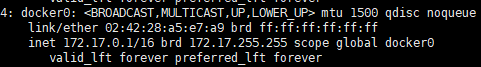
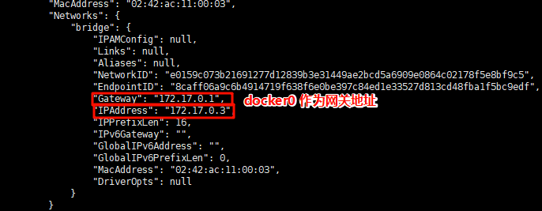

### 一、安装docker

官网指导手册：[安装docker](https://docs.docker.com/engine/)

安装好后，在linux中输入 

```shell
sudo systemctl start docker # 启动docker服务

sudo systemctl enable docker # 设置开机自动启动docker


# 启动& 开机启动docker； enable + start 二合一
sudo systemctl enable docker --now
```

配置镜像源地址

```shell
# 配置加速
sudo mkdir -p /etc/docker
sudo tee /etc/docker/daemon.json <<-'EOF'
{
    "registry-mirrors": [
        "https://mirror.ccs.tencentyun.com"
    ]
}
EOF
sudo systemctl daemon-reload
sudo systemctl restart docker
```

[配置镜像源](https://blog.csdn.net/llc580231/article/details/139979603)


### 二、基本命令


#### 搜索镜像

```shell
docker search <image-name>
```

#### 拉取镜像

```shell
docker pull <image-name> # 默认是最新的版本
docker pull <image-name>:<tag> # 指定版本下载
```

#### 查看镜像

```shell
docker images # 查看所有镜像
```

#### 删除镜像

```shell
docker rmi <image-name>:<tag>
# 或输入镜像的唯一id
docker rmi <image-id>
```

#### 修改镜像名字

```shell
docker tag <old-image-name>:<old-image-tag> <new-image-name>:<new-image-tag>
```

它会创建一个新的镜像,不会将旧的镜像进行删除.

#### 运行镜像，生成容器

```shell
docker run [options] <image-name> [command] [args]
```

常用的 options :

- `-d`	守护进程,后台运行该容器
- `--name`	给容器命名
- `-p  host_port : container_port`	端口映射
- `-P`	随机端口映射，容器内部端口随机映射到主机的端口
- `-it`	交互式允许容器,分配一个伪终端
- `-v host_dir : container_dir`	目录挂载
- `-e`	设置环境变量
- `-u`	指定用户身份创建容器
- `--restart`	容器的重启策略, no:容器退出不重启, on-failure:容器故障退出时重启,always:容器退出时总是重启
- `-m`	设置容器使用内存最大值
- `-h`	设置容器的主机名 hostname
- `--gpus all`	在容器内调用宿主机的CUDA
- `--privileged`	特权模式, 给予容器 root 权限


后面的 [command] 是创建好容器后,执行的指令

一般使用

```shell
docker run -it <image-name> /bin/bash
```

#### 查看运行中的容器

```shell
docker ps
```

#### 查看所有容器

```shell
docker ps -a
```

#### 启动已经停止的容器

```shell
docker start <container-name>
# 或 容器唯一id
docker start <container->
```

#### 重启容器

```shell
docker restart <container-name>
# 或 容器唯一id
docker restart <container-id>
```

#### 停止容器

```shell
docker stop <container-name>
# 或 容器唯一id
docker stop <container-id>
```

#### 暂停容器

```shell
docker pause <container-name> # 暂停容器
docker unpause <container-name> # 取消暂停
```

#### 退出容器

```shell
# 在容器内部
exit
# 或 快捷键 Ctrl + P + Q
```

#### 进入已运行的容器

```shell
docker exec -it <container-name> /bin/bash
docker exec -it <container-id> /bin/bash
```

`-it` 表示以交互的方式进入, `-i` 是通过从容器获取一个标准输入,允许我们创建一个可交互的连接, `-t` 是在容器内分配一个伪终端.

是以` /bin/bash` 进行交互.

#### 删除容器

```shell
docker rm <container-name>
docker rm <container-id>
# 要删除容器，得先停止容器，或强制删除 docker rm -f <container-name>
```

#### 查看容器状态

```shell
docker stats <container-name>
docker stats <container-id>
```

#### 查看容器运行日志

```shell
docker logs <container-name>
docker logs <container-id>
```

#### 保存容器为镜像

```shell
docker commit [options] <container-name>  [REPOSITORY[:TAG]]
```

options: 

- `-a` 	署名作者
- `-c`	对于Dockerfile构建的列表
- `-m`	提交信息
- `-p`	提交过程中暂停容器运行

REPOSITORY 是镜像名, TAG 是标签.


#### 打包镜像

```shell
docker save [Options] <image-name>
# options: -o 指定输出文件的路径
```

例如:

```shell
docker save -o test.tar test:latest
```

这样就将镜像打包成tar包.

打包多个镜像

```shell
docker save -o test.tar <image-name> <image-name> ... 
```

> [!NOTE]
>
> - 保存镜像时，会包含镜像的所有层，因此生成的 tar 文件可能会很大。
> - 如果保存多个镜像到同一个文件中，使用 `docker load` 命令时会加载所有包含的镜像。
> - 为了减少文件大小，可以在保存前使用 `docker image prune` 命令清理未使用的镜像和层


#### 加载镜像

```shell
docker load [Options]
```

Options:

- `-i`	 指定输入文件的路径。
- `-q`	安静模式，减少输出信息


#### 分享镜像

将本地的镜像 分享到dockerHub上面.

```shell
docker login # 登录到dockerHub
docker push <image-name>:<image-tag>
```


### 三、高级应用

#### 目录挂载与数据卷映射

##### 目录挂载

```shell
docker run -it -v <host-dir>:<container-dir>  -p 80:80 <image-name> bash 
```

宿主机的目录和容器的目录做一个**关联关系**，这样一来，修改外部目录可以影响容器内部目录，容器内部目录的修改也可以影响外部目录，即双向同步。而且当容器销毁后用同样的命令重新建立，外部目录的内容不会丢失，可重新映射回容器内部的目录。

前后的路径必须是绝对路径，以下斜线“/”开头; 

容器启动的时候，是以宿主机的目录为准，在容器内部创建目录并同步宿主机的目录内容。之后双向同步.


##### 数据卷映射

**默认情况下，容器内应用产生的数据都是由容器本身独有，如果容器被删除，对应的数据文件就会跟着消失**。

在实际用场景中，更多需要将数据持久化，即容器被删除，数据也应该正常存在；另外也有很多场景需要容器之间共享数据，这就需要容器数据卷。

当你在 Docker 中创建一个数据卷（volume）时，Docker 会在宿主机的这个目录 `/var/lib/docker/volumes/<volume-name>` 下来存储数据卷的内容。

容器启动的时候，是以容器的目录为准，在宿主机的`/var/lib/docker/volumes/` 创建数据卷目录并同步容器的目录内容.之后双向同步

```shell
docker run -it -v <volume-name>:<container-dir> -p 80:80 <image-name> bash
# 或者
docker run -it -v <container-dir> -p 80:80 <image-name> bash
# 此时就是匿名挂载数据卷,生成一个随机命名的数据卷.
```

volume-name 不以 `\` 开头, docker 检测到 以 `\`开头则为目录挂载,不以 `\`开头则为卷映射


数据卷操作命令:

```shell
docker volume create <volume-name> # 创建一个新的数据卷

docker volume ls # 查看所有数据卷

docker volume inspect <volume-name> # 查看指定数据卷的信息

docker volume rm <volume-name> # 删除数据卷
docker rm -v <container-name> # 删除容器时删除相关的卷

docker volume prune # 清除无主的数据卷

```


#### docker 网络

当我们有多个容器的时候,想要这些容器之间可以互相进行网络访问.


最容易想到的是: 这些容器在宿主机上都有一个映射的访问端口, 这样只需要访问宿主机的机器 ip 加 所映射的端口就可访问到容器的服务.


但是这样访问,会稍微有点奇怪, 就好像你想和隔壁的同事进行交流,但是你得先出公司外面,再从公司大门进来跟你同事进行交流一样,明明就在你隔壁,但绕了一个大圈.


实际上, docker 有个机制,就是每个容器都会加入一个docker默认网络叫 docker0, 在安装docker后就有了这个网络, 使用 `ip a` 进行查看网卡

 

docker 每创建一个容器都加入了这个docker0网络环境, 再为每个容器分配一个ip地址.

使用 `docker inspect <container-name>` 查看容器细节

 

那么, 就可以使用容器的ip地址 加 容器内部的端口就可以进行互相访问. 即容器内部进行访问,不通过外部的宿主机器,所以直接用容器应用内部端口就可以访问.

总结一句话: ==docker 为每个容器分配唯一ip, 使用 容器ip + 容器端口 可以互相访问==


但是通过ip来访问,可能会由于各种原因发生变化,所以可以使用域名来进行访问.

docker 提供了一种自定义网络的机制, 默认docker0 不支持主机域名. 需要我们创建一个自定义网络, 比如 mynet, 以后新建的容器加入到自定义的网络中, 接下来 容器的名字就可以当作主机的域名成为稳定的访问地址.


创建自定义网络

```shell
docker network create mynet

# 设置子网范围
docker network create --subnet=172.18.0.0/16 mynet # 设置了网络地址和子网掩码
```

列举出docker内部网段

```shell
docker network ls
```

创建容器加入到自定义网络

```shell
# 容器1
docker run -it -p 88:81 --name app1 --network mynet <image-name> bash
# 容器2
docker run -it -p 88:82 --name app2 --network mynet <image-name> bash

```

在容器1 中

```shell
docker exec -it app1 bash

curl http://app2:82 # 这样就可以通过容器2 的名字来当作域名加容器2的端口访问容器2
```


删除自定义网络

```shell
docker network rm mynet
```


#### Docker Compose

批量管理容器

首先创建一个 `yaml` 文件，将启动所有容器的配置写入该文件里面，那么就可以使用docker compose 批量地操作这些容器。

官方指导手册：[DockerCompose](https://docs.docker.com/reference/)


上线： 将 `yaml` 配置的应用批量地上线，即第一次创建并启动

```shell
docker compose up -d  # -d 后台执行 默认的yaml文件是 compose.yaml
docker compose up -f xxx.yaml -d # 指定 yaml文件启动
```

下线： 将 `yaml` 配置的应用批量地下线，即移除创建这些容器及相关的资源

```shell
docker compose down
```

启动： 指定 `yaml` 配置的特定应用进行启动， 启动是之前已经启动过的

```shell
docker compose start x1 x2 x3 # x1 x2 x3是 yaml文件 配置的 应用名
```

停止： 同理有启动就有停止

```docker
docker compose stop x1 x3
```

扩容： 对 `yaml` 文件配置的应用启动多份。

```shell
docker compose sacle x2=3 # 将x2应用启动三份实例
```


yaml 文件就是将 容器的 docker run 命令参数转换一下 写入到yaml文件中.

```yaml
# compose.yaml文件
name: myblog
services:
	mysql:
		container_name: mysql # 容器名
		image: mysql:8.0 # mysql 镜像
		ports:
			- "3306:3306" # 由于端口映射可能会有多个，所以使用 ‘-’ 代表数组
		environment: # 环境变量
			- MYSQL_ROOT_PASSWORD=123456
			- MYSQL_DATABASE=wordpress
		volumes: # 卷映射
			- mysql-data:/var/lib/mysql
			-/app/myconf:/etc/mysql/conf.d
		restart: always
		networks:
			- blog
	
	wordpress:
		image: wordpress
		ports:
			- "8080:80"
		environment:
			WORDPRESS_DB_HOST: mysql # environment 也可以使用 K-V 写法, 但是需要统一风格.
			WORDPRESS_DB_USER: root
			WORDPRESS_DB_PASSWORD: 123456
			WORDPRESS_DB_NAME: wordpress
		volumes:
			- wordpress:/var/www/html
		restart: always
		networks:
			- blog
		depends_on:
			- mysql # 依赖于谁,决定启动顺序, 即先启动mysql,后启动wordpress
			
volumes:
	mysql-data:
	wordpress:
	
networks:
	blog:

```

 执行

```shell
docker compose -f compose.yaml up -d
```

值得注意的是, 虽然yaml文件 配置的 卷名是 mysql-data, wordpress , 网段名是 blog

但是 创建时, docker 会在这些名字前 加上 前缀 'myblog', 这个'myblog' 是 yaml文件 第一行配置的`name: myblog`

 另外,如果没有配置容器名, docker会自动起名, 起名规则是` <compose 应用名>-<compose 服务名>-<num>`

例如此处的wordpress 服务. 起的名字为 myblog-wordpress-1 . 这里的num是启动的应用个数.


#### Dockerfile

构建自定义镜像。在dockerfile里面指定好 基本环境， 软件包， 启动命令 即可

官方指导手册：[Dockerfile](https://docs.docker.com/reference/dockerfile/)

dockerfile 常见指令

| 指令       | 作用               |
| ---------- | ------------------ |
| FROM       | 指定镜像基础环境   |
| RUN        | 运行自定义命令     |
| CMD        | 容器启动命令或参数 |
| LABEL      | 自定义标签         |
| EXPOSE     | 指定暴露端口       |
| ENV        | 环境变量           |
| ADD        | 添加文件到镜像     |
| COPY       | 复制文件到镜像     |
| ENTRYPOINT | 容器固定启动命令   |
| VOLUME     | 数据卷             |
| USER       | 指定用户和用户组   |
| WORKDIR    | 指定默认工作目录   |
| ARG        | 指定构建参数       |


##### FROM

指定一个已经存在基础镜像作为模板，dockerfile第一行必须是FROM

##### RUN

容器构建时需要执行的命令， 有两种格式， shell格式与 exec格式

shell格式 ：

```shell
java -jar ./app.jar
```

exec格式： ["可执行文件"， "参数1"， "参数2"]

```exec
["java","-jar","/app.jar"]
```

##### EXPOSE

当前容器对外暴露出的端口

##### WORKDIR

指定创建容器后，终端默认登录进来的工作目录

##### USER

指定该镜像以什么用户去执行，默认是root

##### ENV

用来构建镜像过程中设置环境变量

##### ADD

将宿主机目录下的文件拷贝进镜像且会自动处理URL和解压tar压缩包

##### COPY

类似ADD， 拷贝文件和目录到镜像中，将从构建上下文目录中<源路径>的文件/目录复制到新的一层镜像内的<目标路径>

##### CMD

指定容器启动后执行的命令， CMD指令格式与RUN相似。

与RUN的区别： CMD是`docker run` 时执行， 而RUN是`docker build`时执行

另外, 如果在 `docker run` 命令后面添加 [commend] 参数后, 会把 dockerfile的CMD执行的命令覆盖掉. 

执行的是docker run 后面的 [commend] 命令

##### ENTRYPOINT

类似于CMD命令, 但是ENTRYPOINT不会被 `docker run`后面的命令覆盖, 而且这些命令行参数会被当作参数送给ENTRYPOINT指令指定的程序.


例如：

```dockerfile
# dockerfile
FROM openjdk:17

LABEL author=Mrhow

COPY app.jar /app.jar # 将app.jar 复制到镜像中去

EXPOSE 8080

ENTRYPOINT ["java","-jar","/app.jar"]
```

 写好dockerfile文件后，执行

```shell
docker build -f Dockerfile -t myjavaapp:v1.0 ./ 
```


### 四、小技巧

#### 命令替换: 删除容器

```shell
docker ps -aq # 只查看容器的id
docker rm <container-id>
# 结合使用
docker rm -f $(docker ps -aq)
```

#### 设置容器内部的时区

```shell
docker run -it -e TZ=Asia/Shanghai --name <container-name> <image-name>
```

容器启动时就会根据TZ环境变量的值来自动调整系统时区