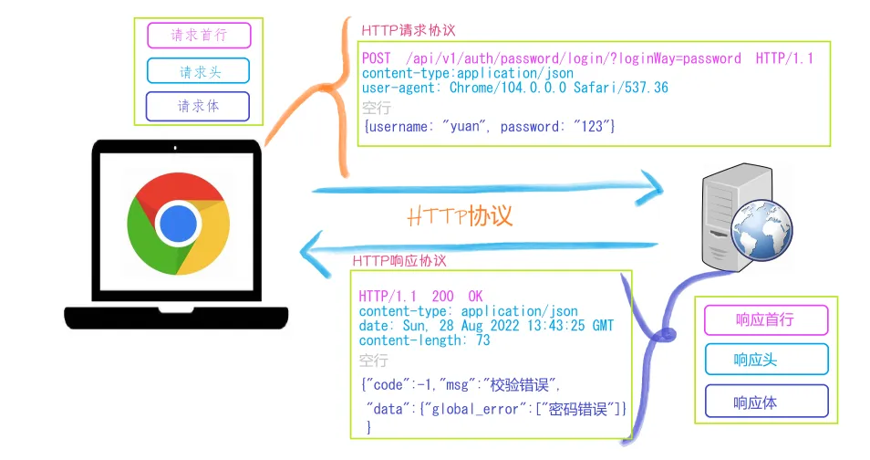
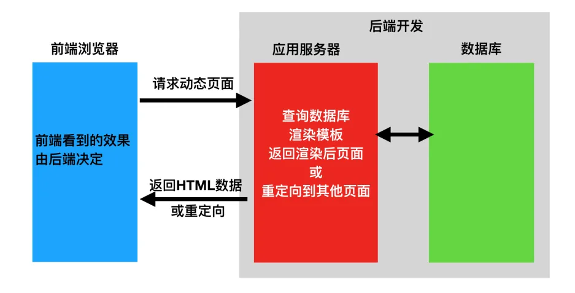
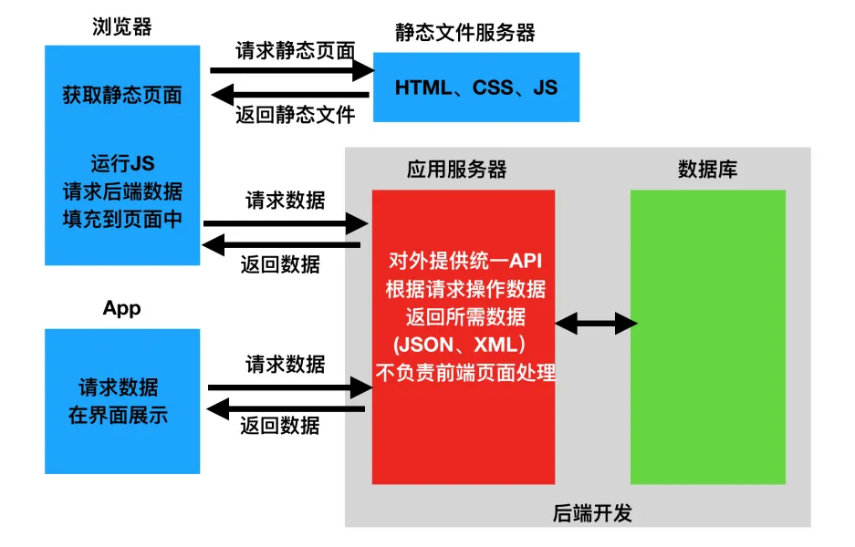
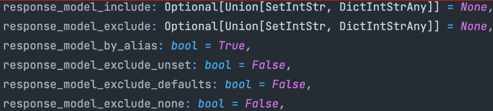

### 前提知识

#### Http协议

##### http四个特点

1. 基于TCP/IP协议

   http协议是基于TCP/IP协议之上的应用层协议。

2. 基于请求-响应模式

   HTTP协议规定,请求从客户端发出,最后服务器端响应该请求并返回。换句话说,肯定是先从客户端开始建立通信的,服务器端在没有接收到请求之前不会发送响应

3. 无状态保存

   HTTP是一种不保存状态,即无状态(stateless)协议。HTTP协议 自身不对请求和响应之间的通信状态进行保存。也就是说在HTTP这个 级别,协议对于发送过的请求或响应都不做持久化处理。

   使用HTTP协议,每当有新的请求发送时,就会有对应的新响应产 生。协议本身并不保留之前一切的请求或响应报文的信息。这是为了更快地处理大量事务,确保协议的可伸缩性,而特意把HTTP协议设计成如此简单的。

4. 短连接

   HTTP1.0默认使用的是短连接。浏览器和服务器每进行一次HTTP操作，就建立一次连接，任务结束就中断连接。

   HTTP/1.1起，默认使用长连接。要使用长连接，客户端和服务器的HTTP首部的Connection都要设置为keep-alive，才能支持长连接。

   HTTP长连接，指的是复用TCP连接。多个HTTP请求可以复用同一个TCP连接，这就节省了TCP连接建立和断开的消耗。
   
   

---

##### 请求与响应



请求首行:  请求方式,请求路径,请求协议

请求头: 

在发送请求到服务器时，请求头会包含诸如请求的类型（GET、POST等）、所需的响应格式、客户端可以接受的语言、Cookie等信息。这些信息帮助服务器更好地理解和处理请求。

请求头为服务器提供了额外的上下文信息，以便服务器可以根据这些信息来定制化响应。例如，通过Accept-Language请求头，服务器可以决定向用户返回英文或中文网页。通过User-Agent，服务器可以判断请求来自哪种类型的设备(手机、桌面计算机等)，并据此提供适当的响应。

请求体:

存放核心数据,例如post提交表单的数据

注意get请求没有请求体,他的数据是挂载在URL地址?后面传递过去.

---

##### URL地址

一个完整的URL包括：协议、ip、端口、路径、参数

例如：` https://www.baidu.com/s?wd=yuan `其中https是协议，www.baidu.com 是IP，端口默认80，/s是路径，参数是wd=yuan

---

##### get请求和post请求

● GET提交的数据会放在URL之后，以?分割URL和传输数据，参数之间以&相连，如EditBook?name=test1&id=123456. POST方法是把提交的数据放在HTTP包的请求体中.

● GET提交的数据大小有限制（因为浏览器对URL的长度有限制），而POST方法提交的数据没有限制

---

##### Content-Type

Content-Type 是一个 HTTP 头部，用于指示资源的 MIME 类型（媒体类型）。在 HTTP 请求中，当你发送数据给服务器（如通过 POST 或 PUT 请求）时，Content-Type 告诉服务器发送的数据是什么格式。同样，在 HTTP 响应中，它告诉客户端实际返回的内容类型是什么。这样，客户端就能正确地解析和处理这些数据。

 

Content-Type 格式通常包括类型和子类型，如 type/subtype，后面可以跟着参数，比如字符集。这里有一些常见的例子：   

 

text/html; charset=UTF-8：表示发送的内容是 HTML 文本，并且字符集是 UTF-8。

application/json：表示发送的内容是 JSON 格式。

multipart/form-data：用于文件上传场景，允许发送表单数据和文件。

application/x-www-form-urlencoded：这是 HTML 表单提交时默认的编码类型，表单数据会被编码为键值对，类似于 URI 查询字符串。


服务器和客户端通过 Content-Type 头部相互沟通，确保发送和接收的内容以正确的方式被处理。例如，如果服务器返回的 Content-Type 是 application/json，客户端就会预期接收到的内容是 JSON 格式，并可以使用 JSON 解析器来处理这些数据。


通俗来说,content-type是告诉服务器应该用何种数据格式进行反解出原始数据.

---

#### 前后端分离

**前后端不分离模式[客户端看到的内容和所有界面效果都是由服务端提供出来的。]**

在传统的网站开发模式中，前端和后端代码通常紧密结合在一起，服务器不仅处理数据和业务逻辑，还负责生成和返回HTML页面。客户端（浏览器）主要负责展示从服务器接收到的HTML内容。这种模式下，前后端的修改和更新往往需要同时进行，相互之间的依赖性很高。




**前后端分离模式[把前端的界面效果(html，css，js分离到另一个服务端，python服务端只需要返回数据即可)]**

前后端分离后，前端变得独立，专注于用户界面和用户体验的构建，通常使用HTML、CSS和JavaScript等技术开发单页应用（SPA）。后端则专注于数据处理、业务逻辑的实现以及安全性等，通常通过RESTful API、GraphQL等接口与前端通信。



---

#### API概念

应用程序编程接口（Application Programming Interface，API接口），就是应用程序对外提供了一个操作数据的入口，这个入口可以是一个函数或类方法，也可以是一个url地址或者一个网络地址。当客户端调用这个入口，应用程序则会执行对应代码操作，给客户端完成相对应的功能。

 

当然，api接口在工作中是比较常见的开发内容，有时候，我们会调用其他人编写的api接口，有时候，我们也需要提供api接口给其他人操作。由此就会带来一个问题，api接口往往都是一个函数、类方法、或者url或其他网络地址，不断是哪一种，当api接口编写过程中，我们都要考虑一个问题就是这个接口应该怎么编写？接口怎么写的更加容易维护和清晰，这就需要大家在调用或者编写api接口的时候要有一个明确的编写规范！！！

 

为了在团队内部形成共识、防止个人习惯差异引起的混乱，我们都需要找到一种大家都觉得很好的接口实现规范，而且这种规范能够让后端写的接口，用途一目了然，减少客户端和服务端双方之间的合作成本。

目前市面上大部分公司开发人员使用的接口实现规范主要有：restful、RPC。

---

#### Restful规范

RESTful是一种专门为Web 开发而定义API接口的设计风格，尤其适用于前后端分离的应用模式中。


关键：$\color{red}{面向资源开发}$

 

这种风格的理念认为后端开发任务就是提供数据的，对外提供的是数据资源的访问接口，所以在定义接口时，客户端访问的URL路径就表示这种要操作的数据资源。

 

对于数据资源分别使用POST、DELETE、GET、UPDATE等请求动作来表达对数据的增删查改。而不再是通过url的路径来区分,即student/add,student/delete等等.


restful规范是一种通用的规范，不限制语言和开发框架的使用。事实上，我们可以使用任何一门语言，任何一个框架都可以实现符合restful规范的API接口。

---

#### uvicorn

Uvicorn 是一个轻量级的ASGI服务器，用于运行Python的异步Web应用。它基于异步编程模型，可以高效处理大量并发请求，是运行像FastAPI这样的现代Web应用的理想选择。

```python
#main.py
import uvicorn
from fastapi import FastAPI
from fastapi.responses import JSONResponse
app = FastAPI()

@app.get("/test")
async def test():
    return JSONResponse({"code":200,"msg":"test"}, status_code=200)

if __name__ == "__main__":
    uvicorn.run(app="main:app",host="127.0.0.1",port=8080,reload=True, debug=True)
```


|    参数     |                  作用                  |
| :---------: | :------------------------------------: |
|     app     |       .py文件  : FastAPI实例对象       |
|    host     |         访问url,默认127.0.0.1          |
|    port     |           访问端口,默认 8080           |
|   reload    |    热更新,有内容修改自动重启服务器     |
|    debug    |               debug模式                |
| reload_dirs | 设置需要 reload 的目录，List[str] 类型 |
|  log_level  |        设置日志级别，默认 info         |

---

### FastAPI基本流程

1. 导入 FastAPI。

2. 创建一个 app 实例。

3. 编写一个路径操作装饰器（如 @app.get(“/test”)）。

4. 编写一个路径操作函数（如上面的 def test(): …）

5. 定义返回值

6. 运行开发服务器（如 uvicorn main:app --reload）


---

### 创建FastAPI实例

```python
# main.py

import uvicorn
from fastapi import FastAPI

app = FastAPI()

@app.get("/home")
async def root():
    pass

if __name__ == "__main__":
    uvicorn.run(app="main:app",host="127.0.0.1",port=8080,reload=True, debug=True)
```

API 元数据

| 参数  | 类型 | 描述 |
| ----- | :-- | ---- |
| title | str  | API标题 |
| summary | str | API简短摘要 |
| description | str | API简短描述 |
| version | string | API 的版本。这是您自己的应用程序的版本，而不是 OpenAPI 的版本。例如 `2.5.0` 。 |
| docs_url | str | 设置文档URL,默认为/docs. 当docs_url=None表示禁用 |
|  |      |      |

---

### 路径操作装饰器

#### **@app.get()**

`GET` 请求用于向指定资源发出请求，请求中包含了资源的 URL 和请求参数。服务器端通过解析请求参数来返回相应的资源，不会修改服务器端的状态。

```python
# 查询所有数据    -> GET   http://localhost/test/user
@app.get("/test/user")
async def test_get():
    # 数据库查询所有用户数据
    datas = getAllUser()
    return {"code": 200, "msg": "success", "data": datas}

# 查询id=xx的数据   -> GET   http://localhost/test/user?id=xx
@app.get("/test/user")
async def test_get(id: int):
    # 数据库查询所有用户数据
    datas = getIdUser(id=id)
    return {"code": 200, "msg": "success", "data": datas}
```

---

#### **@app.post()**

`POST` 请求用于向指定资源提交数据，通常会导致服务器端的状态发生变化。使用 `POST` 请求方式提交的数据会被包含在请求体中，而不像 `GET` 请求方式那样包含在 URL 中。几乎目前所有的提交操作都是用POST请求的。

```python
# 增加数据信息

# 一个一个字段从表单读取   -> POST 表单格式传输 http://localhost/test/user
@app.post("/test/user")
async def test_post(name:str = Form(...), sex:int = Form(...) ):
    # 向数据库写入新的数据
    info = {"name":name, "sex":sex}
    addNewUser(info=info)
    return {"code": 200, "msg": "success", "data": ""}

# 使用pydantic模型读取JSON数据  
class Info(BaseModel):
    name: str
    sex: int
#							-> POST JSON格式传输 http://localhost/test/user
@app.post("/test/user")   
async def test_post(info:Info):
    # 向数据库写入新的数据
    addNewUser(info=info)
    return {"code": 200, "msg": "success", "data": ""}
```

---

#### **@app.put()**

`PUT` 请求用于向服务器更新指定资源，可以理解为对服务器上的资源进行修改操作。具有幂等性,即指的是对同一URL的相同请求被执行多次时，所产生的效果与只执行一次相同。换句话说，多次执行同一请求不会导致资源的状态发生累积变化。

```python
# 对id=xx的数据进行更新  -> PUT http://localhost/test/user?id=xx
# 使用pydantic模型读取JSON数据  
class Info(BaseModel):
    name: str
    sex: int
    
@app.put("/test/user")
async def test_put(id:int,info:Info):
    # 向数据库写入新的数据
    updataUser(id=id,info=info)
    return {"code": 200, "msg": "success", "data": ""}
```

---

#### @app.delete()

`DELETE` 请求用于请求服务器删除指定的资源，可以理解为对服务器上的资源进行删除操作。

```python
# 删除id=xx的数据信息  -> DELETE http://localhost/test/user?id=xx

@app.delete("/test/user")
async def test_delete(id:int):
    # 删除数据库中id=xx的数据
    deleteUser(id=id)
    return {"code": 200, "msg": "success", "data": ""}
```

---

#### @app.patch()

`PATCH `请求只更新资源的某些字段，而不是整个资源。

```python
# 对id=xx的数据进行部分更新  -> PATCH http://localhost/test/user?id=xx
# 使用pydantic模型读取JSON数据  
class Info(BaseModel):
    name: str

    
@app.patch("/test/user")
async def test_patch(id:int,info:Info):
    # 向数据库写入新的数据
    updataUser(id=id,info=info)
    return {"code": 200, "msg": "success", "data": ""}
```

---

#### 装饰器的参数

@app.get(path[, status_code, tags, ... ])

 **path:** 字符串，定义了路由的路径。例如，在 @app.get("/items") 中，"/items" 是路径。

**status_code:** 整数，指定响应的HTTP状态码。默认情况下，大多数操作会返回 200，但你可以通过这个参数改变为其他状态码，例如 status_code=201。

**tags:** 列表，用于组织API文档中的操作。通过为不同的路由设置标签，你可以在自动生成的文档中将它们分类。

**summary:** 字符串，提供操作的简短摘要，使API文档更加清晰。

**description:** 字符串，用于提供操作的详细描述。这比 summary 提供更多的信息，有助于理解API的用途。

**response_model:** Pydantic模型，声明响应的格式。这告诉FastAPI预期的输出数据类型，使其能自动生成文档，并对输出数据进行验证。

**responses:** 字典，用于额外声明除默认外的其他响应类型和消息，允许你为不同的HTTP状态码定义响应模型。

**dependencies:** 列表，包含依赖项。这些依赖项在路由函数执行前运行，可以用于请求前验证、权限检查等。


**deprecated:** 布尔值，如果设置为True，标记该操作为弃用。这对于向用户指示计划在将来版本中移除的API部分非常有用。

**operation_id**: 字符串，用于为操作设置特定的ID。这在自动生成的API文档中用于唯一标识每个操作。

**methods:** 仅在 app.api_route() 装饰器中使用，它允许你为同一个路径指定多个HTTP方法。

---

### 路径操作函数

#### 路径参数

```python
@app.get("/test/user/{user_id}")
async def getUser(user_id:int):
    # 数据库查找user_id的数据
    datas = getIdUser(id=user_id)
    return {"code":200,"msg":"success","data":datas}

# 路径参数user_id.请注意,在路径url中传递的任何参数给路径函数都是一个字符串.
# 在这里由于user_id声明为int类型,故而将传进来的user_id字符进行类型转换.
```

> [!NOTE]
> 
> ```python
> @app.get("/test/user/me")
> async def getUser():
>      # 从数据库中获取当前用户信息
>      datas = getUserMe()
>      return {"code":200,"msg":"success","data":datas}
> 
> 
> @app.get("/test/user/{username}")
> async def getUser(username:str):
>      return {"code":200,"msg":"success","data":username}
> ```
>
> 在创建路径操作时，你会发现有些情况下路径是固定的。
>
> 比如 /users/me，我们假设它用来获取关于当前用户的数据.
>
> 然后，你还可以使用路径 /user/{username} 来通过用户名 获取关于特定用户的数据。
>
> 由于路径操作是按顺序依次运行的(从上到下进行匹配)，你需要确保路径 /user/me 声明在路径 /user/{username}之前.否则，/user/{username} 的路径还将与 /user/me 相匹配，"认为"自己正在接收一个值为 "me" 的 username 参数。
>

---

#### 查询参数

```python
# 查询id=xx的数据   -> GET   http://localhost/test/user?id=xx
@app.get("/test/user")
async def test_get(id: int):
    datas = getIdUser(id=id)
    return {"code": 200, "msg": "success", "data": datas}
```

其中id就是查询参数,当在路径函数中声明不属于路径参数的其他函数参数时，它们将被自动解释为"查询字符串"参数，就是 url "?" 之后用 "&" 分割的 key-value 键值对。

```python
# http://localhost/test/user/1?name=mrhow&sex=1

@app.get("/test/user/{user_id}")
async def test_get(id: int,name:str,sex:int):
    datas = {"id":id,"name":name,"sex":sex}
    return {"code": 200, "msg": "success", "data": datas}
```

---

#### 参数的类型

##### 基本类型声明:

`str`, `int`, `bool`, `float`

```python
@app.get("/test")
async def test_type(id:int,name:str,price:float,flag:bool):
    pass
```

使用类型声明,fastapi会进行数据验证,在运行路由函数前验证请求数据是否符合你在类型声明中指定的类型,这有助于捕获错误并在早期阶段解决问题,从而避免了在服务器内部处理无效数据可能导致的错误和异常.

---

##### typing类型注释

typing模块不用于数据校验,所以不会影响程序的运行,不会报正式的错误,当调用的时候如果参数的类型不正确pycharm就提醒你一下,减少人为编写错误.

typing模块 包含基本类型注释,`str`, `int`, `bool`, `float` 等等.但是在python3.9后,python已经内置了这些类型注释功能了,所以对于基本类型可以不用显式导入typing模块. typing模块在python3.5 后可用.

但是typing模块除了有基本类型注释,还有联合类型、可选类型、容器类型、泛型类型注释等等.

###### 联合类型、可选类型：

- Union 类型注释

	`Union` 类型允许同时使用多个数据类型，其中任何一种类型的值都可以传递给函数。
	
	```python
	from typing import Union
	
	def test_Union(name: Union[int, str, bool, None]):
	    pass
	
	# 在这里name参数数据类型可以是int,str,bool或None
	# 在python3.10 引入新语法，可以使用name: int|str|bool|None 来等效name:Union[int,str,bool,None]
	```
	
- Optional 类型注释

	`Optional`类型表示一个可选的数据类型，它可用于表示参数可以是一种数据类型或 None 值。使用 `Optional[type]` 表示该函数参数可以是 `type` 或 `None` 值。
	
	```python
	from typing import Optional
	
	def test_Optional(name: Optional[str]):
	    pass
	
	# 这里表明name参数的数据类型可以是str或None类型.
	
	# Optional[str] 等价于 Union[str,None]
	```

###### 容器类型：

- List 类型注释

	`List[type]` 的类型注释中使用方括号来指定列表中每个元素的类型。

	```python
	from typing import List
	
	def test_List(name: List[str]):
	    pass
	
	```

- Tuple 类型注释

	`Tuple[type]`

	```python
	from typing import Tuple
	
	def test_Tuple(name: Tuple[str]):
	    pass
	
	# 当试图修改name的值时,由于是元组类型,故而类型检查器会在运行前警告你
	```

- Dict 类型注释

	`Dict[key_type,value_type]` 设置键值的类型

	```python
	from typing import Dict
	
	def test_Dict(name: Dict[str,Union[str,int]]):
	    pass
	
	# 此时name是一个字典类型,其中键key是str类型,值value是str或int类型.
	```

- Set 类型注释

	`Set[type]`

	```python
	from typing import Set  
	  
	def test_set() -> Set[str]:  
	    """返回一个包含唯一字符串名称的集合。"""  
	    return {"Alice", "Bob", "Charlie", "Bob"}  # 注意，集合中的"Bob"只会出现一次  
	  
	
	names = get_unique_names()  
	print(names)  # 输出: {'Alice', 'Bob', 'Charlie'}（顺序可能不同）
	```

注意,这些容器类型还可以互相嵌套.


###### 泛型类型：

- Callable 类型注释

	`Callable[[args], return_type]` 表示一个可调用的对象比如函数、方法、类等. 

	其中`args` 表示可调用对象的参数的类型，  `return_type` 表示可调用对象的返回值的类型。

	```python
	from typing import Callable
	
	def test_Callable(func: Callable[[int,int],int],a:int,b:int) -> int:
	    return func(a,b)
	
	# 这里的[int,int] 既声明参数个数又声明了参数类型
	# 若[int,int] 为[...,int] 则表示可接受任意数量和类型的参数
	```

- TypeVar 类型注释

	泛型类型注释允许我们定义泛型函数和泛型类，可以将这些类型注释用于函数的参数、返回值和函数本身。泛型类型注释用于泛型函数和泛型类时，这些函数和类将接受不同类型的参数，并在运行时创建新的类型。

	```python
	from typing import TypeVar
	
	T = TypeVar('T')
	
	def test_TypeVar(name: List[T]):
	    return {"code":200,"msg":"success","data":name}
	```


---

##### Query

如果想对查询参数进行更加复杂的类型校验和额外的校验(比如大于小于),可以使用Query模块.

FastAPI的Query模块通常与FastAPI的路由函数一起使用,使用Query对象来指定查询参数的属性，如默认值、验证规则等

Query的字段

```python
def Query(
	default: Any,		
    *,
    alias: Optional[str] = None,	# 别名
    title: Optional[str] = None,
    description: Optional[str] = None,
    gt: Optional[float] = None,
    ge: Optional[float] = None,
    lt: Optional[float] = None,
    le: Optional[float] = None,
    min_length: Optional[int] = None,
    max_length: Optional[int] = None,
    regex: Optional[str] = None,
    example: Any = Undefined,
    examples: Optional[Dict[str,Any]] = None,
    deprecated: Optional[bool] = None,		# 是否弃用
    **extra: Any,
) -> Any:
```


```python
from fastapi import Query
from typing import Optional,List

@app.get("/test/Query")
async def test_Query(number:int = Query(...,ge=0,lt=10)):
    pass

# 限定number是一个大于等于0,小于10的数字. 默认为None.
# 其中Query的第一个参数 ... 表示该参数是必传

@app.get("/test/Query_str")
async def test_Query(string:Optional[str] = Query(default=None,min_length=3,max_length=10,regex="^M*how$")):
    pass

# 限定string长度最小为3,最长为10.添加正则表达式校验.默认为None

# 对于参数是List类型时
@app.get("/test/Query_List")
async def test_Query(lst:Optional[List[str]] = Query(["a","b"],min_length=3,max_length=10)):
    pass

# 当不传参数时,lst默认为["a","b"]. 其中max_length是对列表里面元素进行校验.
```

限定于字符串的校验：

- min_length

- max_length

- regex

	

---


##### Path

==Query模块只能对查询参数进行校验,==如果需要对路径参数进行校验,可以使用Path模块.

```python
def Path(
	default: Any,		
    *,
    alias: Optional[str] = None,	
    title: Optional[str] = None,
    description: Optional[str] = None,
    gt: Optional[float] = None,
    ge: Optional[float] = None,
    lt: Optional[float] = None,
    le: Optional[float] = None,
    min_length: Optional[int] = None,
    max_length: Optional[int] = None,
    regex: Optional[str] = None,
    example: Any = Undefined,
    examples: Optional[Dict[str,Any]] = None,
    deprecated: Optional[bool] = None,
    **extra: Any,
) -> Any:
```

可以看到它于Query的参数是一模一样的.

```python
from fastapi import Path
from typing import Optional,List

@app.get("/test/{path_id}")
async def test_Path(path_id: Optional[str] = Path(..., gt=10,le=20,)):
    pass

# 对位置参数path_id进行限制.
```

---

##### Pydantic请求体

FastAPI更推荐使用Pydantic请求体来对传进来的参数进行校验.

```python
from fastapi import FastAPI
from typing import Optional
from pydantic import BaseModel

# 自定义一个pydantic模型
class UserInfo(BaseModel):
    user_id: int
    name: str
    sex: int
    birthday: Optional[str] = None
    address: Optional[str] = None
    
@app.post("/test/pydantic")
async def test_Pydantic(user: UserInfo):
    pass

```

使用Pydantic请求体格式,可以让FastAPI对参数进行校验,且可以将字段值转换相应的类型,例如对设定类型是str的字段传入int型的数据,FastAPI会自动转为str类型.若转换不了,就会报type_error错误.


Pydantic的Field函数

用于定义模型字段的额外元数据或设置验证规则

```python
from pydantic import BaseModel,Field

class UserInfo(BaseModel):
    user_id: int
    name: str
	age: int = Field(default=1,gt=0,lt=100)
```


扩展: pydantic 的 field_validator 装饰器创建自定义字段校验逻辑.

注意pydantic v1版本已经不再更新,现在迁移到v2版本,故而v1的validator验证器已经被废弃,使用v2的field_validator验证器.

```python
from pydantic import BaseModel, field_validator, ValidationError, ValidationInfo

class StudentInfo(BaseModel):
    name: str
    xuehao: str
    class_name: str
    class_id: int
    courses: List[int] = []

    @field_validator("name")
    @classmethod
    def name_must_alpha(cls,v:str) -> str:
        if value.isalpha():
            raise ValidationError('name must be alpha')
        return value

    @field_validator("xuehao","class_name",mode="before")
    @classmethod
    def sno_validate(cls,v:str, info:ValidationInfo) ->:
        if isinstance(v,str):
            is_alphanumeric = v.replace(" ",'').isalnum()
            assert is_alphanumeric, f"{info.field_name} must be alphanumeric"
        return v
    

# mode="before" 可以指定验证是在字段验证前还是验证后进行
# 
# v是要验证的字段值
# info是一个字典,包含正在验证的字段相关信息
# ValidationInfo的字段
# context     当前验证器的上下文
# config	  验证器的配置
# mode		  正在验证的输入数据的类型 [python,json]
# data		  正在为此pydantic模型验证的数据
# field_name  当前验证的字段的名字
    
    
    
```


同时声明请求体、路径参数、查询参数

```python
from typing import Optional
from fastapi import FastAPI
from pydantic import BaseModel

# 自定义一个pydantic模型
class UserInfo(BaseModel):
    name: str
    sex: int
    birthday: Optional[str] = None
    address: Optional[str] = None
    
@app.post("/test/{item_id}")
async def test_Pydantic(item_id:int,user_id:int, userinfo: UserInfo):
    pass

# 路径参数item_id,	查询参数user_id,	请求体userinfo
```


> [!NOTE]
>
> FastAPI识别参数的逻辑
>
> - 如果参数在路径中声明，它将解释为路径参数,例如item_id
> - 如果参数被声明为 Pydantic 模型的类型，它将被解析为请求体,例如userinfo
> - 其他情况，解释为查询参数，例如user_id

---

##### Body

上面说到如果路径函数的参数没有声明为Pydantic模型,那它将解析为查询参数,那么如果要不解析为查询参数,除了声明为Pydantic模型,还有通过Body函数

- 主要作用：可以将单类型的参数成为 Request Body 的一部分，即从查询参数变成请求体参数
- 和 Query、Path 提供的额外校验、元数据是基本一致的（多了个 embed 参数）

```python
def Body(
	default: Any,		
    *,
    embed:bool = False,
    media_type:str = "application/json",
    alias: Optional[str] = None,	
    title: Optional[str] = None,
    description: Optional[str] = None,
    gt: Optional[float] = None,
    ge: Optional[float] = None,
    lt: Optional[float] = None,
    le: Optional[float] = None,
    min_length: Optional[int] = None,
    max_length: Optional[int] = None,
    regex: Optional[str] = None,
    example: Any = Undefined,
    examples: Optional[Dict[str,Any]] = None,
    **extra: Any,
) -> Any:
```

例子:

```python
from fastapi import FastAPI,Body
from pydantic import BaseModel

class Item(BaseModel):
    name: str
    description: Optional[str] = None
    price: float
    tax: Optional[float] = None


class User(BaseModel):
    username: str
    full_name: Optional[str] = None


@app.put("/test/{item_id}")
async def test_Body(
        item_id: int,
        item: Item,
        user: User,
        importance: int = Body(...)
):
    results = {"item_id": item_id, "item": item, "user": user, "importance": importance}
    return results


# 期望得到的请求体为
#{
#    "item": {
#        "name": "Foo",
#        "description": "The pretender",
#        "price": 42.0,
#        "tax": 3.2
#    },
#    "user": {
#        "username": "dave",
#        "full_name": "Dave Grohl"
#    },
#    "importance": 5
#}
# Reuquest Body中多了个importance字段
```

Body()中的 embed参数

当请求体只有一个pydantic模型时,默认是不需要指定字段名的

```python
from pydantic import BaseModel

class Item(BaseModel):
    name: str
    price: float

@app.post("/test/{item_id}")
async def test_Body(item_id:int, item: Item):
    pass
# 期望得到的请求体
#{
#	"name": "Foo",
#	"price": 42.0
#}
# 并不需要指定字段名item
```

当我们要求一定要有字段名,可以使用embed参数

```python
from fastapi import FastAPI,Body
from pydantic import BaseModel

class Item(BaseModel):
    name: str
    price: float

@app.post("/test/{item_id}")
async def test_Body(item_id:int, item: Item = Body(...,embed=True)):
    pass
# 期望得到的请求体
#{
#	"item":{
#		"name": "Foo",
#		"price": 42.0
#	}
#}
# 需要指定字段名item
```

---

#### Form表单数据

通过form-data表单格式传参,FastAPI通过Form来声明参数是表单数据.

```python
from fastapi import FastAPI, Form

@app.post("/test/Form")
async def test_Form(username:str = Form(...),password:str = Form(...)):
    pass

# 将用户名,密码作为表单字段发送,而不是JSON格式.
```

---

#### 文件上传

```python
from fastapi import FastAPI, File, UploadFile
from typing import List

@app.post("/test/file")
async def test_File(file: bytes = File(...)):
    pass

@app.post("/test/uploadfile")
async def test_UploadFile(file: UploadFile = File(...)):
    pass

# 上传多个文件
@app.post("/test/file")
async def test_File(file: List[bytes] = File(...)):
    pass

@app.post("/test/uploadfile")
async def test_UploadFile(file: List[UploadFile] = File(...)):
    pass

```

> [!NOTE]
>
> File
>
> File类型用于读取文件内容为byte或str.
>
> 当你使用 File 作为操作函数的参数类型时，文件的内容将直接被读取到内存中。这适用于小文件，因为它们可以快速被加载处理。使用 File 类型时，你不会接收到文件的元数据，比如文件名或者文件类型。
>
> UploadFile
>
> 存储在内存中的文件达到最大大小限制，超过此限制后，它将存储在磁盘中，可以很好地处理大文件，如图像、视频、大型二进制文件等，而不会消耗所有内存
>
> 可以从上传的文件中获取元数据. 
>
> filename: str 	上传的原始文件名 例如 test.jpg
>
> content_type: str	包含 content-type（MIME type / media type），例如 image/jpeg
>
> 
>
> 总的来说,   UploadFile 类型是 FastAPI 特有的，提供了更多的操作文件的方法，特别适用于大文件，因为它支持异步的文件写入和读取，可以减少内存消耗。
>
> 使用 UploadFile 时，你可以访问文件的元数据，如文件名（filename）、内容类型（content_type）等。
>
> UploadFile 提供了保存文件到磁盘的方法，这对于需要处理上传的文件并将它们保存在服务器上的场景非常有用。
>
> 它还支持异步的读写操作，对于不想阻塞主线程处理其他请求的同时处理文件上传的场景非常合适。


### 路由分发

`mian.py`

```python
# main.py

import uvicorn
from fastapi import FastAPI
from app.user import user_router


app = FastAPI()
app.include_router(user_router, prefix="/user")

if __name__ == "__main__":
    uvicorn.run(app="main:app",host="127.0.0.1",port=8080,reload=True, debug=True)
```

`\app\user.py`

```python
# user.py

from fastapi import APIRouter

user_router = APIRouter()

@user_router.get("/router") 
async def test_router():
    pass


```

---

### 请求与响应

#### Cookie

```python
from fastapi import FastAPI, Cookie
from fastapi.responses import JSONResponse

# 读取Cookie
@app.get("/test/cookie")
async def test_cookie(name: Optional[str] = Cookie(None)):
    pass
# name 需要在Cookie的Name对应上才能拿到数据.

# 返回Set-Cookie 表示浏览器需要设置的一些 Cookie
@app.get("/test/set-cookie")
async def test_set_cookie():
    content = {"code":200,"msg":"success","data":""}
    response = JSONResponse(content=content)
    response.set_cookie(key="username",value="Mrhow")
    return response
```

---

#### Header


---

#### Request对象

在函数中声明Request类型的参数，FastAPI 就会自动传递 Request 对象给这个参数，我们就可以获取到 Request 对象及其属性信息，例如 header、url、cookie、session 等。

```python
from fastapi import FastAPI, Request

@app.get("/test/request")
async test_request(request: Request):
    return {
        "请求URL": request.url,
        "请求IP": request.client.host,
        "请求宿主": request.header.get("user-agent"),
        "cookies": request.cookies
    }
```

---

#### 请求静态文件

```python
from fastapi import FastAPI
from fastapi.staticfiles import StaticFiles

app = FastAPI()
static_dir = "./static"

app.mount("/static",StaticFiles(directory=static_dir))

# 这样就可以通过https://localhost:8080/static 来给前端访问静态资源.
```

---

#### 响应模型

 response_model

FastAPI 提供了 response_model 参数，声明 return 响应体的模型. response_model 是路径操作的参数，并不是路径函数的参数

```python
from fastapi import FastAPI
from pydantic import BaseModel, EmailStr

class UserIn(BaseModel):
    username: str
    password: str
    email: EmailStr
   
class UserOut(BaseModel):
    username: str
    email: EmailStr
    
@app.post("/test/response_model", response_model= UserOut)
async def test_reponse_model(user:UserIn):
    return user


```

这个响应模型用于：

数据转换：自动将你的输出数据转换（或序列化）为定义的模型格式。这意味着，无论你的内部数据结构如何，最终返回给客户端的都将是符合 response_model 定义的格式。

数据验证：在数据被发送给客户端之前验证数据符合模型的定义。这有助于确保返回的数据是有效和一致的，增加了API的健壮性。

输出限制：限制返回数据的字段。如果你的模型中包含了不希望暴露给客户端的敏感数据或内部信息，response_model 可以帮助你仅仅返回那些你希望返回的数据。例如密码password

---

 response_model_exclude_unset

排除未设置的值.

使用路径操作装饰器的 response_model 参数来定义响应模型，特别是确保私有数据被过滤掉。使用 response_model_exclude_unset 来仅返回显式设定的值。

除了response_model_exclude_unset以外，还有response_model_exclude_defaults和response_model_exclude_none，我们可以很直观的了解到他们的意思，排除是默认值的字段和排除是None的字段。

还有response_model_exclude = {“xxx”,”yyy”} 排除xxx,yyy字段

response_model_include= {“zzz”}  只显示zzz字段.




---

#### 响应状态码

可以在任何路径操作中添加参数status_code来声明响应的状态码.

- status_code 接收一个带有 HTTP 状态代码的 number

- status_code 也可以接收一个 IntEnum

- 如果是 number，可以使用 from fastapi import status ，里面都是封装好的状态码变量，直接调用即可

- 如果是 IntEnum，可以使用 from http import HTTPStatus ，是一个 int 类型的枚举类

	

```python
from fastapi import status
from http import HTTPStatus

@app.post("/test/status_code/1",status_code=status.HTTP_201_CREATED)
async def create_item(name:str):
    pass

@app.post("/test/status_code/2",status_code=HTTPStatus.CREATED)
async def create_item(name:str):
    pass

@app.post("/test/status_code/3",status_code=201)
async def create_item(name:str):
    pass

# 默认是200
```

---

### BackgroundTasks后台任务

BackgroundTasks是 FastAPI 框架的一个功能，它允许我们在响应已经返回给客户端后继续处理任务，而无需等待任务完成。这意味着这些任务将在后台异步执行，而不会阻塞主请求——响应循环。这在处理一些非实时关键的任务时非常有用，比如发送电子邮件、日志记录、消息通知等

```python
from fastapi import FastAPI, BackgroundTasks

def write_notification(email: str,message=""):
    with open("log.txt",mode="w") as email_file:
        content = f"notification for {email}: {message}"
        email_file.write(content)
        
@app.post("/test/backgroundTasks")
async def send_notification(email: str, background_task: BackgroundTasks):
    background_tasks.add_task(write_notification, email, message="some notifications")
    return {"code":200,"msg":"success",data=""}

# 后台处理任务函数write_notification, 无须等待,直接返回响应体.
# 其中的add_task()接收的参数有
# 后台运行任务函数 ,例如 write_notification
# 按顺序传递给任务函数的任何参数序列 ,或者传递关键字参数
```

阻塞问题:

有时候我们的后台函数中也可能包含阻塞操作，例如网络请求,因为后台函数里的网络请求阻塞了，会导致整个请求也被阻塞

要解决这个问题，可以通过线程、进程或协程来执行后台任务.

线程: 使用 `threading`模块

```python
import threading

def write_notification(email, message):
    t = threading.Thread(target=send_notification, args=[email,message])
    t.start()
    
```

进程: 使用 `multiprocessing`模块

```python
import multiprocessing

def write_notification(email, message):
    p = multiprocessing.Process(target=send_notification, args=[email,message])
    p.start()
```

协程: 使用`asyncion`模块

```python
import asyncio

def write_notification(email, message):
	await notify(email,message) # 使用 asyncio.sleep 代替 time.sleep
    
def background_tasks(email,message):
    loop = asyncio.get_event_loop()
    loop.create_task(write_notification(email,message))
```


### 依赖注入

### FastAPI错误处理

### 中间件

### 跨域资源共享CORS

### 测试用例

### 异步编程

### 规范目录结构