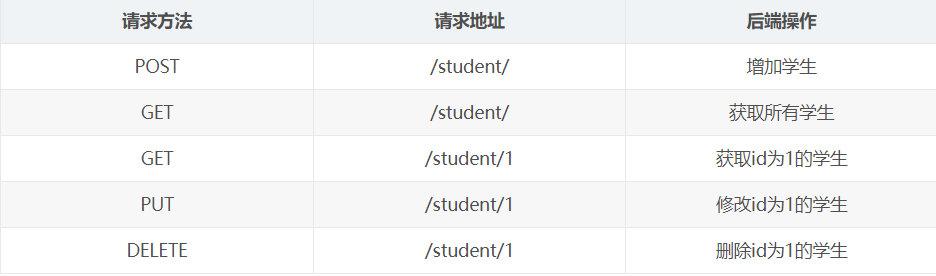

### 前提知识

#### Http协议

##### http四个特点

1. 基于TCP/IP协议

   http协议是基于TCP/IP协议之上的应用层协议。

2. 基于请求-响应模式

   HTTP协议规定,请求从客户端发出,最后服务器端响应该请求并返回。换句话说,肯定是先从客户端开始建立通信的,服务器端在没有接收到请求之前不会发送响应

3. 无状态保存

   HTTP是一种不保存状态,即无状态(stateless)协议。HTTP协议 自身不对请求和响应之间的通信状态进行保存。也就是说在HTTP这个 级别,协议对于发送过的请求或响应都不做持久化处理。

   使用HTTP协议,每当有新的请求发送时,就会有对应的新响应产 生。协议本身并不保留之前一切的请求或响应报文的信息。这是为了更快地处理大量事务,确保协议的可伸缩性,而特意把HTTP协议设计成如此简单的。

4. 短连接

   HTTP1.0默认使用的是短连接。浏览器和服务器每进行一次HTTP操作，就建立一次连接，任务结束就中断连接。

   HTTP/1.1起，默认使用长连接。要使用长连接，客户端和服务器的HTTP首部的Connection都要设置为keep-alive，才能支持长连接。

   HTTP长连接，指的是复用TCP连接。多个HTTP请求可以复用同一个TCP连接，这就节省了TCP连接建立和断开的消耗。
   
   

##### 请求与响应


请求首行:  请求方式,请求路径,请求协议

请求头:

在发送请求到服务器时，请求头会包含诸如请求的类型（GET、POST等）、所需的响应格式、客户端可以接受的语言、Cookie等信息。这些信息帮助服务器更好地理解和处理请求。

请求头为服务器提供了额外的上下文信息，以便服务器可以根据这些信息来定制化响应。例如，通过Accept-Language请求头，服务器可以决定向用户返回英文或中文网页。通过User-Agent，服务器可以判断请求来自哪种类型的设备(手机、桌面计算机等)，并据此提供适当的响应。

请求体:

存放核心数据,例如post提交表单的数据

注意get请求没有请求体,他的数据是挂载在URL地址?后面传递过去.


##### URL地址

一个完整的URL包括：协议、ip、端口、路径、参数

例如：` https://www.baidu.com/s?wd=yuan `其中https是协议，www.baidu.com 是IP，端口默认80，/s是路径，参数是wd=yuan


##### get请求和post请求

● GET提交的数据会放在URL之后，以?分割URL和传输数据，参数之间以&相连，如EditBook?name=test1&id=123456. POST方法是把提交的数据放在HTTP包的请求体中.

● GET提交的数据大小有限制（因为浏览器对URL的长度有限制），而POST方法提交的数据没有限制


##### Content-Type

Content-Type 是一个 HTTP 头部，用于指示资源的 MIME 类型（媒体类型）。在 HTTP 请求中，当你发送数据给服务器（如通过 POST 或 PUT 请求）时，Content-Type 告诉服务器发送的数据是什么格式。同样，在 HTTP 响应中，它告诉客户端实际返回的内容类型是什么。这样，客户端就能正确地解析和处理这些数据。

 

Content-Type 格式通常包括类型和子类型，如 type/subtype，后面可以跟着参数，比如字符集。这里有一些常见的例子：

 

text/html; charset=UTF-8：表示发送的内容是 HTML 文本，并且字符集是 UTF-8。

application/json：表示发送的内容是 JSON 格式。

multipart/form-data：用于文件上传场景，允许发送表单数据和文件。

application/x-www-form-urlencoded：这是 HTML 表单提交时默认的编码类型，表单数据会被编码为键值对，类似于 URI 查询字符串。


服务器和客户端通过 Content-Type 头部相互沟通，确保发送和接收的内容以正确的方式被处理。例如，如果服务器返回的 Content-Type 是 application/json，客户端就会预期接收到的内容是 JSON 格式，并可以使用 JSON 解析器来处理这些数据。


通俗来说,content-type是告诉服务器应该用何种数据格式进行反解出原始数据.

#### 前后端分离

**前后端不分离模式[客户端看到的内容和所有界面效果都是由服务端提供出来的。]**

在传统的网站开发模式中，前端和后端代码通常紧密结合在一起，服务器不仅处理数据和业务逻辑，还负责生成和返回HTML页面。客户端（浏览器）主要负责展示从服务器接收到的HTML内容。这种模式下，前后端的修改和更新往往需要同时进行，相互之间的依赖性很高。


**前后端分离模式[把前端的界面效果(html，css，js分离到另一个服务端，python服务端只需要返回数据即可)]**

前后端分离后，前端变得独立，专注于用户界面和用户体验的构建，通常使用HTML、CSS和JavaScript等技术开发单页应用（SPA）。后端则专注于数据处理、业务逻辑的实现以及安全性等，通常通过RESTful API、GraphQL等接口与前端通信。


#### API概念

应用程序编程接口（Application Programming Interface，API接口），就是应用程序对外提供了一个操作数据的入口，这个入口可以是一个函数或类方法，也可以是一个url地址或者一个网络地址。当客户端调用这个入口，应用程序则会执行对应代码操作，给客户端完成相对应的功能。

 

当然，api接口在工作中是比较常见的开发内容，有时候，我们会调用其他人编写的api接口，有时候，我们也需要提供api接口给其他人操作。由此就会带来一个问题，api接口往往都是一个函数、类方法、或者url或其他网络地址，不断是哪一种，当api接口编写过程中，我们都要考虑一个问题就是这个接口应该怎么编写？接口怎么写的更加容易维护和清晰，这就需要大家在调用或者编写api接口的时候要有一个明确的编写规范！！！

 

为了在团队内部形成共识、防止个人习惯差异引起的混乱，我们都需要找到一种大家都觉得很好的接口实现规范，而且这种规范能够让后端写的接口，用途一目了然，减少客户端和服务端双方之间的合作成本。

目前市面上大部分公司开发人员使用的接口实现规范主要有：restful、RPC。


#### Restful规范

RESTful是一种专门为Web 开发而定义API接口的设计风格，尤其适用于前后端分离的应用模式中。


关键：$\color{red}{面向资源开发}$

 

这种风格的理念认为后端开发任务就是提供数据的，对外提供的是数据资源的访问接口，所以在定义接口时，客户端访问的URL路径就表示这种要操作的数据资源。

 

对于数据资源分别使用POST、DELETE、GET、UPDATE等请求动作来表达对数据的增删查改。而不再是通过url的路径来区分,即student/add,student/delete等等.



restful规范是一种通用的规范，不限制语言和开发框架的使用。事实上，我们可以使用任何一门语言，任何一个框架都可以实现符合restful规范的API接口。


#### uvicorn

Uvicorn 是一个轻量级的ASGI服务器，用于运行Python的异步Web应用。它基于异步编程模型，可以高效处理大量并发请求，是运行像FastAPI这样的现代Web应用的理想选择。

```python
#main.py
import uvicorn
from fastapi import FastAPI
from fastapi.responses import JSONResponse
app = FastAPI()

@app.get("/test")
async def test():
    return JSONResponse({"code":200,"msg":"test"}, status_code=200)

if __name__ == "__main__":
    uvicorn.run(app="main:app",host="127.0.0.1",port=8080,reload=True, debug=True)
```


|    参数     |                  作用                  |
| :---------: | :------------------------------------: |
|     app     |       .py文件  : FastAPI实例对象       |
|    host     |         访问url,默认127.0.0.1          |
|    port     |           访问端口,默认 8080           |
|   reload    |    热更新,有内容修改自动重启服务器     |
|    debug    |               debug模式                |
| reload_dirs | 设置需要 reload 的目录，List[str] 类型 |
|  log_level  |        设置日志级别，默认 info         |


### FastAPI基本流程

1. 导入 FastAPI。
2. 创建一个 app 实例。
3. 编写一个路径操作装饰器（如 @app.get(“/test”)）。
4. 编写一个路径操作函数（如上面的 def test(): …）
5. 定义返回值
6. 运行开发服务器（如 uvicorn main:app --reload）

### 路径操作装饰器

fastAPI支持的请求方式:

1. @app.get()
2. @app.post()
3. @app.put()
4. @app.patch()
5. @app.delete()
6. @app.options()
7. @app.head()
8. @app.trace()


### 路径操作函数

### 请求与响应

### Request对象

### BackgroundTasks后台任务

### 依赖注入

### FastAPI错误处理

### 中间件

### 跨域资源共享CORS

### 测试用例

### 异步编程

### 规范目录结构