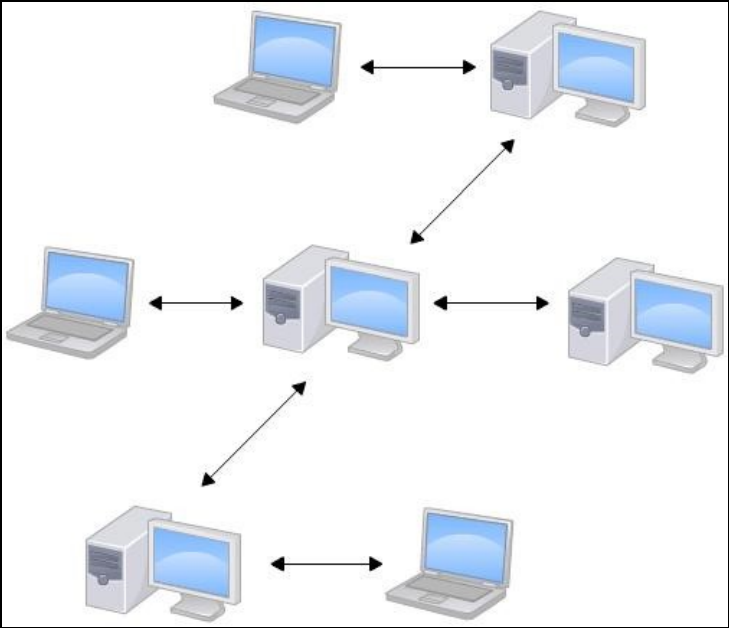
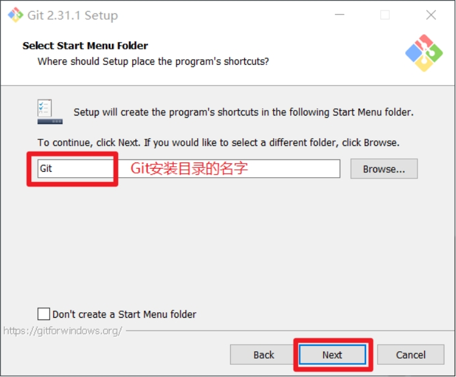
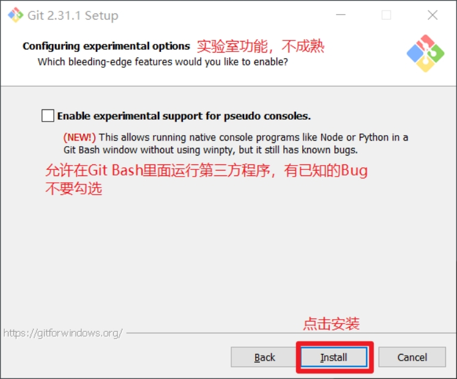

### Git概述

git是一款分布式版本控制工具,可以快速高效处理中小型到大型的各种项目.

#### 什么是版本控制

版本控制是记录文件内容变化,以便将来查阅特定版本修订情况的系统.

版本控制其实最重要的是可以记录文件修改历史记录,从而让用户能够查看历史版本,方便版本切换.

#### 为什么需要版本控制

个人:方便变更内容查看,随时随地查看自己的曾经.

团队:识别不同人员开发的具体内容,追踪每一位开发人员的具体行为,协同整个团队的进度,加速开发效率.

核心意义:当团队中不同人对于同一个决策发生冲突时,及时提醒共同商讨.

即甲乙两人对同一份文件进行修改,保存上传到版本控制中心服务器后,服务器会及时地汇报.若没有这种功能,那么谁后写的,就会把先写的覆盖掉,而那个先写的又不知道,就会造成问题.


#### 版本控制工具

1. 集中式版本控制工具

   CVS、SVN(Subversion)、VSS……

   集中化的版本控制系统诸如 CVS、SVN等，都有一个单一的集中管理的服务器，保存所有文件的修订版本，而协同工作的人们都通过客户端连到这台服务器，取出最新的文件或者提交更新。多年以来，这已成为版本控制系统的标准做法。

   这种做法带来了许多好处，每个人都可以在一定程度上看到项目中的其他人正在做些什么。而管理员也可以轻松掌控每个开发者的权限，并且管理一个集中化的版本控制系统，要远比在各个客户端上维护本地数据库来得轻松容易。

   事分两面，有好有坏。这么做显而易见的缺点是中央服务器的单点故障。如果服务器宕机一小时，那么在这一小时内，谁都无法提交更新，也就无法协同工作。

   

2. 分布式版本控制工具

   Git、Mercurial、Bazaar、Darcs……

   像 Git这种分布式版本控制工具，客户端提取的不是最新版本的文件快照，而是把代码仓库完整地镜像下来（本地库）。这样任何一处协同工作用的文件发生故障，事后都可以用其他客户端的本地仓库进行恢复。因为每个客户端的每一次文件提取操作，实际上都是一次对整个文件仓库的完整备份。

   - 分布式的版本控制系统出现之后,解决了集中式版本控制系统的缺陷:

   - 服务器断网的情况下也可以进行开发（因为版本控制是在本地进行的）

   每个客户端保存的也都是整个完整的项目（包含历史记录，更加安全）
   
   

#### Git工作机制


#### Git和代码托管中心

代码托管中心是基于网络服务器的远程代码仓库，一般我们简单称为远程库。

* **局域网**

GitLab

* **互联网**

GitHub（外网）

Gitee码云（国内网站）

### Git安装

[Git官网地址](https://git-scm.com/) 或 [github下载](https://github.com/git-for-windows/git/releases)

1. 查看协议,直接点击next

   

2. 选择Git安装位置，要求是非中文并且没有空格的目录，然后下一步

   

3. Git选项配置,推荐默认设置,然后下一步

   

4. Git安装目录名，不用修改，直接点击下一步

   

5. Git的默认编辑器，建议使用默认的Vim编辑器，然后点击下一步

   

6. 默认分支名设置，选择让Git决定，分支名默认为master，下一步

   

7. 修改Git的环境变量，选第一个，不修改环境变量，只在Git Bash里使用Git。

   

8. 选择后台客户端连接协议，选默认值OpenSSL，然后下一步

   

9. 配置Git文件的行末换行符，Windows使用CRLF，Linux使用LF，选择第一个自动转换，然后继续下一步。

   

10. 选择Git终端类型，选择默认的Git Bash终端，然后继续下一步。

    

11. 选择Git pull合并的模式，选择默认，然后下一步。

    

12. 选择Git的凭据管理器，选择默认的跨平台的凭据管理器，然后下一步。

    

13. 其他配置，选择默认设置，然后下一步。

    

14. 实验室功能，技术还不成熟，有已知的bug，不要勾选，然后点击右下角的Install按钮，开始安装Git。

    

15. 点击Finsh,Git安装成功.

    

    在Git Bash终端里输入git --version查看git版本，如图所示，说明Git安装成功。

    

### Git常用命令

| **命令名称**                         | **作用**       |
| ------------------------------------ | -------------- |
| git config --global user.name 用户名 | 设置用户签名   |
| git config --global user.email 邮箱  | 设置用户邮箱   |
| git config | 查看全局设置 |
| git init                             | 初始化本地库   |
| git status                           | 查看本地库状态 |
| git add 文件名                       | 添加到暂存区   |
| git commit -m "日志信息" 文件名      | 提交到本地库   |
| git reflog                           | 查看历史记录   |
| git reset --hard 版本号              | 版本穿梭       |
| git push origin dev:master | 本地dev分支推送到origin主机的master分支 |
| git remote add <remote_name>  <remote_url> | 关联远程仓库 |
| git pull origin master | 拉取远程分支(master)与当前分支进行合并. |

#### 设置用户签名

```shell
git config --global user.name Mrhow
git config --global user.email 695649468@qq.com
git config --list # 查看全局配置
#这个全局配置文件在~/.gitconfig 即~ 家 [当前用户的家]/ .gitconfig
```

说明：

签名的作用是区分不同操作者身份。用户的签名信息在每一个版本的提交信息中能够看到，以此确认本次提交是谁做的。Git首次安装必须设置一下用户签名，否则无法提交代码。

注意：这里设置用户签名和将来登录GitHub（或其他代码托管中心）的账号没有任何关系。


#### 初始化本地库

```shell
git init
```

会在对应目录生成一个隐藏文件夹`.git`, 那么当前目录处于工作区.


#### 添加暂存区

```shell
git status #首次查看(工作区没有文件)

#在工作区新增文件 test.txt

#添加到暂存区
git add test.txt #一般使用git add . 

git status #再次查看
```

#### 提交本地库

将暂存区的文件提交到本地库中

```shell
git commit -m "日志信息" # 全部提交
git commit -m "日志信息" test.txt #只提交暂存区里的test.txt文件
```

提交后,暂存区的文件就会被清除.

#### 历史版本

##### 查看版本信息

```shell
git reflog #查看版本信息
git reflog -n 数量 #查看固定数量的版本信息
git log #查看版本详细信息
```

##### 版本穿梭


```shell
git reset --hard 版本号 #回滚到之前的版本

git reset HEAD~n #n代表要回滚的提交数量,比如要回退到最近的两次提交,就把n设置为2
```

 Git切换版本，底层其实是移动的HEAD指针。

版本穿梭一般是用于查看之前的版本代码

#### 删除提交记录及其对应的代码和文件修改

要删除Git历史记录中的提交，我们可以使用`git rebase`命令或`git cherry-pick`命令。

##### 使用git rebase

首先，我们使用`git log`命令查看历史提交记录，并找到要删除的提交的哈希值。然后，使用以下命令进行交互式 rebase：

```nginx
git rebase -i <commit-hash>
```

在交互式 rebase 中，Git 将打开一个文本编辑器，显示包含所有相关提交的列表。在列表中，找到要删除的提交，并将其行前面的 `pick` 改为 `drop`。保存并关闭编辑器后，使用 `git push -f` 命令强制推送删除后的代码到远程仓库, Git 将重新应用提交，并自动跳过我们删除的提交。


#### 恢复被删除的提交记录

如果在删除提交记录后发现删除了错误的提交，或者需要恢复已删除的提交记录，可以使用 `git reflog` 命令来查看所有的历史操作记录。要恢复被删除的提交记录，可以按照以下步骤进行操作：

```nginx
git reflog #查看所有历史操作记录,在历史记录中找到被删除的提交记录对应的哈希值

git cherry-pick <commit-id> #commit-id是被删除提交记录的哈希值

git push #推送恢复后的代码到远程仓库
```


### Git客户端

[Git官网地址](https://git-scm.com/downloads/guis/)

推荐下载使用GitHub Desktop。下载安装之后，选择不登录先进入页面。

#### 设置个人信息


#### 创建新的Git仓库


#### 提交不同的版本

新建test.txt文件,写入信息.之后在GitGui上面提交.


多次提交的版本可以直接在History页面查看区别，不需要再使用reset命令。


#### 连接GitHub远程仓库

登录自己的GitHub账号.


先在本地构建出项目,然后点击Publish将当前项目创建到GitHub上面.


之后修改本地文件,就可以推送到本地git,之后再远程同步到GitHub仓库中.


另一种方式是先在GitHub上创建远程仓库,之后再拉取到本地保持统一.


连接完成远程仓库和本地Git之后，在本地修改文件提交Git之后再push推送即可完成同步。

如果要拉去别人的github项目,得通过URL方式拉取


#### 连接Gitee远程仓库

首先获取gitee的远程仓库的URL


然后新建仓库并克隆gitee的远程仓库.


之后修改本地文件,就可以推送到本地git,之后再远程同步到Gitee仓库中.点击Push origin


最后也可以在GitHub Desktop里修改remote设置.


### IDEA(pycharm)使用Git

打开项目设置,选择git设置.


然后在上面的导航栏选择VCS选项,点击创建Git仓库.


#### 配置Git忽略文件

一种方法是:直接在当前项目新建`.gitignore`文件.添加忽略规则

另一种方法是:可以使ignore文件不在项目里出现,在电脑内部配置.在电脑的家目录下`C:\Users\用户\`有个`.gitconfig`配置文件,打开发现


之后打开`git.ignore`,添加忽略规则(python).

```shell
# Byte-compiled / optimized / DLL files
__pycache__/
*.py[cod]
*$py.class

# C extensions
*.so

# Distribution / packaging
.Python
build/
develop-eggs/
dist/
downloads/
eggs/
.eggs/
lib/
lib64/
parts/
sdist/
var/
wheels/
share/python-wheels/
*.egg-info/
.installed.cfg
*.egg
MANIFEST

# PyInstaller
#  Usually these files are written by a python script from a template
#  before PyInstaller builds the exe, so as to inject date/other infos into it.
*.manifest
*.spec

# Installer logs
pip-log.txt
pip-delete-this-directory.txt

# Unit test / coverage reports
htmlcov/
.tox/
.nox/
.coverage
.coverage.*
.cache
nosetests.xml
coverage.xml
*.cover
*.py,cover
.hypothesis/
.pytest_cache/
cover/

# Translations
*.mo
*.pot

# Django stuff:
*.log
local_settings.py
db.sqlite3
db.sqlite3-journal

# Flask stuff:
instance/
.webassets-cache

# Scrapy stuff:
.scrapy

# Sphinx documentation
docs/_build/

# PyBuilder
.pybuilder/
target/

# Jupyter Notebook
.ipynb_checkpoints

# IPython
profile_default/
ipython_config.py

# pyenv
#   For a library or package, you might want to ignore these files since the code is
#   intended to run in multiple environments; otherwise, check them in:
# .python-version

# pipenv
#   According to pypa/pipenv#598, it is recommended to include Pipfile.lock in version control.
#   However, in case of collaboration, if having platform-specific dependencies or dependencies
#   having no cross-platform support, pipenv may install dependencies that don't work, or not
#   install all needed dependencies.
#Pipfile.lock

# PEP 582; used by e.g. github.com/David-OConnor/pyflow
__pypackages__/

# Celery stuff
celerybeat-schedule
celerybeat.pid

# SageMath parsed files
*.sage.py

# Environments
.env
.venv
env/
venv/
ENV/
env.bak/
venv.bak/

# Spyder project settings
.spyderproject
.spyproject

# Rope project settings
.ropeproject

# mkdocs documentation
/site

# mypy
.mypy_cache/
.dmypy.json
dmypy.json

# Pyre type checker
.pyre/

# pytype static type analyzer
.pytype/

# Cython debug symbols
cython_debug/

```

#### 连接远程仓库


