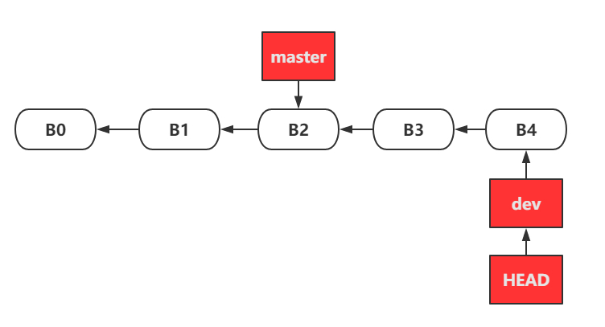
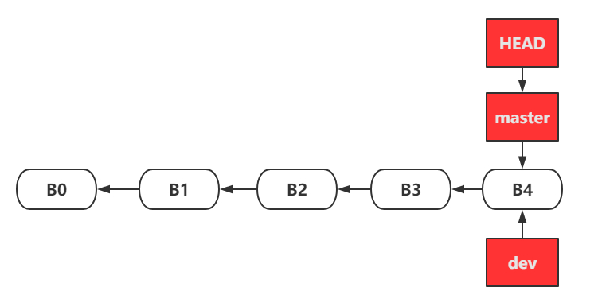
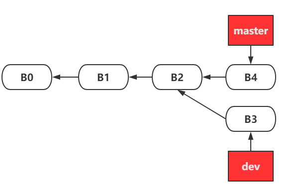
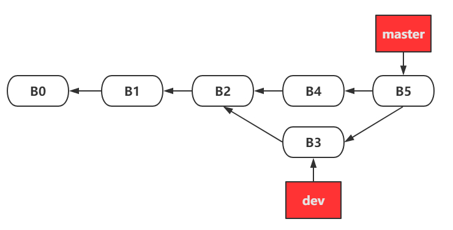
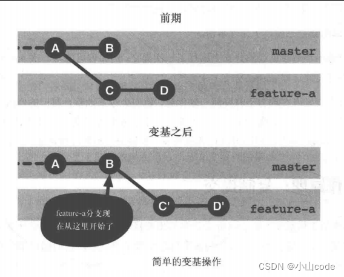

### 初始化

#### 初始化本地仓库

```shell
git init
```

会在对应目录生成一个隐藏文件夹`.git`, 那么当前目录处于工作区.

#### 设置用户签名

```shell
git config --global user.name Mrhow
git config --global user.email 695649468@qq.com
git config --list # 查看全局配置
#这个全局配置文件在~/.gitconfig
```

说明：

签名的作用是区分不同操作者身份。用户的签名信息在每一个版本的提交信息中能够看到，以此确认本次提交是谁做的。Git首次安装必须设置一下用户签名，否则无法提交代码。

#### 关联远程仓库

```shell
git remote add remote_name url 
# 例如： git remote add origin https://xxxx.git 这样就可以用 origin 来代指该远程仓库
```

#### 克隆远程仓库到本地

```shell
git clone url

git clone -b branch_name --single-branch url # 克隆指定分支 --single-branch 选项仅克隆该分支
```


### 分支管理

#### 查看本地分支

```shell
git branch
```

列出本地已存在的分支，当前分支会用*标记

#### 查看本地分支以及最后一次提交

```shell
git branch -v

git branch -vv # 查看本地分支+上次提交的信息+本地和远程分支的关系
```

#### 查看远程仓库分支

```shell
git branch -r
```

#### 查看所有分支列表（本地和远程）

```shell
git branch -a
```

#### 删除本地分支

```shell
git branch -d branch_name
```

#### 切换本地分支

```shell
git checkout branch_name
```

#### 创建本地分支

```shell
git branch -b branch_name

git checkout -b branch_name # 创建分支并切换到该分支
git checkout -b branch_name origin/remote_branch_name # 以远程仓库的某个分支为起点，创建新分支
```

#### 本地分支关联远程分支

```shell
git branch --set-upstream-to=origin/remote_branch_name branch_name
# 将远程仓库的remote_branch_name 与 本地的branch_name 进行关联
# 以后在 branch_name 下pull和push时就不再需要指定远程分支名称，直接git push和git pull 操作
```


### 拉取和提交

#### 获取远程仓库最新代码

```shell
git fetch origin branch_name

git log origin/branch_name # 查看远程分支提交记录
git diff origin/branch_name # 查看本地分支与远程分支的差异

git merge origin/branch_name # 合并到本地分支
```

获取远程仓库最新代码，但并不会自动合并到本地分支，这样可以让我们查看更新的内容，再决定是否合并

如果我们决定将这些修改合并到我们的本地分支上，我们可以执行`git merge` 或 `git rebase`命令来合并更新。


#### 拉取远程仓库

获取最新的更改并合并到当前分支

```shell
git pull origin remote_branch_name:branch_name 
# remote_branch_name 远程分支
# branch_name 本地分支
```

`git pull` 相当于 `git fetch` 和 `git merge` 的结合。

`git fetch`比`git pull`更安全一些，因为它不会自动修改本地分支。这就意味着在执行`git fetch`之后，你可以在查看更新情况后，决定是否合并到本地分支，从而避免了意外的合并操作。


#### 添加暂存区

```shell
git add . # 添加当前目录下的所有文件（排除.gitignore文件设置的文件）
git add test.txt # 添加特定文件到暂存区
```

#### 提交本地库

将暂存区的文件提交到本地库中

```shell
git commit -m "日志信息" # 全部提交
git commit -m "日志信息" test.txt #只提交暂存区里的test.txt文件
```

提交后,暂存区的文件就会被清除.


### 多人协作

#### 合并

##### 快进-无冲突

 

分支 dev 开发结束，将 dev 合并到 master 分支上：

```shell
git checkout master # 切换到主分支
git merge dev # 合并dev 分支
git push origin master # 推送合并后的主分支到远程仓库的master分支
```

由于当前 master 分支所指向的提交是你当前提交（dev的提交）的直接上游，所以 Git 只是简单的将 master 指针向前移动。 换句话说，当你试图合并两个分支时，如果顺着一个分支走下去能够到达另一个分支，那么 Git 在合并两者的时候，只会简单的将指针向前推进（指针右移），因为这种情况下的合并操作没有需要解决的分歧——这就叫做 “快进（fast-forward）”。合并结果如下：
 

##### 非快进， 修改不同文件-无冲突

当在新分支 dev 进行了一次提交B3，再回到分支 master 又进行一次提交 B4

  

在 master 分支和 dev 分支的公共祖先 B2 后，master 和 dev 的提交是对不同文件或者同一文件的不同部分进行了修改，Git 可以合并它们。

 

注意这里合并后 master 自动 commit 提交了一次，产生了提交B5。

##### 非快进，修改相同文件-有冲突

在 master 分支和 dev 分支的公共祖先 B2 后，master 和 dev 的提交是对同一个文件的同一个部分进行了不同的修改，Git 就没法干净的合并它们。

此时 Git 做了合并，但是没有自动地创建一个新的合并提交。 Git 会暂停下来，等待你去解决合并产生的冲突。 


#### 变基

```shell
git rebase master
```

 

从 master 分支上岔出了一个名为 feature-a 的分支，其中包含了C 和 D 两个提交。同时， master 分支也得到了进一步的开发，于是多出了一个提交B。

进行 `git rebase` 后，将提交到某一分支上的所有修改都移至另一分支上

回到 `master` 分支，进行一次快进合并

```shell
git checkout master
git merge feature-a
```


然而在很多情况下，我们可能不会直接去调用 `git rebase` 命令。相反，我们通常会用 pull 命令加上 `--rebase` 选项来对远程版本库中的修改进行变基处理。

> [!NOTE]
>
> git pull 和 git pull --rebase区别
>
> git pull = git fetch + git merge
> git pull --rebase = git fetch + git rebase


#### MR/PR

`https://zhuanlan.zhihu.com/p/431865877`


#### 解决冲突

- 检测合并冲突

  当合并冲突发生时，Git会提示你冲突的文件，并标记出冲突的部分。你可以使用`git status`命令查看哪些文件有冲突：

  ```shell
  git status
  ```

  输出中会显示冲突的文件，通常会标注为**unmerged**。

- 查看冲突文件

  打开冲突文件，你会看到类似以下格式的标记：

  ```text
  <<<<<<< HEAD
  <div class="header">Hello from master</div>
  =======
  <div class="header">Hello from feature-branch</div>
  >>>>>>> feature-branch
  ```

  其中，`<<<<<<< HEAD`表示当前分支（`master`）的内容，`>>>>>>> feature-branch`表示待合并分支（`feature-branch`）的内容。`=======`是两个版本的分隔符。

- 手动解决冲突

  - 保留其中一个版本：如果你认为其中一个版本更合适，可以删除另一个版本的内容，并去掉冲突标记，即`<<<<<<< HEAD`，`=======`，`>>>>>>> new_branch`
  - 手动合并：如果两个版本的内容需要合并，可以手动编辑文件，将两者的内容融合在一起。

- 标记冲突已解决

  编辑完冲突文件后，你需要标记冲突已解决，方法是使用`git add`命令将已解决的文件添加到暂存区：

  ```shell
  git add test.html
  ```

- 完成合并

  所有冲突解决后，执行`git commit`提交合并结果：

  ```shell
  git commit
  ```

  Git会自动生成一条合并信息，你可以修改这条信息，或者直接保存。


### 版本管理

#### 查看版本信息

```shell
git reflog #查看版本信息
git reflog -n 数量 #查看固定数量的版本信息
git log #查看版本详细信息
```


### 状态查看

#### 查看本地仓库状态

```shell
git status
```

`git status`命令的输出通常由三个部分组成：分支信息、暂存区信息和工作区信息。

#### 查看远程仓库的详细信息

```shell
git remote show origin
```

#### 查看git 配置信息

```shell
git config -l
```

#### 查看历史记录

```shell
git reflog
```


### Q&A

#### `git pull` 为什么会导致git历史混乱

`https://blog.csdn.net/chuyouyinghe/article/details/141386568`