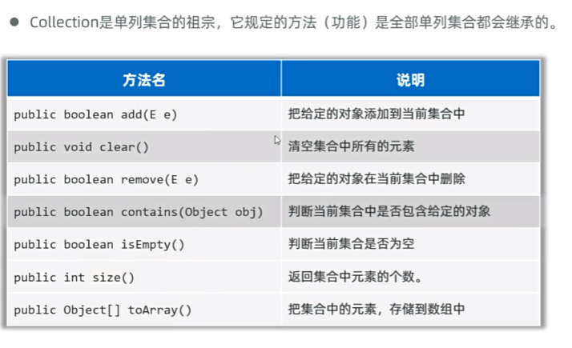

### 一、基础篇

#### java 注释

```java
// 单行注释

/*
   多行注释
*/

/**
  文档注释
*/
```

#### 输入输出

输入

```java
// 使用java提供的Scanner API 来获取用户键盘输入
import java.util.Scanner;

Scanner sc = new Scanner(System.in);

int age = sc.nextInt();
String name = sc.next();
```

输出

```java
System.out.println("xxx");
```


#### 逻辑运算符

| 符号 | 名称     | 例子             | 说明                                                   |
| ---- | -------- | ---------------- | ------------------------------------------------------ |
| &    | 逻辑与   | 2 > 1 & 3 > 2    | 多个条件必须都为True，结果才是True                     |
| \|   | 逻辑或   | 2 > 1 \| 3 < 5   | 多个条件中只要有一个是True，结果就是True               |
| !    | 逻辑非   | ! ( 2 > 1 )      | 取反                                                   |
| ^    | 逻辑异或 | 2 > 1 ^ 3 > 1    | 前后条件结果相同返回False，不同返回True                |
| &&   | 短路与   | 2 > 10 && 3 >  2 | 判断结果与& 一样，过程不同：左边为False，右边不执行    |
| \|\| | 短路或   | 2 > 1 \|\| 3 < 5 | 判断结果与 \| 一样， 过程不同：左边为True， 右边不执行 |


#### 数组

声明方式

```c
// c 语言
int num[2];
int num[1][2];
int num[2] = {1,2};
char mystring[6] = "hello";
```

```java
// java
int[] num = new int[2];
int[][] num = new int[1][2];
int[] num = {1,2};
String mystring = "hello"; // 在Java中，字符串是以 String 对象的形式存在的，而不是字符数组。

// 其实 java 中， 也可以把中括号[] 放到变量名后面，即 int num[] = new int[2];
```

数组大小

```c
// c 
int num[2];
numSize = sizeof(num) / sizeof(int);
```

```java
// java
int[] num = new int[2];
numSize = num.length; //在 java 中 数组是一个对象
```


#### 实体类 javabean

是一种特殊的类，需满足以下要求：

- 类中的成员变量全部私有，并提供public修饰的 `getter` 和 `setter` 方法
- 类中需要提供一个无参的构造器， 有参构造器可选。

```java
public class Student {
    // 私有成员变量
    private String name;
    private double chinese;
    private double math;
    
    // 必须提供无参构造器
    public Student() {}
    
    // 提供一个有参构造器（可选）
    public Student(String name,double chinese,double math){
        this.name = name;
        this.chinese = chinese;
        this.math = math;
    }
    
    // 提供公共的getter 和 setter方法
    public String getName(){
        return name;
    }
    public void setName(String name){
        this.name = name;
    }
    ...
}
```

实体类的基本作用：创建对象存取数据（封装数据）

一般实体类对象只负责数据存取，而对数据业务处理交给其他类的对象完成，以实现数据和数据业务处理相分离。


> [!NOTE]
>
> 每次手写 getter 与 setter 方法太过麻烦， 可以使用lombok 技术 实现为类自动添加 getter settter 方法， 无参构造器， toString方法等。
>
> 只需要在类上面添加`@Data` 注解 ，即可自动生成getter ，setter 方法，无参构造器，toString方法。
>
> ```java
> import lombok.Data;
> 
> @Data
> public class Card{
>     private String carId;
>     private String name;
>     private String phone;
> }
> ```
>
> 注意，需要去下载lombok ，直接 `Alt + <Enter>` 选中 `Add 'lombok' to classpath` 下载
>
> 如果需要 有参构造器 ，那么可以 添加 `@AllArgsConstructor` 注解， 添加所有参数构造器。
>
> 但是如果你一旦添加了`@AllArgsConstructor` 注解， 那么无参构造器就没了，你又得添加 `@NoArgsConstructor` 注解来添加无参构造器。
>
> ```java
> import lombok.Data;
> import lombok.AllArgsConstructor;
> import lombok.NoArgsConstructor;
> 
> @Data
> @NoArgsConstructor
> @AllArgsConstructor
> public class Card{
>     private String carId;
>     private String name;
>     private String phone;
> }
> ```
>
> 注意， 使用lombok 技术， 需要在IDEA中设置开启自动生成代码功能，即在设置中 搜索 `annotation processors` ，勾选 `Enable annotation processing`


#### static 修饰

类里面 static 修饰变量， 此变量叫 静态变量（类变量），该变量属于类本身，即各个类实例==共享==该变量

可以使用 `类名.静态变量名` 来访问。

同理，也可以使用static 来修饰成员方法

如果一个方法只是为了实现一个功能但不需要访问对象的数据，那么该方法定义为静态方法。

静态方法一般用于做工具类，工具类中的方法都是一些静态方法，每个方法完成一个功能，以便直接调用使用。

静态方法中==不可以出现 `this` 关键字==。


#### 类继承

c++ 的类继承 有 公有继承、私有继承和保护继承

但 java 的类继承只有公有继承

```c++
// c++
class Base {
    public:
    	int n1;
    protected:
    	int n2;
    private:
    	int n3;
};

class Derived : public Base {
  // 公有继承 可以访问 Base 的 public 和 protected 成员  
};
```

```java
// java
public class Base {
    public int n1;
    protected int n2;
    private int n3;
}

public class Derived extends Base {
    // 可以访问 Base 的 public 和 protected 成员  
}
```

另外，c++ 有多重继承， 而 java 没有。即不能继承多个父类，但可多层继承

java 所有的 类 都是 Object 类 的子类。

就近原则： 优先访问自己类中的方法， 自己类中没有才会去访问父类。


##### 方法重写

- 子类重写父类的方法时， 访问权限必须大于或等于父类方法的权限。（public > protected> 缺省）
- 重写的方法返回值类型，必须与被重写方法的返回值类型一样，或者范围更小。
- 私有方法，静态方法不能被重写。

方法重写常见应用场景：

- 子类重写Object类的toString() 方法，以便返回对象的内容。

  ```java
  // java
  
  class Student {
      private String name;
      private char sex;
      private int age;
      
      public Student(){}
      
      public String getName(){
          return name;
      }
      public void setName(String name){
          this.name = name;
      }
      
      public char getSex(){
          return sex;
      }
      public void setSex(cjar sex){
          this.sex = sex;
      }
      
      public String getAge(){
          return age;
      }
      public void setAge(int age){
          this.age = age;
      }
      
      // 重写 Object类的toString 方法
      
      @Override
      public String toString() {
          return "Student {name=" + name + ",sex=" + sex + ",age=" + age + "}";
      }
  }
  
  // 当打印类对象时，默认是调用类的toString方法。
  Student s = new Student(name="Mrhow",sex="男", age=24);
  System.out.println(s); // 此时打印函数打印的是 s 的toString方法返回的数据。
  ```


##### 子类构造器

子类先执行父类的构造器 ，后执行子类的构造器。

默认情况下，子类全部构造器第一行代码都是 super() （写不写都有），它会调用父类的无参构造器。

如果父类没有无参构造器， 则必须在子类构造器第一行手写super(...) 指定调用父类的有参构造器。

```java
// java
public class People{
    private String name;
    
    public People() {}
    public People(String name) { this.name = name; }
    
    public String getName() { return name; }
    public void setName(String name) { this.name = name; }
    
}

public Teacher extends People {
    private String skill;
    
    public Teacher(String name, String skill){
        super(name);
        this.skill = skill;
    }
    public String getSkill(){ return skill; }
    public void setSkill(String skill) { this.skill = skill; }
}

public class Test {
    public static void main(String[] args) {
        Teacher t = new Teacher("Mrhow","java");
        System.out.println(t.getName());
        System.out.println(t.getSkill());
    }
}
```

调用兄弟构造器

```java
// java
public class Student {
    private char sex;
    private int age;
    private String schoolName;
    
    public Student(){}
    
    public Student(String name, char sex){
        this(name,sex,"黑马程序员"); // this 调用兄弟构造器 ，即 下面 三个参数的构造器。
    }
    
    public Student(String name, char sex, String schoolName){
        this.name = name;
        this.sex = sex;
        this.schoolName = schoolName;
    }
}
```

注意 ， `super(...)` 或 ` this(...)` 必须写在构造器的第一行，而且==两者不能同时出现==


#### 多态

多态是 ==继承/实现== 情况下的一种现象， 表现为： 对象多态，行为多态。

例如

```java
public class Animal {
    String name = "Animal";
    public void run(){
        System.out.println("Animal running");
    }
}

public class Dog extends Animal{
    String name = "Dog";
    
    @Override
    public void run(){
        System.out.println("Dog running");
    }
}

public class Wolf extends Animal{
    String name = "Wolf";
    
    @Override
    public void run(){
        System.out.println("Wolf running");
    }
}

public class Test{
    public static void main(String[] args){
        Animal a1 = new Wolf();
        a1.run();
        System.out.println(a1.name);
        
        Animal a2 = new Dog();
        a2.run();
        System.out.println(a2.name);
    }
}
```

打印出来的内容：

```text
Wolf running
Animal
Dog running
Animal
```

多态性在Java中主要体现在方法的调用上，而不是字段的访问上。对于字段的访问，它是通过引用类型来确定的。当你通过父类的引用指向子类的对象，并调用一个被子类重写的方法时，会调用子类中的方法实现，这是多态性的表现。


多态的前提 ：有==继承/实现关系==，存在父类引用子类对象；==存在方法重写==。

多态的好处：1，解耦合；2，使用父类类型接收一切子类形参，扩展性强。

多态的缺点： 不能使用子类独有的方法。

多态类型强制转换

子类 变量名 = (子类) 父类变量

```java
People p1 = new Teacher();
Teacher p2 = (Teacher)p1;
```

注意，运行时，如果发现对象真实类型与强制转换后的类型不同，就会抛出==类型转换异常(ClassCastException)==的错误。

例如：

```java
People p1 = new Teacher();
Student p2 = (Student)p1; // 编译时不会报错，运行时报错
```

强转前： 使用 instanceof 关键字，判断当前对象的真实类型，再进行强转。

```java
if (p1 instanceof Student){
    Student p2 = (Student)p1;
}else if(p1 instanceof Teacher){
    Teacher p2 = (Teacher)p1;
}
```


### 二、高级篇

#### final 关键字

final 关键字 是最终的意思，可以修饰：类、方法、变量。

- 修饰类：该类被称为最终类，特点是不能被继承了

  ```java
  final class A{}
  ```

  使用场景：给工具类 修饰

- 修饰方法：该方法被称为最终方法，特点是不能被重写了

  ```java
  class B {
      public final void function(){}
  }
  ```

  使用场景：？？

- 修饰变量：该变量有且仅能被赋值一次。

  ```java
  public class C{
      public static final String schoolName = "黑马程序员";
      // final 修饰静态变量，该变量被称为常量，常量的命名建议全部大写，用下划线连接单词。
      private final String name = "xx";
      // final 修饰实例变量，一般没有意义
  }
  ```

final 注意事项：

- final修饰基本类型变量，变量存储的数据不能被改变
- final修饰引用类型变量，变量存储的地址不能被改变，但地址所指向对象的内容可以被改变


#### 单例类（设计模式）

单例类是软件设计模式，作用是：确保某个类只能创建一个对象

实现步骤：

- 把类的构造器私有
- 定义一个类变量记住类的一个对象
- 定义一个类方法，返回对象

```java
// 单例类
public class A{
    // 2. 定义一个静态变量记住本类的唯一一个对象
    private static A a = new A(); // 用private修饰是为防止a被修改，也可以使用final定义
    
    
    // 1. 私有构造器
    private A(){}
    
    // 3. 提供一个公开的静态方法，返回这个类的唯一对象
    public static A getObject(){
        return a;
    }
}
```

上面的写法是==饿汉式单例== ，即在获取类的对象时，对象早已经创建好了

还有一种是==懒汉式单例==，即在获取类对象时，才创建对象。

```java
public class B {
    // 2. 定义一个类变量用于存储对象
    private static B b; 
    
    // 1. 单例必须私有构造器
    private B() {}
    
    // 3. 提供一个类方法返回类的一个对象
    public static B getObject(){
        if (b == null){
            b = new B();
        }
        return b;
    }
}
```


#### 枚举类

写法：

修饰符 enum 枚举类名{

​	名称1, 名称2, 名称3 , ... ;

​	其他成员...

}

```java
public enum A{
    X, Y, Z;
    ...
}
```

特点：

- 枚举类第一行，只能写枚举类的对象名称，且用逗号隔开
- 这些名称，本质是常量，每个常量都记住了枚举类的一个对象

那么怎么确定这些名称，本质是常量，可以对编写的代码进行编译，然后进行反编译，查看真正的代码长什么样子。

> [!NOTE]
>
> 反编译手段：
>
> - IDEA 里面的 out 文件夹中，找到 类A 拖出来查看，但是IDEA 反编译能力比较弱
> - 使用Xjad-class 反编译工具，将编译后的 `A.class` 文件拖进去。
> - 在命令终端中，输入 ` javap .\A.class`  ，获取反编译后的代码

经过反编译得到

```java
public final class A extends java.lang.Enum<A> {
    public static final A X = new A();
    public static final A Y = new A();
    public static final A Z = new A();
    
    public static A[] values();
    public static A valueOf(java.lang.String);
}
```

- 枚举类都是最终类，不可以被继承，枚举类都是继承java.lang.Enum类的。
- 枚举类第一行只能罗列一些名称，这些名称都是常量，并且每个常量都会记住枚举类的一个对象。
- 枚举类的构造器都是私有的（写不写都只能是私有的），因此枚举类对外不能创建对象。

也就是说枚举类其实就是==多例模式==，那么单例模式也可以使用枚举类来实现，只需第一行声明一个常量。

相关方法

```java
public class Test{
    public static void main(String[] args){
        A a1 = A.X;
        A a2 = A.Y;
        System.out.println(a1.name()); // 打印 "X"
        System.out.println(a2.name()); // 打印 "Y"
        System.out.println(a2.ordinal()); // 打印出索引 0
        System.out.println(a2.ordinal()); // 打印出索引 1
    }
}
```

应用场景：

枚举类很适合做信息分类合标志


#### 抽象类

在java中有个关键字叫：`abstract`, 可以用它修饰类、成员方法

```java
// 抽象类
public abstract class A{
    // 抽象方法，只有方法签名，不能有方法体
    public abstract void test();
}
```

注意事项：

- 抽象类中不一定有抽象方法，==但有抽象方法的类必须是抽象类==
- 抽象类里面 成员变量、方法、构造器、抽象类都可以有。
- ==抽象类不能创建对象==，仅作为一种特殊的父类，让子类继承并实现
- 一个类继承抽象类，必须重写完抽象类的全部抽象方法，否则这个类也必须定义为抽象类。

使用抽象类是为了更好地支持多态

#### 模板方法（设计模式）

提供一个方法作为完成某类功能的模板，模板方法封装了每个实现步骤，但允许子类提供特定步骤的实现。

```java
public abstract class A{
    public final void modeFunction(){
        // 代码相同部分
        
        // 代码相异部分
        differentFunction();
        
        // 代码相同部分
    }
    
    public abstract void differentFunction();
}


public class B extends A {
    @Override
    public void differentFunction(){
        // B 类 重写 代码
    }
}
```


#### 接口

Java 提供关键字 `interface` 定义接口

JDK 8 之前的接口（传统接口）格式：

``` text
public interface 接口名{
	// 成员变量 （变量）
	// 成员方法 （抽象方法）
}
```

```java

public interface A {
    // JDK 8 之前，接口只能定义常量和抽象方法
    
    String SCHOOL_NAME = "黑马程序员";
    // 常量： 接口中定义常量可以省略public static final， 默认会加上去
    // public static final String SCHOOL_NAME = "黑马程序员";
    
    
    void run();
    // 抽象方法：接口中定义抽象方法可以省略public abstract， 默认会加上去
    // public abstract void run();
}
```

==接口也不能创建对象==， 跟抽象类很像， 抽象类是被类继承的，而接口是被类==实现 ( implements )==的

实现接口的类称为==实现类==，一个类可以同时实现多个接口

```java
修饰符 class 实现类类名 implements 接口1, 接口2, ... {
	// 实现类 实现多个接口，必须重写完 全部接口的 全部抽象方法， 否则实现类 需要定义成抽象类
}
```

接口的好处：

之前提到，java的类继承不能像c++那样可以多重继承，而是单继承。为了实现这样的效果，java使用多个接口来实现。

让程序可以面向接口编程，方便切换各种业务实现（利于程序的解耦合）

```java
interface Driver{}
interface BoyFriend{}

class People{}

class Student extents People implements Driver,BoyFriend{}

class Teacher extents People implements Driver,BoyFriend{}

public class Test {
    public static void main(String[] args){
        People p = new Student();
        Driver d = new Student(); // Driver d = new Teacher();
    }
}
```

例子：

```java
// 类 Student
import lombok.AllArgsConstructor;
import lombok.NoArgsConstructor;
import lombok.Data;

@Data
@NoArgsConstructor
@AllArgsConstructor
public class Student{
    private String name;
    private char sex;
    private double score;
}
```


```java
// 接口 ClassDataInter.java
public interface ClassDataInter {
    void printAllStudentInfos();
    void printAverageScore();
}
```


```java
// 实现类 方案一： 打印班级全部学生的信息，和全部学生平均分
// ClassDataInterImpl1.java

public class ClassDataInterImpl1 implements ClassDataInter{
    private Student[] students;
    public ClassDataInterImpl1(Student[] students){
        this.students = students;
    }
    @Override
    public void printAllStudentInfos(){
        System.out.println("全班学生信息如下：");
        for(int i = 0; i < students.length; i++){
            Student s = students[i];
            System.out.println(s.getName() + " " + s.getSex() + " " + s.getScore());
        }
    }
    
    @OVerride
    public void printAverageScore(){
        double sum = 0;
        for(int i = 0; i < students.length; i++){
            Student s = students[i];
            sum += s.getScore();
        }
        System.out.println("全班平均成绩为：" + sum / students.length);
    }
}
```


```java
// 实现类 方案二： 打印班级全部学生的信息，和全部学生平均分，男女人数
// ClassDataInterImpl2.java

public class ClassDataInterImpl2 implements ClassDataInter{
    private Student[] students;
    public ClassDataInterImpl1(Student[] students){
        this.students = students;
    }
    
    @Override
    public void printAllStudentInfos(){
        int maleCount = 0;
        System.out.println("全班学生信息如下：");
        for(int i = 0; i < students.length; i++){
            Student s = students[i];
            System.out.println(s.getName() + " " + s.getSex() + " " + s.getScore());
            if (s.getSex() == '男'){
                maleCount++;
            }
        }
        System.out.println("男学生人数：" + maleCount);
        System.out.println("女学生人数：" + (students.length - maleCount));
    }
    
    @OVerride
    public void printAverageScore(){
        double sum = 0;
        for(int i = 0; i < students.length; i++){
            Student s = students[i];
            sum += s.getScore();
        }
        System.out.println("全班平均成绩为：" + sum / students.length);
    }
}
```


```java
// main
public class Test{
    public static void main(String[] args){
        Student[] allStudents = new Student[10];
        // 准备学生数据进行测试
        ...
        
        ClassDataInter cdi = new ClassDataInterImpl1(allStudents);
        // 这样就可以解耦，想要实现不同的方案，只需修改成另一个接口实现类的的类名即可
        //ClassDataInter cdi = new ClassDataInterImpl2(allStudents)
        cdi.printAllStudentInfos();
        cdi.printAverageScore();
    }
}
```


从JDK 8开始，接口新增了三种方法：

```java
public interface A{
    /**
     * 1. 默认方法（实例方法）：必须使用 default 修饰， 默认会被加上 public修饰。
     * 注意： 只能使用接口的实现类对象调用
     */
    default void test1(){ ... }
    
     /**
     * 2. 私有方法，JDK 9 开始支持
     * 注意： 只能使用接口中的其他实例方法来调用
     */
    private void test2(){ ... }
    
    /**
     * 3. 类方法（静态方法）： 使用static修饰，默认会被加上public修饰
     * 注意： 只能用当前接口名调用，也就是说不能用 实现类 名来调用。
     */
    static void test3(){ ... }
}
```

提高了接口的扩展能力。因为这些方法不是抽象方法，那么实现类就不需要重写这些方法，方便为以后添加的新功能扩展。

注意事项：

- 接口与接口可以多继承，一个接口可以同时继承多个接口

  - 类与类： 单继承
  - 类与接口： 多实现
  - 接口与接口： 多继承

- 接口继承多个接口中， 如果多个接口中存在相同方法名，但返回类型不同，即方法签名冲突，则此时不支持多继承也不支持多实现

- 一个类继承了父类，又同时实现了接口，如果父类和接口中有同名的默认方法，实现类优先用父类的。

  ```java
  class A{
      public void show(){
          System.out.println("父类的show方法")
      }
  }
  
  interface B{
      default void show(){
          System.out.println("接口的show方法")
      }
  }
  
  class C extends A implements B {
      public void go(){
          show(); // 父类的
          super.show(); // 父类的
          B.super.show(); // 接口的
      }
  }
  ```

- 一个类实现了多个接口，如果多个接口中存在同名的默认方法，会冲突；这个类重写该方法即可解决冲突。

  ```java
  interface A{
      default void show(){
          System.out.println("接口A的show方法")
      }
  }
  interface B{
      default void show(){
          System.out.println("接口B的show方法")
      }
  }
  
  class C implements A,B {
      @Override
      public void show(){
          A.super.show(); // A的
          B.super.show(); // B的
          System.out.println("重写show方法")
      }
  }
  ```

  

抽象类与接口的区别：

相同点：

- 1、多是抽象形式，都可以有抽象方法，都不能创建对象。
- 2、都是派生子类形式：抽象类是被子类继承使用，接口是被实现类实现。
- 3、一个类继承抽象类，或者实现接口，都必须重写完他们的抽象方法，否则自已要成为抽象类或者报错！
- 4、都能支持的多态，都能够实现解耦合。

不同点：

- 1、抽象类中可以定文类的全部普通成员，接口只能定义常量，抽象方法（JDK8新增的三种方式）
- 2、抽象类只能被类单继承，接口可以被类多实现。
- 3、一个类继承抽象类就不能再继承其他类，一个类实现了接口（还可以继承其他类或者实现其他接口）。
- 4、抽象类体现模板思想：更利于做父类，实现代码的复用性。最佳实践
- 5、接口更适合做功能的解耦合：解耦合性更强更灵活。最佳实践


#### 代码块

代码块是类的五大成分之一（成员变量、构造器、方法、代码块、内部类）

代码块分两种：

- 静态代码块：

  - 格式：static{}
  - 特点：类加载时自动执行，由于类只会加载一次，所以静态代码块也只会执行一次。
  - 作用：完成类的初始化，例如：对静态变量的初始化赋值。

  ```java
  public class CodeDemo1 {
      public static String name; 
      
      static {
          System.out.println("静态代码块执行");
          name = "黑马程序员";
      }
      public static void main(String[] args){
          System.out.println("main方法执行");
      }
  }
  ```

- 实例代码块：

  - 格式：{}
  - 特点：每次创建对象时，执行实例代码块，并在构造器前执行
  - 作用：和构造器一样，都是用来完成对象的初始化的，例如对实例变量进行初始化

  ```java
  public class CodeDemo2 {
      public String name;
      
      {
          System.out.println("实例代码块执行");
          name = "黑马程序员";
      }
      public static void main(String[] args){
          System.out.println("main方法执行");
      }
  }
  ```

  

#### 内部类

分为四种：

- 成员内部类
- 静态内部类
- 局部内部类
- 匿名内部类

##### 成员内部类

就是类中普通的成员。

```java
public class Outer{
    public static String name = "黑马"; // 外部类的静态成员
    private int age; // 外部类的实例成员
    
    // 成员内部类，无static修饰，属于外部类的对象持有的
    public class Inner{
        public void show(){
            System.out.println("inner");
            System.out.println("访问外部类的静态成员：" + name);
            System.out.println("访问外部类的实例成员：" + age);
        }
    }
}

public class InnerClassDemo1 {
    public static void main(String[] args){
        // 外部类名称.内部类名称 对象名  = new 外部类名称().new 内部类名称();
       	Outer.Inner oi = new Outer().new Inner();
        oi.show();
        // 成员内部类访问外部类成员：
        // 1.成员内部类中可以直接访问外部类的静态成员,也可以直接访问外部类的实例成员
        // 2.成员内部类的实例方法中，可以直接拿到当前寄生的外部类对象： 外部类名.this
    }
}

class People {
    private int heartBeat = 100;
    public class Heart {
        private int hearBeat = 80;
        public void show(){
            int heartBeat = 200;
            System.out.println(heartBeat); // 200
            System.out.println(this.heartBeat); // 80
            System.out.println(People.this.heartBeat); // 100
        }
    }
}
```

##### 静态内部类

有static 修饰的内部类，属于外部类自己持有的

```java
public class Outer{
    // 静态内部类
    public static class Inner{
        public void show(){
            ...
        }
    }
}

public class InnerClassDemo2 {
    public static void main(String[] args){
        // 外部类名称.内部类名称 对象名  = new 外部类名称.内部类名称();
       	Outer.Inner oi = new Outer.Inner();
        oi.show();
        // 静态内部类中可以直接访问外部类的静态成员，但不可以方法实例成员
    }
}

```


##### 局部内部类

局部内部类是定义在方法中，代码块中，构造器等执行体中，了解即可


##### 匿名内部类

是一种特殊的局部内部类。

匿名是指程序员不需要为这个类声明名字，默认有个隐藏的名字。

 

特点： 匿名内部类本质就是一个子类，并会立即创建出一个子类对象。

作用： 用于更方便的创建子类对象，不需要单独定义一个子类继承父类，再创建一个子类对象。

例子：

多态的写法：

```java
public abstract class Animal{
    public abstract void cry();
}

class Cat extends Animal{
    @Override
    public void cry(){
        System.out.println("猫喵喵地叫")
    }
}

public class Test{
    public static void main(String[] args){
        Animal a = new Cat();
        a.cry();
    }
}
```

匿名内部类形式：

```java
public abstract class Animal{
    public abstract void cry();
}

public class Test{
    public static void main(String[] args){
        Animal a = new Animal(){
            @Override
            public void cry(){
                System.out.println("猫喵喵地叫")
            }
        };
        a.cry();
    }
}
```

匿名内部类实际上是有名字: `外部类名$编号.class`


常见使用形式

通常作为一个对象参数传递给方法使用

 


应用场景：

调用别人提供的方法实现需求时，这个方法正好可以让我们传输一个匿名内部类对象给其使用。

使用案例：

 


#### 函数式编程

##### Lambda 函数

使用Lambda 函数替代某些匿名内部类对象，从而让程序更简洁，可读性好。

格式:

```java
(被重写方法的形参列表) -> { 被重写方法的方法体代码 }
```

```java
// 函数式接口：有且仅有一个抽象方法的接口 @FunctionalInterface 是声明函数式接口的注解
@FunctionalInterface
interface Swim{
    void swimming();
}

public class Test{
    public static void main(String[] args){
        // 匿名内部类
        Swim s1 = new Swim(){
          @Override
          public void swimming(){
              System.out.println("学生游的贼快");
          }
        };
        s1.swimming();
        // 使用lambda 函数 ， 注意lambda 并不是可以简化全部匿名内部类，只能简化函数式接口的匿名内部类
        // 所谓 函数式接口： 有且仅有一个抽象方法的接口
        
        Swim s2 = () -> {System.out.println("学生游的贼快");};
        s2.swimming();
    }
}
```

==lambda 只能简化函数式接口的匿名内部类==

lambda 省略规则：

- 参数类型全部可以省略不写
- 如果只有一个参数，参数类型省略的同时， `()` 也可以省略， 但多个参数不能省略
- 如果Lambda 表达式中只有一行代码，大括号可以不写，同时要省略分号 `;`, 如果这行代码是return 语句，return也必须去掉


#### 方法引用

方法引用是进一步简化lambda。

分为：

- 静态方法引用
- 实例方法引用
- 特定类型方法引用
- 构造器引用

##### 静态方法引用

语法： `类名::静态方法`

使用场景： 如果某个Lambda表达式里只是调用一个静态方法，并且`->` 前后参数的形式一致，就可以使用静态方法引用。

```java
// Student.java

@Data
@@Data
@NoArgsConstructor
@AllArgsConstructor
public class Student{
    private String name;
    private char sex;
    private double score;
    private int age;
    
    public static int compareByAge(Student o1,Student o2){
        return o1.getAge() - o2.getAge();
    }
}
```


```java
// Demo.java

public class Demo {
    static void main(String[] args){
        Student [] students = new Student[6];
        ....
        
        // 匿名内部类
        Arrays.sort(students, new Comparator<Student>() {
            @Override
            public int compare(Student o1,Student o2){
                return o1.getAge() - o2.getAge();
            }
        });
        
        // lambda表达式
        Arrays.sort(students, (Student o1,Student o2) -> {
              return o1.getAge() - o2.getAge();
          });
        // lambda 简化
        Arrays.sort(students, (o1, o2) -> o1.getAge() - o2.getAge());
        
        // 静态方法引用
        Arrays.sort(students, (o1, o2) -> Student.compareByAge(o1, o2));
        //  如果某个Lambda表达式里只是调用一个静态方法，并且`->` 前后参数的形式一致，就可以使用静态方法引用。
        Arrays.sort(students, Student::compareByAge);
            
    }
}
```


##### 实例方法引用

语法：` 对象名:: 实例方法`

使用场景：如果某个Lambda表达式里只是通过对象名调用一个实例方法，并且`->` 前后参数形式一致，就可以使用实例方法引用。

```java
// Student.java

@Data
@@Data
@NoArgsConstructor
@AllArgsConstructor
public class Student{
    private String name;
    private char sex;
    private double score;
    private int age;
    
    // 实例方法
    public int compareByHeight(Student o1,Student o2){ 
        return Double.compare(o1.getHeight(),o2.getHeight());
    }
}
```


```java
// Demo.java

public class Demo{
    public static void main(String[] args){
        Student[] students = new Student[6];
        ...
        Student t = new Student();
        // lambda 
        Arrays.sort(students, (o1, o2) -> t.compareByHeight(o1,o2));
        // 实例方法引用
        Arrays.sort(students, t::compareByHeight);
    }
}
```


##### 特定类型方法引用

语法：`特定类型的名称::方法名`

使用场景：如果某个Lambda表达式里只是调用一个特定类型的实例方法，并且前面参数列表中的第一个参数是作为方法的主调，后面的所有参数都是作为该实例方法的入参的，则此时就可以使用特定类型的方法引用。

```java
public class Demo{
    public static void main(String[] args){
        String[] names = {"Tom","Jerry","Bodi","Mike","angela","Andy"};
        // 使用匿名内部类
        Arrays.sort(names, new Comparator<String>(){
           @Override
           public int compare(String o1,String o2){
               return o1.compareToIgnoreCase(o2); // 字符串首字母忽略大小写比较
           }
        });
        
        // lambda
        Arrays.sort(names, (o1, o2) -> o1.compareToIgnoreCase(o2));
        
        // 特定类型方法引用，o1.compareToIgnoreCase() 是字符串的实例方法， 字符串string是java的特定类型。
        Arrays.sort(names, String::CompareToIgnoreCase);
    }
}
```

##### 构造器引用

语法：`类名::new`

使用场景：如果某个Lambda表达式里只是在创建对象，并且 `->`前后参数情况一致，就可以使用构造器引用

```java
// Demo.java
@Data
@AllArgsConstructor
@NoArgsConstructor
class Car{
    private String name;
}

interface CarFactory {
    Car getCar(String name); // 根据名称创造汽车
}

public class Demo{
    public static void main(String[] args){
        // 创建接口的匿名内部类对象
        CarFactory cf = new CarFactory(){
            @Override
            public Car getCar(String name){
                return new Car(name);
            }
        };
        
        Car c1 = cf.getCar("奔驰");
        
        // lambda 
        CarFactory cf = name -> new Car(name);
        //构造器引用
        CarFactory cf = Car::new;
    }
}
```


#### 常用API

##### String

只要是以 `String s1 = "xxx"` 写出的字符串对象，会存储到字符串常量池，且相同内容的字符串只存储一份

通过 new方式 `String s1 = new String("xxx")` 创建的字符串对象，每new一次都会产生一个新的对象存放到堆内存中。

 

##### ArrayList

 


### 三、终极篇

#### 异常

```java
public class ExceptionDemo{
    
    public static void main(String[] args){
        try {
    		show();
        } catch (Exception e){
            e.printStackTrace(); // 打印异常信息
        }
    }
    
    public static void show() throws Exception {
        ...
    }
}

```

在方法上使用 `throws` 关键字，可以将方法内部出现的异常抛出去给调用者处理

主动抛出异常

```java
public static int div(int a, int b) throws Exception {
    if (b == 0){
		throw new Exception("除数不能为0");
    }
    int result = a / b;
    return result;
}
```

##### 自定义编译时异常

```java
/**
* 1. 继承Exception
* 2. 重写Exception构造器
* 3. throw 
*/

public class ItheimaAgeIllegalException extends Exception{
    public ItheimaAgeIllegalException(){
        
    }
    public ItheimaAgeIllegalException(String message){
        super(message);
    }
}
```

```java
public class ExceptionDemo{
    public static void main(String[] args){
        try{
            saveAge(300);
        } catch (ItheimaAgeIllegalException e){
            e.printStackTrace();
        }
        
    }
    
    public static void saveAge(int age) throws ItheimaAgeIllegalException {
        if (age < 1 || age > 200){
            throw new ItheimaAgeIllegalException("年龄非法")
        }else {
            ...
        }
    }
}
```

##### 自定义运行时异常

```java
/**
* 定义一个异常类继承 RuntimeException
* 重写构造器
* 通过 throw new 异常类(xxx) 来创建异常对象并返回
*/
public class ItheimaAgeIllegalRuntimeException extends RuntimeException{
    public ItheimaAgeIllegalRuntimeException(){}
    public ItheimaAgeIllegalRuntimeException(String message){
        super(message);
    }
}

```

```java
public class ExceptionDemo{
    public static void main(String[] args){
        try{
            saveAge(300);
        } catch (Exception e){
            e.printStackTrace();
        }
        
    }
    
    public static void saveAge(int age) {
        if (age < 1 || age > 200){
            throw new ItheimaAgeIllegalRuntimeException("年龄非法")
        }else {
            ...
        }
    }
}
```

一般使用运行时异常

##### 异常处理方案

方案一： 底层异常层层往上抛，最外层捕获异常，记录异常信息，并响应适合用户观看的信息提示

方案二： 最外层捕获异常后，尝试重新修复


#### 泛型

##### 泛型类

```text
修饰符 class 类名<类型变量, 类型变量, ...>{
	...
}
```

类型变量建议使用大写英文字母，常用的有：E、T、K、V 等

```java
public class A<E>{
    public E function(E e){
        return e;
    }
}


A<String> a = new A<String>();
// 这样将所有E替换为String类型
```


##### 泛型接口

```java
修饰符 interface 接口名<类型变量, 类型变量, ...>{
	...
}
```

```java
public interface A<T> {
    void add(T t);
    void delete(T t);
}

public class B implements A<Student>{
    @Override
    public void add(Student s){
        ...
    }
    
    @Override
    public void delete(Student s){
        ...
    }
}
```

##### 泛型方法

```java
修饰符 <类型变量,类型变量,...> 返回值类型 方法名(形参列表){
    ...
}
```

```java
public static <T> void test(T t){
    // 泛型方法
}
public static <T> T test1(T t){
    return t;
}
```

通配符 `?` ， 可以在使用泛型的时候代表 一切 类型；

E T K V 是 在定义泛型的时候使用

```java
ArrayList<xiaomi> xiaomis = new ArrayList<>();
xiaomis.add(new Xiaomi());
xiaomis.add(new Xiaomi());
xiaomis.add(new Xiaomi());
go(xiaomis);

ArrayList<BYD> byds = new ArrayList<>();
byds.add(new BYD());
byds.add(new BYD());
byds.add(new BYD());
go(byds);

public static void go(ArrayList<?> cars){
    ...
}

```

泛型上下限:

- 泛型上限:  `? extends Car` 表示? 能接收的必须是Car或者其子类
- 泛型下限: `? super Car` 表示 ? 能接收的必须是Car或者其父类.


##### 泛型支持的类型

泛型和集合是不支持基本数据类型, 只能支持对象类型(引用数据类型)

包装类: 包装类就是把基本类型的数据包装成对象的类型.

 

```java
// 手工包装
// 把基本数据类型变成包装类对象
Integer it1 = Integer.valueof(100);


// 自动包装
// 自动装箱, 基本数据类型的数据可以直接变成包装对象的数据,不需要额外做任何事情
Integer it2 = 100;

// 自动拆箱,把包装类对象直接给基本类型的数据
int i = it2;

ArrayList<Integer> list = new ArrayList<>();
list.add(123); // 自动装箱, 此时123是一个对象进去.
int i = list.get(123); // 自动拆箱, 其实返回的是包装类对象
```

> [!NOTE]
>
> 包装类的其他功能:
>
> - 可以把基本类型的数据转换为字符串类型
>
>   ```java
>   int j = 23;
>   String rs1 = Integer.toString(j); // "23"
>   
>   int j = 23;
>   Integer i = j;
>   String rs2 = i.toString();
>   
>   int j = 23;
>   String rs3 = j + "";
>   ```
>
> - 把字符串数值转换成对应的基本数据类型
>
>   ```java
>   String str = "98";
>   int i1 = Integer.parseInt(str);
>   int i2 = Integer.valueOf(str);
>             
>   String str = "98.8";
>   double d1 = Double.parseDouble(str);
>   double d2 = Double.valueOf(str);
>   ```


#### 集合

集合是一种容器,用于装数据,类似于数组,但集合大小可变.

分为:

- List
- ArrayList
- LinkedList
- Collection
- Set
- HashSet
- LinkedHashSet
- TreeSet
- Map
- HashMap
- TreeMap
- LinedHashMap

集合大致分为两大类, 一类是 `Collection` 一类是 `Map`

Collection 是单列集合, 每个元素(数据) 只包含一个值

Map 是双列集合, 每个元素包含两个值.(键值对)


##### Collection 集合

集合体系

 

collection 方法

 

```java
public class CollectionDemo {
    public static void main(String[] args){
        Collection<String> list = new ArrayList<>();
        // 添加元素
        list.add("张三");
        // 获取集合元素个数
        System.out.println(list.size());
        // 删除集合元素
        list.remove("张三");
        // 判断集合是否为空
        System.out.println(list.isEmpty());
        // 清空集合
        list.clear();
        // 判断集合中是否存在某个数据
        System.out.println(list.contains("张三"));
        // 把集合转换为数组
        Object[] arr = list.toArray();
        System.out.println(Arrays.toString(arr));
        
        String[] arr2 = list.toArray(String[]::new);
    }
}
```


##### collection 遍历方式

迭代器 (Iterator) 遍历: 迭代器是用来遍历集合的专用方式(数组没有迭代器) 

```java
public class CollectionTraversalDemo {
    public static void main(String[] args){
        Collection<String> names = new ArrayList<>();
        
        // 1. 获取这个集合的迭代器对象
        Interator<String> it = names.iterator();
        String rs = it.next();
        // 2. 使用循环遍历
        while (it.hasNext()){ // hasNext 是判断当前有没有数据
            String name = it.next();
        	System.out.println(name);
        }
    }
}
```

增强for循环

增强for循环可以遍历集合或者数组

```java
for (元素的数据类型 变量名 : 数组或者集合){
    
}
```

增强for循环遍历集合,本质是迭代器遍历集合的简化写法

`数组.for` 回车就可以快速生成代码结构

```java
String[] users = {"张无忌","玄冥二老","宋青书"};
for (String user : users) {
    System.out.println(user);
}
```


Lambda表达式遍历集合

使用Collection 的 如下方法完成

```java
default void forEach(Consumer< ? super T> action)
```

```java
Collection<String> names = new ArrayList<>();

names.forEach(new Consumer<String>(){
   @Override
    public void accept(String s){
        System.out.println(s);
    }
});

// lambda
names.forEach(System.out::println);

```


认识并发修改异常问题：遍历集合的同时又存在增删集合元素的行为时可能出现业务异常，这种现象被称之为并发修改异常问题。


对于迭代器遍历，遍历集合的同时又存在增删集合元素的行为时，会报异常，因为迭代器在遍历的过程中

会有检查集合是否有修改的方法。

解决方法是，使用迭代器的增删 方法来增删元素。迭代器会自动记录索引。


增强for 与 lambda 遍历都没法解决并发修改异常， 结论是增强for 与 lambda 遍历只适合做遍历，不适合做遍历并修改。


##### List 集合

List 集合的特点是： 有序， 可重复， 有索引

- ArrayList :  有序， 可重复， 有索引
- LinkedList:  有序， 可重复， 有索引

ArrayList 与 LinkedList 是List 的实现类，它们底层实现不同，适合场景也不同。


List 相关的方法：

 

```java
public class ListDemo{
    public static void main(String[] args){
        List<String> names = new ArrayList<>();
        
        // 插入元素
        names.add(0,"赵敏");
        // 删除元素
        names.remove(0);
        ...
    }
}
```

List 集合支持的遍历方式：

- for 循环 （因为List集合有索引）
- 迭代器
- 增强for循环
- Lambda 表达式


ArrayList

ArrayList 底层是基于数组存储数据的

- 查询速度快。（因为是根据数组索引查询快，复杂度是O(1))
- 增删数据效率低（第一次添加数据，数组扩容到10，后面再加元素则扩容到旧容量的1.5倍）


LinkedList

LinkedList 底层是基于双链表存储数据的

查询速度慢，增删相对较快， 但对首位元素进行增删改查的速度极快。因此LinkedList 新增了很多首尾操作的特有方法。

 

LinkedList 应用场景：

- 设计队列，队列只是首尾增删元素
- 设计栈， 栈只是在首部增删元素


##### Set 集合

Set系列集合特点：无序：添加数据的顺序和获取出的数据顺序不一致；不重复；无索引；

- HashSet：无序、不重复、无索引。
- LinkedHashSet：有序、不重复、无索引。
- TreeSet：排序、不重复、无索引。

Set 集合 常用方法 基本就是 Collection 父接口 提供的， 几乎没有额外新增一些独有的常用方法


##### HashSet 

java中每个对象都有一个哈希值， 可以调用 Object 类 提供的 `hashCode` 方法，返回该对象自己的哈希值。

对象哈希值特点：

- 同一个对象多次调用 `hashCode` 方法返回的哈希值是相同的
- 不同的对象，它们的哈希值大概率不相等，但也有可能会相等（哈希碰撞）。


HashSet 是基于哈希表存储数据的。 在 JDK8 之前， 哈希表 = 数组 + 链表； 在JDK 8 开始 哈希表 = 数组 + 链表 + 红黑树组成。


在 JDK8 之前， 哈希表 = 数组 + 链表：

 

JDK 8  开始，当链表长度超过 8 ，且数组长度 >= 64 时，自动将链表转成 红黑树。

自定义 HashSet 集合去重 操作

- 定义学生类，创建HashSet集合对象，创建学生对象
- 把学生添加到集合
- 在学生类中重写两个方法，hashCode() 和 equals() ，自动生成即可。


##### LinkedHashSet

它依然是基于哈希表（数组，链表，红黑树）实现的

但是，它的每个元素都额外的多一个双链表机制记录它前后元素的位置。

 


##### TreeSet

底层是基于红黑树实现的排序。

注意：

- 对于数值类型：Integer，Double，默认按照数值本身的大小进行升序排序。
- 对于字符串类型：默认按照首字符的编号升序排序。
- 对于自定义类型如Student对象，TreeSet默认是无法直接排序的。

对于自定义类型如Student对象，TreeSet默认是无法直接排序的。 解决方案：

方案一：对象类 实现一个Comparable比较接口，重写compare方法，指定大小比较规则。

方案二：public TreeSet集合自带比较器Comparator对象，指定比较规则


方案一：

```java

@Data
@NoArgsConstructor
@AllArgsConstructor
public class Teacher implements Comparable<Teacher>{
    private String name;
    private int age;
    private double salary;
    
    
    // t2.compareTo(t1)
    // t2 == this, t1 == o
    // 如果左边大于右边 返回正整数，左边小于右边，返回负整数，相同返回0
    @Override
    public int compareTo(Teacher o){
        return this.getAge() - o.getAge(); // 升序
    }
}


public class SetDemo{
    public static void main(String[] args){
        Set<Teacher> teachers = new TreeSet<>();
        
    }
}
```

方案二：

```java
@Data
@NoArgsConstructor
@AllArgsConstructor
public class Teacher implements Comparable<Teacher>{
    private String name;
    private int age;
    private double salary;
    
}


public class SetDemo{
    public static void main(String[] args){
        Set<Teacher> teachers = new TreeSet<>( new Comparator<Teacher>(){
            @Override
            public int compare(Teacher o1,Teacher o2) {
                return o2.getAge() - o1.getAge(); // 降序
            }
        });
        
         Set<Teacher> teachers = new TreeSet<>((o1, o2) -> o2.getAge() - o1.getAge());
    }
}
```


##### Map 集合

  

Map / HashMap 特点

- 无序，不重复，无索引
- 键值对都可以为null

LinkedHashMap 特点

- 有序，不重复，无索引
- 键值对都可以为null

TreeMap 特点：

- 按照键可排序，不重复，无索引


Map 常用方法：

 


Map 遍历方式

- 键找值 先获取Map集合全部的键，再通过遍历键来找值。

  ` public Set<K> keySet() 获取所有键的集合`

  `public V get(Object key) 根据键获取对应的值`

  ```java
  public class MapTraverseDemo{
      public static void main(String[] args){
          Map<String,Integer> map = new HashMap<>();
          
          Set<String> keys = map.keySet();
          
          for (String key: keys){
              Integer value = map.get(key);
              ...
          }
      }
  }
  ```

- 键值对 把键值对看成一个整体进行遍历

  Map 提供了一个方法 `Set<Map.Entry<K,V>> entrySet()` 用于获取所有“键值对”的对象。

  ```java
  public class MapTraverseDemo{
      public static void main(String[] args){
          Map<String,Integer> map = new HashMap<>();
          
          Set< Map.Entry<String,Double> entries = map.entrySet();
          
          for (Map.Entry<String,Double> entry : entries) {
              String key = entry.getKey();
              double value = entry.getValue();
          }
       
      }
  }
  ```

- Lambda 遍历

  需要Map 提供的方法：`default void forEach(BiConsumer<? super K,? super V> action)`

  ```java
  public class MapTraverseDemo{
      public static void main(String[] args){
          Map<String,Integer> map = new HashMap<>();
          
          map.forEach(new BiConsumer<String,Integer>(){
             @Override
              public void accept(String s,Integer integer){
                  System.out.println(s + "=" + integer);
              }
          });
          
          // lambda 简化
          map.forEach((k,v) -> System.out.println(k + "=" + v));
       
      }
  }
  ```


HashMap 集合

实际上HashSet 集合底层 是使用 HashMap集合，只是不需要value这个值，只需要 key。

```java
// HashSet 源码
...
// HashSet 构造器
public HashSet() {
    map = new HashMap<>();
}
```

那也就是HashMap跟HashSet底层原理一模一样，都是基于哈希表实现。


LinkedHashMay 集合

它的底层原理就是 LinkedHashSet 集合的底层原理.


#### Stream 流

Stream 流 是 JDK8 开始 新增的 一系列API, 可以用于操作集合 或 数组的数据

Stream 流 大量结合 Lambda 语法风格 编程.

Stram 流是一个接口

```java
public class StreamDemo{
    public static void main(String[] args){
        List<String> list = new ArrayList<>();
        ...
        // 需求: 找出姓张的人, 名字为3个字符,存入到新集合中去

        // 1. 传统方法
        List<String> newList = new ArrayList<>();
        for (String name: list){
            if (name.startsWith("张") && name.length() == 3){
                newList.add(name);
            }
        }
        
        // 2. 使用Stream流方法
        List<String> newList1 = list.stream().filter(s -> s.startsWith("张")).filter(s -> s.length() == 3 ).collect(Collectors.toList());
        
    }
}
```

 

##### 获取Steam流

获取集合的Stream流

```java
// 集合封装好了 Stream 流
// 获取集合的Stream流  Collection 提供的如下方法 获取当前集合对象的Stream 流 实现类对象
default Stream<E> stream();

// 获取数组的Stream 流, Arrays类提供了如下静态方法,获取当前数组的Stream流
public static <T> Stream<T> stream(T[] array);

// 使用Stream类提供的如下方法,获取当前接收数据的Stream 流.
public static<T> Stream<T> of(T...Values);

```

```java
public class StreamDemo{
    public static void main(String[] args){
        // 获取集合的Stream流
        Collection<String> list = new ArrayList<>();
        Stream<String> s1 = list.stream();
        
        // Map  集合
        Map<String,Integer> map = new HashMap<>();
        // 不能 map.stream();只能拆开来,获取键流,值流
        // 获取键流
        Stream<String> s2 = map.keySet().stream();
        // 获取值流
        Stream<String> s3 = map.values().stream();
        // 获取键值对流
        Stream<Map.Entry<String,Integer>> s4 = map.entrySet().stream();
        
        //  获取数组的Stream 流
        
        String[] names = {"a","b","c"};
        Stream<String> s5 = Arrays.stream(names);
        
        //  使用Stream类提供的方法
        Stream<String> s6 = Stream.of(names)
    }
}
```


##### Stream 流 常用中间方法

 

```java
public class StreamDemo{
    public static void main(String[] args){
        List<String> list = new ArrayList<>();
        
        // 过滤方法
        list.stream().filter(s -> s.startsWith("张") && s.length() == 3).forEach(System.out::println);
        
        // 排序方法
        List<Double> scores = new ArrayList<>();
        scores.stream().sorted().forEach(System.out::println); // 默认是升序
        
        scores.stream().sorted((s1,s2) -> Double.compare(s2,s1)).forEach(System.out::println); // 降序
        // limit
        scores.stream().sorted((s1,s2) -> Double.compare(s2,s1)).limit(2).forEach(System.out::println); // 降序后只需前2名
        // skip
        scores.stream().sorted((s1,s2) -> Double.compare(s2,s1)).skip(2).forEach(System.out::println); // 降序后跳过前2名           // 去重
        scores.stream().sorted((s1,s2) -> Double.compare(s2,s1)).distinct().forEach(System.out::println);
        // 如果希望自定义对象能够去重，要重写对象的hashCode和equals的方法。才可以去重
        
        // 映射/加工方法， 把流上原来的数据取出来，变成新数据在放回去。
        scores.stream().map(s -> "加10分后：" + (s + 10)).forEach(System.ou::println);
        
        // 合并流
        Stream<String> s1 = Stream.of("张三丰","张无忌","张学友");
        Stream<Integer> s2 = Stream.of(11,22,33);
        
        Stream<Object> s3 = Stream.concat(s1,s2);
        
    }
}
```


##### Steam 流 终结方法

终结方法是指调用完后，不会返回新的Stream流了，没法继续使用流。


```java
public class StreamDemo{
    public static void main(String[] args){
        List<Teacher> teachers = new ArrayList<>();
        ...
        
        // forEach
        teachers.stream().filter(t -> t.getSalary() > 150000).forEach(System.out::println);
        
        // count
        long count = teachers.stream().filter(t-> t.getSalary() > 150000).count();
        
        // max
        Optional<Teacher> max = teachers.stream().max((t1,t2) -> Double.compare(t1.getSalary(),t2.getSalary()));
        Teacher maxTeacher = max.get();
        
        // 同理 min
        
    }
}
```

##### 收集Stream 流

将Stream 流操作后的结果 转回到 集合 或者 数组中去。

 

```java
public class StreamDemo{
    public static void main(String[] args){
        List<String> list = new ArrayList<>();
        ...
            
        Stream<String> s1 = list.stream().filter(s -> s.startsWith("张"));
        // 收集到List集合中
        List<String> list1 = s1.collect(Collectors.toList());
        
        // 收集到Set集合中
        Set<String> set1 = s1.collect(Collectors.toSet());
        
        // 收集到数组中
        Object[] array = s1.toArray();
        
        // 收集到Map集合
        Map<String,Double> map = teachers.stream().collect(Collectors.toMap(Teacher::getName,Teacher::getSalary));
    }
}
```


#### File

File是java.io 包 下的类， File 类的对象是用于代表当前操作系统的文件（可以是文件，文件夹）

==File类只能对文件本身进行操作，不能读写文件里面存储的数据==

 

File常用方法

 

```java
public class FileDemo{
    public static void main(String[] args){
        // 也可以使用相对路径，相对于java工程目录下。
        File f1 = new File("E:/resource/img.jpg");
        System.out.println(f1.length()); // 字节个数
        
        // 创建对象代表不存在的文件路径
        File f2 = new File("./test.txt");
        f2.createNewFile(); // 把这个文件创建出来
        
        // 创建对象代表不存在的文件夹路径
        File f3 = new File("./test");
        f3.mkdir(); // mkdir 只能创建一级文件夹
        f3.mkdirs(); // mkdirs 可以创建多级文件夹
        
        // 删除文件
        File f4 = new File("./test.txt");
        f4.delete(); // delete 如果删除文件夹，那只能删除空的文件夹。想删除非空文件夹，只能递归删除里面的文件，然后删除文件夹
        
        // 获取当前目录下的一级文件名称
        File f5 = new File("./test");
        String[] names = f5.list();
        
        // 获取当前目录下的一级文件对象
        File[] files = f5.listFiles();
        for (File file : files){
            System.out.println(file.getAbsoluteFile()); // 获取绝对路径
        }
        
    }
}
```

 


#### IO 流

##### 字节流

文件字节输入流 (FileInputStream) : 以内存为基准， 可以把磁盘文件中的数据以字节的形式读到内存中去。


```java
public class FileInputStreamDemo {
    public static void main(String[] args) throws Exception {
        InputStream fileIn = new FileInputStream("./test.txt");
        byte[] buffer = new byte[3];
        int len;
        while ((len = fileIn.read(buffer)) ! = -1) {
            String str = new String(buffer);
            System.out.print(str);
        }
    }
}
```

文件字节输出流 (FileOutputStream) : 以内存为基准，把内存中的数据以字节的形式写到文件中去。

```java
OutputStream os = new FileOutputStream("./test.txt");
os.write(97); // 写入一个字节数据
os.write("b"); // 写入一个字符数据

byte[] bytes = "你好".getBytes();
os.write(bytes); // 写入一个字节数组进去

os.close(); // 用完需要关闭。
```


##### 字符流

文件字符输入流 

文件字符输出流

 

 


##### 缓冲流

 

缓存字节输入流

 

```java
InputStream fis = new FileInputStream(srcPath);
InputStream bis = new BufferedInputStream(fis);

OutputStream fos = new FileOutputStream(destPath);
OutputStream bos = new BufferedOutputStream(fos);
```

缓冲字符输入流

 

```java
Reader fr = new FileReader("./test.txt");
BufferedReader br = new BufferedReader(fr);
String line;
while ((line = br.readLine()) != null){
    System.out.println(line);
}

```


##### 其他流

字符输入转换流 (InputStreamReader) : 解决不同编码时，字符流读取文本内容乱码问题。

 

```java
InputStream is = new FileInputStream("./test.txt");
Reader isr = new InputStreamReader(is,"GBK");
BufferedReader br = new BufferedReader(isr);
```


打印流 (PrintStream / PrintWriter) ：打印流可以实现更方便、更高效的打印数据，实现打印啥出去就是啥出去。

 

```java
public static void main(String[] args){
    try(
    	// PrintStream ps = new PrintStream("./test.txt"); // 字节流
       	// PrintWriter ps = new PrintWriter("./test.txt"); // 字符流
        PrintStream ps = new PrintStream(new FileOutputStream("./test.txt",true)); // 追加模式
    ){
        ps.println(97);
        ps.println('a');
        ps.println(true);
       
    }catch (Exception e){
        e.printstactTrace();
    }
}
```


特殊数据流

DataInputStream (数据输出流) 允许把数据和其类型一并写出去

 

```java
public static void main(String[] args){
    try(
    	DataOutputStream dos = new DataOutputStream(new FileOutputStream("./test.txt"));
    ){
        dos.writeByte(34);
        dos.writeUTF("你好");
        dos.writeInt(123);
        dos.writeDouble(9.9);
    }catch  (Exception e){
        e.printStackTrace();
    }
}
```

DataInputStream 特殊数据输入流

```java
public static void main(String[] args){
    try(
    	DataInputStream dos = new DataInputStream(new FileInputStream("./test.txt"));
    ){
        System.out.println(dos.readByte());
        System.out.println(dos.readUTF());
        System.out.println(dos.readInt());
        System.out.println(dos.readDouble());
    }catch  (Exception e){
        e.printStackTrace();
    }
}
```


##### IO 框架

封装好了java对文件，数据进行操作的代码框架

导入IO框架 ： commons-io-2.16.1.jar

- 在项目中创建一个文件夹：lib
- 将commons-io-2.16.jar 文件复制到lib文件中。
- 在jar文件右键，选中 Add as Library
- 在类中导包使用

 

 ```java
 import org.apache.commons.io.FileUtils;
 
 public class CommonsIoDemo{
     public static void main(String[] args){
         FileUtils.copyFile(new File("./src.txt"),new File("./dest.txt"));
     }
 }
 ```


#### 多线程

##### 创建多线程

- #### 继承Thread类

  ```java
  class MyThread extends Thread {
      // 重写Thread 类的run方法
      @Override
      public void run(){
          // 在run 方法编写线程的任务代码
          ...
      }
  }
  public class Test{
      // main方法本身是由一条主线程负责执行
      public static void main(String[] args){
          Thread t1 = new MyThread();
          t1.start();
      }
  }
  
  ```

  优点: 编码简单

  缺点: 线程类已经继承了Thread,无法继承其他类,不利于功能扩展.

  注意事项:

  - 直接调用run方法会被当成普通方法执行,也就是还是单线程执行

  - 只有调用strat方法才是启动一个新的线程执行.

    

- #### 实现Runnable接口的类

  ```java
  class MyRunnable implements Runnable {
      // 重写run方法， 设置线程任务
      @Override
      public void run(){
          // 在run 方法编写线程的任务代码
          ...
      }
  }
  
  public class Test{
     
      public static void main(String[] args){
          Runnable r = new MyRunnable();
          Thread t = new Thread(r);
          t.start();
      }
  }
  ```

  优点: 任务类只是实现接口，可以继续继承其他类，实现其他接口，扩展性强

  缺点: 需要多一个Runnable对象。如果线程有执行结果是不能直接返回的。

   

  匿名内部类的写法：

  - 可以创建Runnable 匿名内部类对象
  - 再交给Thread线程对象
  - 调用线程对象的start() 启动线程

  

- #### 实现Callable接口，FutureTask类

  前两种创建线程的方式都存在一个问题：假如线程执行完毕后有一些数据需要返回，它们重写的run方法均不能直接返回结果。

  而使用 Callable 接口 和 FutureTask 类可以解决上述问题。

  - 创建任务对象

    定义一个类 实现Callable接口， 重写 call方法， 封装 线程任务代码和要返回的数据

    把Callable 类型对象封装成 FutureTask对象 (线程任务对象)

  - 把线程任务对象交给Thread 对象。

  - 调用Thread对象的start 方法启动线程

  - 线程执行完毕后，通过FutureTask对象的get方法获取线程任务执行完毕后的结果。

  ```java
  class MyCallable implements Callable<String> {
      public String call() throws Exception {
          // 编写线程的任务代码
          return "子线程执行完毕，返回数据";
      }
  }
  public class Test{
     
      public static void main(String[] args){
          Callable<String> c1 = new MyCallable();
          FutureTask<String> f1 = new FutureTask<>(c1);
          Thread t1 = new Thread(f1);
          t1.start();
          
          try {
              // 如果主线程执行到此处， 发现子线程还未执行完毕，会让出cpu，等待子线程执行完返回数据。
              System.out.println(f1.get());
          } catch (Exception e){
              e.printStackTrace();
          }
      }
  }
  ```

  

##### 线程的常用方法

 


##### 线程同步

线程安全问题 即多个线程竞争同一个共享资源的问题

线程同步是线程安全问题的解决方案，其核心思想是让多个线程先后依次访问共享资源。

加锁，每次只允许一个线程加锁，加锁后才能进行访问，访问完后自动解锁，然后才允许其他进程加锁。

加锁方法：

- #### 同步方法块

   

  ```java
  public class A {
      public void function(){
          ...
          synchronized(this){
              // 需要同步的代码块
              ...
          }
      }
  }
  ```

  锁对象建议使用共享资源作为锁对象，对于实例方法建议使用 this 作为锁对象。

  对于静态方法建议使用 字节码 (类名.class) 对象作为锁对象。

  

- #### 同步方法

   

  ```java
  public class A{
      public synchronized void function(){
          ...
      }
  }
  ```

- #### Lock 锁

   

  ```java
  public class A {
      private final Lock lk = new ReentrantLock(); // final保护锁
      public void function() {
          ...
          lk.lock(); // 上锁
          try {
              ...
          } finally {
              lk.unlock(); //解锁
          }
      }
  }
  ```


##### 线程池

线程池是一种复用线程的技术。

 

方法一： 通过 ThreadPoolExecutor 创建线程池

```java
public ThreadPoolExecutor(int corePoolSize, int maximumPoolSize, long keepAliveTime, TimeUnit unit, BlockingQueue<Runnable> workQueue, ThreadFactory threadFactory, RejectedExecutionHandler handler)
```

- 参数一：corePoolSize  指定线程池的核心线程的数量

  相当于 "正式工"

- 参数二：maximumPoolSize  指定线程池最大线程的数量

  最大员工数是 5 个， 正式工为3个， 临时员工为2个

- 参数三：keepAliveTime  指定临时线程的存活时间

- 参数四：unit  指定临时线程存活的时间单位

- 参数五：workQueue  指定线程池的任务队列

- 参数六：threadFactory  指定线程池的线程工厂

  相当于 招聘员工的 hr

- 参数七：handler  指定线程池的任务拒绝策略

  线程都在忙碌的情况

```java
public class ExecutorServiceDemo {
    public static void main(String[] args){
        ExecutorService pool = new ThreadPoolExecutor(3,5,10,TimeUnit.SECONDS, new ArrayBlockingQueue<>(3), Executors.defaultThreadFactory(), new ThreadPoolExecutor.AbortPolicy());
        
        
    }
}
```


ExecutorService 常用方法

 

```java
public class ExecutorServiceDemo {
    public static void main(String[] args){
        ExecutorService pool = new ThreadPoolExecutor(3,5,10,TimeUnit.SECONDS, new ArrayBlockingQueue<>(3), Executors.defaultThreadFactory(), new ThreadPoolExecutor.AbortPolicy());
        
        // 处理 Runnable 任务
        Runnable target = new MyRunnable();
        pool.execute(target); // 提交第一个任务，创建第一个线程，自动启动线程处理这个任务
        pool.execute(target); // 提交第二个任务，创建第二个线程，自动启动线程处理这个任务
        
        // 处理 Callable 任务
        Future<String> f1 = pooll.submit(new MyCallable()); // 提交第一个任务
        Future<String> f2 = pooll.submit(new MyCallable()); // 提交第二个任务
        
        try {
            System.out.println(f1.get());
            System.out.println(f2.get());
        } catch (Exception e){
            e.printStackTrace();
        }
        
        pool.shutdown(); //关闭线程池，但一般不关闭线程池，关闭后，线程池不再接收新的任务，但会继续执行已经提交的任务。
        
        pool.shutdownNow(); // 立即关闭，不过任务是否执行完毕
    }
}
```

线程池注意事项：

- 新任务提交时发现核心线程都在忙，任务队列也满了，并且还可以创建临时线程，此时才会创建临时进程。

- 核心线程和临时线程都在忙，且任务队列也满了，此时拒绝新的任务进来。

   


方案二 ： 通过 Executors 创建

 

```java
public class ExecutorsDemo{
    public static void main(String[] args){
        ExecutorService pool = Executors.newFixedThreadPool(3);
        // 线程池的方法跟上面是一样的，只是获取线程池的方法不同,
        // 实际上 都是通过类 ThreadPoolExecutor创建的线程池对象
        
        // 处理 Runnable 任务
        Runnable target = new MyRunnable();
        pool.execute(target); // 提交第一个任务，创建第一个线程，自动启动线程处理这个任务
        pool.execute(target); // 提交第二个任务，创建第二个线程，自动启动线程处理这个任务
        
        // 处理 Callable 任务
        Future<String> f1 = pooll.submit(new MyCallable()); // 提交第一个任务
        Future<String> f2 = pooll.submit(new MyCallable()); // 提交第二个任务
        
        try {
            System.out.println(f1.get());
            System.out.println(f2.get());
        } catch (Exception e){
            e.printStackTrace();
        }
        
        pool.shutdown(); //关闭线程池，但一般不关闭线程池，关闭后，线程池不再接收新的任务，但会继续执行已经提交的任务。
        
        pool.shutdownNow(); // 立即关闭，不过任务是否执行完毕
    }
}
```

Executors 使用存在的陷阱

 


#### 网络通信

基本的通信架构有两种：CS架构(Client客户端 / Server 服务端) 、BS架构(Browser浏览器 / Server 服务器)

##### IP 

InetAddress 

 

```java
public class InetAddressDemo{
    public static void main(String[] args){
        // 获取本机IP对象
        InetAddress ip1 = InetAddress.getLocalHost();
        System.out.println(ip1);
        System.out.println(ip1.getHostName());
        System.out.println(ip1.getHostAddress());
        
        // 获取对方IP对象
        InetAddress ip2 = InetAddress.getByName("www.baidu.com");
        System.out.println(ip2);
        
        // 判断本机与对方主机是否互通
        System.out.println(ip2.isReachable(5000));
    }
}
```


##### UDP通信

 

```java
// 发送端 (客户端)

public class UDPClientDemo{
    public static void main(String[] args){
        // 创建发送端对象
        DatagramSocket socket = new DatagramSocket();
        // 创建数据包对象封装要发生的数据
        
        byte[] bytes = "Mrhow,hello world".getBytes();
        /**
        * 参数一：发生的数据，字节数组
        * 参数二：发送的字节长度
        * 参数三：目的地IP地址
        * 参数四：服务端端口号
        */
        DatagramPacket packet = new DatagramPacket(bytes,bytes.length,InetAddress.getByName("192.xx.xx.xx"),8080);
        
        socket.send(packet);
        
    }
}
```

```java
// 接收端 (服务端)

public class UDPServerDemo{
    public static void main(String[] args){
        // 创建接收端对象，注册端口
        DatagramSocket socket = new DatagramSocket(8080);
        
        // 创建数据包对象 接收数据
        byte[] buf = new byte[1024*64];
        DatagramPacket = packet = new DatagramPacket(buf,buf.length);
        
        socket.receive(packet);
        int len = packet.getLength();
        String data = new String(buf,0,len);
        System.out.println("服务端收到了"+ data);
        
        // 获取对方IP对象和程序端口
        String ip = packet.getAddress().getHostAddress();
        int port = packet.getPort();
    }
}
```


##### TCP 通信

客户端

 

```java
public class ClientDemo{
    public static void main(String[] args){
        // Socket 管道对象， 请求与服务端的Socket链接，可靠连接
		Socket socket = new Socket("127.0.0.1",9999);
        // 从socket通信管道中得到一个字节输出流
        OutputStream os = socket.getOutputStream();
        
        // 特殊数据流
        DataOutputStream dos = new DataOutputStream(os);
        dos.writeInt(1);
        dos.writeUTF("Mrhow");
        
        socket.close();
    }
}
```

服务端

   

```java
public class ServerDemo{
    public static void main(String[] args){
        // 创建服务端ServerSocket对象，绑定端口号
        ServerSocket ss = new ServerSocket(9999);
        // 调用accept方法，阻塞等待客户端连接，一旦有客户端连接会返回一个Socket对象
        Socket socket = ss.accept();
        // 获取输入流，读取客户端发送的数据
        InputStream is = socket.getInputStream();
        // 因为客户端是使用特殊数据输出流，所以服务端也是使用特殊数据输入流
        DataInputStream dis = new DataInputStream(is);
        
        int id = dis.readInt();
        String msg = dis.readUTF();
    }
}
```


#### 反射

加载类，并允许以编程的方式解剖类中的各种成分（成员变量、方法、构造器等）

-  加载类，获取类的字节码： Class对象

  获取Class对象的三种方法

  - class c1 = 类名.class
  - 调用Class提供方法：public static Class forName(String package);
  - Object提供的方法：public Class getClass();         Class c3 = 对象.getClass();

   

- 获取类的构造器：Constructor对象
- 获取类的成员变量：Field对象
- 获取类的成员方法：Method对象
