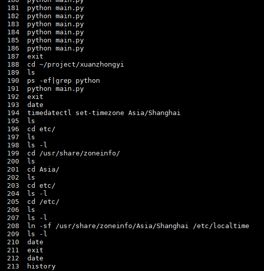
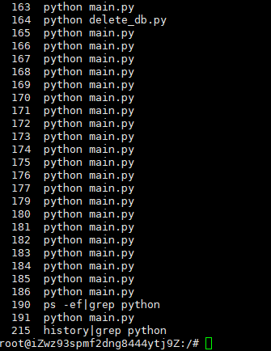
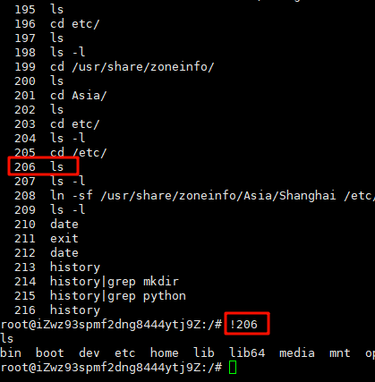
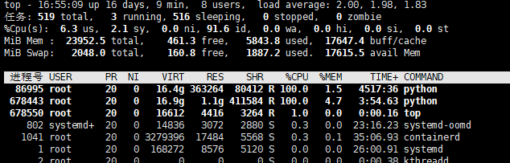

### cd 切换目录

进入上级目录

```shell
cd ..
```

进入当前用户主目录

```shell
cd ~
```

进入上两级目录

```shell
cd ../..
```

进入当前目录

```shell
cd .
```

---


### mkdir 新建文件夹目录

新建文件夹test

```shell
mkdir test
```

新建文件夹并设置权限

```shell
mkdir -m 777 test
```

> [!NOTE]
>
> 权限 
>
> 所有者  用户组  其他用户
>
> rwx      rwx        rwx

新建多个文件夹

```shell
mkdir test1 test2 test3
```

新建多层级文件夹

```shell
mkdir -p dir/file
```

---


### mv 移动命令

移动当前文件test.txt 到/usr/local目录下

```shell
mv ./test.txt /usr/local
```

移动当前文件test.txt 到/usr/local目录下, 但/usr/local已存在test.txt, 强制覆盖

```shell
mv ./test.txt -f /usr/local
```

移动当前文件test.txt 到/usr/local目录下, 但/usr/local已存在test.txt, 询问是否覆盖

```shell
mv ./test.txt -i /usr/local
```

移动当前文件test.txt 到/usr/local目录下, 但/usr/local已存在test.txt, 先进行备份, 再进行覆盖

```shell
mv ./test.txt -b /usr/local
```

移动当前文件夹test 到/usr/local目录下

```shell
mv ./test/ /usr/local
```

修改文件名

```shell
mv test.txt test_1.txt
```

移动多个文件到/usr/local目录下

```shell
mv test1.txt test2.txt -t /usr/local
```

---


### cp 复制命令

复制当前文件test.txt到/usr/local目录下

```shell
cp ./test.txt /usr/local
```

复制当前文件test.txt到/usr/local目录下, 但/usr/local已存在test.txt, 强制覆盖

```shell
cp -f ./test.txt /usr/local
```

复制当前文件test.txt 到/usr/local目录下, 但/usr/local已存在test.txt, 询问是否覆盖

```shell
cp -i ./test.txt /usr/local
```

复制当前文件test.txt 到/usr/local目录下, 但/usr/local已存在test.txt, 先进行备份, 再进行覆盖

```shell
cp -b ./test.txt /usr/local
```

复制当前文件test.txt 到/usr/local目录下, 保留文件的元数据, 如修改时间、权限等

```shell
cp -p ./test.txt /usr/local
```

复制文件夹test 到/usr/local目录下

```shell
cp -r  ./test/ /usr/local
```

---


### history 查看历史记录

查看历史命令执行记录

```shell
history
```

 

查看特定命令的历史执行记录,例如 python

```shell
history | grep python
```

 

执行历史记录中,序号为 n 的命令, `!n`  例如  206

```shell
!206
```

 

执行上一条命令 `!!`（直接输入两个感叹号）

```shell
!!
```

执行倒数第n条命令  `!-n` 

```shell
!-2 # 执行倒数第二条命令
```

执行最近一条以string开头的命令 `!string` 

```shell
!python  # 执行最近一条以python开头的命令
```

查找最后10条历史记录（两种方式）

```shell
history 10
history | tail -10
```

清除历史记录

```
history -c
```

将当前所有历史记录写入历史文件中，默认写入 ~/.bash_history 

```shell
history -w
cat ~/.bash_history  # 查看内容
```

---


### tar /zip  打包解压命令

#### tar

如果只打包,不进行压缩, 那么生成的文件后缀应该为 `.tar`

如果需要打包并进行压缩,有三种压缩方式: gzip、bzip2和compress. 分别对应文件格式为`xx.tar.gz` 、`xx.tar.bz2` 和 `xx.tar.Z`

compress 使用较少，一般使用gz， 打包耗时时间 bz2 > gz > tar , 解压耗时时间 bz2 > tar > gz

常用参数

| 参数 | 描述                                                         |
| ---- | :----------------------------------------------------------- |
| -z   | 通过gzip进行压缩                                             |
| -j   | 通过bzip2进行压缩                                            |
| -Z   | 通过compress进行压缩                                         |
| -c   | 创建新的归档文件，将指定的文件或目录列表打包成一个新的归档文件 |
| -C   | 切换到指定目录，表示指定解压缩包的内容和打包的内容存放的目录 |
| -x   | 解压缩、提取打包的内容                                       |
| -t   | 查看压缩包内容                                               |
| -v   | 显示压缩或者打包的内容                                       |
| -f   | 使用文件名，在f后面要接压缩后的文件的名字，-f选项是必须要用的，-f参数在使用的时候一定排在其他参数的后面，在最右边 |
| -r   | 向压缩归档文件末尾追加文件                                   |
| -u   | 更新原压缩包中的文件                                         |


压缩文件 test.txt 为 test.tar.gz

```shell
tar -zcvf test.tar.gz test.txt
```

压缩多个文件

```shell
tar -zcvf all.tar.gz test1.txt test2.txt test3.txt
```

压缩文件夹

```shell
tar -zcvf test.tar.gz test/
```

打包当前目录下所有jpg文件

```shell
tar -cvf test.tar *.jpg
```

打包当前目录下所有文件, 但排除特定文件

```shell
tar -cvf test.tar --exclude'*.txt' . # 排除所有 .txt文件
```

解压 test.tar 、 test.tar.gz 、 test.tar.bz2

```shell
tar -xvf test.tar
tar -zxvf test.tar.gz
tar -jxvf test.tar.bz2
```

将test.txt文件添加到 test.tar中

```shell
tar -rf test.tar test.txt
```

> [!NOTE]
>
> 不能直接向 `.tar.gz` 或其他任何压缩的 tar 归档文件（如 `.tar.bz2`、`.tar.xz` 等）添加新的文件，因为这些文件是经过压缩的.

列出 test.tar 中的所有文件

```shell
tar -tf test.tar
```


#### zip

常用参数

| 参数 | 描述                                               |
| ---- | -------------------------------------------------- |
| -m   | 将文件压缩后，删除原文件                           |
| -o   | 将压缩文件内的所有文件的最新变动时间设为压缩的时间 |
| -q   | 安静模式，在压缩的时候不显示指令执行的过程         |
| -r   | 递归压缩，将自定目录下的所有子文件以及文件一起处理 |
| -x   | ”文件列表“，压缩时排除文件列表中的文件             |

解压 `unzip`

---


### cat 查看文件内容

获取test.txt文件所有内容

```shell
cat test.txt
```

无论是否为空行，都显示行号

```shell
cat -n test.txt
```

显示行号，除了空行

```shell
cat -b test.txt
```

连续读取两个文件，按顺序输出

```shell
cat test1.txt test2.txt
```

倒序输出   其实就是cat倒过来写即可

```shell
tac test.txt
```

---


### tail 查看文件结尾内容

查看实时更新的test.log文件

```shell
tail -f test.log # 不断刷新,只要test.log更新就可以看到最新的文件内容。
```

查看最后n行内容

```shell
tail -10 test.log
tail -10f test.log # 实时刷新最后10条log
```

显示第五条后面的所有log

```shell
tail -n +5 test.log
```

显示文件test.log 的最后 10 个字符:

```shell
tail -c 10 test.log
```

---


### ls 列出命令

列出当前目录中所有的子目录和文件(不包含隐藏文件 .开头的)

```shell
ls
```

列出目录下的所有的子目录和文件（包含隐藏文件 .开头的）

```shell
ls -a
```

列出文件的详细信息（包括权限、所有者、文件大小等） 两种方式

```shell
ls -lll
```

列出当前目录中所有以“test”开头的详细内容

```shell
ls -l test*
```

按文件最后修改时间排序，降序

```shell
ls -t
```

按文件大小排序，从大到小

```shell
ls -S
```

查看文件大小时增加可读性（1K 2M 2G）

```shell
ls -l -h
ll -h
```

---


### ps 查看进程信息

查看所有进程

```shell
ps -A
```

显示进程的所有信息

```shell
ps -ef
```

> [!NOTE]
>
> 各个字段的含义
>
> | 字段  | 含义                                |
> | ----- | ----------------------------------- |
> | UID   | 用户ID                              |
> | PID   | 进程ID                              |
> | PPID  | 父进程号                            |
> | C     | CPU的占用率                         |
> | STIME | 进程的启动时间                      |
> | TTY   | 登入者的终端机位置                  |
> | TIME  | 表示进程执行起到现在总的CPU占用时间 |
> | CMD   | 启动这个进程的命令                  |


查看指定字段的进程

```shell
ps -ef | grep python
```

显示所有进程更详细的信息，包括进程占用CPU、内存

```shell
ps -aux
```

> [!NOTE]
>
> 各个字段的含义
>
> | 字段    | 含义                                                         |
> | ------- | ------------------------------------------------------------ |
> | USER    | 表示哪个用户启动了这个进程                                   |
> | PID     | 进程ID                                                       |
> | %CPU    | 进程CPU的占用率                                              |
> | %MEM    | 进程物理内存的占用率                                         |
> | VSZ     | 进程占用的虚拟内存量 (Kbytes)                                |
> | RSS     | 进程当前实际上占用了多少内存                                 |
> | TTY     | 进程是在哪个终端机上面运作，若与终端机无关，则显示 ?，另外， tty1-tty6 是本机上面的登入者程序，若为 pts/0 等等的，则表示为由网络连接进主机的程序。 |
> | STAT    | 该程序目前的状态，主要的状态有 <br />R ：运行；该程序目前正在运作，或者是可被运作; <br />D：不可中断：一般是IO进程; <br />S ：中断；该程序目前正在睡眠当中 (可说是 idle 状态)，但可被某些讯号 (signal) 唤醒; <br />T ：停止：该程序目前正在侦测或者是停止了; <br />Z ：僵尸：该程序应该已经终止，但是其父程序却无法正常的终止他，造成 zombie (僵尸) 程序的状态 |
> | START   | 该进程启动的时间点                                           |
> | TIME    | 进程从启动后到现在，实际占用CPU的总时间                      |
> | COMMAND | 启动该进程的命令                                             |


根据CPU、内存使用来降序排序

```shell
ps -aux --sort -pcpu
ps -aux --sort -pmem
```

---


### top 性能分析命令

实时显示系统中各个进程的资源占用状况, 类似于Windows的任务管理器

查看所有进程的资源占用情况

```shell
top
```

监控每个逻辑CPU的状况

```
top  ，按 1
```

高亮显示当前运行进程

```
top ，按 b
```

显示 完整命令

```
top ，按 c
```

切换显示CPU

```
top，按t
```

按CPU使用率从大到小排序

```
top，按P
```

切换显示Memory

```
top，按m
```

按Memory占用率从大到小排序

```
top，按M
```

按累计运行时间Time从大到小排序

```
top，按T
```

高亮CPU列

```
top，按x
```

彩色高亮显示

```
top，按ztop，按shift+z 可以调配色方案
```

通过”shift + >”或”shift + <”可以向右或左改变排序列

```
top shift + >或shift + <
```

忽略闲置和僵死进程，这是一个开关式命令

```
top，按i
```

杀掉进程

```
top，按k，输入PID
```

改变内存的显示单位，默认为KB

```
top，按e （针对列表）top，按E （针对头部统计信息）
```

退出top程序

```
top, 按 q
```


#### top 各项指标信息含义

 

第一行: 输出系统任务队列信息

- 16:55:09	系统当前时间
- up 16 days, 9 min	系统开机后到现在的总运行时间
- 8 users	当前登录用户数
- load average: 2.00, 1.98, 1.83	系统负载，系统运行队列的平均利用率，可认为是可运行进程的平均数；三个数值分别为 1分钟、5分钟、15分钟前到现在的平均值；单核CPU中load average的值=1时表示满负荷状态，多核CPU中满负载的load average值为1*CPU核数

第二行: 任务进程信息

- total	系统全部进程的数量
- running	运行状态的进程数量
- sleeping	睡眠状态的进程数量
- stoped	停止状态的进程数量
- zombie	僵尸进程数量

第三行: cpu信息

- us	用户空间占用CPU百分比
- sy	内核空间占用CPU百分比
- ni	已调整优先级的用户进程的CPU百分比
- id	空闲CPU百分比,越低说明CPU使用率越高
- wa	等待IO完成的CPU百分比
- hi	处理硬件中断的占用CPU百分比
- si	处理软中断占用CPU百分比
- st	虚拟机占用CPU百分比

第四行: 物理内存信息

- total	物理内存总量
- free	空闲内存总量
- used	使用中的内存总量
- buff/cache	用于内核缓存的内存量

第五行: 交换区内存信息

- total	交换区总量
- free	空闲交换区总量
- used	使用的交换区总量
- avail Mem	可用交换区总量

==如果used不断在变化， 说明内核在不断进行内存和swap的数据交换，说明内存真的不够用了==


---


### wget  网络下载

下载isTester.jpg文件

```shell
wget http://51.istester.com/isTester.png
```

下载isTester.jpg文件，并存储名为isTester_Logo.jpg

```shell
wget -o isTester_Logo.jpg http://51.istester.com/isTester.png
```

下载isTester.jpg文件，后台形式下载

```shell
wget -b http://51.istester.com/isTester.png
```


