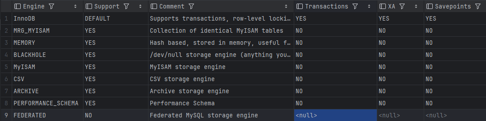

### 一、基础

#### SQL分类

| 分类 | 全称                       | 说明                                                 |
| ---- | -------------------------- | ---------------------------------------------------- |
| DDL  | Data Definition Language   | 数据定义语言，用来定义数据库对象（数据库，表，字段） |
| DML  | Data Manipulation Language | 数据操作语言，用来对数据库表中的数据进行增删改       |
| DQL  | Data Query Language        | 数据查询语言，用来查询数据库中表的记录               |
| DCL  | Data Control Language      | 数据控制语言，用来创建数据库用户，控制数据库访问权限 |


#### DDL 语法

##### 数据类型

 

 


##### 数据库操作

查询

- 查询所有数据库

  ````sql
  show databases;
  ````

- 查询当前数据库

  ```sql
  select database();
  ```

创建

```sql
create database [if not exists] 数据库名 [default charset 字符集] [collate 排序规则];
```

删除

```sql
drop database [if exists] 数据库名;
```

切换数据库

```sql
use 数据库名;
```


##### 数据表操作

查询：

- 查询当前数据库所有表

  ```sql
  use 数据库名;
  show tables;
  ```

- 查询表结构

  ```sql
  desc 数据表名;
  ```

- 查询指定表的建表语句

  ```sql
  show create table 数据表名;
  ```

创建

```sql
create table 数据表名(
	字段1 数据类型 [约束] [comment 注释],
	字段2 数据类型 [约束] [comment 注释],
	....
    字段n 数据类型 [约束] [comment 注释]
) [comment 表注释];
```

修改

- 添加字段

  ```sql
  alter table 数据表名 add 字段名 类型(长度) [comment 注释] [约束];
  ```

- 修改数据类型

  ```sql
  alter table 数据表名 modify 字段名 新数据类型(长度);
  ```

- 修改字段名和字段类型

  ```sql
  alter table 数据表名 change 旧字段名 新字段名 类型(长度) [comment 注释] [约束];
  ```

- 删除字段

  ```sql
  alter table 数据表名 drop 字段名;
  ```

- 修改表名

  ```sql
  alter table 数据表名 rename to 新数据表名;
  ```

删除

- 删除表

  ```sql
  drop table [if exists] 数据表名;
  ```

- 删除指定表，并重新创建该表

  ```sql
  truncate table 数据表名;
  ```

  

#### DML 语法

##### 插入

- 给指定字段添加数据

  ```sql
  insert into 数据表名 (字段名1,字段名2,...) values (值1,值2,...);
  ```

- 给全部字段添加数据

  ```sql
  insert into 数据表名 values (值1,值2,...);
  ```

- 批量添加数据

  ```sql
  insert into 数据表名 (字段名1,字段名2,...) values (值1,值2,...),(值1,值2,...),(值1,值2,...);
  insert into 数据表名 values (值1,值2,...),(值1,值2,...),(值1,值2,...);
  ```

  插入数据时,指定字段顺序应与值的顺序是一一对应的;

  字符串和日期型数据 应该包含在引号中;

  插入的数据大小,应该在字段类型的规定范围内

##### 更新

- 修改数据

  ```sql
  update 数据表名 set 字段名1 = 值1, 字段名2 = 值2, ... [where 条件];
  ```

  如果没有where条件, 那么会对整张表进行修改

##### 删除

- 删除数据

  ```sql
  delete from 数据表名 [where 条件];
  ```

  如果没有where条件,那么会删除整张表的所有数据;

  delete语句不能删除某个字段的值,应使用update语句.


#### DQL 语法

##### 单表查询

```sql
select 字段列表 from 数据表名 [where 条件列表] [group by 分组字段列表] [having 分组后条件列表] [order by 排序字段列表] [limit 分页参数];
```

###### 基础查询

- 查询多个字段

  ```sql
  select 字段1, 字段2,... from 数据表名;
  select * from 数据表名;
  ```

- 设置别名

  ```sql
  select 字段1 [as 别名1], 字段2 [as 别名2],... from 数据表名;
  ```

- 去除重复记录

  ```sql
  select distinct 字段列表 from 数据表名;
  ```


###### 条件查询

```sql
select 字段列表 from 数据表名 where 条件列表;
```

条件

| 比较运算符          | 功能                                        |
| ------------------- | ------------------------------------------- |
| >, >=, <, <=, =, != |                                             |
| between.... and ... | 在某个范围之内, 闭区间                      |
| in(....)            | 在in内的列表中查询                          |
| like 占位符         | 模糊匹配( _ 匹配单个字符, % 匹配任意个字符) |
| is null             | 判断字符是不是null                          |

| 逻辑运算符 | 功能 |
| ---------- | ---- |
| and 或 &&  | 且   |
| or 或 \|\| | 或   |
| not 或 !   | 非   |


###### 聚合函数

| 聚合函数 | 功能       |
| -------- | ---------- |
| count    | 统计数量   |
| max      | 获取最大值 |
| min      | 获取最小值 |
| avg      | 计算平均值 |
| sum      | 求和       |

```sql
select 聚合函数(字段列表) from 数据表名;
```

注意: null值是不参与任何聚合函数的运算.


###### 分组查询

```sql
select 字段列表 from 数据表名 [where 条件] group by 分组字段名 [having 分组后过滤条件];
```

where 与 having 的区别:

- 执行时机不同: where 是分组之前进行过滤, 不满足where条件, 不参与后面的分组; 而having是分组之后对结果进行过滤
- 判断条件不同: where 不能对聚合函数进行判断, 而having可以.

综合例子:

```sql
# 查询年龄小于45岁的员工,并根据工作地址进行分组,获取员工数量大于等于3的工作地址
select workaddress, count(*) from esp where age < 45 group by workaddress having count(*) >= 3;
```


注意:

- 执行顺序: where > 聚合函数 > having
- 分组之后,查询的字段一般为聚合函数和分组字段, 查询其他字段无任何意义


###### 排序查询

```sql
select 字段列表 from 数据表名 order by 字段1 排序方式1, 字段2 排序方式2;
```

排序方式

- asc 升序(默认值)
- desc 降序


###### 分页查询

```sql
select 字段列表 from 数据表名 limit 起始索引, 查询记录数;
```

注意:

- 起始索引从0开始, 起始索引 = (查询页码 - 1) * 页面大小
- 如果查询的是第一页,起始索引可以省略,简写为 limit 查询记录数


###### 执行顺序

 


##### 多表联查

###### 多表关系

- 一对多 / 多对一

  `多` 的一方建立外键, 指向 `一` 的一方的主键

- 多对多

  建立第三张中间表,中间表至少包含两个外键,分别关联两方主键. 需要一个中间表来维护关系

- 一对一

  在任意一方增加外键,关联另一方的主键,并且设置外键为唯一的, unique


> [!NOTE]
>
> 笛卡尔积
>
> 笛卡尔积是数学中,两个集合A和B的所有组合的情况.
>
> 所以在多表查询中,需要消除无效的笛卡尔积.
>
> 消除无效的笛卡尔积: 在查询语句中添加 关联两张表的 关联条件 即可过滤掉.


###### 多表查询的分类

- 连接查询

  - 内连接

    查询A表与B表中符合关联条件的数据，相当于查询A、B交集部分的数据

  - 外连接

    - 左外连接

      以左表为基础，查询左表所有数据，加上右表符合关联条件的数据，若不符合，则为null。

    - 右外连接

      以右表为基础，查询右表所有数据，加上左表符合关联条件的数据，若不符合，则为null。

  - 自连接

    当前表与自身的连接查询，自连接必须使用表别名用于区分

- 子查询


###### 内连接

隐式内连接

```sql
select 字段列表 from 数据表1，数据表2 where 条件 ...;
```

显式内连接

```sql
select 字段列表 from 表1 [inner] join 表2 on 连接条件 ...;
```


###### 外连接

左连接——以左表为基础，查询左表所有数据，加上右表符合关联条件的数据，若不符合，则为null。

```sql
select 字段列表 from 表1 left [outer] join 表2 on 条件...;
```

右连接——以右表为基础，查询右表所有数据，加上左表符合关联条件的数据，若不符合，则为null。

```sql
select 字段列表 from 表1 right [outer] join 表2 on 条件...;
```

举例：

```sql
# 	A 表							B 表
#	+----+--------+					+----+--------+
#	| id | name   |					| id | age	  |
#	+----+--------+					+----+--------+
#	| 1  | 张三   |				   | 1  |  18    |
#	| 2  | 李四   |				   | 2  |  15    |
#	| 3  | 王五   |				   | 4  |  10    |
#	| 4  | 赵六   |				   +----+--------+
#	+----+--------+

# 左连接
select * from A left join B on A.id = B.id;
#	+----+--------+----+--------+
#	| id | name   | id | age    |
#	+----+--------+----+--------+
#	| 1  | 张三   |  1  |  18    |
#	| 2  | 李四   |  2  |  15    |
#	| 3  | 王五   | NULL| NULL   |			   
#	| 4  | 赵六   |  4  |  10    |   
#	+----+--------+----+--------+

# 右边连接
select * from A right join B on A.id = B.id;
#	+----+--------+----+--------+
#	| id | name   | id | age    |
#	+----+--------+----+--------+
#	| 1  | 张三   |  1  |  18    |
#	| 2  | 李四   |  2  |  15    |			   
#	| 4  | 赵六   |  4  |  10    |   
#	+----+--------+----+--------+
```


###### 自连接

```sql
select 字段列表 from 数据表A 别名A join 数据表A 别名B on 条件...;
```

自连接可以是内连接查询，也可以是外连接查询。本质就是一张表自己连接自己。


###### 联合查询

对于 union 查询，就是把多次查询的结果合并起来，形成新的查询结果集

```sql
select 字段列表 from 数据表A ...
union [all]
select 字段列表 from 数据表B ...;
```

注意：

- union all 是直接将两个查询的结果集进行合并， 而 union 除了合并还会将重复的记录进行去重。
- 联合查询的多张表的列数必须保持一致，字段类型也需要保持一致


###### 子查询

sql语句中嵌套select语句，称为嵌套查询，又称子查询

```sql
select * from 数据表A where 字段1 = (select 字段1 from 数据表B ...);
```

根据子查询的结果不同，分为：

- 标量子查询（子查询的结果为标量）

  常用操作符：`=`、`<>`、`>`、`>=`、`<`、`<=`

- 列子查询 （子查询的结果为一列）

  常用操作符：`in`、`not in`、`any`、`some`、`all`

  | 操作符 | 描述                                         |
  | ------ | -------------------------------------------- |
  | in     | 在指定的集合范围之内                         |
  | not in | 不在指定的集合范围之内                       |
  | any    | 子查询返回列表中，有任意一个满足过滤条件即可 |
  | some   | 与any等同，使用some的地方都可以使用any       |
  | all    | 子查询返回列表的所有值都必须满足过滤条件     |

- 行子查询 （子查询的结果为一行）

  常见操作符：`=`、`<>`、`in`、`not in`

- 表子查询 （子查询的结果为多行多列）

子查询的位置可以在： where关键字后， from关键字后， select关键字后


#### DCL 语法

##### 用户管理

- 查询用户

  ```sql
  user mysql;
  select * from user;
  ```

- 创建用户

  ```sql
  create user '用户名'@'主机名' identified by '密码';
  ```

  例如: 创建用户 test1, 只能在当前主机 localhost 访问, 密码123456

  ```sql
  create user 'test1'@'localhost' identified by '123456';
  ```

  例如: 创建用户 test2, 可以在任意主机都可以访问, 密码 123456

  ```sql
  create user 'test2'@'%' identified by '123456';
  ```

  此时创建的用户是没有分配任何权限

  

- 修改用户密码

  ```sql
  alter user '用户名'@'主机名' identified with mysql_native_password by '新密码';
  ```

- 删除用户

  ```sql
  drop user '用户名'@'主机名';
  ```


##### 权限控制

常用权限

| 权限   | 说明               |
| ------ | ------------------ |
| all    | 所有权限           |
| select | 查询数据           |
| insert | 插入数据           |
| update | 修改数据           |
| delete | 删除数据           |
| alter  | 修改表             |
| drop   | 删除数据库/表/视图 |
| create | 创建数据库/表      |


- 查询权限

  ```sql
  show grants for '用户名'@'主机名';
  ```

- 授予权限

  ```sql
  grant 权限列表 on 数据库名.数据表名 to '用户名'@'主机名';
  # 如果需要授予所有的库和表, 就是 *.*
  # 如果需要授予指定的库和指定的表, 就是 指定库.指定表
  ```

- 撤销权限

  ```sql
  revoke 权限列表 on 数据库名.数据表名 from '用户名'@'主机名';
  ```

注意:

- 多个权限之间用逗号分隔
- 授权时,数据库名和表名,可以使用 `*`来通配,代表所有


#### 内置函数

##### 字符串函数

常用字符串函数

| 函数                       | 功能                                                       |
| -------------------------- | ---------------------------------------------------------- |
| concat(str1,str2,...)      | 字符串拼接,将str1,str2,... 拼接成一个字符串                |
| lower(str)                 | 将字符串str全部转为小写                                    |
| upper(str)                 | 将字符串str全部转为大写                                    |
| lpad(str, n, pad)          | 左填充,用字符串 pad 对str的左边进行填充, 达到n个字符串长度 |
| rpad(str, n, pad)          | 右填充,用字符串 pad 对str的右边进行填充, 达到n个字符串长度 |
| trim(str)                  | 去掉字符串头部和尾部的空格                                 |
| substring(str, start, len) | 返回字符串str 从 start 位置起的 len 个长度的 子字符串      |

##### 数值函数

常见数值函数

| 函数        | 功能                                |
| ----------- | ----------------------------------- |
| ceil(x)     | 向上取整                            |
| floor(x)    | 向下取整                            |
| mod(x,y)    | 对 x / y 取模                       |
| rand()      | 返回 0~1 内的随机数                 |
| round(x, y) | 求参数x 的四舍五入的值, 保留y位小数 |

##### 日期函数

常见日期函数

| 函数                                 | 功能                                                         |
| ------------------------------------ | ------------------------------------------------------------ |
| curdate()                            | 返回当前日期                                                 |
| curtime                              | 返回当前时间                                                 |
| now()                                | 返回当前日期和时间                                           |
| year(date)                           | 获取指定date的年份                                           |
| month(date)                          | 获取指定date的月份                                           |
| day(date)                            | 获取指定date的天数                                           |
| date_add(date, INTERVAL, expr, type) | 返回date 加上一个时间间隔expr后的时间值, type是时间单位(YEAR,MONTH,DAY) |
| datediff(date1, date2)               | 返回起始时间date1 与 结束时间date2 之间的天数                |

##### 流程控制函数

常用于sql语句条件筛选

| 函数                                                       | 功能                                                    |
| ---------------------------------------------------------- | ------------------------------------------------------- |
| if(value,t,f)                                              | 如果value为true,返回t,反之返回f                         |
| ifnull(value1,value2)                                      | 如果value1不为空,返回value1,否则返回value2              |
| case when [val1] then [res1] ... else [default] end        | 如果val1为true, 返回res1, ... 否则返回default默认值     |
| case [expr] when [val1] then [res1] ... else [default] end | 如果expr的值等于val1,返回res1,... 否则返回default默认值 |


#### 约束

##### 约束分类

| 约束     | 描述                                                | 关键字      |
| -------- | --------------------------------------------------- | ----------- |
| 非空约束 | 限制字段不能为NULL                                  | not null    |
| 唯一约束 | 保证该字段的所有数据都是唯一,不重复的               | unique      |
| 主键约束 | 要求非空唯一,是数据的唯一标识                       | primary key |
| 默认约束 | 保存数据时,如果未指定字段的值,则采用默认值          | default     |
| 检查约束 | 保证字段值满足某一个条件                            | check       |
| 外键约束 | 用来让两张表的数据建立连接,保证数据的一致性和完整性 | foreign key |


##### 外键约束

- 添加外键

  ```sql
  # 建表添加
  create table 数据表名(
  	字段名 数据类型,
      ....
      [constraint] [外键名称] foreign key (外键字段名) references 主表(主表列名)
  );
  
  # 已有表添加
  alter table 数据表名 add constraint 外键名称 foreign key (外键字段名) references 主表(主表列名);
  ```

- 删除外键

  ```sql
  alter table 数据表名 drop foreign key 外键名称;
  ```


删除/更新行为

| 行为        | 说明                                                         |
| :---------- | :----------------------------------------------------------- |
| no action   | 当在父表中删除/更新对应记录时，首先检查该记录是否有对应外键，如果有则不允许删除/更新。(与restrict 一致) |
| restrict    | 当在父表中删除/更新对应记录时，首先检查该记录是否有对应外键，如果有则不允许删除/更新。(与no action 一致) |
| cascade     | 当在父表中删除/更新对应记录时，首先检查该记录是否有对应外键，如果有，则也删除/更新外键在子表中的记录。 |
| set null    | 当在父表中删除对应记录时，首先检查该记录是否有对应外键，如果有则设置子表中该外键值为null（这就要求该外键允许取null）。 |
| set default | 父表有变更时，子表将外键列设置成一个默认的值(Innodb不支持)   |

```sql
alter table 数据表名 add constraint 外键名称 foreign key (外键字段名) references 主表(主表列名) on update cascade on delete cascade;
```


#### 事务

事务是一组操作的集合，这些操作是原子性的，即要么同时成功，要么同时失败。

##### ACID

事务四大特性

- 原子性（Atomicity）事务是不可分割的最小操作单元，要么全部成功，要么全部失败。
- 一致性（Consistency）事务完成时，必须使所有的数据都保持一致状态。
- 隔离性（Isolation）数据库系统提供的隔离机制，保证事务在不受外部并发操作影响的独立环境下运行。
- 持久性（Durability）事务一旦提交或回滚，它对数据库中的数据的改变就是永久的。

##### 事务操作

- 查看 / 设置事务提交方式

  ```sql
  select @@autocommit; # 查看是否是自动提交，如果为1，则是；为0，则是手动提交。
  set @@autocommit = 0; # 将事务提交改为手动提交。
  ```

  mysql默认事务是自动提交的，即当执行一条DML语句，mysql会立即隐式的提交事务。

- 提交事务

  ```sql
  commit;
  ```

- 回滚事务

  ```sql
  rollback;
  ```


##### 并发事务问题

- 脏读，一个事务读到另一个事务还没有提交的数据
- 不可重复读，事务先后读取同一条记录，但两次读取的数据不同
- 幻读，一个事务按照条件查询数据时，没有对应的数据行，但是在插入数据时，又发现这行数据已经存在

##### 事务隔离级别

事务隔离是为了解决并发事务带来的问题。

| 隔离级别                        | 脏读 | 不可重复读 | 幻读 |
| ------------------------------- | ---- | ---------- | ---- |
| Read uncommitted                | √    | √          | √    |
| Read committed                  | ×    | √          | √    |
| Repeatable Read(可重复读，默认) | ×    | ×          | √    |
| Serializable（串行化隔离）      | ×    | ×          | ×    |

`√`标识为会出现，`×`标识为不会出现

表格中越往下，隔离级别越高，同时效率就越低

- 查看当前事务隔离级别

  ```sql
  select @@transaction_isolation;
  ```

- 设置事务隔离级别

  ```sql
  set [session|global] transaction isolation level [read uncommitted|read committed|repeatable read|serializable]
  # session是当前会话的隔离级别，global是全局的隔离级别
  ```

  


### 二、进阶

#### 体系结构

- 连接层

  最上层是一些客户端和链接服务，主要完成一些类似于连接处理、授权认证、及相关的安全方案。服务器也会为安全接入的每个客户端验证它所具有的操作权限

- 服务层

  第二层架构主要完成大多数的核心服务功能，如SQL接口，并完成缓存的查询，SQL的分析和优化，部分内置函数的执行。所有跨存储引擎的功能也在这一层实现，如过程、函数等。

- 引擎层

  存储引擎真正的负责了MySQL中数据的存储和提取，服务器通过API和存储引擎进行通信。不同的存储引擎具有不同的功能，这样我们可以根据自己的需要，来选取合适的存储引擎。

- 存储层

  主要是将数据存储在文件系统之上，并完成与存储引擎的交互。


#### 存储引擎

存储引擎就是存储数据、建立索引、更新/查询数据等技术的实现方式。存储引擎是基于表的，而不是基于库的，所以存储引擎也可被称为表类型。

- 在创建表时，指定存储引擎

  ```sql
  create table 数据表名 (
  	...
  )engine=innodb [comment 表注释];
  ```

- 查看当前数据库支持的存储引擎

  ```sql
  show engines;
  ```

  

​	默认是InnoDB

##### InnoDB

- 特点

  - DML 操作遵循ACID模型，支持事务

  - 行级锁，提高并发访问性能

  - 支持外键约束，保证数据完整性和正确性

- 文件

  `xxx.ibd`: xxx是数据表名，innoDB引擎的每张表都会对应这样一个表空间文件，存储该表的表结构，数据和索引。

  参数： innodb_file_per_table ，该参数关闭表示多张表共享同一个表空间文件，打开表示每一张表都有一个表空间文件。

- 表空间结构

   


##### MyISAM

MyISAM 是mysql早期默认的存储引擎

- 特点
  - 不支持事务，不支持外键
  - 支持表锁，不支持行锁
  - 访问速度快
- 文件
  - `xxx.sdi`： 存储表结构信息
  - `xxx.MYD`：存储数据
  - `xxx.MYI`：存储索引


##### Memory

Memory引擎的表数据是存储在内存中的，由于受到硬件问题、或断电问题的影响，只能将这些表作为临时表或缓存使用。

- 特点
  - 内存存放
  - hash索引（默认）
- 文件
  - `xxx.sdi`: 存储表结构信息


这三个存储引擎的区别：

 


#### 索引

##### 索引概述

索引（index）是帮助 mysql 高效获取数据的数据结构（有序）。

没有索引的话，查询就是全表扫描，性能极低。

优缺点：

- 优点：提高数据检索效率，降低数据库的IO成本
- 缺点：索引需要占用一定的空间，索引大大提高了查询的效率，但同时也降低了更新表的速率，因为mysql需要维护索引的结构。


##### 索引结构

mysql的索引是在存储引擎层实现，因此不同的存储引擎有着不同的索引结构，主要包括以下几种：

- B+ Tree索引：最常见的索引结构，大部分引擎都支持B+树索引。
- Hash索引：底层数据结构是用哈希表实现的，只有精确匹配索引列的查询才有效，不支持范围查询
- R-tree（空间索引）：空间索引是MyISAM引擎的一个特殊索引类型，主要用于地理空间数据类型，通常使用较少
- Full-text（全文索引）：是一种通过建立倒排索引，快速匹配文档的方式。

 


##### 索引分类

- 主键索引

  针对表中主键创建的索引，默认自动创建，只能有一个。 关键词：primary

- 唯一索引

  避免同一个表中某数据列中的值重复，可以有多个。关键词：unique

- 常规索引

  快速定位特点数据，可以有多个

- 全文索引

  全文索引查找的是文本中的关键词，而不是比较索引中的值，可以有多个。关键词：fulltext

在InonoDB存储引擎中，根据索引的存储形式，又可以分为：

- 聚集索引（Clustered Index）

  将数据存储与索引放到一块，索引结构的叶子节点保存了行数据， 必须有且只有一个

  如果存在主键，主键索引就是聚集索引

  如果不存在主键，将使用的第一个唯一（unique）索引作为聚集索引。

  如果表没有主键，或没有合适的唯一索引，则InnoDB会自动生成一个rowid作为隐藏的聚集索引。

- 二级索引（Secondary Index）

  将数据与索引分开存储，索引结构的叶子节点关联的是对应的主键，可以存在多个。

 


##### 索引语法

- 创建索引

  ```sql
  create [unique|fulltext] index 索引名 on 数据表名(字段名,...);
  # (字段名,...) `...` 表示一个索引可以关联多个字段
  ```

- 查看索引

  ```sql
  show index from 数据表名;
  ```

- 删除索引

  ```sql
  drop index 索引名 on 数据表名;
  ```

  

##### SQL性能分析

###### 查看SQL执行频率

SQL执行频率

```sql
show [session|global] status like 'Com_______'; # 查看增删改查的访问频次
```

 


###### 慢查询日志

慢查询日志记录了所有执行时间超过指定参数（long_query_time, 单位：秒，默认10秒）的所有sql语句日志。

```sql
# 查询是否开启慢查询日志
 show variables like  '%slow_query_log%';
```

mysql的慢查询日志默认没有开启

```sql
set global slow_query_log=1;
set global long_query_time=2;
```

mysql重启后会失效，如果需要永久生效则需要在mysql配置文件`my.cnf`中配置如下信息：

```yaml
# 开启MySQL慢日志查询开关
show_query_log=1
# 日志保存路径
slow_query_log_file=/var/lib/mysql/localhost-slow.log
# 设置慢日志的时间为2秒，SQL语句执行时间超过2秒，视为慢查询，记录到慢查询日志中
long_query_time=2
```

配置完毕后，重启mysql服务，慢日志文件存储在 `/var/lib/mysql/localhost-show.log`


###### profiles详情

show profiles能够在做SQL优化时，帮助我们了解时间都耗费到哪里

通过 have_profiling 参数，能够查看当前mysql是否支持profile操作：

```sql
select @@have_profiling;
```

默认profiling是关闭的，可以通过set语句在 session/global级别开启profiling:

```sql
set [session|global] profiling=1;
select @@profiling;
```


操作：

- 查看每一条SQL的耗时基本情况

  ```sql
  show profiles;
  ```

- 查看指定query_id的SQL语句各个阶段的耗时情况

  ```sql
  show profile for query query_id;
  ```

- 查看指定query_id的SQL语句CPU使用情况

  ```sql
  show profile cpu for query query_id;
  ```


###### explain 执行计划

explain或者desc命令获取mysql如何执行select语句的信息，包括select语句执行过程中表如何连接和连接顺序。

```sql
# 在select语句之前加上关键字 explain/desc
explain select 字段列表 from 数据表名 ...;
```

查询到的记录各个字段的含义：

- id

  select查询的序列号，表示查询中执行select子句或者是操作表的顺序（id相同，执行顺序从上到下；id不同，值越大，越先执行）。

- select_type

  表示select 的类型，常见的取值有SIMPLE（简单表，即不使用表连接或者子查询）、PRIMARY（主查询，即外层的查询）、UNION（UNION中的第二个或者后面的查询语句）、SUBQUERY（SELECT/WHERE之后包含了子查询）等

- type

  表示连接类型，性能由好到差的连接类型为NULL、system、const、eq_ref、ref、range、index、all

  当我们查询不使用到任意一张表，就为NULL

  当我们使用主键或唯一索引查询时，一般就为const

  当我们使用非唯一索引，就为ref

  优化sql时，尽量往前优化。

- possible_key：可能应用在这张表上的索引，一个或多个

- Key：实际使用的索引，如果为 NULL，则没有使用索引

- Key_len：表示索引中使用的字节数，该值为索引字段最大可能长度，并非实际使用长度，在不损失精确性的前提下，长度越短越好

- rows：MySQL认为必须要执行的行数，在InnoDB引擎的表中，是一个估计值，可能并不总是准确的

- filtered：表示返回结果的行数占需读取行数的百分比，filtered的值越大越好


##### 索引使用

###### 最左前缀法则

如果一个索引关联了多个字段列（联合索引），要遵守最左前缀法则，即查询从索引的最左列开始，并且不跳过索引中间的列。

如果跳过了某一列，索引将部分失效（后面的字段索引失效），此时会进行全表扫描。

例子：

假设idx_user_pro_age_sta联合索引，关联着 表中的 profession, age, status 列

情况1：

`select * from user where profession = '软件工程' and age = 24 and status = 0;`

中间并未跳过任何一列，此时索引使用成功

情况2：

`select * from user where profession = '软件工程' and age = 24;`

从索引的最左列依次使用，满足最左前缀法则，索引使用成功

情况3：

`select * from user where age = 24 and status = 0;`

跳过了 profession，不是从最左开始，不满足最左前缀法则，索引使用失败，此时进行全部扫描。


###### 范围查询

在联合索引中，出现范围查询（<、>），范围查询右侧的列索引失效。

例子：`select * from user where profession = '软件工程' and age > 24 and status = 0;`

status 没有走索引，原因是age使用了范围查询，导致右侧的列索引失效。

怎么规避这种情况？在业务允许的情况下，使用大于等于，或小于等于的比较符来进行范围查询。

就可以使三个字段都使用到了索引。


###### 索引失效情况

- 索引列运算

  在索引列上进行运算操作，索引失效

- 过滤条件中，字符串没有使用单引号括起

  因为字符串不加单引号，会进行隐式类型转换，此时索引失效。

- 模糊查询

  如果仅仅是尾部模糊查询，索引不会失效，如果是头部存在模糊查询，索引失效。

- or连接

  用or 分割开的条件，如果or前条件中的列有索引，而后面的列中没有索引，那么涉及到的索引都不会被用到

  即一侧有索引，一侧没有索引，整个索引都会失效

  只有两侧都有索引时，索引才会生效

- 数据分布影响

  如果mysql评估使用索引比全表扫描更慢，则不使用索引。


###### SQL提示

如果对表中的列创建了联合索引和单列索引，之后条件中也符合最左前缀法则。此时这两个索引mysql都有可能使用到，那么mysql会选哪个呢？mysql会根据优化器自动选中其中一个索引

在某个场景，某列存在多个索引，我们如果想要mysql按照我们指定的索引进行查询，可以使用sql提示。

sql提示： 在sql语句中加入一些人为的提示来达到优化操作的目的。

- user index

  ```sql
  select * from tb_user user index(idx_user_pro) where profession='软件工程';
  ```

  告诉mysql使用idx_user_pro索引

- ignore index

  ```sql
  select * from tb_user ignore index(idx_user_pro) where profession='软件工程';
  ```

  告诉mysql不要使用idx_user_pro索引

- force index

  ```sql
  select * from tb_user force index(idx_user_pro) where profession='软件工程';
  ```

  告诉mysql必须使用idx_user_pro索引

  

###### 覆盖索引&回表查询

尽量使用覆盖索引（查询使用了索引，并且查询需要返回的列在该索引中已经全部能找到），减少 `select *`。

在使用explain查看sql执行计划中 extra 字段含义：
`using index condition`：查找使用了索引，但是需要回表查询数据
`using where; using index;`：查找使用了索引，但是需要的数据都在索引列中能找到，所以不需要回表查询

如果在聚集索引中直接能找到对应的行，则直接返回行数据，只需要一次查询，哪怕是select *；如果在辅助索引中找聚集索引，如`select id, name from xxx where name='xxx';`，也只需要通过辅助索引(name)查找到对应的id，返回name和name索引对应的id即可，只需要一次查询；如果是通过辅助索引查找其他字段，则需要回表查询，如`select id, name, gender from xxx where name='xxx';`

所以尽量不要用`select *`，容易出现回表查询，降低效率，除非有联合索引包含了所有字段


也就是说，如果返回的列在索引中，直接就返回了，一次查询；如果不在，则需要根据索引查到数据保存的位置，再回表查询整行数据，两次查询。


面试题：一张表，有四个字段（id, username, password, status），由于数据量大，需要对以下SQL语句进行优化，该如何进行才是最优方案：
`select id, username, password from tb_user where username='itcast';`

解：给username和password字段建立联合索引，则不需要回表查询，直接覆盖索引


###### 前缀索引

当字段类型为字符串（varchar, text等）时，有时候需要索引很长的字符串，这会让索引变得很大，查询时，浪费大量的磁盘IO，影响查询效率，此时可以只将字符串的一部分前缀，建立索引，这样可以大大节约索引空间，从而提高索引效率。

```sql
create index idx_xxx on 数据表名(字段名(n));
# n 表示提取字符串的前n个字符来构建索引
```

前缀长度：可以根据索引的选择性来决定，而选择性是指不重复的索引值（基数）和数据表的记录总数的比值，索引选择性越高则查询效率越高，唯一索引的选择性是1，这是最好的索引选择性，性能也是最好的。

计算选择性

```sql
# 计算字段1 的选择性
select count(distinct 字段1) / count(*) from 数据表名;
# 计算字段1 的前缀的选择性
select count(distinct substring(字段1, 1, 5)) / count(*) from 数据表名;
```


##### 索引设计原则

1. 针对于数据量较大，且查询比较频繁的表建立索引（一般数据量100w就开始考虑建立索引）
2. 针对于常作为查询条件（where）、排序（order by）、分组（group by）操作的字段建立索引
3. 尽量选择区分度高的列作为索引，尽量建立唯一索引，区分度越高，使用索引的效率越高
4. 如果是字符串类型的字段，字段长度较长，可以针对于字段的特点，建立前缀索引
5. 尽量使用联合索引，减少单列索引，查询时，联合索引很多时候可以覆盖索引，节省存储空间，避免回表，提高查询效率
6. 要控制索引的数量，索引并不是多多益善，索引越多，维护索引结构的代价就越大，会影响增删改的效率
7. 如果索引列不能存储NULL值，请在创建表时使用NOT NULL约束它。当优化器知道每列是否包含NULL值时，它可以更好地确定哪个索引最有效地用于查询


#### SQL优化

##### 插入数据

普通insert优化

- 批量插入，建议500-1000条

  ```sql
  insert into test values(1,'Tom'),(2,'Cat'),(3,'Jerry');
  ```

- 手动提交事务

  ```sql
  start transaction;
  insert into test values(1,'Tom'),(2,'Cat'),(3,'Jerry');
  insert into test values(4,'Tom'),(5,'Cat'),(6,'Jerry');
  insert into test values(7,'Tom'),(8,'Cat'),(9,'Jerry');
  commit;
  ```

- 主键顺序插入

大批量插入数据

如果一次性需要插入大批量数据，使用insert语句性能较低，此时可以使用load指令进行插入

```sql
# 客户端连接服务端时，加上参数 --local-infile（这一行在bash/cmd界面输入）该参数表示需要加载本地的文件
mysql --local-infile -u root -p
# 设置全局参数local_infile为1，开启从本地加载文件导入数据的开关
set global local_infile = 1;
select @@local_infile;
# 执行load指令将准备好的数据，加载到表结构中
load data local infile '/root/sql1.log' into table 'tb_user' fields terminated by ',' lines terminated by '\n';
# fields terminated by ',' 表示本地文件中每一个字段用逗号分割
# lines terminated by '\n 表示本地文件每一行的数据用 \n 分割

```


##### 主键优化

数据组织方式：在InnoDB存储引擎中，表数据都是根据主键顺序组织存放的，这种存储方式的表称为索引组织表（Index organized table, IOT）

假如不按照主键顺序插入，由于因为叶子节点是要求有序的，故而插入的时候就会破坏已有的存储结构，可能导致页分裂

页分裂：页可以为空，也可以填充一半，也可以填充100%，每个页包含了2-N行数据（如果一行数据过大，会行溢出），根据主键排列。

当删除一行记录时，实际上记录并没有被物理删除，只是记录被标记（flaged）为删除并且它的空间变得允许被其他记录声明使用。

页合并：当页中删除的记录到达 MERGE_THRESHOLD（默认为页的50%），InnoDB会开始寻找最靠近的页（前后）看看是否可以将这两个页合并以优化空间使用。

MERGE_THRESHOLD：合并页的阈值，可以自己设置，在创建表或创建索引时指定


主键设计原则：

- 满足业务需求的情况下，尽量降低主键的长度
- 插入数据时，尽量选择顺序插入，选择使用AUTO_INCREMENT自增主键
- 尽量不要使用UUID做主键或者其他自然主键（如身份证号），因为长度相对有点长


##### order by优化

1. Using filesort：通过表的索引或全表扫描，读取满足条件的数据行，然后在排序缓冲区 sort buffer 中完成排序操作，所有不是通过索引直接返回排序结果的排序都叫 FileSort 排序
2. Using index：通过有序索引顺序扫描直接返回有序数据，这种情况即为 using index，不需要额外排序，操作效率高

如果order by字段（字段具有索引）全部使用升序排序或者降序排序，则都会走索引

但是如果一个字段升序排序，另一个字段降序排序，则不会走索引，explain的extra信息显示的是`Using index, Using filesort`，如果要优化掉Using filesort，则需要另外再创建一个索引，如：`create index idx_user_age_phone_ad on tb_user(age asc, phone desc);`，此时使用`select id, age, phone from tb_user order by age asc, phone desc;`会全部走索引

总结：

- 根据排序字段建立合适的索引，多字段排序时，也遵循最左前缀法则
- 尽量使用覆盖索引
- 多字段排序，一个升序一个降序，此时需要注意联合索引在创建时的规则（ASC/DESC）
- 如果不可避免出现filesort，大数据量排序时，可以适当增大排序缓冲区大小 sort_buffer_size（默认256k）


##### group by 优化

- 在分组操作时，可以通过索引来提高效率
- 分组操作时，索引的使用也是满足最左前缀法则的

如索引为`idx_user_pro_age_stat`，则句式可以是`select ... where profession group by age`，这样也符合最左前缀法则（where条件用到profession，group by用到age）


##### limit 优化

