### 一、Redis 简介

官网地址：[英文](https://redis.io/),[中文文档](https://www.redis.com.cn/documentation.html)：

安装包：https://redis.io/download/

文档资料：[Redis源码地址](https://github.com/redis/redis)  ,  [Redis在线测试](https://try.redis.io/) , [Redis命令参考](http://doc.redisfans.com/)

作者：[github](https://github.com/antirez) ， [个人博客](http://antirez.com)


Redis是基于内存的key—value键值对数据库。


### 二、Redis 安装

Redis版本的命名规则

版本号第二位如果是奇数，则为非稳定版本，如2.7、2.9、3.1

版本号第二位如果是偶数，则为稳定版本，如2.6、2.8、3.0、3.2


历史版本：https://download.redis.io/releases/


前提：具备gcc编译环境


使用docker安装


```python
redis-benchmark       	# 性能测试工具，服务启动后运行该命令，查看性能
redis-check-aof			# 修复有问题的AOF文件
redis-check-dump		# 修复有问题的dump.rdb文件
redis-cli				# 客户端操作入口
redis-sentinel			# redis集群使用
redis-server			# redis服务器启动命令
```


修改redis配置文件,(注意留一份初始文件备份)

```shell
# 修改前						修改后
# daemonize no				  daemonize yes	   后台启动
# protected-mode yes 		  protected-mode no  将保护模式取消
# bind 127.0.0.1  			  注释掉或改成本机IP地址 默认是只能本机访问,否则影响远程IP连接.
# 添加redis密码					requirepass xxxx
```


根据配置文件启动redis

```shell
redis-server /myredis/redis7.conf
```


连接redis服务

```shell
redis-cli -a xxxx -p 6379 # xxx是密码,6379是默认端口
```


关闭

在redis-cli里面可以使用 exit 是退出redis-cli客户端.

在redis-cli里面可以使用shutdown 关闭整个redis

单实例关闭 `redis-cli -a xxxx shutdown`

多实例关闭(关闭好几个机器) `redis-cli -p 6379 shutdown`


### 三、Redis 十大数据类型

#### 总览


> [!NOTE]
>
> 这里所说的数据类型是value的数据类型,key的类型都是字符串


##### 1.redis字符串（String）

String是redis最基本的数据类型，一个key对应一个value。

string类型是二进制安全的，意思是redis的string可以包含任何数据，比如jpg图片或者序列化的对象。

string类型是Redis最基本的数据类型，一个redis中字符串value**最多可以是512M**


##### 2.redis列表（List）

Redis列表是最简单的字符串列表，按照插入顺序排序。你可以添加一个元素到列表的$\textcolor{blue}{头部(左边)或者尾部(右边)}$，它的底层实际是个$\textcolor{red}{双端链表}$​，最多可以包含 $2^{32}-1$ 个元素（4294967295，每个列表超过40亿个元素）


##### 3.redis哈希表（Hash）

Redis Hash是一个string类型的field（字段）和value（值）的映射表，Hash特别适合用户存储对象。

Redis中每个Hash可以存储 $2^{32}-1$ 个键值对（40多亿）


##### 4.redis集合（Set）

Redis的Set是string类型的$\textcolor{red}{无序集合}$。集合成员是唯一的，这就意味着集合中不能出现重复的数据，集合对象的编码可以是intset或者Hashtable。

Redis中Set集合是通过哈希表实现的，所以添加，删除，查找的复杂度都是O(1)。

集合中最大的成员数为 $2^{32}-1$ （4294967295，每个集合可存储40多亿个成员）


##### 5.redis有序集合（ZSet）

zset(sorted set：有序集合)

Redis zset和Set一样也是string类型元素的集合，且不允许重复的成员。

不同的是每个元素都会关联一个double类型的分数，redis正是通过分数来为集合中的成员进行从小到大的排序。

zset的成员是唯一的，但是分数（score）却可以重复。

zset集合是通过哈希表实现的，所以添加，删除，查找的复杂度都是O(1)。集合中最大的成员数是 $2^{32}-1$ 


##### 6.redis地理空间（GEO）

Redis GEO主要用于存储地理位置信息(经纬度)，并对存储的信息进行操作，包括：

添加地理位置的坐标。

获取地理位置的坐标。

计算两个位置之间的距离。

根据用户给定的经纬度坐标来获取指定范围内的地址位置集合。


##### 7.redis基数统计（HyperLogLog）

HyperLogLog是用来做$\textcolor{red}{基数统计}$的算法，HyperLogLog的优点是，在输入元素的数量或者体积非常非常大时，计算基数所需要的空间总是固定且是很小的。

在Redis里面，每个HyperLogLog键只需要花费12KB内存，就可以计算接近 $2^{64}$ 个不同元素的基数。这和计算基数时，元素越多耗费内存就越多的集合形成鲜明对比。

但是，因为HyperLogLog只会根据输入元素来计算基数，而不会存储输入元素本身，所以HyperLogLog不能像集合那样，返回输入的各个元素。


##### 8.redis位图（bitmap）


由0和1状态表现的二进制位的bit数组


##### 9.redis位域（bitfield）

通过bitfield命令可以一次性操作多个$\textcolor{red}{比特位域(指的是连续的多个比特位)}$，它会执行一系列操作并返回一个响应数组，这个数组中的元素对应参数列表中的相应的执行结果。

说白了就是通过bitfield命令我们可以一次性对多个比特位域进行操作。


##### 10.redis流（Stream）

Redis Stream是Redis5.0版本新增加的数据结构。

Redis Stream主要用于消息队列（MQ，Message Queue），Redis本身就是一个Redis发布订阅（pub/sub）来实现消息队列的功能，但它有个缺点就是消息无法持久化，如果出现网络断开、Redis宕机等，消息就会被丢弃。

简单来说发布订阅（pub/sub）可以分发消息，但无法记录历史消息。

而Redis Stream提供了消息的持久化和主备复制功能，可以让任何客户端访问任何时刻的数据，并且能记住每一个客户端的访问位置，还能保证消息不丢失。


##### redis常见数据类型操作命令

官网英文： https://redis.io/commands/

中文：http://www.redis.cn/commands.html

---


#### key 操作命令

---

查看当前库所有的key

`key * `

相当于mysql的 `select * from table`


---

判断某个key是否存在

`exists key`

例如:

```shell
127.0.0.1:6379> exists k1 k2 k3
(integer) 2			# 判断k1,k2,k3是否存在,有几个就返回几的数字
```


---

查看key是什么类型

`type key`

```shell
127.0.0.1:6379> type k1
string
```


---

删除指定的key数据

`del key`

```shell
127.0.0.1:6379> del k1
(integer) 1 # 删除存在的key会返回1
del k2
127.0.0.1:6379> (integer) 0 # 删除不存在的key会返回0
```


---

非阻塞删除

`unlink key`

仅仅将keys从keyspace元数据中删除，真正的删除会在后续异步中操作。

del key 是原子的删除(他是阻塞的)，只有删除成功了才会返回删除结果，如果是删除大key用del会将后面的操作都阻塞，而unlink key 不会阻塞，它会在后台异步删除数据。


---

查看该key还有多少秒过期

`ttl key`

-1 表示永不过期, -2 表示已经过期


---

为给定的key设置过期时间

`expire key 秒钟`

```shell
127.0.0.1:6379> expire k1 5 #设置5秒过期
```


---

将当前数据库的key 移动到给定的数据库db当中

`move key dbindex [0-15]`

```shell
127.0.0.1:6379> move k1 3 # 将key为k1的数据移动到4号
```

> [!NOTE]
>
> 一个redis服务器默认有16个数据库,默认使用0号库


---

切换数据库,默认为0号.

`select dbindex`

```shell
127.0.0.1:6379> select 3 # 切换到4号库.
127.0.0.1:6379[3]> 
```


---

查看当前数据库key的数量

`dbsize`


---

清空当前库

`flushdb`


---

清空所有的库

`flushall`


> [!NOTE]
>
> redis命令不区分大小写,但是key区分大小写


---


#### 字符串 String


##### 最常用命令

```shell
127.0.0.1:6379> set key value
127.0.0.1:6379> get key
```


`set key value [NX|XX] [GET] [EX seconds|PX milliseconds|EXAT unix-time-seconds|PXAT unix-time-milliseconds|KEEPTTL]`


**返回值：**

设置成功则返回OK，返回nil为未执行Set命令，如不满足NX，XX条件等。

若使用GET参数，则返回该键原来的值，或在键不存在时nil。


例如:

```shell
127.0.0.1:6379> set k1 v1 nx
OK
127.0.0.1:6379> get k1
"v1"
127.0.0.1:6379> set k1 v1 nx		# key存在会失败
(nil)  								
127.0.0.1:6379> set k1 v1xx xx		# key存在会进行覆盖
OK
127.0.0.1:6379> get k1
"v1xx"
127.0.0.1:6379> set k1 v1 get		# 先返回key原始值,然后设置新值.
"v1xx"
127.0.0.1:6379> get k1
"v1"
127.0.0.1:6379> set k1 v1 ex 10		# 设置10秒后过期
OK
127.0.0.1:6379> ttl k1
(integer) 8
127.0.0.1:6379> set k1 v1 px 8000	# 设置8000毫秒后过期
OK
127.0.0.1:6379> pttl k1				# 使用pttl查看精确的剩余毫秒数
6555
127.0.0.1:6379> del k1
(integer) 1
127.0.0.1:6379> set k1 v1 ex 30
OK
127.0.0.1:6379> ttl k1
(integer) 27
127.0.0.1:6379> set k1 v2 keepttl 	# 重设k1后,过期时间会重置,若想继承上次的过期剩余时间,使用keepttl选项.
OK
127.0.0.1:6379> ttl k1
(integer) 22 
```


##### 同时设置/获取多个键值

MSET key value [key value...]

MGET key [key ...]

MSETNX key value [key value...]

```shell
127.0.0.1:6379> mset k1 v1 k2 v2 k3 v3
OK
127.0.0.1:6379> mget k1 k2 k3 k4
1) "v1"
2) "v2"
3) "v3"
4) (nil)
127.0.0.1:6379> msetnx k1 v11 k4 v4 #msetnx是当不存在key值时,才成功 要么都成功,要么都失败
(integer) 0
127.0.0.1:6379> get k1
"v1"
127.0.0.1:6379> get k4
(nil)
127.0.0.1:6379> msetnx k4 v4 k5 v5 #msetnx 要key全部不存在创建成功.
(integer) 1
127.0.0.1:6379> mget k1 k2 k3 k4 k5
1) "v1"
2) "v2"
3) "v3"
4) "v4"
5) "v5"

```


##### 获取指定区间范围的值

GETRANGE key start end

SETRANGE key offset value

```shell
127.0.0.1:6379> set k1 abcd1234
OK
127.0.0.1:6379> getrange k1 0 -1 # 表示取得全部的范围
"abcd1234"
127.0.0.1:6379> getrange k1 0 3
"abcd"
127.0.0.1:6379> setrange k1 1 xxyy # 从下标1开始覆盖
(integer) 8
127.0.0.1:6379> get k1
"axxyy234"

```


##### 数值增减

一定得是数字才能进行加减

递增数字: INCR key

增加指定整数: INCRBY key increment

递减数值: DECR key

减少指定整数: DECRBY key decrement

```shell
127.0.0.1:6379> set k1 100
OK
127.0.0.1:6379> get k1
"100"
127.0.0.1:6379> incr k1
(integer) 101
127.0.0.1:6379> incrby k1 3
(integer) 104
127.0.0.1:6379> decr k1
(integer) 103
127.0.0.1:6379> decrby k1 3
(integer) 100
```


##### 获取字符串长度和内容追加

STRLEN key

APPEND key value

```shell
127.0.0.1:6379> set k1 abcd
OK
127.0.0.1:6379> strlen k1
(integer) 4
127.0.0.1:6379> append k1 xxxx
(integer) 8
127.0.0.1:6379> get k1
"abckxxxx"
```


##### 分布式锁

setnx key value


setex key 秒值 value

相当于`set key value` 与 `expire key 秒值`这两个指令的合并.

也就是将这两条指令变为一条,保证了原子性.


若有多个微服务竞争资源,可以利用redis的`setnx key value`来充当锁

例如: 

```shell
setnx lock uuid
del lock
```

谁先设置到lock这个key,谁就可以获得资源,之后在释放.


##### getset key value

先get再set，即先将key的原始值返回，再对key设置新值

```shell
127.0.0.1:6379> set k1 v11
OK
127.0.0.1:6379> getset k1 haha
"v11"
127.0.0.1:6379> get k1
"haha"
```


应用场景：点赞，或是否喜欢文章等等


---


#### 列表 List

**单key多value**

简单说明：$\textcolor{red}{一个双向链表的结构}$，容量是2的32次方减1个元素大概40多亿，主要功能有push/pop等，一般用在栈、队列、消息队列等场景。left、right都可以插入添加；

如果键不存在，创建新的链表；

如果键已存在，新增内容；

如果值全移除，对应的键也就消失了

它的底层实际上就是个双向链表，对两端的作性能很高，通过索引下标的操作中间的节点性能会较差


##### lpush/rpush/lrange

LPUSH/RPUSH list value ...

LRANGE list start stop

注意，没有rrange命令，只有lrange

```shell
127.0.0.1:6379> lpush list1 1 2 3 4 5
(integer) 5
127.0.0.1:6379> lrange list1 0 -1
1) "5"
2) "4"
3) "3"
4) "2"
5) "1"
127.0.0.1:6379> rpush list2 11 22 33 44 55
(integer) 5
127.0.0.1:6379> lrange list2 0 -1
1) "11"
2) "22"
3) "33"
4) "44"
5) "55"
```


##### lpop/rpop

```shell
127.0.0.1:6379> lpush list1 1 2 3 4 5
(integer) 5
127.0.0.1:6379> lrange list1 0 -1
1) "5"
2) "4"
3) "3"
4) "2"
5) "1"
127.0.0.1:6379> lpop list1
"5"
127.0.0.1:6379> lrange list1 0 -1
1) "4"
2) "3"
3) "2"
4) "1"
127.0.0.1:6379> rpop list1
"1"
127.0.0.1:6379> lrange list1 0 -1
1) "4"
2) "3"
3) "2"
```


##### lindex

LINDEX key index

按照索引下标获得元素（从上到下）,没有值返回nil

```shell
127.0.0.1:6379> lpush list1 1 2 3 4 5
(integer) 5
127.0.0.1:6379> lindex list1 3
"2"
```


##### llen

获取列表中元素的个数

```python
127.0.0.1:6379> lpush list1 1 2 3 4 5
(integer) 5
127.0.0.1:6379> llen list1
(integer) 5
```


##### lrem

LREM list N value

删除N个值等于value 的元素， 后面必须带值，想删除全部，使用del命令

```shell
127.0.0.1:6379> lpush list1 1 2 2 3 3 3
(integer) 6
127.0.0.1:6379> lrem list1 2 3
(integer) 2
127.0.0.1:6379> lrange list1 0 -1
1) "3"
2) "2"
3) "2"
4) "1"

```


##### ltrim

LTRIM list start_index end_index

截取指定范围的值后再赋值给list

```shell
127.0.0.1:6379> lpush list1 1 2 3 4
(integer) 4
127.0.0.1:6379> ltrim list1 1 2
OK
127.0.0.1:6379> lrange list1 0 -1
1) "3"
2) "2"

```


##### rpoplpush

rpoplpush 源列表 目的列表

```shell
127.0.0.1:6379> lpush list1 1 2
(integer) 2
127.0.0.1:6379> lpush list2 3 4
(integer) 2
127.0.0.1:6379> lrange list1 0 -1
1) "2"
2) "1"
127.0.0.1:6379> lrange list2 0 -1
1) "4"
2) "3"
127.0.0.1:6379> rpoplpush list1 list2
"1"
127.0.0.1:6379> lrange list2 0 -1
1) "1"
2) "4"
3) "3"
```


##### lset

ISET list index value

```shell
127.0.0.1:6379> lpush list1 1 2 3 4
(integer) 4
127.0.0.1:6379> lset list1 1 mysql
OK
127.0.0.1:6379> lrange list1 0 -1
1) "4"
2) "mysql"
3) "2"
4) "1"
```


##### linsert

LINSERT list before|after old_value new_value

```shell
127.0.0.1:6379> lpush list1 1 2 3 4
(integer) 4
127.0.0.1:6379> linsert list1 before 2 redis
(integer) 5
127.0.0.1:6379> lrange list1 0 -1
1) "4"
2) "3"
3) "redis"
4) "2"
5) "1"
```


应用场景：微信公众号订阅文章

---


#### 哈希 Hash

key-value键值对中的value又是一个key-value键值对

即Map<String,Map<Object,Object>>


##### hset/hget/hmset/hmget/hgetall/hdel

```shell
127.0.0.1:6379> hset user_1 id 1 name Mrhow age 24
(integer) 3
127.0.0.1:6379> hget user_1 id
"1"
127.0.0.1:6379> hget user_1 name
"Mrhow"
127.0.0.1:6379> hmset user_2 id 2 name mrhow age 24
OK
127.0.0.1:6379> hmget user_2 id name age
1) "2"
2) "mrhow"
3) "24"
127.0.0.1:6379> hgetall user_2
1) "id"
2) "2"
3) "name"
4) "mrhow"
5) "age"
6) "24"
127.0.0.1:6379> hdel user_2 age
(integer) 1
127.0.0.1:6379> hgetall user_2
1) "id"
2) "2"
3) "name"
4) "mrhow"
```


##### hlen

```shell
127.0.0.1:6379> hset user_1 id 1 name Mrhow age 24
(integer) 3
127.0.0.1:6379> hlen user_1
(integer) 3
```


##### hexists

hexists key     判断在key里面的某个值的key是否存在

```shell
127.0.0.1:6379> hset user_1 id 1 name Mrhow age 24
(integer) 3
127.0.0.1:6379> hexists user_1 name
(integer) 1
127.0.0.1:6379> hexists user_1 score
(integer) 0

```


##### hkeys/hvals

获取key下的所有key ，获取key下的所有value

```shell
127.0.0.1:6379> hset user_1 id 1 name Mrhow age 24
(integer) 3
127.0.0.1:6379> hkeys user_1
1) "id"
2) "name"
3) "age"
127.0.0.1:6379> hvals user_1
1) "1"
2) "Mrhow"
3) "24"
```


##### hincriby/hincrbyfloat

HINCRIBY key1 key2 整数

HINCRIBYFLOAT key1 key2 浮点数

```shell
127.0.0.1:6379> hset user_1 id 1 name Mrhow age 24 score 99.5
(integer) 4
127.0.0.1:6379> hincriby user_1 age 1
(integer) 25
127.0.0.1:6379> hincribyfloat user_1 score 0.5
"100"
```


##### hsetnx

不存在则赋值，存在则无效

```shell
127.0.0.1:6379> hsetnx user_1 email 695649468@qq.com
(integer) 1
127.0.0.1:6379> hsetnx user_1 email 695649468@qq.com
(integer) 0
```


应用场景：京东早期购物车

----


#### 集合 Set

无序无重复

##### sadd

SADD key member [member ...]

添加元素，可以多次向同一个key中设置不同值，不会覆盖之前的值

```shell
127.0.0.1:6379> sadd set1 1 1 1 2 2 2 3 4 5
(integer) 5
127.0.0.1:6379> 
```


##### smembers

SMEMBERS key

遍历集合中的所有元素

```shell
127.0.0.1:6379> sadd set1 1 1 1 2 2 2 3 4 5
(integer) 5
127.0.0.1:6379> smembers set1
1) "1"
2) "2"
3) "3"
4) "4"
5) "5"

```


##### sismember

SISMEMBER key member

判断元素是否在集合中

```shell
127.0.0.1:6379> sadd set1 1 2 3 4 5
(integer) 5
127.0.0.1:6379> sismember set1 1
(integer) 1
127.0.0.1:6379> sismember set1 x
(integer) 0

```


##### srem

SREM key member [member ...]

删除元素,删除已有的元素返回1，删除没有的元素返回0

```shell
127.0.0.1:6379> sadd set1 1 2 3 4 5
(integer) 5
127.0.0.1:6379> srem set1 1
(integer) 1
127.0.0.1:6379> srem set1 y
(integer) 0
127.0.0.1:6379> smembers set1
1) "2"
2) "3"
3) "4"
4) "6"

```


##### scard 

获取集合里面的元素个数

```shell
127.0.0.1:6379> sadd set1 1 2 3 4 5
(integer) 5
127.0.0.1:6379> scard set1
(integer) 5
```


##### srandmember

SRANDMEMBER key [数字]

从集合中随机展现设置的数字个数的元素，元素不删除

```shell
127.0.0.1:6379> sadd set1 1 2 3 4 5
(integer) 5
127.0.0.1:6379> srandmember set1 2
1) "4"
2) "1"
127.0.0.1:6379> smembers set1
1) "1"
2) "2"
3) "3"
4) "4"
5) "5"

```


##### spop 

SPOP key [数字]

从集合中随机弹出数字个元素，并删除

```shell
127.0.0.1:6379> sadd set1 1 2 3 4 5
(integer) 5
127.0.0.1:6379> spop set1 1
1) "3"
127.0.0.1:6379> smembers set1
1) "1"
2) "2"
3) "4"
4) "5"
```


##### smove

SMOVE key1 key2

将key1里已存在的某个值移动到key2

```shell
127.0.0.1:6379> sadd set1 1 2 3 4 5
(integer) 5
127.0.0.1:6379> sadd set2 a b c
(integer) 3
127.0.0.1:6379> smove set1 set2 2
(integer) 1
127.0.0.1:6379> smembers set1
1) "1"
2) "3"
3) "4"
4) "5"
127.0.0.1:6379> smembes set2
1) "a"
2) "b"
3) "2"
4) "c"

```


##### 差集运算 A - B

属于A但不属于B的元素构成的集合

SDIFF key1 [key2 ...]

```shell
127.0.0.1:6379> sadd set1 a b c 1 2
(integer) 5
127.0.0.1:6379> sadd set2 1 2 3 a x
(integer) 5
127.0.0.1:6379> sdiff set1 set2
1) "b"
2) "c"
```


##### 并集运算 A U B

合并两个集合

SUNION key1 key2

```shell
127.0.0.1:6379> sadd set1 a b c 1 2
(integer) 5
127.0.0.1:6379> sadd set2 1 2 3 a x
(integer) 5
127.0.0.1:6379> sunion set1 set2
1) "x"
2) "a"
3) "b"
4) "1"
5) "2"
6) "3"
7) "c"

```


##### 交集运算 A ∩ B

集合之间共有部分

SINTER key [key ...]

SINTERCARD numkeys key [key ...] [LIMIT limit]

sintercard 不返回结果集，只返回结果的基数。返回由所有给定集合的交集产生的集合的基数

基数是指去重后的元素个数。也就是交集的个数

```shell
127.0.0.1:6379> sadd set1 a b c 1 2
(integer) 5
127.0.0.1:6379> sadd set2 1 2 3 a x
(integer) 5
127.0.0.1:6379> sinter set1 set2
1) "a"
2) "1"
3) "2"
127.0.0.1:6379> sintercard 2 set1 set2
(integer) 3
127.0.0.1:6379> sintercard 2 set1 set2 limit 1
(integer) 1
127.0.0.1:6379> sintercard 2 set1 set2 limit 2
(integer) 2
127.0.0.1:6379> sintercard 2 set1 set2 limit 3
(integer) 3
127.0.0.1:6379> sintercard 2 set1 set2 limit 4
(integer) 3

```


应用场景：微信抽奖小程序，朋友圈点赞，


---


#### 有序集合 Zset

在set基础上，每个val值前加一个score分数值。之前set是k1 v1 v2 v3，现在zset是 k1 score1 v1 score2 v2

这个score来作为Zset排序的依据。


##### zadd

ZADD key score member [score member ...]

```shell
127.0.0.1:6379> zadd zset1 60 v1 70 v2 80 v3
(integer) 3
```


##### zrange/zrevrange

ZRANGE key start stop [WITHSCORES]

按照元素分数从小到大顺序返回索引从start到stop之间的所有元素

```shell
127.0.0.1:6379> zadd zset1 60 v1 70 v2 80 v3
(integer) 3
127.0.0.1:6379> zrange zset1 0 -1
1) "v1"
2) "v2"
3) "v3"
127.0.0.1:6379> zrange zset1 0 -1 withscores
1) "v1"
2) "60"
3) "v2"
4) "70"
5) "v3"
6) "80"
```

对zrange的结果进行反转.

```shell
127.0.0.1:6379> zadd zset1 60 v1 70 v2 80 v3
(integer) 3
127.0.0.1:6379> zrevrange zset1 0 -1 withscores
1) "v3"
2) "80"
3) "v2"
4) "70"
5) "v1"
6) "60"
```


##### zrangebyscore

ZRANGEBYSCORE key min max [WITHSCORE] [LIMIT offset count]

获取指定分数范围的元素, 若在min前或max后加上圆括号,则表示不包含的意思

默认是 min <= score <= max

```shell
127.0.0.1:6379> zadd zset1 60 v1 70 v2 80 v3
(integer) 3
127.0.0.1:6379> zrangebyscore zset1 60 75
1) "v1"
2) "v2"
127.0.0.1:6379> zrangebyscore zset1 60 75 withscores
1) "v1"
2) "60"
3) "v2"
4) "70"
127.0.0.1:6379> zrangebyscore zset1 (60 75 withscores
1) "v2"
2) "70"
```


##### zscore

ZSCORE key member

获取元素的分数

```shell
127.0.0.1:6379> zadd zset1 60 v1 70 v2 80 v3
(integer) 3
127.0.0.1:6379> zscore zset1 v2
"70"
```


##### zcard

ZCARD key

获取集合中元素的数量

```shell
127.0.0.1:6379> zadd zset1 60 v1 70 v2 80 v3
(integer) 3
127.0.0.1:6379> zcard zset1
(integer) 3
```


##### zrem

ZREM key member [member ...]

这个member是某个score对应的value值,作用是删除元素

```shell
127.0.0.1:6379> zadd zset1 60 v1 70 v2 80 v3
(integer) 3
127.0.0.1:6379> zrem zset1 v3
(integer) 1
127.0.0.1:6379> zrange zset1 0 -1 withscores
1) "v1"
2) "60"
3) "v2"
4) "70"
```


##### zincrby

ZINCRBY key increment member 增加某个元素的分数

```shell
127.0.0.1:6379> zadd zset1 60 v1 70 v2 80 v3
(integer) 3
127.0.0.1:6379> zincrby zset1 3 v1
"63"
```


##### zcount

ZCOUNT key min max

获得指定分数范围内的元素个数

```shell
127.0.0.1:6379> zadd zset1 60 v1 70 v2 80 v3
(integer) 3
127.0.0.1:6379> zcount zset1 60 70
(integer) 2
```


##### zmpop

ZMPOP numkeys key [key ...] MIN|MAX [COUNT count]

从键名列表中的第一个非空排序集中弹出一个或多个元素,是成员分数对.

numkeys是由key的数量决定,count 是弹出的元素个数

```shell
127.0.0.1:6379> zadd zset1 60 v1 70 v2 80 v3
(integer) 3
127.0.0.1:6379> zadd zset2 90 v4
(integer) 1
127.0.0.1:6379> zmpop 1 zset1 min count 1
1) "zset1"
2) 1) 1) "v1"
	  2) "60"
127.0.0.1:6379> zrange zset1 0 -1 withscores
1) "v2"
2) "70"
3) "v3"
4) "80"
127.0.0.1:6379> zmpop 2 zset2 zset1 min count 1  # 从第一个非空的集合中弹出最小值,而不是弹出所有key里面最小的值
1) "zset2"
2) 1) 1) "v4"
	  2) "90"
```


##### zrank/zrevrank

zrank key member [withscore]

获取下标值

zrevrank 是逆序获得下标值

```shell
127.0.0.1:6379> zadd zset1 60 v1 70 v2 80 v3
(integer) 3
127.0.0.1:6379> zrange zset1 0 -1
1) "v1"
2) "v2"
3) "v3"
127.0.0.1:6379> zrank zset1 v1
(integer) 0
127.0.0.1:6379> zrevrank zset1 v1
(integer) 2
```


应用场景: 商品热销排序,排行榜

---


#### 位图 BitMap

一句话：由0和1状态表现的二进制位的bit数组

看需求：

1. 用户是否登陆过Y、N，比如软件的每日签到功能
2. 电影、广告是否被点击播放过
3. 钉钉打卡上下班，签到统计


说明：$\textcolor{red}{用String类型作为底层数据结构实现的一种统计二值状态的数据类型}$

位图本质是数组，它是基于String数据类型的按位的操作。该数组由多个二进制位组成，每个二进制位都对应一个偏移量（我们称之为一个索引）。

Bitmap支持的最大位数是$2^{32}$位，它可以极大的节约存储空间，使用512M内存就可以存储多达42.9亿的字节信息($2^{32}=4294967296$)

基本命令:

| 命令                                 | 作用                                                | 时间复杂度 |
| ------------------------------------ | --------------------------------------------------- | ---------- |
| setbit key offset value              | 给指定key的值的offset位赋值value                    | O(1)       |
| getbit key offset                    | 获得指定key的offset位                               | O(1)       |
| bitcount key start end               | 返回指定key中[start,end]中为1的数量                 | O(n)       |
| bitop operation destkey key [key...] | 对不同的二进制存储数据进行位运算(AND、OR、NOT、XOR) | O(n)       |


##### setbit

setbit key offset value

value只能是0或者1

返回的是被修改前的原始值

```shell
127.0.0.1:6379> setbit k1 1 1 # 保存到redis后的数据是这样的： 01000000...
(integer) 0
127.0.0.1:6379> setbit k1 7 1
(integer) 0
127.0.0.1:6379> get k1
"A"  # "A"的ASCII码是65 即01000001
```


##### getbit

```shell
127.0.0.1:6379> setbit k1 1 1 # 保存到redis后的数据是这样的： 01000000...
(integer) 0
127.0.0.1:6379> getbit k1 0
(integer) 0
127.0.0.1:6379> getbit k1 1
(integer) 1
```


##### strlen

统计字节数占用多少,不是字符串长度而是指占用多少个字节数

```shell
127.0.0.1:6379> setbit k1 1 1 # 此时k1为01000000
(integer) 0
127.0.0.1:6379> strlen k1
(integer) 1 
127.0.0.1:6379> setbit k1 8 1 # 此时k1为01000000 10000000
(integer) 0
127.0.0.1:6379> strlen k1
(integer) 2
```


##### bitcount

统计键里面含有1的个数

```shell
127.0.0.1:6379> setbit k1 1 1
(integer) 0
127.0.0.1:6379> setbit k1 2 1
(integer) 0
127.0.0.1:6379> bitcount k1
(integer) 2
```


##### bitop

bitop operation(AND|OR|XOR|NOT) destkey key [key ...]

将运行后的结果存到destkey中

案例:获取连续2天都签到的用户数量


应用场景: 签到打卡.

---


#### 基数统计 HyperLogLog

需求：

1. 用户搜索网站关键词的数量
2. 统计用户每天搜索不同词条个数
3. 统计某个网站的UV、统计某个文章的UV

> [!NOTE]
>
> 什么是UV？
>
> Unique Visitor，独立访客，一般理解为客户端IP，**需要去重考虑**


去重复统计功能的基数估计算法-就是HyperLogLog

```
Redis在2.8.9版本添加了HyperLogLog 结构。
Redis HyperLogLog是用来做基数统计的算法，HyperLogLog 的优点是，在输入元素的数量或者体积非常非常大时，计算基数所需的空间总是固定的、并且是很小的。
在Redis里面，每个 HyperLogLog键只需要花费12KB内存，就可以计算接近2^64个不同元素的基数。这和计算基数时，元素越多耗费
内存就越多的集合形成鲜明对比。

```

但是，因为HyperLogLog只会根据输入元素来计算基数，而==不会储存输入元素本身==，所以HyperLogLog不能像集合那样，返回输入的各个元素。

基数：是一种数据集，去重复后的真实个数

```
(全集)={2,4,6,8,77,39,4,8,10}
去掉重复的内容
基数={2,4,6,8,77,39,10} = 7
```

基数统计：用于统计一个集合中不重复的元素个数，就是对集合去重复后剩余元素的计算。

一句话：去重脱水后的真实数据

基本命令:


##### pfadd

添加指定元素到HyperLogLog中

```shell
127.0.0.1:6379> pfadd hll01 1 3 4 5 7 9
(integer) 1  # 1表示成功

```


##### pfcount

返回给定的HyperLogLog的基数估算值

```shell
127.0.0.1:6379> pfadd hll02 2 4 6 6 6 6 8 9
(integer) 1
127.0.0.1:6379> pfcount hll02
(integer) 6 # 去重后有5个元素有效
```


##### pfmerge

将多个HyperLogLog合并成一个HyperLogLog

```shell
127.0.0.1:6379> pfadd hll01 1 3 4 5 7 9
(integer) 1  
127.0.0.1:6379> pfadd hll02 2 4 6 6 6 6 8 9
(integer) 1
127.0.0.1:6379> pfmerge hll03 hll01 hll02
OK
127.0.0.1:6379> pfcount hll03
(integer) 9
```


---


#### 地理空间 GEO

地理位置是使用二维的经纬度表示，经度范围(-180,180]，纬度范围(-90，90]，只要我们确定一个点的经纬度就可以取得他在地球的位置。

在数据库中查找距离我们(坐标x0,y0)附近r公里范围内部的车辆 使用如下SQL即可

```mysql
select taxi from position where x0-r< X < x0 + r and y0-r< y < y0+r
```

但是这样会有什么问题呢? 1.查询性能问题，如果并发高，数据量大这种查询是要搞垮数据库的 2.这个查询的是一个矩形访问，而不是以我为中心r公里为半径的圆形访问。 3.精准度的问题，我们知道地球不是平面坐标系，而是一个圆球，这种矩形计算在长距离计算时会有很大误差

原理:


##### geoadd

GEOADD key longitude latitude member [longitude latitude member]

多个经度(longitude)、纬度(latitude)、位置名称(member)添加到指定的key中

命令：GEOADD city 116.403963 39.915119 "天安门" 116.403414 39.924091 "故宫" 116.024067 40.362639 "长城"

geo类型实际上是zset，可以使用zset相关的命令对其进行遍历，如果遍历出现中文乱码可以使用如下命令：redis-cli --raw

```shell
127.0.0.1:6379> geoadd city 116.403963 39.915119 "天安门" 116.403414 39.924091 "故宫" 116.024067 40.362639 "长城"
(integer) 3
127.0.0.1:6379> type city
zset
127.0.0.1:6379> zrange city 0 -1
1) "\xcc\xec\xb0\xb2\xc5"
2) "\xb9\xca\xb9\xac"
3) "\xb3\xa4\xb3\xc7"

# 出现中文乱码,退出然后输入redis-cli --raw
127.0.0.1:6379> zrange city 0 -1
天安门
故宫
长城
```


##### geopos

GEOPOS key member [member]

从键里面返回所有指定名称(member )元素的位置（经度和纬度），不存在返回nil

```shell
127.0.0.1:6379> geoadd city 116.403963 39.915119 "天安门" 116.403414 39.924091 "故宫" 116.024067 40.362639 "长城"
(integer) 3
127.0.0.1:6379> geopos city 天安门
116.403963
39.915119
```


##### geohash

返回一个或多个位置元素的GEOhash表示

geohash 算法生成的base32编码值，3维变2维变1维

```shell
127.0.0.1:6379> geoadd city 116.403963 39.915119 "天安门" 116.403414 39.924091 "故宫" 116.024067 40.362639 "长城"
(integer) 3
127.0.0.1:6379> geohash city 天安门 故宫 长城
wx4g016f2v0
wx4g0gfqsj0
wx4t85y1kt0
```


##### geodist 

GEODIST key member1 member2 [M|KM|FT|MI]

计算两个位置之间的距离

m-米
km-千米
ft-英寸
mi-英里

```shell
127.0.0.1:6379> geoadd city 116.403963 39.915119 "天安门" 116.403414 39.924091 "故宫" 116.024067 40.362639 "长城"
(integer) 3
127.0.0.1:6379> geodist city 天安门 故宫 km
59.3390
```


##### georadius

GEORADIUS key longitude latitude radius M|KM|FT|MI [WITHCOORD] [WITHDIST] [WITHHASH] [COUNT count [ANY]

以给定的经纬度为中心，返回与中心的距离不超过给定最大距离的所有元素位置

WITHDIST: 在返回位置元素的同时， 将位置元素与中心之间的距离也一并返回。 距离的单位和用户给定的范围单位保持一致。

WITHCOORD: 将位置元素的经度和维度也一并返回。

WITHHASH:以 52位有符号整数的形式， 返回位置元素经过原始 geohash 编码的有序集合分值。 这个选项主要用于底层应用或者调试，实际中的作用并不大 

COUNT 限定返回的记录数。


##### georadiusbymember

跟georadius类似, georadius输入的是经纬度，而georadiusbymember输入的是key里面的元素。


---


#### 流 Stream

实现消息队列，它支持消息的持久化、支持自动生成全局唯一ID、支持ack确认消息的模式、支持消费组模式等，让消息队列更加的稳定和可靠


一个消息链表，将所有加入的消息都串起来，每个消息都有一个唯一的ID和对应的内容

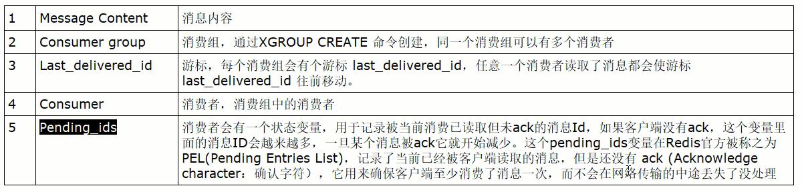

##### 基本命令

队列相关指令

| 指令名称  | 指令作用                                    |
| --------- | ------------------------------------------- |
| XADD      | 添加消息到队列末尾                          |
| XTRIM     | 限制Stream的长度，如果已经超长会进行截取    |
| XDEL      | 删除消息                                    |
| XLEN      | 获取Stream中的消息长度                      |
| XRANGE    | 获取消息列表(可以指定范围)，忽略删除的消息  |
| XREVRANGE | 和XRANGE相比，区别在于反向获取，ID从大到小  |
| XREAD     | 获取消息(阻塞/非阻塞)，返回大于指定ID的消息 |

消费组相关指令

| 指令名称           | 指令作用                                                     |
| ------------------ | ------------------------------------------------------------ |
| XGROUP CREATE      | 创建消费者组                                                 |
| XREADGROUP GROUP   | 读取消费者组中的消息                                         |
| XACK               | ack消息，消息被标记为“已处理”                                |
| XGROUP SETID       | 设置消费者组最后递送消息的ID                                 |
| XGROUP DELCONSUMER | 删除消费者组                                                 |
| XPENDING           | 打印待处理消息的详细信息                                     |
| XCLAIM             | 转移消息的归属权（长期未被处理/无法处理的消息，转交给其他消费者组进行处理） |
| XINFO              | 打印Stream\Consumer\Group的详细信息                          |

XINFO GROUPS 打印消费组的详细信息

XINFO STREAM 打印stream的详细信息

四个特殊符号

| - +  | 最小和最大可能出现的Id                                       |
| ---- | ------------------------------------------------------------ |
| $    | $表示只消费新的消息，当前流中最大的Id，可用于将要到来的信息  |
| >    | 用于XREADGROUP命令，表示迄今还没有发送给组中使用者的信息，会更新消费者组的最后Id |
| *    | 用于XADD命令，让系统自动生成Id                               |


##### xadd

添加消息到队列末尾，==消息ID必须要比上一个ID大==，默认用星号表示自动生成ID；* 用于XADD命令中，让系统自动生成ID；

XADD用于向Stream队列中添加消息，如果指定的Stream队列不存在，则该命令执行时会新建一个Stream队列

```shell
127.0.0.1:6379> xadd mystream * id 11 cname z3
"1669453947894-0"  # 消息id
127.0.0.1:6379> xadd mystraem * k1 v1 k2 v2 k3 v3
"1669453973537-0"
```

生成的消息ID，有两部分组成，毫秒时间戳-该毫秒内产生的第一条消息

'*' 表示服务器自动生成MessageID(类似MySQL里面主键auto_increment)，后面顺序跟着一堆业务key/value

| 信息条目指的是序列号，在相同的毫秒下序列号从0开始递增，序列号是64位长度，理论上在同一毫秒内生成的数据量无法到达这个级别，因此不用担心序列号会不够用。milisecondsTime指的是Redis节点服务器的本地时间，如果存在当前的毫秒时间截比以前已经存在的数据的时间戳小的话(本地时间钟后跳)，那么系统将会采用以前相同的毫秒创建新的ID，也即redis 在增加信息条目时会检查当前 id 与上一条目的 id，自动纠正错误的情况，一定要保证后面的 id 比前面大，.个流中信息条目的ID必须是单调增的，这是流的基础。 |
| ------------------------------------------------------------ |
| 客户端显示传入规则: Redis对于ID有强制要求，格式必须是**时间戳-自增Id**这样的方式，且后续ID不能小于前一个ID |
| Stream的消息内容，也就是图中的Messaget它的结构类似Hash结构，以kev-value的形式存在 |


##### xrange/xrevrange

XRANGE 	key 	start	 end	 [COUNT count]

XREVRANGE 	key 	end	 strat	 [COUNT count]

用于获取消息列表（可以指定范围），忽略删除的消息

start 表示开始值，-代表最小值

end 表示结束值，+代表最大值

count 表示最多获取多少个值

```shell
127.0.0.1:6379> xadd mystream * id 11 cname z3
"1669453947894-0"  # 消息id
127.0.0.1:6379> xadd mystraem * k1 v1 k2 v2 k3 v3
"1669453973537-0"
127.0.0.1:6379> xrange mystream - + 
1) 1) "1669453947894-0"
   2) 1) "id"
      2) "11"
      3) "cname"
      4) "z3"
2) 1) "1669453973537-0"
   2) 1) "k1"
      2) "v1"
      3) "k2"
      4) "v2"
      5) "k3"
      6) "v3"
127.0.0.1:6379> xrange mystream - + count 1
1) 1) "1669453947894-0"
   2) 1) "id"
      2) "11"
      3) "cname"
      4) "z3"
127.0.0.1:6379> xrevrange mystream + 1 count 1
2) 1) "1669453973537-0"
   2) 1) "k1"
      2) "v1"
      3) "k2"
      4) "v2"
      5) "k3"
      6) "v3"
      
```


##### xdel

按照消息id进行删除

```shell
127.0.0.1:6379> xadd mystream * id 11 cname z3
"1669453947894-0"  # 消息id
127.0.0.1:6379> xadd mystraem * k1 v1 k2 v2 k3 v3
"1669453973537-0"
127.0.0.1:6379> xdel mystream 1669453973537-0
(integer) 1
127.0.0.1:6379> xrange mystream - + 
1) 1) "1669453947894-0"
   2) 1) "id"
      2) "11"
      3) "cname"
      4) "z3"
```


##### xlen

```shell
127.0.0.1:6379> xadd mystream * id 11 cname z3
"1669453947894-0"  # 消息id
127.0.0.1:6379> xadd mystraem * k1 v1 k2 v2 k3 v3
"1669453973537-0"
127.0.0.1:6379> xlen mystream
(integer) 2
```


##### xtrim

XTRIM key MAXLEN|MINID

用于对Stream的长度进行截取，如超长会进行截取

MAXLEN 允许的最大长度，对流进行修剪限制长度

MINID 允许的最小id，从某个id值开始比该id值小的将会被抛弃

```shell
127.0.0.1:6379> xadd mystream * id 11 cname z3
"1669453947894-0"  # 消息id
127.0.0.1:6379> xadd mystraem * k1 v1 k2 v2 k3 v3
"1669453973537-0"
127.0.0.1:6379> xadd mystream * k1 v1
"1680185449454-0"
127.0.0.1:6379> xadd mystream * k2 v2
"1680185454310-0"
127.0.0.1:6379> xrange mystream - +
1) 1) "1669453947894-0"
   2) 1) "id"
      2) "11"
      3) "cname"
      4) "z3"
2) 1) "1669453973537-0"
   2) 1) "k1"
      2) "v1"
      3) "k2"
      4) "v2"
      5) "k3"
      6) "v3"
3) 1) "1680185449454-0"
   2) 1) "k1"
      2) "v1"
4) 1) "1680185454310-0"
   2) 1) "k2"
      2) "v2"
127.0.0.1:6379> xtrim mystream maxlen 2 # 截取两条最大的数据，根据id排序
(integer) 2
127.0.0.1:6379> xrange mystream - +
1) 1) "1680185449454-0"
   2) 1) "k1"
      2) "v1"
2) 1) "1680185454310-0"
   2) 1) "k2"
      2) "v2"
127.0.0.1:6379> xtrim mystream minid 1680185449454-0 # 舍弃比指定id小的数据
(integer) 0 # 没有比1680185449454-0还小的id，故而返回0
127.0.0.1:6379> xtrim mystream minid 1680185454310-0
(integer) 1
127.0.0.1:6379> xrange mystream - +
1) 1) "1680185454310-0"
   2) 1) "k2"
      2) "v2"
```


##### xread

XREAD [COUNT count] [BLOCK milliseconds] STREAMS key [key ...] id [id ...]

可以读取多个key

用于获取消息(阻塞/非阻塞)

 只会返回大于指定ID的消息，COUNT最多读取多少条消息；

BLOCK是否以阻塞的方式读取消息，默认不阻塞，如果milliseconds设置为0，表示永远阻塞

非阻塞

- ''$''表特殊ID，表示以当前Stream已经存储的最大的ID作为最后一个ID，当前Stream中不存在大于当前最大ID的消息，因此此时返回nil
- 0-0代表从最小的ID开始获取Stream中的消息，当不指定count，将会返回Stream中的所有消息，注意也可以使用0 (00/000也都是可以的)

```shell
127.0.0.1:6379> xrange mystream - +
1) 1) "1680185454310-0"
   2) 1) "k2"
      2) "v2"
2) 1) "1680186198334-0"
   2) 1) "k3"
      2) "v3"
      3) "k4"
      4) "v4"
3) 1) "1680186206339-0"
   2) 1) "k5"
      2) "v5"
4) 1) "1680186625952-0"
   2) 1) "k6"
      2) "v6"
5) 1) "1680186634848-0"
   2) 1) "k7"
      2) "v7"
127.0.0.1:6379> xread count 2 streams mystream $
(nil) # 因为$是表示当前mystream中存储的最大id，当前Stream中不存在大于当前最大ID的消息，因此此时返回nil。只有当新的数据进来，那么就出现比当前最大id还大的id，这时就不返回nil.
127.0.0.1:6379> xread count 2 streams mystream 0-0
1) 1) "mystream"
   2) 1) 1) "1680185454310-0"
         2) 1) "k2"
            2) "v2"
      2) 1) "1680186198334-0"
         2) 1) "k3"
            2) "v3"
            3) "k4"
            4) "v4"

```

阻塞

BLOCK是否以阻塞的方式读取消息，默认不阻塞，如果milliseconds设置为0，表示永远阻塞

```shell
127.0.0.1:6379> xread count 1 block 0 streams mystream $ # 此时是一直阻塞状态，直到出现比当前最大id还要大的id，才返回结果退出阻塞。即实时获取最新消息。
```


##### xgroup

XGROUP CREATE   key   group_name   id|$

$表示从Stream尾部开始消费

0表示从Stream头部开始消费

创建消费组的时候必须指定ID，ID为0表示从头开始消费，为$表示只消费新消息

```shell
127.0.0.1:6379> xgroup create mystream group_a $
OK
127.0.0.1:6379> xgroup create mystream group_b 0
OK
```


##### xreadgroup group

XREADGROUP GROUP group [COUNT count] [BLOCK milliseconds] STREAMS key id

">"，表示从第一条尚未被消费的消息开始读取

```shell
127.0.0.1:6379> xgroup create mystream group_a 0
OK
127.0.0.1:6379> xgroup create mystream group_b 0
OK
127.0.0.1:6379> xreadgroup group group_a consumer_1 streams mystream >
1) 1) "mystream"
   2) 1) 1) "1680185454310-0"
   	     2) 1) "k2"
            2) "v2"
      2) 1) "1680186198334-0"
         2) 1) "k3"
            2) "v3"
            3) "k4"
            4) "v4"
      3) 1)"1680186206339-0"
         2) 1) "k5"
            2) "v5"
      4) 1) "1680186625952-0"
         2) 1) "k6"
            2) "v6"
      5) 1) "1680186634848-0"
         2) 1) "k7"
            2) "v7"
127.0.0.1:6379> xreadgroup group group_a consumer_2 streams mystream >
(nil)
# stream 中的消息一旦被消费组里面的一个消费者读取了，就不能再被该消费组内的其他消费组读取了
# 即同一个消费组里的消费组不能消费同一条消息。之前的xreadgroup命令已经将消息读取过了，所以后面的xreadgroup命令读到的是nil。
# 但是，不同消费组的消费者可以消费同一条消息
127.0.0.1:6379> xreadgroup group group_b consumer_1 streams mystream >
1) 1) "mystream"
   2) 1) 1) "1680185454310-0"
   	     2) 1) "k2"
            2) "v2"
      2) 1) "1680186198334-0"
         2) 1) "k3"
            2) "v3"
            3) "k4"
            4) "v4"
      3) 1)"1680186206339-0"
         2) 1) "k5"
            2) "v5"
      4) 1) "1680186625952-0"
         2) 1) "k6"
            2) "v6"
      5) 1) "1680186634848-0"
         2) 1) "k7"
            2) "v7"
```

消费组groupA内的消费者consumer1从mystream消息队列中读取所有消息

消费组的目的？

让组内的多个消费者共同分担读取消息，所以，我们通常会让每个消费者读取部分消息，从而实现消息读取负载在多个消费者间是均衡分部的


重点问题

基于 Stream 实现的消息队列，如何保证消费者在发生故障或宕机再次重启后，仍然可以读取未处理完的消息?

Streams 会自动使用内部队列(也称为 PENDING List)留存消费组里每个消费者读取的消息保底措施，直到消费者使用 XACK命令通知 Streams"消息已经处理完成”。 消费确认增加了消息的可靠性，一般在业务处理完成之后，需要执行 XACK 命令确认消息已经被消费完成


##### xpending

查询每个消费组内所有消费者 ==已读取，但尚未确认==的消息。

```shell
127.0.0.1:6379> xpending mystream groupC
1) (integer) 6 # 总共读了有6条信息
2) "1659430290156-0"    # 所有消费组读取的消息最小ID
3) "1659430750387-0"    # 所有消费组读取的消息最大ID
4) 1) 1) "consumer1"
      2) "1" # 表示消费组consumer1读取了1条信息
   2) 1) "consumer2"
   	  2) "1"
   3) 1) "consumer3"
      2) "1"
127.0.0.1:6379> xpending mystream groupC - + 10 consumer2 # 获取c组的consumer2所读取未确认的消息,限定10条
1) 1) "1659430293537-0"
   2) "consumer2"
   3) (integer) 1204177
   4) (integer) 1
```


##### xack

XACK key group id [id...]

向消息队列确认消息处理已完成

```shell
127.0.0.1:6379> xpending mystream groupC  # 获取已读未确认的
1) (integer) 6 # 总共读了有6条信息
2) "1659430290156-0"    # 所有消费组读取的消息最小ID
3) "1659430750387-0"    # 所有消费组读取的消息最大ID
4) 1) 1) "consumer1"
      2) "1" # 表示消费组consumer1读取了1条信息
   2) 1) "consumer2"
   	  2) "1"
   3) 1) "consumer3"
      2) "1"
127.0.0.1:6379> xack mystream groupC 1659430293537-0 # 消息确认
(integer) 1
127.0.0.1:6379> xpending mystream groupC  # 这样获取已读未确认就会少一条.
...
...
```


##### xinfo

用于打印Stream/Consumer/Group的详细信息


---


#### 位域 BitFields

能干嘛

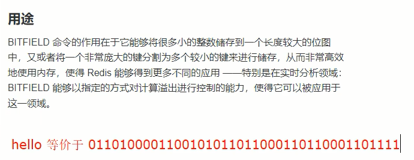

位域修改、溢出控制

一句话

将一个redis字符串看作是一个由二进制位组成的数组并能对变长位宽和任意没有字节对齐的指定整型位域进行寻址和修改


命令代码实操

Ascii码表：[https://ascii.org.cn](https://ascii.org.cn/)

##### BITFIELD key [GET type offset]


##### BITFIELD key set type offstet value


##### BITFIELD key [INCRBY type offset increment]


如果偏移量后面的值发生溢出（大于127），redis对此也有对应的溢出控制，默认情况下，INCRBY使用WRAP参数


##### 溢出控制 OVERFLOW [WRAP|SAT|FAIL]

WRAP:使用回绕(wrap around)方法处理有符号整数和无符号整数溢出情况


SAT:使用饱和计算(saturation arithmetic)方法处理溢出，下溢计算的结果为最小的整数值，而上溢计算的结果为最大的整数值


fail:命令将拒绝执行那些会导致上溢或者下溢情况出现的计算，并向用户返回空值表示计算未被执行


---


### 四、Redis 持久化

#### Redis 持久化——RDB

RDB 即 Redis DataBase

在指定的时间间隔，执行数据集的时间点快照

实现类似照片记录效果的方式，就是把某一时刻的数据和状态以文件的形式写到磁盘上，也就是快照。这样一来即使故障宕机，快照文件也不会丢失，数据的可靠性也就得到了保证。

这个快照文件就称为RDB文件(dump.rdb)其中，RDB就是Redis DataBase的缩写。

在指定的时间间隔内将内存中的数据集快照写入磁盘，也就是行话讲的snapshot内存快照，它恢复时再将硬盘快照文件直接读回到内存里。

Redis的数据都在内存中，保存备份时它执行的是全量快照，也就是说，把内存中的所有数据都记录到磁盘中，一锅端。

RDB保存的是dump.rdb文件。


##### 配置文件(6 VS 7)

Redis6.0.16及以下


Redis6.2以及Redis-7.0.0


##### 操作步骤

默认情况下，Redis 将数据集的快照保存在磁盘上名为 dump.rdb 的二进制文件中。可以将 Redis 配置为如果 Redis 中至少有 M 个更改，则每 N 秒保存一次数据集，也可以手动调用 SAVE 或 BGSAVE 命令进行快照保存。

自动触发

案例： 5秒2次修改

修改配置文件redis7.conf

```shell
# save 3600 1 300 100 60 10000
save 5 2 # 5秒内修改2次就保存
dir /myredis/dumpfiles # 修改自定义保存路径。 注意，指定dump文件保存路径需要手动创建，不然报错
dbfilename dump6379.rdb # 修改备份文件名
```

```shell
redis-server /myredis/redis7.conf # 修改配置，记得要重启redis服务
```

在redis-cli里面使用 `config get dir` 获取目录

```shell
127.0.0.1:6379> config get dir
1) "dir"
2) "/myredis/dumpfiles"
```

注：RDB 持久化是 Redis 的一种持久化机制，它会在 Redis 数据发生修改时对内存中的数据进行快照，然后保存到磁盘，以保证数据的持久性。通常情况下，RDB 保存快照的时间间隔由配置文件中的参数 save 决定，格式为 save <seconds> <changes>，表示在 <seconds> 秒内，如果数据有 <changes> 次修改，则会进行一次快照。

在题目描述的情况下，RDB 设置了每 5 秒进行一次快照，但是如果在 5 秒内修改次数超过了 2 次，也会进行快照。这是因为在 Redis 中，保存快照并不是在规定的时间到达后才进行，而是在修改数据时和时间间隔条件的双重限制下才进行的。

如果限制只按时间间隔来进行保存快照，则会出现两个问题：

如果时间间隔太大，那么 Redis 持久化的数据可能会丢失，并且故障恢复时的数据可能会受到影响。

如果时间间隔太小，那么数据的保存成本就会过高，并可能导致 Redis 运行效率下降。

因此，Redis 引入了按时间和数据修改次数双重限制的快照保存机制，以在灵活性和效率之间取得平衡。如果在 5 秒内修改的次数超过 2 次，则说明数据的变化较快，在此情况下保存快照并不会带来明显的性能问题。因此，Redis 将其纳入保存快照的范围，以保证数据的安全和一致性

##### 手动触发

使用save或者bgsave命令

**save**：在主程序中执行会**阻塞**当前redis服务器，直到持久化工作完成执行save命令期间，Redis不能处理其他命令，线上禁止使用

**bgsave(默认)**：

- redis会在后台异步进行快照操作，**不阻塞**快照同时还可以相应客户端请求，该触发方式会fork一个子进程由子进程复制持久化过程
- Redis会使用bgsave对当前内存中的所有数据做快照，这个操作是子进程在后台完成的，这就允许主进程同时可以修改数据。

可以通过lastsave命令获取最后一次成功执行快照的时间

```shell
127.0.0.1:6379> lastsave
(integer) 1668604512 # 获取时间戳
```


##### 如何恢复

将备份文件(dump.rdb)移动到 Redis 安装目录并启动服务即可

备份成功后故意用flushdb清空redis，看看是否可以恢复数据

- 执行flushall/flushdb命令也会产生dump.rdb文件，但里面是空的，无意义
- 使用shutdown退出redis-server，redis会自动生成一个rdb文件，保存最新的数据。

物理恢复，一定要将服务产生的RDB文件备份一份，然后分机隔离，避免生产上物理损坏后备份文件也挂了。

不可以把备份文件dump.rdb和生产redis服务器放在同一台机器上，必须分开各自存储，以防生产机物理损坏后备份文件也挂掉。

```shell
# 将产生的RDB文件改个名字
mv dump6379.rdb dump6379.rdb.bak
# 进入redis-cli
127.0.0.1:6379> flushdb
OK
# 退出redis-cli
# 发现服务器又生成了一个RDB文件，此时将最新的RDB文件删除，然后将之前的RDB恢复名字
rm dump6379.rdb
mv dump6379.rdb.bak dump6379.rdb

# 重启服务，进行验证
redis-server /myredis/redis7.conf
redis-cli -a xxxx

```


##### 优缺点

优点：

- RDB是Redis 数据的一个非常紧凑的单文件时间点表示。RDB文件非常适合备份。例如，您可能希望在最近的24小时内每小时归档一次RDB文件，并在30天内每天保存一个RDB快照。这使您可以在发生灾难时轻松恢复不同版本的数据集。
- RDB非常适合灾难恢复，它是一个可以传输到远程数据中心或Amazon S3(可能已加密）的压缩文件。
- RDB最大限度地提高了Redis 的性能，因为Redis 父进程为了持久化而需要做的唯一工作就是派生一个将完成所有其余工作的子进程。父进程永远不会执行磁盘I/О或类似操作。
- 与AOF 相比，RDB允许使用大数据集更快地重启。
- 在副本上，RDB支持重启和故障转移后的部分重新同步。

小总结：

- 适合大规模的数据恢复
- 按照业务定时备份
- 对数据完整性和一致性要求不高
- RDB文件在内存中的加载速度要比AOF快很多

缺点：

- 如果您需要在Redis停止工作时（例如断电后）将数据丢失的可能性降到最低，那么RDB并不好。您可以配置生成RDB的不同保存点（例如，在对数据集至少5分钟和100次写入之后，您可以有多个保存点)。但是，您通常会每五分钟或更长时间创建一次RDB快照，因此，如果Redis由于任何原因在没有正确关闭的情况下停止工作，您应该准备好丢失最新分钟的数据。
- RDB需要经常fork()以便使用子进程在磁盘上持久化。如果数据集很大，fork()可能会很耗时，并且如果数据集很大并且CPU性能不是很好，可能会导致Redis停止为客户端服务几毫秒甚至一秒钟。AOF也需要fork()但频率较低，您可以调整要重写日志的频率，而不需要对持久性进行任何权衡。

小总结：

- 在一定间隔时间做一次备份，所以如果redis意外down掉的话，就会丢失从当前至最近一次快照期间的数据，**快照之间的数据会丢失**
- 内存数据的全量同步，如果数据量太大会导致IO严重影响服务器性能
- RDB依赖于主进程的fork，在更大的数据集中，这可能会导致服务请求的瞬间延迟。fork的时候内存中的数据被克隆了一份，大致2倍的膨胀性，需要考虑


##### RDB文件

如何检查修复dump.rdb文件？

进入到redis安装目录，执行`redis-check-rdb`命令

` redis-check-rdb ./redisconfig/dump.rdb`

哪些情况会触发RDB快照

1. 配置文件中默认的快照配置
2. 手动save/bgsave命令
3. 执行flushdb/fulshall命令也会产生dump.rdb文件，但是也会将命令记录到dump.rdb文件中，恢复后依旧是空，无意义
4. 执行shutdown且没有设置开启AOF持久化
5. 主从复制时，主节点自动触发

如何禁用快照

1. 动态停止RDB保存规则的方法：`redis-cli config set save ""`

2. 手动修改配置文件

   

   去掉那个注释，即可开启禁用rdb快照功能


配置文件SNAPSHOTTING模块

- `save <seconds> <changes>`：配置快照保存条件
- dir：配置快照保存目录地址
- dbfilename：配置快照的文件名
- stop-writes-on-bgsave-error：

​	默认yes，如果配置成no，表示不在乎数据不一致或者有其他的手段发现和控制这种不一致，那么在快照写入失败时，也能确保redis继续接受新的请求

- rdbcompression：


​	默认yes，对于存储到磁盘中的快照，可以设置是否进行压缩存储。如果是的话，Redis会采用LZF算法进行压缩。如果你不想消耗CPU来进行压缩的话，可以设置为关闭此功能

- rdbchecksum:

  

  默认yes，在存储快照后，还可以让redis使用CRC64算法来进行数据校验，但是这样做会增加大约10%的性能消耗，如果希望获取到最大的性能提升，可以关闭此功能

- rdb-del-sync-files:	

在没有持久化的情况下删除复制中使用的RDB文件。默认情况下no，此选项是禁用的。

##### 总结


---


#### Redis 持久化——AOF

是什么

以日志的形式来记录每个写操作，将Redis执行过的所有写指令记录下来(读操作不记录)，只许追加文件但是不可以改写文件，redis启动之初会读取该文件重新构建数据，换言之，redis重启的话就根据日志文件的内容将写指令从前到后执行一次以完成数据的恢复工作

默认情况下，redis是没有开启AOF的。开启AOF功能需要设置配置：appendonly yes

AOF保存的是appendonly.aof文件

##### AOF持久化工作流程


1.Client作为命令的来源，会有多个源头以及源源不断的请求命令。

2.在这些命令到达Redis Server 以后并不是直接写入AOF文件，会将其这些命令先放入AOF缓存中进行保存。这里的AOF缓冲区实际上是内存中的一片区域，存在的目的是当这些命令达到一定量以后再写入磁盘，避免频繁的磁盘IO操作。

3.AOF缓冲会根据AOF缓冲区==同步文件的三种写回策略==将命令写入磁盘上的AOF文件。

4.随着写入AOF内容的增加为避免文件膨胀，会根据规则进行命令的合并(又称==AOF重写==)，从而起到AOF文件压缩的目的。

5.当Redis Server服务器重启的时候会对AOF文件载入数据。

##### AOF缓冲区三种写回策略


**ALways**：同步写回，每个写命令执行完立刻同步地将日志写会磁盘

**everysec**：每秒写回，每个写命令执行完，只是先把日志写到AOF文件的内存缓冲区，每隔1秒把缓冲区中的内容写入到磁盘

**no**：操作系统控制的写回，每个写命令执行完，只是先把日志写到AOF文件的内存缓冲区，由操作系统决定何时将缓冲区内容写回磁盘

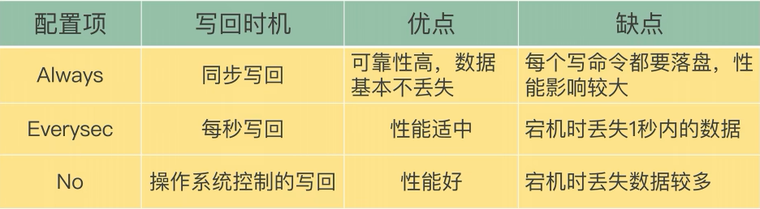

##### 配置文件(6 VS 7 )

如何开启aof

```shell
# redis.conf
...
appendonly yes
...
```

设置写回策略

```shell
# redis.conf
...
# appendfsync always
appendfsync everysec
# appendfsync no
...
```

aof保存路径设置

redis6及以前

AOF保存文件的位置和RDB保存文件的位置一样，都是通过redis.conf配置文件的dir配置

```shell
# redis.conf
...
dir /myredis
...
```

redis7及最新

```shell
# redis.conf
...
dir /myredis
appendirname "appendonlydir"
...
```

即

aof文件保存名称

redis6及以前

```shell
# redis.conf
...
appendfilename "appendonly.aof" # 有且只有一个
...
```

redis7及最新

.jpg)

实行的是MP-AOF （Multi Part AOF）方案，即

将原来的单个AOF文件拆分成多个AOF文件。在MP-AOF中，我们将AOF分为三种类型, 分别为:

- **BASE: 表示基础AOF**，它一般由子进程通过重写产生，该文件最多只有一个。
- **INCR:表示增量AOF**，它一般会在AOFRW开始执行时被创建，该文件可能存在多个。一般写记录就存在这
- **HISTORY**:表示历史AOF，它由BASE和INCR AOF变化而来，每次AOFRW成功完成时，本次AOFRW之前对应的BASE和INCR AOF都将变为HISTORY，==HISTORY类型的AOF会被Redis自动删除==。

为了管理这些AOF文件，我们引入了一个manifest (清单)文件来跟踪、管理这些AOF。同时，为了便于AOF备份和拷贝，我们将所有的AOF文件和manifest文件放入一个单独的文件目录中，目录名由appenddirname配置(Redis 7.0新增配置项)决定。


redis7 中的配置项


##### 如何恢复

正常恢复

开启AOF后，按照配置文件生成aof文件到指定的目录

写操作继续，生成aof文件到指定目录（然后将appendonly文件备份，使用flushdb+shutdown服务器来模拟redis宕机数据丢失

先将旧的appendonly文件夹删除,将备份好的appendonly放回去,因为之前的flushdb操作也被记录到了之前旧的aof中去了.

故而需要删除

恢复：重启redis然后重新加载，将数据重新写入到redis


异常恢复

故意胡乱改动正常的AOF文件，模拟网络闪断文件写入不完整等其他异常情况

重启redis，进行aof加载，发现服务连接不上，redis服务启动失败

异常修复命令：`redis-check-aof --fix` 进行修复	

```shell
# bash
redis-check-aof --fix /myredis/appendonlydir/appendonly.aof* # 修复只认两种类型，.aof与.manifest文件
```


##### 优缺点

优点:

- 更好的保护数据不丢失、性能高、可做紧急恢复
- 使用AOF Redis 更加持久: 您可以有不同的fsync 策略: 根本不fsync、每秒 fsync、每次查询时fsync。使用每秒fsync的默认策略，写入性能仍然很棒。fsync 是使用后台线程执行的，当没有fsync正在进行时，主线程将努力执行写入，因此您只能丢失一秒钟的写入。
- AOF 日志是一个仅附加日志，因此不会出现寻道问题，也不会在断电时出现损坏问题。即使由于某种原因(磁盘已满或其他原因) 日志以写一半的命令结尾，redis-check-aof 工具也能够轻松修复它。
- 当AOF 变得太大时，Redis 能够在后台自动重写AOF。重写是完全安全的，因为当 Redis继续附加到旧文件时，会使用创建当前数据集所需的最少操作集生成一个全新的文件，一旦第二个文件准备就绪，Redis 就会切换两者并开始附加到新的那一个。
- AOF以易于理解和解析的格式依次包含所有操作的日志。您甚至可以轻松导出AOF文件。例如，即使您不小心使用孩FLUSHALL命令刷新了所有内容，只要在此期间没有执行日志重写，您仍然可以通过停止服务器、删除最新命令并重新启动 Redis 来保存您的数据集。

缺点:

相同数据集的数据而言AOF文件要远大于RDB文件，恢复速度慢于RDB

AOF运行效率要慢于RDB，每秒同步策略效率较好，不同步效率和RDB相同

- AOF文件通常比相同数据集的等效 RDB 文件大。
- 根据确切的 fsync策略，AOF可能比 RDB 慢。一般来说，将fsync 设置为每秒性能仍然非常高，并且在禁用 fsync的情况下，即使在高负载下它也应该与 RDB 一样快。即使在巨大的写入负载的情况下，RDB仍然能够提供关于最大延迟的更多保证。


##### AOF重写机制

是什么？

由于AOF持久化是Redis不断将写命令记录到 AOF 文件中，随着Redis不断的进行，AOF 的文件会越来越大,文件越大，占用服务器内存越大以及 AOF 恢复要求时间越长。 为了解决这个问题，**Redis新增了重写机制**，当AOF文件的大小超过所设定的峰值时，Redis就会**自动**启动AOF文件的内容压缩.只保留可以恢复数据的最小指令集或者可以**手动使用命令 bgrewriteaof 来重新**。

即启动AOF文件的内容压缩，只保留可以恢复数据的最小指令集。

触发机制

```shell
# redis.conf 默认配置
...
auto-aof-rewrite-percentage 100 # 百分比
auto-aof-rewrite-min-size 64mb
...
```

同时满足上面两条规则才会触发,即:

根据上次重写后的aof的大小,判断当前aof大小是不是增长了1倍

重写时满足的文件大小


自动触发

满足配置文件中的选项后,Redis会记录上次重写时的AOF大小,默认配置是当AOF文件大小是上次rewrite后大小的一倍且文件大于64M时

手动触发

客户端向服务器发送 `bgrewriteaof`命令

启动AOF文件的内容压缩，只保留可以恢复数据的最小指令集。

 举个例子: 比如有个key 开始你 set k1 v1 然后改成 set k1 v2 最后改成 set k1 v3 如果不重写，那么这3条语句都在aof文件中，内容占空间不说启动的时候都要执行一遍，共计3条命令但是，我们实际效果只需要set k1 v3这一条，所以， 开启重写后，只需要保存set k1 3就可以了只需要保留最后一次修改值，相当于给aof文件瘦身减肥，性能更好。 AOF重写不仅降低了文件的占用空间，同时更小的AOF也可以更快地被Redis加载。


**AOF文件重写并不是对原文件进行重新整理，而是直接读取服务器现有的键值对，然后用一条命令去代替之前记录这个键值对的多条命令，生成一个新的文件后去替换原来的AOF文件。** AOF文件重写触发机制:通过 redis.conf配置文件中的 auto-aof-rewrite-percentage:默认值为100，以及auto-aof-rewrite-min-size: 64mb配置，也就是说默认Redis会记录上次重写时的AOF大小，**默认配置是当AOF文件大小是上次rewrite后大小的一倍且文件大于64M时触发。


#### RDB-AOF 混合持久化

**问题：**

可否共存？

如果共存听谁的？

**Redis配置文档解答：RDB和AOF共存时会优先加载AOF文件**


数据恢复顺序和加载流程


怎么选？用哪个？

- RDB持久化方式能够在指定的时间间隔对你的数据进行快照存储。
- AOF持久化方式记录每次对服务器写的操作，当服务器重启的时候会重新执行这些命令来恢复原始的数据，AOF命令以redis协议追加保存每次写的操作到文件末尾。

同时开启两种持久化方式

- 在这种情况下，$\textcolor{red}{当redis重启的时候会优先载入AOF文件来恢复原始的数据}$，因为在通常情况下AOF文件保存的数据集要比RDB文件保存的数据集要完整。
- RDB的数据不实时，同时使用两者时服务器重启也只会找AOF文件。但是作者也不建议只使用AOF方式备份，因为RDB更适合用于备份数据库（AOF在不断的变化不好备份），留着RDB作为一个万一的手段。

推荐方式

RDB+AOF混合方式

1开启混合方式设置 设置aof−use−rdb−preamble的值为yes，yes表示开启，设置为no表示禁用 2 RDB+AOF的混合方式.结论:RDB镜像做全量持久化，AOF做增量持久化 先使用RDB进行快照存储，然后使用AOF持久化记录所有的写操作，当重写策略满足或手动触发重写的时候，将最新的数据存储为新的RDB记录。这样的话，重启服务的时候会从RDB和AOF两部分恢复数据，既保证了数据完整性，又提高了恢复数据的性能。简单来说:混合持久化方式产生的文件一部分是RDB格式，一部分是AOF格式。AOF包括了RDB头部+AOF混写


#### 纯缓存模式

同时关闭RDB与AOF。不需要redis持久化

```shell
# redis.conf
...
save ""  # 禁用rdb,仍然可以使用命令save,bgsave生成rdb文件
appendonly no # 禁用aof,仍然可以使用命令bgrewriteaof生成aof文件
```


### 五、Redis事务

可以一次执行多个命令,本质是一组命令的集合,一个事务中的所有命令都会序列化,按顺序地串行化执行而不会被其他命令插入,不允许加塞.

一个队列中,一次性,顺序性,排他性的执行一系列命令。

#### Redis事务 VS 数据库事务

1. 单独的隔离操作：Redis的事务仅仅是保证事务里的操作会被连续独占的执行，redis命令执行是单线程架构，在执行完事务内所有指令前是不可能再去同时执行其他客户端的请求的
2. 没有隔离级别的概念：因为事务提交前任何指令都不会被实际执行，也就不存在”事务内的查询要看到事务里的更新，在事务外查询不能看到”这种问题了
3. 不保证原子性：Redis的事务不保证原子性（或者说部分支持原子性），也就是不保证所有指令同时成功或同时失败，只有决定是否开始执行全部指令的能力，没有执行到一半进行回滚的能力
4. 排它性：Redis会保证一个事务内的命令依次执行，而不会被其它命令插入


#### 常用命令

##### discard

取消事务，放弃执行事务块内的所有命令

##### exec

执行所有事务块的命令

##### multi

标记一个事务块的开始

##### watch

监视一个或多个key，如果在事务执行之前这个或这些key被其他命令所改动，那么事务将被打断。

##### unwatch

取消watch命令对所有key的监视


#### 案例

##### 正常执行 MULTI EXEC


##### 放弃事务 MULTI DISCARD


##### 全体连坐

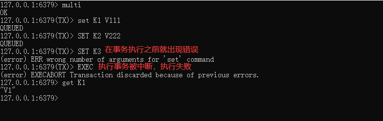

一个语法出错，全体连坐。如果任何一个命令语法有错，Redis会直接返回错误，所有的命令都不会执行,整体取消.

##### 冤头债主

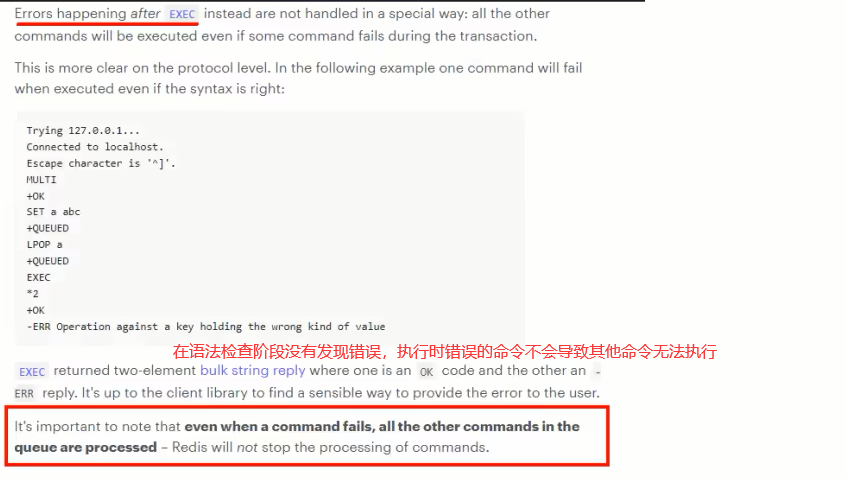

redis 不提供事务回滚的功能,开发者必须在事务执行出错后,自行恢复数据库专题.注意和传统数据库事务的区别，不一定要么全部成功要么全部失败


##### watch监控

**Redis使用Watch来提供乐观锁定，类似于CAS(Check-and-Set)**

1. 悲观锁：悲观锁(Pessimistic Lock)，顾名思义，就是很悲观，每次去拿数据的时候都认为别人会修改，所以每次在拿数据的时候都会上锁，这样别人想拿这个数据就会block直到它拿到锁

2. 乐观锁：乐观锁(Optimistic Lock)，顾名思义，就是很乐观，每次去拿数据的时候都认为别人不会修改，$\textcolor{red}{所以不会上锁}$，但是在更新的时候会判断一下在此期间别人有没有去更新这个数据。

   乐观锁策略：提交版本必须大于记录当前版本才能执行更新

watch key [key ...]

初始化k1和balance两个key，先监控在开启multi，保证两个key变动在同一个事务内

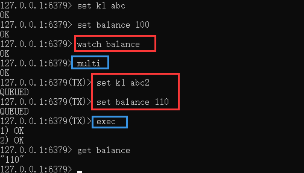

有加塞篡改: watch命令是一种乐观锁的实现，Redis在修改的时候会检测数据是否被更改，如果被更改了，则执行失败


图中3和4不管哪个先执行，最终的结果都是整个事务执行失

总结:

​	开启: 以MULTI开始一个事务

​       入队: 将多个命令入队到事务中,接到这些命令并不会立即执行,而是放到等待执行的事务队列里面.

​       执行: 由EXEC命令触发事务.

---


### 六、Redis管道

#### 简介

Redis是一种基于**客户端-服务端模型**以及请求/响应协议的TCP服务。一个请求会遵循以下步骤: 1客户端向服务端发送命令分四步(发送命令→命令排队→命令执行-返回结果)，并监听Socket返回，通常以阻塞模式等待服务端响应。 2服务端处理命令，并将结果返回给客户端。 上述两步称为: Round Trip Time(简称RTT,数据包往返于两端的时间)。

如果同时需要执行大量的命令，那么就要等待上一条命令应答后再执行，这中间不仅仅多了RTT (Round Time Trip) ，而且还频繁调用系统IO， 发送网络请求，同时需要redis调用多次read()和write()系统方法， 系统方法会将数据从用户态转移到内核态，这样就会对进程上下文有比较大的影响了，性能不太好，0(π_ π)0。这时候Redis管道就出现了。


管道(pipeline)可以一次性发送多条命令给服务端，**服务端依次处理完毕后，通过一 条响应一次性将结果返回，通过减少客户端与redis的通信次数来实现降低往返延时时间**。pipeline实现的原理是队列，先进先出特性就保证数据的顺序性。

pipeline是为了解决RTT往返时，仅仅是将命令打包一次性发送，对整个Redis的执行不造成其他任何影响

**批处理命令变种优化措施**，类似Redis的原生批命令(mget和mset)


#### 例子

```shell
[root@xxx myredis]# cat cmd.txt
set k1 v1
set k2 v2
hset k3 name mrhow
hset k4 age 20
lpush list 1 2 3 4 5           # 将这些命令通过管道一次性执行
[root@xxx myredis]# cat cmd.txt | redis-cli -a xxxx --pipe   # 这里的|是linux的管道, --pipe是redis的管道.
```

####  总结

- pipeline与原生批量命令对比
  1. 原生批量命令是原子性(例如：mset、mget)，$\textcolor{red}{pipeline是非原子性的}$
  2. 原生批量命令一次只能执行一种命令，pipeline支持批量执行不同命令
  3. 原生批量命令是服务端实现，而pipeline需要服务端与客户端共同完成
- pipeline与事务对比
  1. 事务具有原子性，管道不具有原子性
  2. 管道一次性将多条命令发送到服务器，事务是一条一条的发，事务只有在接收到exec命令后才会执行，管道不会
  3. 执行事务时会阻塞其他命令的执行，而执行管道中的命令时不会
- 使用pipeline注意事项
  1. pipeline缓冲的指令只是会依次执行，不保证原子性，如果执行中指令发生异常，将会继续执行后续的指令
  2. 使用pipeline组装的命令个数不能太多，不然数量过大客户端阻塞的时间可能过久，同时服务端此时也被迫回复一个队列答复，占用很多内存

---


### 七、Redis发布订阅

是一种消息通信模式：发送者(PUBLISH)发送消息，订阅者(SUBSCRIBE)接收消息，可以实现进程间的消息传递.

Redis可以实现消息中间件MQ的功能，通过发布订阅实现消息的引导和分流。但是目前不推荐使用该功能，专业的事情交给专业的中间件处理，redis就做好分布式缓存功能

​	 

​	

当有新消息通过publish命令发送给频道channel1时，订阅客户端都会收到消息


#### 常用命令


#### subscribe

SUBSCRIBE channel [channel ...]

订阅给定的一个或多个频道的信息

推荐先执行订阅然后在发布，订阅成功之前发布的消息是收不到的

订阅的客户端每次可以收到一个3个参数的消息

1. 消息种类
2. 始发频道的名称
3. 实际的消息内容


#### publish

PUBLISH channel message

发布消息到指定的频道


#### psubscribe

PSUBSCRIBE pattern [pattern ...]

带模式的订阅,批量订阅,支持 "*"代表所有.

#### pubsub

PUBSUB subcommand [argument [argument ...]]

查看订阅与发布系统

PUBSUB CHANNELS

 由活跃频道组成的列表

PUBSUB NUMSUB [channel [channel ...]]

 某个频道有几个订阅者

PUBSUB NUMPAT

 只统计使用PSUBSCRIBE命令执行的返回客户端订阅的唯一$\textcolor{red}{模式的数量}$


#### 案例:

开启两个客户端,演示客户端A订阅消息,客户端B发布消息

```shell
# 客户端A
127.0.0.1:6379> subscribe c1
Reading message...(press Ctrl-C to quit)
1) "subscribe"
2) "c1"
3) (integer) 1
```

```shell
# 客户端B
127.0.0.1:6379> publish c1 hello
(integer) 1 # 一个人收到,即客户端A
```

```shell
# 客户端A
127.0.0.1:6379> subscribe c1
Reading message...(press Ctrl-C to quit)
1) "subscribe"
2) "c1"
3) (integer) 1
1) "message"
2) "c1"
3) "hello"
```


演示批量订阅和发布

```shell
127.0.0.1:6379> psubscribe c* a* b* # 订阅 c开头，a开头，b开头的频道
127.0.0.1:6379> pubsub NUMPAT
(integer) 3
127.0.0.1:6379> pubsub channels
1) "c1"
2) "c2"
```


取消订阅


#### 小总结


**可以实现消息中间件MQ的功能，通过发布订阅实现消息的引导和分流。但是不推荐使用该功能，专业的事情交给专业的中间件处理，redis就做好分布式缓存功能**

PUB/SUB缺点

1. 发布的消息在Redis系统中不能持久化，因此，必须先执行订阅，在等待消息发布。如果先发布了消息，那么该消息由于没有订阅者，消息将被直接丢弃
2. 消息只管发送，对于发布者而言消息是即发即失，不管接受，也没有ACK机制，无法保证消息的消费成功
3. 以上的缺点导致Redis的Pub/Sub模式就像个小玩具，在生产环境中几乎无用武之地，为此Redis5.0版本新增了Stream数据结构，不但支持多播，还支持数据持久化，相比Pub/Sub更加的强大


### 八、Redis主从复制

#### 介绍


主从备份，一句话：就是主从复制，master以写为主，slave以读为主，当master数据变化的时候，自动将新的数据异步同步到其他的slave数据库

作用：

- 读写分离
- 容灾恢复
- 数据备份
- 水平扩容支撑高并发

==配从库不配主库==

master如果配置了requirepass参数，需要密码登录 ，那么slave就要配置masterauth来设置校验密码，否则的话master会拒绝slave的访问请求


#### 常用命令

**info replication** ：可以查看复制结点的主从关系和配置信息

**replicaof 主库IP 主库端口** ：就是认谁是老大, 一般写入进从机的Redis.conf配置文件内，重启后生效.

**slaveof 主库IP 主库端口** ：使用命令操作, 临时切换, 手动的形式指定老大.

 每次与master断开之后，都需要重新连接，除非你配置进了redis.conf文件；在运行期间修改slave节点的信息，如果该数据库已经是某个主数据库的从数据库，那么会停止和原主数据库的同步关系 转而和新的主数据库同步，重新拜码头

**slaveof no one** ：使当前数据库停止与其他数据库的同步，$\textcolor{red}{转成主数据库，自立为王}$


#### 案例演示

一个Master两个Slave，三台虚拟机，每台都安装redis


拷贝多个redis.conf文件

redis6379.conf、redis6380.conf、redis6381.conf

小口诀

三台虚拟机需要能相互ping通且需要注意防火墙配置

三大命令：

1. 主从复制

   replicaof 主库IP 主库端口，配从(库)不配主(库)

2. 改换门庭

   slaveof 新主库IP 新主库端口

3. 自立为王

   slaveof no one

##### 修改配置文件

redis6379.conf为例，步骤如下：

1. 开启daemonize yes  ,  后台运行

   

2. 注释掉bind 127.0.0.1  , 

3. protected-mode no, 关闭保护模式

   

4. 指定端口

   

5. 指定当前工作目录，dir

   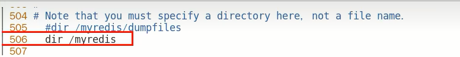

6. pid文件名字，pidfile   进程文件

   

7. log文件名字，logfile  日志文件

   **如果日志文件和启动文件同级，这里可以配置为./6379.log，否则这里一定要写绝对路径，是个巨坑！！！**

   

8. requiredpass   设置密码

   

9. dump.rdb   设置持久化RDB文件名字

   

10. aof文件，appendfilename ,是否开启aof

    

11. ==从机访问主机的通行密码masterauth，必须配置==  **从机需要配置，主机不用**

    

12. 配置从机设置

    


##### 一主二仆

方案1：配置文件固定写死主从关系

- 配置文件执行：replicaof 主库IP 主库端口

- 配从(库)不配(主)库：配置从机

  

- 先master后两台slave依次启动

  

- 主从关系查看

  主机日志

  

  从机日志

  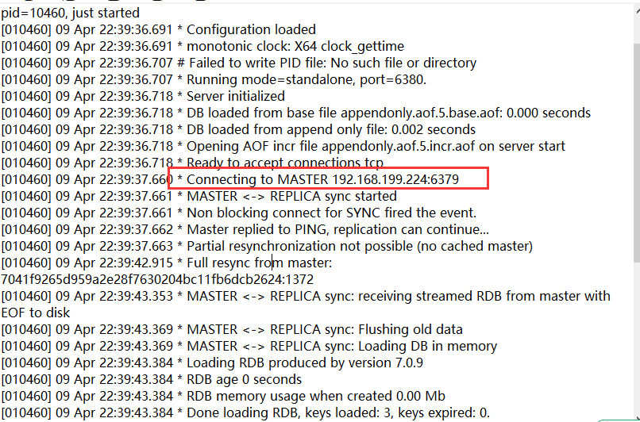

  命令：info replication命令查看

  

Q: 从机是否可以执行写命令吗?

A: 不可以,从机只能读


Q: slave是从头开始复制还是从切入点开始复制?

 A: master启动，写到k3. slave1跟着master同时启动，跟着写到k3 slave2写到k3后才启动，那之前的是否也可以复制?  可以.


Q: 主机shutdown后，从机会上位吗？

A: 从机不动，原地待命，从机数据可以正常使用，等待主机重启归来


Q: 主机shutdown后，重启后主从关系还在吗？从机还能否顺利复制？

A: 主从关系依然存在，从机依旧是从机，可以顺利复制


Q: 某台从机down后，master继续，从机重启后它能跟上大部队吗？

A: 可以，类似于从机切入点问题


方案2：命令操作手动主从关系指令

- 从机停机去掉配置文件中的配置项，3台目前都是主机状态，各不从属, 三台主机

- 预设的从机上执行命令   salveof 主库IP 主库端口

  

Q:使用命令来实现主从关系,从机重启后,关系是否还在?

A: 不存在


##### 薪火相传

- 上一个slave可以是下一个slave的master，slave同样可以接收其他slaves的连接和同步请求，那么该slave作为了链条中下一个的master,可以有效减轻主master的写压力

- 中途变更转向:会清除之前的数据，重新建立主从关系并拷贝最新的

  slaveof 新主库IP 新主库端口


Q: 中间的redis既是主机的从机又是下一个redis的主机,那么中间的redis是否能够写操作呢?

A: 不能.只是改变传递的方向.


##### 反客为主

从机变主机   slaveof no one 使当前数据库停止与其他数据库的同步关系


#### 复制原理和工作流程

1. slave 启动, 同步初请

   - slave启动成功链接到master后会发送一个sync命令
   - slave首次全新连接master，一次完全同步(全量复制)将被自动执行，slave自身原有数据会被master数据覆盖清除

2. 首次连接, 全量复制

   - master节点收到sync命令后会开始在后台保存快照(即RDB持久化，主从复制时会触发RDB)，同时收集所有接收到的用于修改数据集的命令并缓存起来，master节点执行RDB持久化完后，master将RDB快照文件和所有缓存的命令发送到所有slave，以完成一次完全同步
   - 而slave服务在接收到数据库文件数据后，将其存盘并加载到内存中，从而完成复制初始化

3. 心跳持续, 保持通信

   master发ping包的周期,默认时间是10s

   repl-ping-replica-period 10

4. 进入平稳, 增量复制

   - master继续将新的所有收集到的修改命令自动依次传送给slave，完成同步

5. 从机下线, 重连续传

   - master会检查backlog里面的offset，master和slave都会保存一个复制的offset还有一个masterId，offset是保存在backlog中的。==master只会把已经缓存的offset后面的数据复制给slave，类似断点续传==

#### 复制的缺点

- 复制延时，信号衰减

  由于所有的写操作都是先在Master上操作，然后同步更新到Slave上，所以从Master同步到Slave机器有一定的延迟，当系统很繁忙的时候，延迟问题会更加严重，Slave机器数量的增加也会使这个问题更加严重。

- master挂了怎么办？

  默认情况下，不会在slave节点中自动选一个master

  那每次都要人工干预？ -> 无人值守变成刚需


### 九、Redis哨兵监控

#### 介绍

哨兵(Sentinel)是什么?

吹哨人巡查监控后台master主机是否故障，如果故障了根据$\textcolor{red}{投票数}$自动将某一个从库转换为新主库，继续对外服务

监控redis 运行状态,包括master 和 slave, 当master 宕机,能自动将slave切换为新的master


**主从监控**：监控主从redis库运行是否正常

**消息通知**：哨兵可以将故障转移的结果发送给客户端

**故障转移**：如果master异常，则会进行主从切换，将其中一个slave作为新master

**配置中心**：客户端通过连接哨兵来获得当前Redis服务的主节点地址


Redis Sentinel架构，前提说明

- 3个哨兵：自动监控和维护集群，不存放数据，只是吹哨人
- 1主2从：用于数据读取和存放

哨兵的配置文件和redis配置文件不一样.

/opt目录下默认的 sentinel.conf文件

拷贝一份到myredis目录下 `cp sentinel.conf /myredis/`

sentinel.conf 重点参数

- bind：服务监听地址，用于客户端连接，默认本机地址

- daemonize：是否以后台daemon方式运行

- protected-model：安全保护模式

- port：端口

- logfile：日志文件路径

- pidfile：pid文件路径

- dir：工作目录

- ==sentinel monitor <master.name> <ip> <redis-port> <quorum>==

  设置要监控的master服务器

  quorum表示最少有几个哨兵认可客观下线，同意故障迁移的法定票数

  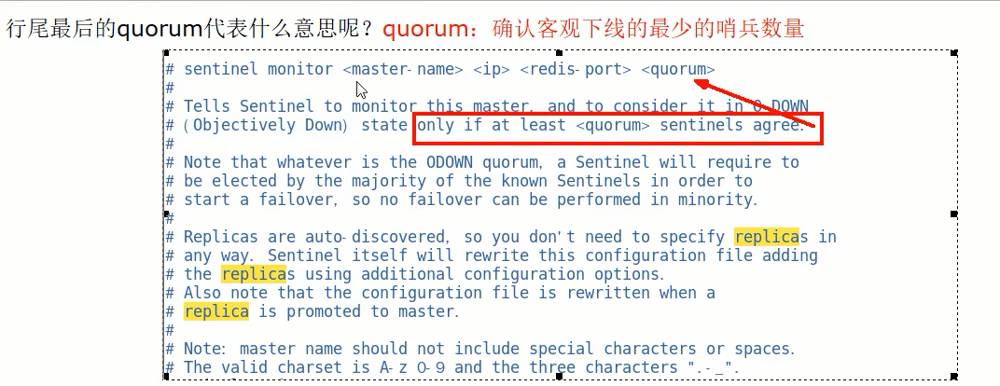

  网络是不可靠的,有时候一个sentinel会因为网络堵塞而误以为master redis已经死掉，在sentinel集群环境下需要多个sentinel互相沟通来确认某个master是否真的死掉了，quorum这个参数是进行客观下线的一个依据，意思是至少有quorum个sentinel认为这个master有故障，才会对这个master进行下线以及故障转移。因为有的时候，某个sentinel节点可能因为自身网络原因，导致无法连接master，而此时master并没有出现故障，所以，这就需要多个sentinel都一致认为改master有问题，才可以进行下一步操作，这就保证了公平性和高可用。

- ==sentinel auth−pass <master-name> <password>==

  master设置了密码，连接master服务的密码

- 其他参数

  | sentinel down-after-milliseconds | 指定多少毫秒之后，主节点没有应答哨兵，此时哨兵主观上认为主节点下线 |
  | :------------------------------- | ------------------------------------------------------------ |
  | sentinel parallel-syncs          | 表示允许并行同步的slave个数，当Master挂了后，哨兵会选出新的Master，此时，剩余的slave会向新的master发起同步数据 |
  | sentinel failover-timeout        | 故障转移的超时时间，进行故障转移时，如果超过设置的毫秒，表示故障转移失败 |
  | sentinel notification-script     | 配置当某一事件发生时所需要执行的脚本                         |
  | sentinel client-reconfig-script  | 客户端重新配置主节点参数脚本                                 |


#### 通用配置文件

```shell
# sentinel26379.conf

bind 0.0.0.0
daemonize yes
protected-mode no
port 26379
logfile "/myredis/sentinel26379.log"
pidfile /var/run/redis-sentinel26379.pid
dif /myredis
sentinel monitor mymaster 192.xxx.xxx.xxx 6379 2
sentinel auth-pass mymaster xxxx
```

每一个哨兵都要单独配置配置文件


三个哨兵监控一个master.理论上sentinel配置文件应该部署在不同的服务器上，做成集群，但是本次演示将其放到一台机器上

#### 案例

先启动一主二从3个redis实例，测试正常的主从复制


6379后续可能会变成从机，需要设置访问新主机的密码，所以此处要设置masterauth，**不然后续可能会报错 master_link_status:down**

哨兵部分

```shell
redis-sentinel /path/to/sentinel.conf  # 命令1
redis-server /path/to/sentinel.conf --sentinel # 
```

启动主机从机redis

启动后我们会发现sentinel配置文件会自动在配置文件中加上部分配置


手动关闭master所在的服务器,模拟master挂了

- 问题思考

  1. 两台从机数据是否OK
  2. 是否会从剩下的2台机器上选出新的master
  3. 之前down机的master机器重启回来，谁将会是新老大？会不会双master冲突

- 答案

  1. 两台从机数据OK

     如果master突然断开后,会报两种类型的错误, 待新的master选举出来后, 就不报错了

     - Error: Server closed the connection

     - Error: Broken pipe

       > [!NOTE]
       >
       > Broken pipe
       >
       > pipe 是管道的意思,里面是数据流,通常是从文件或网络套接字读取的数据.当该管道从另一端突然关闭时,会发生数据突然中断,即broken,对于socket来说,可能是网络被拔出或另一端的进程崩溃.
       >
       > 其实当该异常产生时,对于服务端来说,并没有多少影响.因为可能是某个客户端突然中止了进程而导致了该错误.
       >
       > 这个异常是客户端读取超时关闭了连接,这时候服务端再向客户端已经断开的连接写数据时就发生broken pipe异常.

       

  2. 会投票选出新的master主机

     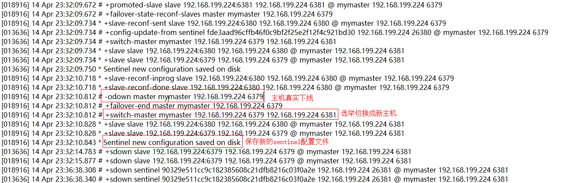

  3. 本案例中6381被选举为新的master，上位成功

     重启6379之后，它会从原来的master降级为slave

     6380还是slave，只不过是换了一个新老大6381(从跟随6379变成跟随6381)

对比配置文件

老master的redis6379.conf文件

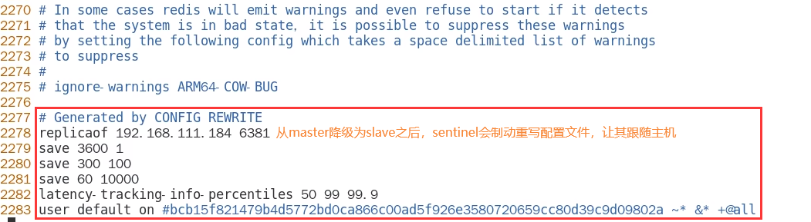

新master的redis6381.conf文件


文件的内容，在运行期间会被sentinel动态进行更改

Master−Slave切换后，masterredis.conf、slaveredis.conf、sentinel.conf的内容都会发生改变，即masterredis.conf中会多一行slaveof的配置，而升级为master的主机会去掉原来的slaveof配置，sentinel.conf的监控目标会随之调换


#### 哨兵运行流程

当一个主从配置中的master失效之后，sentinel可以选举出一个新的master 用于自动接替原master的工作，主从配置中的其他redis服务器自动指向新的master同步数据。一般==建议sentinel采取奇数台==，防止某一台sentinel无法连接到master导致误切换.

第一步

SDOWN(主观下线) 的 单个sentinel自己主观上检测到关于master的状态,从sentinel的角度来看,如果发送了PING心跳后,在一定时间内没有收到合法的回复,就达到了SDOWN的条件.

sentinel 配置文件中的down-after-milliseconds 设置了判断主观下线的时间长度.

第二步

ODOWN(客观下线) 需要一定数量的sentinel,多个哨兵达成一致意见才能认为master已经宕机

经过投票数决定, quorum是客观下线的一个依据.

第三步

选举出领导者哨兵.  当确定master已经宕机了,剩下的工作就是让从机上位为主机,那么谁来执行这个工作呢?

这就要选举出哨兵leader. 由leader来指定谁是master.

当主节点被判断客观下线以后，各个哨兵节点会进行协商,先选举出一个领导者哨兵节点并由该领导者节点，进行failover（故障迁移）

leader是通过Raft算法选举出来的.

第四步

由leader哨兵进行故障切换流程选出一个新的master


#### 选举原理

第一步   某个slave被选中成为新master

在剩余slave节点健康前提下,按照 下图规则进行选举


redis.conf文件中，优先级slave-priority或者replica-priority最高的从节点(数字越小优先级越高)

复制偏移位置offset最大的从节点(也就是在master还没有宕机时，复制到数据比其他Slave要多)

最小Run ID的从节点，字典顺序，ASCII码


第二步 

leader哨兵会对选举出的新master执行 slaveof no one操作,将其提升为master节点

leader哨兵向其他slave发送命令,让剩余的slave成为新的master节点的slave


第三步

之前已经宕机的旧master重新上线,将被设置为新master的从节点, leader哨兵让原来的master降级为slave,恢复正常工作.


#### 使用建议

1. 哨兵节点的数量应为多个，哨兵本身应该集群，保证高可用

2. 哨兵节点的数量应该是奇数

3. 各个哨兵节点的配置应一致

4. 如果哨兵节点部署在Docker等容器里面，尤其要注意端口的正确映射

5. 哨兵集群+主从复制，并不能保证数据零丢失，所以需要使用集群

   

### 十、Redis集群分片

#### 介绍

由于数据量过大，单个Master复制集难以承担，因此需要对多个复制集进行集群，形成水平扩展每个复制集只负责存储整个数据集 的一部分，这就是Redis的集群，其作用是提供在多个Redis节点间共享数据的程序集。


Redis集群是一个提供在多个Redis节点间共享数据的程序集，Redis集群可以支持多个master

作用

- Redis集群支持多个master，每个master又可以挂载多个slave
  1. 读写分离
  2. 支持数据的高可用
  3. 支持海量数据的读写存储操作
- 由于Cluster自带Sentinel的故障转移机制，内置了高可用的支持，==无需再去使用哨兵功能==
- 客户端与Redis的节点连接，不再需要连接集群中所有的节点，只需要任意连接集群中的一个可用节点即可
- 槽位slot负责分配到各个物理服务节点，由对应的集群来负责维护节点、插槽和数据之间的关系


#### 分片和槽位

槽位 slot

Redis集群没有使用一致性hash 而是引入了哈希槽的概念。

Redis集群有16384个哈希槽每个key通过CRC16校验后对16384取模来决定放置哪个槽，集群的每个节点负责一部分hash槽，举个例子，比如当前集群有3个节点，那么：


分片

使用Redis集群时我们会将存储的数据分散到多台redis机器上，这称为分片。简言之，集群中的每个Redis实例都被认为是整个数据的一个分片。

为了找到给定key的分片，我们对key进行CRC16(key)算法处理并通过对总分片数量取模。然后，$\textcolor{red}{\large使用确定性哈希函数}$，这意味着给定的key$\textcolor{red}{\large将多次始终映射到同一个分片}$​​，我们可以推断将来读取特定key的位置。这样读的时候和写的时候都是同一个槽位.


分片和槽位的优势

最大优势，方便扩缩容和数据分派查找

这种结构很容易添加或者删除节点，比如如果我想添加个节点D，我需要从节点A，B，C中得部分槽位到D上。如果我想移出节点A，需要将A中的槽移动到B和C节点上，然后将没有任何槽的节点从集群中移除即可。由于一个结点将哈希槽移动到另一个节点不会停止服务，所以无论添加删除或者改变某个节点的哈希槽的数量都不会造成集群不可用的状态。

Redis集群使用固定数量的哈希槽（共16384个），即使节点数变化，槽位总数不变。这意味着可以通过迁移部分槽位来实现平滑的扩展，而不需要重新计算所有键值的映射位置。

#### slot 槽位映射方案

##### 哈希取余分区

hash(key) / n 

优点：简单粗暴，直接有效，只需要预估好数据规划好节点，例如3台、8台、10台，就能保证一段时间的数据 支撑。使用Hash算法让固定的一部分请求落到同一台服务器上，这样每台服务器固定处理一部分请求 (并维护这些请求的信息)， 起到负载均衡+分而治之的作用。

缺点: 当节点数目改变时，所有键的哈希值都需要重新计算，这意味着几乎所有的数据都需要重新分配。取余哈希算法倾向于将数据均匀分布在所有节点上，但如果节点数目不是键值空间大小的因数，可能会导致某些节点负载较高，而其他节点负载较低。这需要额外的逻辑来确保负载均衡。 某个redis机器宕机了，由于台数数量变化，会导致hash取余全部数据重新洗牌。

##### 一致性哈希算法分区

构建一致性哈希环,一致性哈希算法必然有个hash函数并按照算法产生hash值，这个算法的所有可能哈希值会构成一个全量集，这个集合可以成为一个hash空间[0,$2^{32}-1$]，这个是一个线性空间，但是在算法中，我们通过适当的逻辑控制将它首尾相连(0= $2^{32}$),这样让它逻辑上形成了一个环形空间。 它也是按照使用取模的方法，**前面笔记介绍的节点取模法是对节点（服务器）的数量进行取模。而一致性Hash算法是对2^32取模，简单来说，一致性Hash算法将整个哈希值空间组织成一个虚拟的圆环**，如假设某哈希函数H的值空间为0-$2^{32}-1$(即哈希值是一个32位无符号整形），整个哈希环如下图:整个空间**按顺时针方向组织**，圆环的正上方的点代表0，0点右侧的第一个点代表1，以此类推，2、3、4、……直到$2^{32}-1$，也就是说0点左侧的第一个点代表$2^{32}-1$，0和$2^{32}-1$在零点中方向重合，我们把这个由$2^{32}$​个点组成的圆环称为Hash环。


服务器IP节点映射

将集群中各个IP节点映射到环上的某一个位置。 将各个服务器使用Hash进行一个哈希，具体可以选择服务器的IP或主机名作为关键字进行哈希，这样每台机器就能确定其在哈希环上的位置。假如4个节点Node : A、B、C、D，经过IP地址的**哈希函数**计算(hash(ip))，使用IP地址哈希后在环空间的位置如下:


key落到服务器的落键规则

当我们需要存储一个kv键值对时，首先计算key的hash值，hash(key)，将这个key使用相同的函数Hash计算出哈希值并确定此数据在环上的位置，**从此位置沿环顺时针“行走”**，第一台遇到的服务器就是其应该定位到的服务器，并将该键值对存储在该节点上。 如我们有Object A、 Object B、 Object C. object D四个数据对象，经过哈希计算后，在环空间上的位置如下:根据一致性Hash算法，数据A会被定为到Node A上，B被定为到Node B上，C被定为到Node C上，D被定为到Node D上。

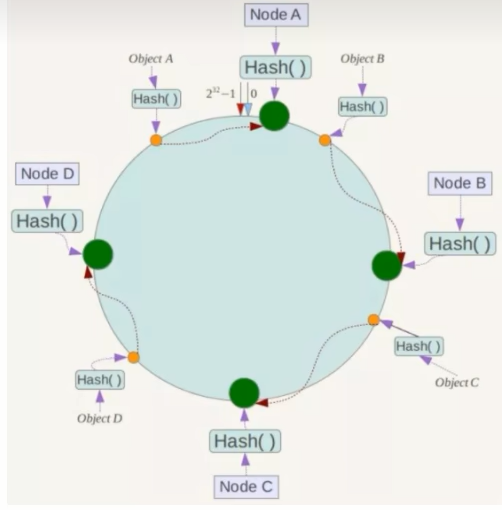

优点

一致性哈希算法的容错性 ：假设Node C宕机，可以看到此时对象A、B、D不会受到影响。一般的，在一致性Hash算法中，如果一台服务器不可用，则受影响的数据仅仅是此服务器到其环空间中前一台服务悉**〈即沿着逆时针方向行走遇到的第一台服务器）之间数据**，其它不会受到影响。简单说，就是C挂了，受到影响的只是B、C之间的数据**且这些数据会转移到D进行存储**。


一致性哈希算法的扩展性

数据量增加了，需要增加一台节点NodeX，X的位置在A和B之间，那收到影响的也就是A到X之间的数据，重新把A到X的数据录入到X上即可，不会导致hash取余全部数据重新洗牌。


缺点

一致性哈希算法的数据倾斜问题

一致性Hash算法在服务**节点太少时**，容易因为节点分布不均匀而造成**数据倾斜**（被缓存的对象大部分集中缓存在某一台服务器上)问题，例如系统中只有两台服务器:


为了在节点数目发生改变时尽可能少的迁移数据

将所有的存储节点排列在收尾相接的Hash环上，每个key在计算Hash后会顺时针找到临近的存储节点存放。而当有节点加入或退出时仅影响该节点在Hash环上顺时针相邻的后续节点。

优点 ：加入和删除节点只影响哈希环中顺时针方向的相邻的节点，对其他节点无影响。

缺点 ：数据的分布和节点的位置有关，因为这些节点不是均匀的分布在哈希环上的，所以数据在进行存储时达不到均匀分布的效果。


##### 哈希槽分区

哈希槽实质就是一个数组，数组[0, $2^{14}-1$]形成hash slot空间. 相当于节点上放的是槽，槽里面放的是数据。槽解决的是粒度问题，相当于把粒度变大了，这样便于数据移动。哈希解决的是映射问题，使用key的哈希值来计算所在的槽，便于数据分配.

一个集群只能有16384个槽，编号0-16383(0-$2^{14}-1$)。这些槽会分配给集群中的所有主节点，分配策略没有要求。

集群会记录节点和槽的对应关系，解决了节点和槽的关系后，接下来就需要对key求哈希值，然后对16384取模，余数是几key就落入对应的槽里。HASH_SLOT = CRC16(key) mod 16384。以槽为单位移动数据，因为槽的数目是固定的，处理起来比较容易，这样数据移动问题就解决了。

Redis集群中内置了16384个哈希槽，redis 会根据节点数量大致均等的将哈希槽映射到不同的节点。当需要在Redis集群中放置一个key-valuel时，redis先对key使用crc16算法算出一个结果然后用结果对16384求余数[ CRC16(key) % 16384]，这样每个key都会对应一个编号在0-16383之间的哈希槽，也就是映射到某个节点上。

> [!IMPORTANT]
>
> 为什么哈希槽的数量是16384 ($2^{14}$）个呢?CRC16算法产生的hash值有16bit，该算法可以产生$2^{16}$=65536个值。 换句话说值是分布在0～65535之间，有更大的65536不用为什么只用16384就够?
>
> - 如果槽位为65536，发送心跳信息的消息头达8k，发送的心跳包过于庞大。 在消息头中最占空间的是myslots[CLUSTER_SLOTS/8]。当槽位为65536时，这块的大小是:65536÷8÷1024=8kb
>
>   在消息头中最占空间的是myslots[CLUSTER_SLOTS/8]。当槽位为16384时，这块的大小是:16384∶8∶1024=2kb
>
>   因为每秒钟，redis节点需要发送一定数量的ping消息作为心跳包，如果槽位为65536，这个ping消息的消息头太大了，浪费带宽。 
>
> - redis的集群主节点数量基本不可能超过1000个。 集群节点越多，心跳包的消息体内携带的数据越多。如果节点过1000个，也会导致网络拥堵。因此redis作者不建议redis cluster节点数量超过1000个。那么，对于节点数在1000以内的redis cluster集群，16384个槽位够用了。没有必要拓展到65536个。
> -  槽位越小，节点少的情况下，压缩比高，容易传输 Redis主节点的配置信息中它所负责的哈希槽是通过一张bitmap的形式来保存的，在传输过程中会对bitmap进行压缩，但是如果bitmap的填充率slots /N很高的话(N表示节点数)， bitmap的压缩率就很低。如果节点数很少，而哈希槽数量很多的话，bitmap的压缩率就很低。


