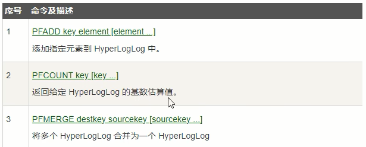
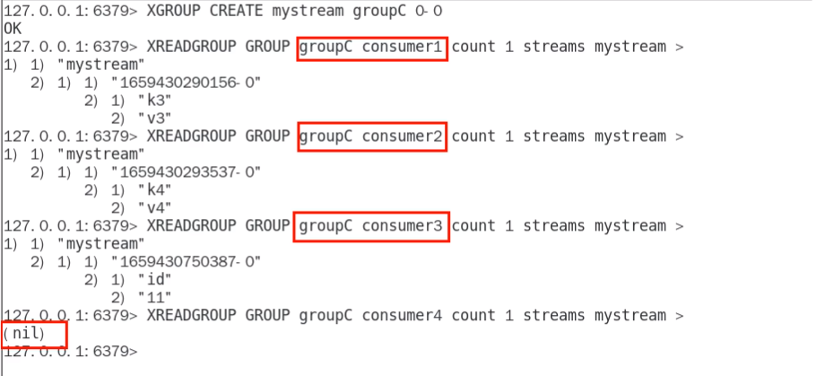
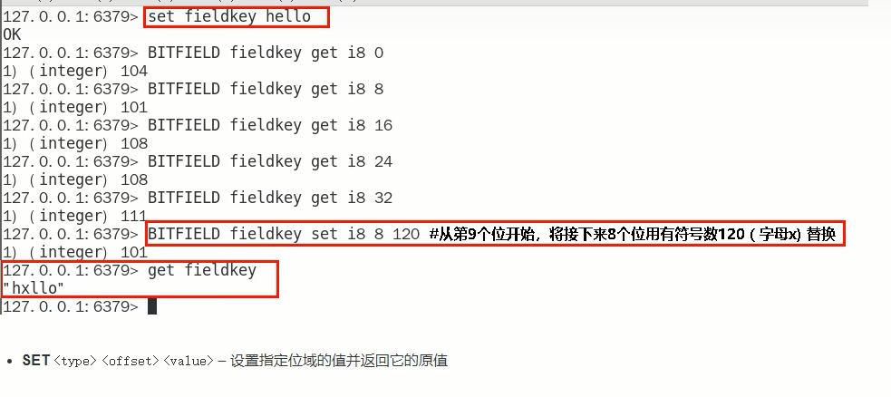

### 一、Redis 简介

官网地址：[英文](https://redis.io/),[中文文档](https://www.redis.com.cn/documentation.html)：

安装包：https://redis.io/download/

文档资料：[Redis源码地址](https://github.com/redis/redis)  ,  [Redis在线测试](https://try.redis.io/) , [Redis命令参考](http://doc.redisfans.com/)

作者：[github](https://github.com/antirez) ， [个人博客](http://antirez.com)


Redis是基于内存的key—value键值对数据库。


### 二、Redis 安装

Redis版本的命名规则

版本号第二位如果是奇数，则为非稳定版本，如2.7、2.9、3.1

版本号第二位如果是偶数，则为稳定版本，如2.6、2.8、3.0、3.2


历史版本：https://download.redis.io/releases/


前提：具备gcc编译环境


使用docker安装


```python
redis-benchmark       	# 性能测试工具，服务启动后运行该命令，查看性能
redis-check-aof			# 修复有问题的AOF文件
redis-check-dump		# 修复有问题的dump.rdb文件
redis-cli				# 客户端操作入口
redis-sentinel			# redis集群使用
redis-server			# redis服务器启动命令
```


修改redis配置文件,(注意留一份初始文件备份)

```shell
# 修改前						修改后
# daemonize no				  daemonize yes	   后台启动
# protected-mode yes 		  protected-mode no  将保护模式取消
# bind 127.0.0.1  			  注释掉或改成本机IP地址 默认是只能本机访问,否则影响远程IP连接.
# 添加redis密码					requirepass xxxx
```


根据配置文件启动redis

```shell
redis-server /myredis/redis7.conf
```


连接redis服务

```shell
redis-cli -a xxxx -p 6379 # xxx是密码,6379是默认端口
```


关闭

在redis-cli里面可以使用 exit 是退出redis-cli客户端.

在redis-cli里面可以使用shutdown 关闭整个redis

单实例关闭 `redis-cli -a xxxx shutdown`

多实例关闭(关闭好几个机器) `redis-cli -p 6379 shutdown`


### 三、Redis 十大数据类型

#### 总览


> [!NOTE]
>
> 这里所说的数据类型是value的数据类型,key的类型都是字符串


##### 1.redis字符串（String）

String是redis最基本的数据类型，一个key对应一个value。

string类型是二进制安全的，意思是redis的string可以包含任何数据，比如jpg图片或者序列化的对象。

string类型是Redis最基本的数据类型，一个redis中字符串value**最多可以是512M**


##### 2.redis列表（List）

Redis列表是最简单的字符串列表，按照插入顺序排序。你可以添加一个元素到列表的$\textcolor{blue}{头部(左边)或者尾部(右边)}$，它的底层实际是个$\textcolor{red}{双端链表}$​，最多可以包含 $2^{32}-1$ 个元素（4294967295，每个列表超过40亿个元素）


##### 3.redis哈希表（Hash）

Redis Hash是一个string类型的field（字段）和value（值）的映射表，Hash特别适合用户存储对象。

Redis中每个Hash可以存储 $2^{32}-1$ 个键值对（40多亿）


##### 4.redis集合（Set）

Redis的Set是string类型的$\textcolor{red}{无序集合}$。集合成员是唯一的，这就意味着集合中不能出现重复的数据，集合对象的编码可以是intset或者Hashtable。

Redis中Set集合是通过哈希表实现的，所以添加，删除，查找的复杂度都是O(1)。

集合中最大的成员数为 $2^{32}-1$ （4294967295，每个集合可存储40多亿个成员）


##### 5.redis有序集合（ZSet）

zset(sorted set：有序集合)

Redis zset和Set一样也是string类型元素的集合，且不允许重复的成员。

不同的是每个元素都会关联一个double类型的分数，redis正是通过分数来为集合中的成员进行从小到大的排序。

zset的成员是唯一的，但是分数（score）却可以重复。

zset集合是通过哈希表实现的，所以添加，删除，查找的复杂度都是O(1)。集合中最大的成员数是 $2^{32}-1$ 


##### 6.redis地理空间（GEO）

Redis GEO主要用于存储地理位置信息(经纬度)，并对存储的信息进行操作，包括：

添加地理位置的坐标。

获取地理位置的坐标。

计算两个位置之间的距离。

根据用户给定的经纬度坐标来获取指定范围内的地址位置集合。


##### 7.redis基数统计（HyperLogLog）

HyperLogLog是用来做$\textcolor{red}{基数统计}$的算法，HyperLogLog的优点是，在输入元素的数量或者体积非常非常大时，计算基数所需要的空间总是固定且是很小的。

在Redis里面，每个HyperLogLog键只需要花费12KB内存，就可以计算接近 $2^{64}$ 个不同元素的基数。这和计算基数时，元素越多耗费内存就越多的集合形成鲜明对比。

但是，因为HyperLogLog只会根据输入元素来计算基数，而不会存储输入元素本身，所以HyperLogLog不能像集合那样，返回输入的各个元素。


##### 8.redis位图（bitmap）


由0和1状态表现的二进制位的bit数组


##### 9.redis位域（bitfield）

通过bitfield命令可以一次性操作多个$\textcolor{red}{比特位域(指的是连续的多个比特位)}$，它会执行一系列操作并返回一个响应数组，这个数组中的元素对应参数列表中的相应的执行结果。

说白了就是通过bitfield命令我们可以一次性对多个比特位域进行操作。


##### 10.redis流（Stream）

Redis Stream是Redis5.0版本新增加的数据结构。

Redis Stream主要用于消息队列（MQ，Message Queue），Redis本身就是一个Redis发布订阅（pub/sub）来实现消息队列的功能，但它有个缺点就是消息无法持久化，如果出现网络断开、Redis宕机等，消息就会被丢弃。

简单来说发布订阅（pub/sub）可以分发消息，但无法记录历史消息。

而Redis Stream提供了消息的持久化和主备复制功能，可以让任何客户端访问任何时刻的数据，并且能记住每一个客户端的访问位置，还能保证消息不丢失。


##### redis常见数据类型操作命令

官网英文： https://redis.io/commands/

中文：http://www.redis.cn/commands.html

---


#### key 操作命令

---

查看当前库所有的key

`key * `

相当于mysql的 `select * from table`


---

判断某个key是否存在

`exists key`

例如:

```shell
127.0.0.1:6379> exists k1 k2 k3
(integer) 2			# 判断k1,k2,k3是否存在,有几个就返回几的数字
```


---

查看key是什么类型

`type key`

```shell
127.0.0.1:6379> type k1
string
```


---

删除指定的key数据

`del key`

```shell
127.0.0.1:6379> del k1
(integer) 1 # 删除存在的key会返回1
del k2
127.0.0.1:6379> (integer) 0 # 删除不存在的key会返回0
```


---

非阻塞删除

`unlink key`

仅仅将keys从keyspace元数据中删除，真正的删除会在后续异步中操作。

del key 是原子的删除(他是阻塞的)，只有删除成功了才会返回删除结果，如果是删除大key用del会将后面的操作都阻塞，而unlink key 不会阻塞，它会在后台异步删除数据。


---

查看该key还有多少秒过期

`ttl key`

-1 表示永不过期, -2 表示已经过期


---

为给定的key设置过期时间

`expire key 秒钟`

```shell
127.0.0.1:6379> expire k1 5 #设置5秒过期
```


---

将当前数据库的key 移动到给定的数据库db当中

`move key dbindex [0-15]`

```shell
127.0.0.1:6379> move k1 3 # 将key为k1的数据移动到4号
```

> [!NOTE]
>
> 一个redis服务器默认有16个数据库,默认使用0号库


---

切换数据库,默认为0号.

`select dbindex`

```shell
127.0.0.1:6379> select 3 # 切换到4号库.
127.0.0.1:6379[3]> 
```


---

查看当前数据库key的数量

`dbsize`


---

清空当前库

`flushdb`


---

清空所有的库

`flushall`


> [!NOTE]
>
> redis命令不区分大小写,但是key区分大小写


---


#### 字符串 String


##### 最常用命令

```shell
127.0.0.1:6379> set key value
127.0.0.1:6379> get key
```


`set key value [NX|XX] [GET] [EX seconds|PX milliseconds|EXAT unix-time-seconds|PXAT unix-time-milliseconds|KEEPTTL]`


**返回值：**

设置成功则返回OK，返回nil为未执行Set命令，如不满足NX，XX条件等。

若使用GET参数，则返回该键原来的值，或在键不存在时nil。


例如:

```shell
127.0.0.1:6379> set k1 v1 nx
OK
127.0.0.1:6379> get k1
"v1"
127.0.0.1:6379> set k1 v1 nx		# key存在会失败
(nil)  								
127.0.0.1:6379> set k1 v1xx xx		# key存在会进行覆盖
OK
127.0.0.1:6379> get k1
"v1xx"
127.0.0.1:6379> set k1 v1 get		# 先返回key原始值,然后设置新值.
"v1xx"
127.0.0.1:6379> get k1
"v1"
127.0.0.1:6379> set k1 v1 ex 10		# 设置10秒后过期
OK
127.0.0.1:6379> ttl k1
(integer) 8
127.0.0.1:6379> set k1 v1 px 8000	# 设置8000毫秒后过期
OK
127.0.0.1:6379> pttl k1				# 使用pttl查看精确的剩余毫秒数
6555
127.0.0.1:6379> del k1
(integer) 1
127.0.0.1:6379> set k1 v1 ex 30
OK
127.0.0.1:6379> ttl k1
(integer) 27
127.0.0.1:6379> set k1 v2 keepttl 	# 重设k1后,过期时间会重置,若想继承上次的过期剩余时间,使用keepttl选项.
OK
127.0.0.1:6379> ttl k1
(integer) 22 
```


##### 同时设置/获取多个键值

MSET key value [key value...]

MGET key [key ...]

MSETNX key value [key value...]

```shell
127.0.0.1:6379> mset k1 v1 k2 v2 k3 v3
OK
127.0.0.1:6379> mget k1 k2 k3 k4
1) "v1"
2) "v2"
3) "v3"
4) (nil)
127.0.0.1:6379> msetnx k1 v11 k4 v4 #msetnx是当不存在key值时,才成功 要么都成功,要么都失败
(integer) 0
127.0.0.1:6379> get k1
"v1"
127.0.0.1:6379> get k4
(nil)
127.0.0.1:6379> msetnx k4 v4 k5 v5 #msetnx 要key全部不存在创建成功.
(integer) 1
127.0.0.1:6379> mget k1 k2 k3 k4 k5
1) "v1"
2) "v2"
3) "v3"
4) "v4"
5) "v5"

```


##### 获取指定区间范围的值

GETRANGE key start end

SETRANGE key offset value

```shell
127.0.0.1:6379> set k1 abcd1234
OK
127.0.0.1:6379> getrange k1 0 -1 # 表示取得全部的范围
"abcd1234"
127.0.0.1:6379> getrange k1 0 3
"abcd"
127.0.0.1:6379> setrange k1 1 xxyy # 从下标1开始覆盖
(integer) 8
127.0.0.1:6379> get k1
"axxyy234"

```


##### 数值增减

一定得是数字才能进行加减

递增数字: INCR key

增加指定整数: INCRBY key increment

递减数值: DECR key

减少指定整数: DECRBY key decrement

```shell
127.0.0.1:6379> set k1 100
OK
127.0.0.1:6379> get k1
"100"
127.0.0.1:6379> incr k1
(integer) 101
127.0.0.1:6379> incrby k1 3
(integer) 104
127.0.0.1:6379> decr k1
(integer) 103
127.0.0.1:6379> decrby k1 3
(integer) 100
```


##### 获取字符串长度和内容追加

STRLEN key

APPEND key value

```shell
127.0.0.1:6379> set k1 abcd
OK
127.0.0.1:6379> strlen k1
(integer) 4
127.0.0.1:6379> append k1 xxxx
(integer) 8
127.0.0.1:6379> get k1
"abckxxxx"
```


##### 分布式锁

setnx key value


setex key 秒值 value

相当于`set key value` 与 `expire key 秒值`这两个指令的合并.

也就是将这两条指令变为一条,保证了原子性.


若有多个微服务竞争资源,可以利用redis的`setnx key value`来充当锁

例如: 

```shell
setnx lock uuid
del lock
```

谁先设置到lock这个key,谁就可以获得资源,之后在释放.


##### getset key value

先get再set，即先将key的原始值返回，再对key设置新值

```shell
127.0.0.1:6379> set k1 v11
OK
127.0.0.1:6379> getset k1 haha
"v11"
127.0.0.1:6379> get k1
"haha"
```


应用场景：点赞，或是否喜欢文章等等


---


#### 列表 List

**单key多value**

简单说明：$\textcolor{red}{一个双向链表的结构}$，容量是2的32次方减1个元素大概40多亿，主要功能有push/pop等，一般用在栈、队列、消息队列等场景。left、right都可以插入添加；

如果键不存在，创建新的链表；

如果键已存在，新增内容；

如果值全移除，对应的键也就消失了

它的底层实际上就是个双向链表，对两端的作性能很高，通过索引下标的操作中间的节点性能会较差


##### lpush/rpush/lrange

LPUSH/RPUSH list value ...

LRANGE list start stop

注意，没有rrange命令，只有lrange

```shell
127.0.0.1:6379> lpush list1 1 2 3 4 5
(integer) 5
127.0.0.1:6379> lrange list1 0 -1
1) "5"
2) "4"
3) "3"
4) "2"
5) "1"
127.0.0.1:6379> rpush list2 11 22 33 44 55
(integer) 5
127.0.0.1:6379> lrange list2 0 -1
1) "11"
2) "22"
3) "33"
4) "44"
5) "55"
```


##### lpop/rpop

```shell
127.0.0.1:6379> lpush list1 1 2 3 4 5
(integer) 5
127.0.0.1:6379> lrange list1 0 -1
1) "5"
2) "4"
3) "3"
4) "2"
5) "1"
127.0.0.1:6379> lpop list1
"5"
127.0.0.1:6379> lrange list1 0 -1
1) "4"
2) "3"
3) "2"
4) "1"
127.0.0.1:6379> rpop list1
"1"
127.0.0.1:6379> lrange list1 0 -1
1) "4"
2) "3"
3) "2"
```


##### lindex

LINDEX key index

按照索引下标获得元素（从上到下）,没有值返回nil

```shell
127.0.0.1:6379> lpush list1 1 2 3 4 5
(integer) 5
127.0.0.1:6379> lindex list1 3
"2"
```


##### llen

获取列表中元素的个数

```python
127.0.0.1:6379> lpush list1 1 2 3 4 5
(integer) 5
127.0.0.1:6379> llen list1
(integer) 5
```


##### lrem

LREM list N value

删除N个值等于value 的元素， 后面必须带值，想删除全部，使用del命令

```shell
127.0.0.1:6379> lpush list1 1 2 2 3 3 3
(integer) 6
127.0.0.1:6379> lrem list1 2 3
(integer) 2
127.0.0.1:6379> lrange list1 0 -1
1) "3"
2) "2"
3) "2"
4) "1"

```


##### ltrim

LTRIM list start_index end_index

截取指定范围的值后再赋值给list

```shell
127.0.0.1:6379> lpush list1 1 2 3 4
(integer) 4
127.0.0.1:6379> ltrim list1 1 2
OK
127.0.0.1:6379> lrange list1 0 -1
1) "3"
2) "2"

```


##### rpoplpush

rpoplpush 源列表 目的列表

```shell
127.0.0.1:6379> lpush list1 1 2
(integer) 2
127.0.0.1:6379> lpush list2 3 4
(integer) 2
127.0.0.1:6379> lrange list1 0 -1
1) "2"
2) "1"
127.0.0.1:6379> lrange list2 0 -1
1) "4"
2) "3"
127.0.0.1:6379> rpoplpush list1 list2
"1"
127.0.0.1:6379> lrange list2 0 -1
1) "1"
2) "4"
3) "3"
```


##### lset

ISET list index value

```shell
127.0.0.1:6379> lpush list1 1 2 3 4
(integer) 4
127.0.0.1:6379> lset list1 1 mysql
OK
127.0.0.1:6379> lrange list1 0 -1
1) "4"
2) "mysql"
3) "2"
4) "1"
```


##### linsert

LINSERT list before|after old_value new_value

```shell
127.0.0.1:6379> lpush list1 1 2 3 4
(integer) 4
127.0.0.1:6379> linsert list1 before 2 redis
(integer) 5
127.0.0.1:6379> lrange list1 0 -1
1) "4"
2) "3"
3) "redis"
4) "2"
5) "1"
```


应用场景：微信公众号订阅文章

---


#### 哈希 Hash

key-value键值对中的value又是一个key-value键值对

即Map<String,Map<Object,Object>>


##### hset/hget/hmset/hmget/hgetall/hdel

```shell
127.0.0.1:6379> hset user_1 id 1 name Mrhow age 24
(integer) 3
127.0.0.1:6379> hget user_1 id
"1"
127.0.0.1:6379> hget user_1 name
"Mrhow"
127.0.0.1:6379> hmset user_2 id 2 name mrhow age 24
OK
127.0.0.1:6379> hmget user_2 id name age
1) "2"
2) "mrhow"
3) "24"
127.0.0.1:6379> hgetall user_2
1) "id"
2) "2"
3) "name"
4) "mrhow"
5) "age"
6) "24"
127.0.0.1:6379> hdel user_2 age
(integer) 1
127.0.0.1:6379> hgetall user_2
1) "id"
2) "2"
3) "name"
4) "mrhow"
```


##### hlen

```shell
127.0.0.1:6379> hset user_1 id 1 name Mrhow age 24
(integer) 3
127.0.0.1:6379> hlen user_1
(integer) 3
```


##### hexists

hexists key     判断在key里面的某个值的key是否存在

```shell
127.0.0.1:6379> hset user_1 id 1 name Mrhow age 24
(integer) 3
127.0.0.1:6379> hexists user_1 name
(integer) 1
127.0.0.1:6379> hexists user_1 score
(integer) 0

```


##### hkeys/hvals

获取key下的所有key ，获取key下的所有value

```shell
127.0.0.1:6379> hset user_1 id 1 name Mrhow age 24
(integer) 3
127.0.0.1:6379> hkeys user_1
1) "id"
2) "name"
3) "age"
127.0.0.1:6379> hvals user_1
1) "1"
2) "Mrhow"
3) "24"
```


##### hincriby/hincrbyfloat

HINCRIBY key1 key2 整数

HINCRIBYFLOAT key1 key2 浮点数

```shell
127.0.0.1:6379> hset user_1 id 1 name Mrhow age 24 score 99.5
(integer) 4
127.0.0.1:6379> hincriby user_1 age 1
(integer) 25
127.0.0.1:6379> hincribyfloat user_1 score 0.5
"100"
```


##### hsetnx

不存在则赋值，存在则无效

```shell
127.0.0.1:6379> hsetnx user_1 email 695649468@qq.com
(integer) 1
127.0.0.1:6379> hsetnx user_1 email 695649468@qq.com
(integer) 0
```


应用场景：京东早期购物车

----


#### 集合 Set

无序无重复

##### sadd

SADD key member [member ...]

添加元素，可以多次向同一个key中设置不同值，不会覆盖之前的值

```shell
127.0.0.1:6379> sadd set1 1 1 1 2 2 2 3 4 5
(integer) 5
127.0.0.1:6379> 
```


##### smembers

SMEMBERS key

遍历集合中的所有元素

```shell
127.0.0.1:6379> sadd set1 1 1 1 2 2 2 3 4 5
(integer) 5
127.0.0.1:6379> smembers set1
1) "1"
2) "2"
3) "3"
4) "4"
5) "5"

```


##### sismember

SISMEMBER key member

判断元素是否在集合中

```shell
127.0.0.1:6379> sadd set1 1 2 3 4 5
(integer) 5
127.0.0.1:6379> sismember set1 1
(integer) 1
127.0.0.1:6379> sismember set1 x
(integer) 0

```


##### srem

SREM key member [member ...]

删除元素,删除已有的元素返回1，删除没有的元素返回0

```shell
127.0.0.1:6379> sadd set1 1 2 3 4 5
(integer) 5
127.0.0.1:6379> srem set1 1
(integer) 1
127.0.0.1:6379> srem set1 y
(integer) 0
127.0.0.1:6379> smembers set1
1) "2"
2) "3"
3) "4"
4) "6"

```


##### scard 

获取集合里面的元素个数

```shell
127.0.0.1:6379> sadd set1 1 2 3 4 5
(integer) 5
127.0.0.1:6379> scard set1
(integer) 5
```


##### srandmember

SRANDMEMBER key [数字]

从集合中随机展现设置的数字个数的元素，元素不删除

```shell
127.0.0.1:6379> sadd set1 1 2 3 4 5
(integer) 5
127.0.0.1:6379> srandmember set1 2
1) "4"
2) "1"
127.0.0.1:6379> smembers set1
1) "1"
2) "2"
3) "3"
4) "4"
5) "5"

```


##### spop 

SPOP key [数字]

从集合中随机弹出数字个元素，并删除

```shell
127.0.0.1:6379> sadd set1 1 2 3 4 5
(integer) 5
127.0.0.1:6379> spop set1 1
1) "3"
127.0.0.1:6379> smembers set1
1) "1"
2) "2"
3) "4"
4) "5"
```


##### smove

SMOVE key1 key2

将key1里已存在的某个值移动到key2

```shell
127.0.0.1:6379> sadd set1 1 2 3 4 5
(integer) 5
127.0.0.1:6379> sadd set2 a b c
(integer) 3
127.0.0.1:6379> smove set1 set2 2
(integer) 1
127.0.0.1:6379> smembers set1
1) "1"
2) "3"
3) "4"
4) "5"
127.0.0.1:6379> smembes set2
1) "a"
2) "b"
3) "2"
4) "c"

```


##### 差集运算 A - B

属于A但不属于B的元素构成的集合

SDIFF key1 [key2 ...]

```shell
127.0.0.1:6379> sadd set1 a b c 1 2
(integer) 5
127.0.0.1:6379> sadd set2 1 2 3 a x
(integer) 5
127.0.0.1:6379> sdiff set1 set2
1) "b"
2) "c"
```


##### 并集运算 A U B

合并两个集合

SUNION key1 key2

```shell
127.0.0.1:6379> sadd set1 a b c 1 2
(integer) 5
127.0.0.1:6379> sadd set2 1 2 3 a x
(integer) 5
127.0.0.1:6379> sunion set1 set2
1) "x"
2) "a"
3) "b"
4) "1"
5) "2"
6) "3"
7) "c"

```


##### 交集运算 A ∩ B

集合之间共有部分

SINTER key [key ...]

SINTERCARD numkeys key [key ...] [LIMIT limit]

sintercard 不返回结果集，只返回结果的基数。返回由所有给定集合的交集产生的集合的基数

基数是指去重后的元素个数。也就是交集的个数

```shell
127.0.0.1:6379> sadd set1 a b c 1 2
(integer) 5
127.0.0.1:6379> sadd set2 1 2 3 a x
(integer) 5
127.0.0.1:6379> sinter set1 set2
1) "a"
2) "1"
3) "2"
127.0.0.1:6379> sintercard 2 set1 set2
(integer) 3
127.0.0.1:6379> sintercard 2 set1 set2 limit 1
(integer) 1
127.0.0.1:6379> sintercard 2 set1 set2 limit 2
(integer) 2
127.0.0.1:6379> sintercard 2 set1 set2 limit 3
(integer) 3
127.0.0.1:6379> sintercard 2 set1 set2 limit 4
(integer) 3

```


应用场景：微信抽奖小程序，朋友圈点赞，


---


#### 有序集合 Zset

在set基础上，每个val值前加一个score分数值。之前set是k1 v1 v2 v3，现在zset是 k1 score1 v1 score2 v2

这个score来作为Zset排序的依据。


##### zadd

ZADD key score member [score member ...]

```shell
127.0.0.1:6379> zadd zset1 60 v1 70 v2 80 v3
(integer) 3
```


##### zrange/zrevrange

ZRANGE key start stop [WITHSCORES]

按照元素分数从小到大顺序返回索引从start到stop之间的所有元素

```shell
127.0.0.1:6379> zadd zset1 60 v1 70 v2 80 v3
(integer) 3
127.0.0.1:6379> zrange zset1 0 -1
1) "v1"
2) "v2"
3) "v3"
127.0.0.1:6379> zrange zset1 0 -1 withscores
1) "v1"
2) "60"
3) "v2"
4) "70"
5) "v3"
6) "80"
```

对zrange的结果进行反转.

```shell
127.0.0.1:6379> zadd zset1 60 v1 70 v2 80 v3
(integer) 3
127.0.0.1:6379> zrevrange zset1 0 -1 withscores
1) "v3"
2) "80"
3) "v2"
4) "70"
5) "v1"
6) "60"
```


##### zrangebyscore

ZRANGEBYSCORE key min max [WITHSCORE] [LIMIT offset count]

获取指定分数范围的元素, 若在min前或max后加上圆括号,则表示不包含的意思

默认是 min <= score <= max

```shell
127.0.0.1:6379> zadd zset1 60 v1 70 v2 80 v3
(integer) 3
127.0.0.1:6379> zrangebyscore zset1 60 75
1) "v1"
2) "v2"
127.0.0.1:6379> zrangebyscore zset1 60 75 withscores
1) "v1"
2) "60"
3) "v2"
4) "70"
127.0.0.1:6379> zrangebyscore zset1 (60 75 withscores
1) "v2"
2) "70"
```


##### zscore

ZSCORE key member

获取元素的分数

```shell
127.0.0.1:6379> zadd zset1 60 v1 70 v2 80 v3
(integer) 3
127.0.0.1:6379> zscore zset1 v2
"70"
```


##### zcard

ZCARD key

获取集合中元素的数量

```shell
127.0.0.1:6379> zadd zset1 60 v1 70 v2 80 v3
(integer) 3
127.0.0.1:6379> zcard zset1
(integer) 3
```


##### zrem

ZREM key member [member ...]

这个member是某个score对应的value值,作用是删除元素

```shell
127.0.0.1:6379> zadd zset1 60 v1 70 v2 80 v3
(integer) 3
127.0.0.1:6379> zrem zset1 v3
(integer) 1
127.0.0.1:6379> zrange zset1 0 -1 withscores
1) "v1"
2) "60"
3) "v2"
4) "70"
```


##### zincrby

ZINCRBY key increment member 增加某个元素的分数

```shell
127.0.0.1:6379> zadd zset1 60 v1 70 v2 80 v3
(integer) 3
127.0.0.1:6379> zincrby zset1 3 v1
"63"
```


##### zcount

ZCOUNT key min max

获得指定分数范围内的元素个数

```shell
127.0.0.1:6379> zadd zset1 60 v1 70 v2 80 v3
(integer) 3
127.0.0.1:6379> zcount zset1 60 70
(integer) 2
```


##### zmpop

ZMPOP numkeys key [key ...] MIN|MAX [COUNT count]

从键名列表中的第一个非空排序集中弹出一个或多个元素,是成员分数对.

numkeys是由key的数量决定,count 是弹出的元素个数

```shell
127.0.0.1:6379> zadd zset1 60 v1 70 v2 80 v3
(integer) 3
127.0.0.1:6379> zadd zset2 90 v4
(integer) 1
127.0.0.1:6379> zmpop 1 zset1 min count 1
1) "zset1"
2) 1) 1) "v1"
	  2) "60"
127.0.0.1:6379> zrange zset1 0 -1 withscores
1) "v2"
2) "70"
3) "v3"
4) "80"
127.0.0.1:6379> zmpop 2 zset2 zset1 min count 1  # 从第一个非空的集合中弹出最小值,而不是弹出所有key里面最小的值
1) "zset2"
2) 1) 1) "v4"
	  2) "90"
```


##### zrank/zrevrank

zrank key member [withscore]

获取下标值

zrevrank 是逆序获得下标值

```shell
127.0.0.1:6379> zadd zset1 60 v1 70 v2 80 v3
(integer) 3
127.0.0.1:6379> zrange zset1 0 -1
1) "v1"
2) "v2"
3) "v3"
127.0.0.1:6379> zrank zset1 v1
(integer) 0
127.0.0.1:6379> zrevrank zset1 v1
(integer) 2
```


应用场景: 商品热销排序,排行榜

---


#### 位图 BitMap

一句话：由0和1状态表现的二进制位的bit数组

看需求：

1. 用户是否登陆过Y、N，比如软件的每日签到功能
2. 电影、广告是否被点击播放过
3. 钉钉打卡上下班，签到统计


说明：$\textcolor{red}{用String类型作为底层数据结构实现的一种统计二值状态的数据类型}$

位图本质是数组，它是基于String数据类型的按位的操作。该数组由多个二进制位组成，每个二进制位都对应一个偏移量（我们称之为一个索引）。

Bitmap支持的最大位数是$2^{32}$位，它可以极大的节约存储空间，使用512M内存就可以存储多达42.9亿的字节信息($2^{32}=4294967296$)

基本命令:

| 命令                                 | 作用                                                | 时间复杂度 |
| ------------------------------------ | --------------------------------------------------- | ---------- |
| setbit key offset value              | 给指定key的值的offset位赋值value                    | O(1)       |
| getbit key offset                    | 获得指定key的offset位                               | O(1)       |
| bitcount key start end               | 返回指定key中[start,end]中为1的数量                 | O(n)       |
| bitop operation destkey key [key...] | 对不同的二进制存储数据进行位运算(AND、OR、NOT、XOR) | O(n)       |


##### setbit

setbit key offset value

value只能是0或者1

返回的是被修改前的原始值

```shell
127.0.0.1:6379> setbit k1 1 1 # 保存到redis后的数据是这样的： 01000000...
(integer) 0
127.0.0.1:6379> setbit k1 7 1
(integer) 0
127.0.0.1:6379> get k1
"A"  # "A"的ASCII码是65 即01000001
```


##### getbit

```shell
127.0.0.1:6379> setbit k1 1 1 # 保存到redis后的数据是这样的： 01000000...
(integer) 0
127.0.0.1:6379> getbit k1 0
(integer) 0
127.0.0.1:6379> getbit k1 1
(integer) 1
```


##### strlen

统计字节数占用多少,不是字符串长度而是指占用多少个字节数

```shell
127.0.0.1:6379> setbit k1 1 1 # 此时k1为01000000
(integer) 0
127.0.0.1:6379> strlen k1
(integer) 1 
127.0.0.1:6379> setbit k1 8 1 # 此时k1为01000000 10000000
(integer) 0
127.0.0.1:6379> strlen k1
(integer) 2
```


##### bitcount

统计键里面含有1的个数

```shell
127.0.0.1:6379> setbit k1 1 1
(integer) 0
127.0.0.1:6379> setbit k1 2 1
(integer) 0
127.0.0.1:6379> bitcount k1
(integer) 2
```


##### bitop

bitop operation(AND|OR|XOR|NOT) destkey key [key ...]

将运行后的结果存到destkey中

案例:获取连续2天都签到的用户数量


应用场景: 签到打卡.

---


#### 基数统计 HyperLogLog

需求：

1. 用户搜索网站关键词的数量
2. 统计用户每天搜索不同词条个数
3. 统计某个网站的UV、统计某个文章的UV

> [!NOTE]
>
> 什么是UV？
>
> Unique Visitor，独立访客，一般理解为客户端IP，**需要去重考虑**


去重复统计功能的基数估计算法-就是HyperLogLog

```
Redis在2.8.9版本添加了HyperLogLog 结构。
Redis HyperLogLog是用来做基数统计的算法，HyperLogLog 的优点是，在输入元素的数量或者体积非常非常大时，计算基数所需的空间总是固定的、并且是很小的。
在Redis里面，每个 HyperLogLog键只需要花费12KB内存，就可以计算接近2^64个不同元素的基数。这和计算基数时，元素越多耗费
内存就越多的集合形成鲜明对比。

```

但是，因为HyperLogLog只会根据输入元素来计算基数，而==不会储存输入元素本身==，所以HyperLogLog不能像集合那样，返回输入的各个元素。

基数：是一种数据集，去重复后的真实个数

```
(全集)={2,4,6,8,77,39,4,8,10}
去掉重复的内容
基数={2,4,6,8,77,39,10} = 7
```

基数统计：用于统计一个集合中不重复的元素个数，就是对集合去重复后剩余元素的计算。

一句话：去重脱水后的真实数据

基本命令:




##### pfadd

添加指定元素到HyperLogLog中

```shell
127.0.0.1:6379> pfadd hll01 1 3 4 5 7 9
(integer) 1  # 1表示成功

```


##### pfcount

返回给定的HyperLogLog的基数估算值

```shell
127.0.0.1:6379> pfadd hll02 2 4 6 6 6 6 8 9
(integer) 1
127.0.0.1:6379> pfcount hll02
(integer) 6 # 去重后有5个元素有效
```


##### pfmerge

将多个HyperLogLog合并成一个HyperLogLog

```shell
127.0.0.1:6379> pfadd hll01 1 3 4 5 7 9
(integer) 1  
127.0.0.1:6379> pfadd hll02 2 4 6 6 6 6 8 9
(integer) 1
127.0.0.1:6379> pfmerge hll03 hll01 hll02
OK
127.0.0.1:6379> pfcount hll03
(integer) 9
```


---


#### 地理空间 GEO

地理位置是使用二维的经纬度表示，经度范围(-180,180]，纬度范围(-90，90]，只要我们确定一个点的经纬度就可以取得他在地球的位置。

在数据库中查找距离我们(坐标x0,y0)附近r公里范围内部的车辆 使用如下SQL即可

```mysql
select taxi from position where x0-r< X < x0 + r and y0-r< y < y0+r
```

但是这样会有什么问题呢? 1.查询性能问题，如果并发高，数据量大这种查询是要搞垮数据库的 2.这个查询的是一个矩形访问，而不是以我为中心r公里为半径的圆形访问。 3.精准度的问题，我们知道地球不是平面坐标系，而是一个圆球，这种矩形计算在长距离计算时会有很大误差

原理:


##### geoadd

GEOADD key longitude latitude member [longitude latitude member]

多个经度(longitude)、纬度(latitude)、位置名称(member)添加到指定的key中

命令：GEOADD city 116.403963 39.915119 "天安门" 116.403414 39.924091 "故宫" 116.024067 40.362639 "长城"

geo类型实际上是zset，可以使用zset相关的命令对其进行遍历，如果遍历出现中文乱码可以使用如下命令：redis-cli --raw

```shell
127.0.0.1:6379> geoadd city 116.403963 39.915119 "天安门" 116.403414 39.924091 "故宫" 116.024067 40.362639 "长城"
(integer) 3
127.0.0.1:6379> type city
zset
127.0.0.1:6379> zrange city 0 -1
1) "\xcc\xec\xb0\xb2\xc5"
2) "\xb9\xca\xb9\xac"
3) "\xb3\xa4\xb3\xc7"

# 出现中文乱码,退出然后输入redis-cli --raw
127.0.0.1:6379> zrange city 0 -1
天安门
故宫
长城
```


##### geopos

GEOPOS key member [member]

从键里面返回所有指定名称(member )元素的位置（经度和纬度），不存在返回nil

```shell
127.0.0.1:6379> geoadd city 116.403963 39.915119 "天安门" 116.403414 39.924091 "故宫" 116.024067 40.362639 "长城"
(integer) 3
127.0.0.1:6379> geopos city 天安门
116.403963
39.915119
```


##### geohash

返回一个或多个位置元素的GEOhash表示

geohash 算法生成的base32编码值，3维变2维变1维

```shell
127.0.0.1:6379> geoadd city 116.403963 39.915119 "天安门" 116.403414 39.924091 "故宫" 116.024067 40.362639 "长城"
(integer) 3
127.0.0.1:6379> geohash city 天安门 故宫 长城
wx4g016f2v0
wx4g0gfqsj0
wx4t85y1kt0
```


##### geodist 

GEODIST key member1 member2 [M|KM|FT|MI]

计算两个位置之间的距离

m-米
km-千米
ft-英寸
mi-英里

```shell
127.0.0.1:6379> geoadd city 116.403963 39.915119 "天安门" 116.403414 39.924091 "故宫" 116.024067 40.362639 "长城"
(integer) 3
127.0.0.1:6379> geodist city 天安门 故宫 km
59.3390
```


##### georadius

GEORADIUS key longitude latitude radius M|KM|FT|MI [WITHCOORD] [WITHDIST] [WITHHASH] [COUNT count [ANY]

以给定的经纬度为中心，返回与中心的距离不超过给定最大距离的所有元素位置

WITHDIST: 在返回位置元素的同时， 将位置元素与中心之间的距离也一并返回。 距离的单位和用户给定的范围单位保持一致。

WITHCOORD: 将位置元素的经度和维度也一并返回。

WITHHASH:以 52位有符号整数的形式， 返回位置元素经过原始 geohash 编码的有序集合分值。 这个选项主要用于底层应用或者调试，实际中的作用并不大 

COUNT 限定返回的记录数。


##### georadiusbymember

跟georadius类似, georadius输入的是经纬度，而georadiusbymember输入的是key里面的元素。


---


#### 流 Stream

实现消息队列，它支持消息的持久化、支持自动生成全局唯一ID、支持ack确认消息的模式、支持消费组模式等，让消息队列更加的稳定和可靠


一个消息链表，将所有加入的消息都串起来，每个消息都有一个唯一的ID和对应的内容


##### 基本命令

队列相关指令

| 指令名称  | 指令作用                                    |
| --------- | ------------------------------------------- |
| XADD      | 添加消息到队列末尾                          |
| XTRIM     | 限制Stream的长度，如果已经超长会进行截取    |
| XDEL      | 删除消息                                    |
| XLEN      | 获取Stream中的消息长度                      |
| XRANGE    | 获取消息列表(可以指定范围)，忽略删除的消息  |
| XREVRANGE | 和XRANGE相比，区别在于反向获取，ID从大到小  |
| XREAD     | 获取消息(阻塞/非阻塞)，返回大于指定ID的消息 |

消费组相关指令

| 指令名称           | 指令作用                                                     |
| ------------------ | ------------------------------------------------------------ |
| XGROUP CREATE      | 创建消费者组                                                 |
| XREADGROUP GROUP   | 读取消费者组中的消息                                         |
| XACK               | ack消息，消息被标记为“已处理”                                |
| XGROUP SETID       | 设置消费者组最后递送消息的ID                                 |
| XGROUP DELCONSUMER | 删除消费者组                                                 |
| XPENDING           | 打印待处理消息的详细信息                                     |
| XCLAIM             | 转移消息的归属权（长期未被处理/无法处理的消息，转交给其他消费者组进行处理） |
| XINFO              | 打印Stream\Consumer\Group的详细信息                          |

XINFO GROUPS 打印消费组的详细信息

XINFO STREAM 打印stream的详细信息

四个特殊符号

| - +  | 最小和最大可能出现的Id                                       |
| ---- | ------------------------------------------------------------ |
| $    | $表示只消费新的消息，当前流中最大的Id，可用于将要到来的信息  |
| >    | 用于XREADGROUP命令，表示迄今还没有发送给组中使用者的信息，会更新消费者组的最后Id |
| *    | 用于XADD命令，让系统自动生成Id                               |


##### xadd

添加消息到队列末尾，==消息ID必须要比上一个ID大==，默认用星号表示自动生成ID；* 用于XADD命令中，让系统自动生成ID；

XADD用于向Stream队列中添加消息，如果指定的Stream队列不存在，则该命令执行时会新建一个Stream队列

```shell
127.0.0.1:6379> xadd mystream * id 11 cname z3
"1669453947894-0"  # 消息id
127.0.0.1:6379> xadd mystraem * k1 v1 k2 v2 k3 v3
"1669453973537-0"
```

生成的消息ID，有两部分组成，毫秒时间戳-该毫秒内产生的第一条消息

'*' 表示服务器自动生成MessageID(类似MySQL里面主键auto_increment)，后面顺序跟着一堆业务key/value

| 信息条目指的是序列号，在相同的毫秒下序列号从0开始递增，序列号是64位长度，理论上在同一毫秒内生成的数据量无法到达这个级别，因此不用担心序列号会不够用。milisecondsTime指的是Redis节点服务器的本地时间，如果存在当前的毫秒时间截比以前已经存在的数据的时间戳小的话(本地时间钟后跳)，那么系统将会采用以前相同的毫秒创建新的ID，也即redis 在增加信息条目时会检查当前 id 与上一条目的 id，自动纠正错误的情况，一定要保证后面的 id 比前面大，.个流中信息条目的ID必须是单调增的，这是流的基础。 |
| ------------------------------------------------------------ |
| 客户端显示传入规则: Redis对于ID有强制要求，格式必须是**时间戳-自增Id**这样的方式，且后续ID不能小于前一个ID |
| Stream的消息内容，也就是图中的Messaget它的结构类似Hash结构，以kev-value的形式存在 |


##### xrange/xrevrange

XRANGE 	key 	start	 end	 [COUNT count]

XREVRANGE 	key 	end	 strat	 [COUNT count]

用于获取消息列表（可以指定范围），忽略删除的消息

start 表示开始值，-代表最小值

end 表示结束值，+代表最大值

count 表示最多获取多少个值

```shell
127.0.0.1:6379> xadd mystream * id 11 cname z3
"1669453947894-0"  # 消息id
127.0.0.1:6379> xadd mystraem * k1 v1 k2 v2 k3 v3
"1669453973537-0"
127.0.0.1:6379> xrange mystream - + 
1) 1) "1669453947894-0"
   2) 1) "id"
      2) "11"
      3) "cname"
      4) "z3"
2) 1) "1669453973537-0"
   2) 1) "k1"
      2) "v1"
      3) "k2"
      4) "v2"
      5) "k3"
      6) "v3"
127.0.0.1:6379> xrange mystream - + count 1
1) 1) "1669453947894-0"
   2) 1) "id"
      2) "11"
      3) "cname"
      4) "z3"
127.0.0.1:6379> xrevrange mystream + 1 count 1
2) 1) "1669453973537-0"
   2) 1) "k1"
      2) "v1"
      3) "k2"
      4) "v2"
      5) "k3"
      6) "v3"
      
```


##### xdel

按照消息id进行删除

```shell
127.0.0.1:6379> xadd mystream * id 11 cname z3
"1669453947894-0"  # 消息id
127.0.0.1:6379> xadd mystraem * k1 v1 k2 v2 k3 v3
"1669453973537-0"
127.0.0.1:6379> xdel mystream 1669453973537-0
(integer) 1
127.0.0.1:6379> xrange mystream - + 
1) 1) "1669453947894-0"
   2) 1) "id"
      2) "11"
      3) "cname"
      4) "z3"
```


##### xlen

```shell
127.0.0.1:6379> xadd mystream * id 11 cname z3
"1669453947894-0"  # 消息id
127.0.0.1:6379> xadd mystraem * k1 v1 k2 v2 k3 v3
"1669453973537-0"
127.0.0.1:6379> xlen mystream
(integer) 2
```


##### xtrim

XTRIM key MAXLEN|MINID

用于对Stream的长度进行截取，如超长会进行截取

MAXLEN 允许的最大长度，对流进行修剪限制长度

MINID 允许的最小id，从某个id值开始比该id值小的将会被抛弃

```shell
127.0.0.1:6379> xadd mystream * id 11 cname z3
"1669453947894-0"  # 消息id
127.0.0.1:6379> xadd mystraem * k1 v1 k2 v2 k3 v3
"1669453973537-0"
127.0.0.1:6379> xadd mystream * k1 v1
"1680185449454-0"
127.0.0.1:6379> xadd mystream * k2 v2
"1680185454310-0"
127.0.0.1:6379> xrange mystream - +
1) 1) "1669453947894-0"
   2) 1) "id"
      2) "11"
      3) "cname"
      4) "z3"
2) 1) "1669453973537-0"
   2) 1) "k1"
      2) "v1"
      3) "k2"
      4) "v2"
      5) "k3"
      6) "v3"
3) 1) "1680185449454-0"
   2) 1) "k1"
      2) "v1"
4) 1) "1680185454310-0"
   2) 1) "k2"
      2) "v2"
127.0.0.1:6379> xtrim mystream maxlen 2 # 截取两条最大的数据，根据id排序
(integer) 2
127.0.0.1:6379> xrange mystream - +
1) 1) "1680185449454-0"
   2) 1) "k1"
      2) "v1"
2) 1) "1680185454310-0"
   2) 1) "k2"
      2) "v2"
127.0.0.1:6379> xtrim mystream minid 1680185449454-0 # 舍弃比指定id小的数据
(integer) 0 # 没有比1680185449454-0还小的id，故而返回0
127.0.0.1:6379> xtrim mystream minid 1680185454310-0
(integer) 1
127.0.0.1:6379> xrange mystream - +
1) 1) "1680185454310-0"
   2) 1) "k2"
      2) "v2"
```


##### xread

XREAD [COUNT count] [BLOCK milliseconds] STREAMS key [key ...] id [id ...]

可以读取多个key

用于获取消息(阻塞/非阻塞)

 只会返回大于指定ID的消息，COUNT最多读取多少条消息；

BLOCK是否以阻塞的方式读取消息，默认不阻塞，如果milliseconds设置为0，表示永远阻塞

非阻塞

- ''$''表特殊ID，表示以当前Stream已经存储的最大的ID作为最后一个ID，当前Stream中不存在大于当前最大ID的消息，因此此时返回nil
- 0-0代表从最小的ID开始获取Stream中的消息，当不指定count，将会返回Stream中的所有消息，注意也可以使用0 (00/000也都是可以的)

```shell
127.0.0.1:6379> xrange mystream - +
1) 1) "1680185454310-0"
   2) 1) "k2"
      2) "v2"
2) 1) "1680186198334-0"
   2) 1) "k3"
      2) "v3"
      3) "k4"
      4) "v4"
3) 1) "1680186206339-0"
   2) 1) "k5"
      2) "v5"
4) 1) "1680186625952-0"
   2) 1) "k6"
      2) "v6"
5) 1) "1680186634848-0"
   2) 1) "k7"
      2) "v7"
127.0.0.1:6379> xread count 2 streams mystream $
(nil) # 因为$是表示当前mystream中存储的最大id，当前Stream中不存在大于当前最大ID的消息，因此此时返回nil。只有当新的数据进来，那么就出现比当前最大id还大的id，这时就不返回nil.
127.0.0.1:6379> xread count 2 streams mystream 0-0
1) 1) "mystream"
   2) 1) 1) "1680185454310-0"
         2) 1) "k2"
            2) "v2"
      2) 1) "1680186198334-0"
         2) 1) "k3"
            2) "v3"
            3) "k4"
            4) "v4"

```

阻塞

BLOCK是否以阻塞的方式读取消息，默认不阻塞，如果milliseconds设置为0，表示永远阻塞

```shell
127.0.0.1:6379> xread count 1 block 0 streams mystream $ # 此时是一直阻塞状态，直到出现比当前最大id还要大的id，才返回结果退出阻塞。即实时获取最新消息。
```


##### xgroup

XGROUP CREATE   key   group_name   id|$

$表示从Stream尾部开始消费

0表示从Stream头部开始消费

创建消费组的时候必须指定ID，ID为0表示从头开始消费，为$表示只消费新消息

```shell
127.0.0.1:6379> xgroup create mystream group_a $
OK
127.0.0.1:6379> xgroup create mystream group_b 0
OK
```


##### xreadgroup group

XREADGROUP GROUP group [COUNT count] [BLOCK milliseconds] STREAMS key id

">"，表示从第一条尚未被消费的消息开始读取

```shell
127.0.0.1:6379> xgroup create mystream group_a 0
OK
127.0.0.1:6379> xgroup create mystream group_b 0
OK
127.0.0.1:6379> xreadgroup group group_a consumer_1 streams mystream >
1) 1) "mystream"
   2) 1) 1) "1680185454310-0"
   	     2) 1) "k2"
            2) "v2"
      2) 1) "1680186198334-0"
         2) 1) "k3"
            2) "v3"
            3) "k4"
            4) "v4"
      3) 1)"1680186206339-0"
         2) 1) "k5"
            2) "v5"
      4) 1) "1680186625952-0"
         2) 1) "k6"
            2) "v6"
      5) 1) "1680186634848-0"
         2) 1) "k7"
            2) "v7"
127.0.0.1:6379> xreadgroup group group_a consumer_2 streams mystream >
(nil)
# stream 中的消息一旦被消费组里面的一个消费者读取了，就不能再被该消费组内的其他消费组读取了
# 即同一个消费组里的消费组不能消费同一条消息。之前的xreadgroup命令已经将消息读取过了，所以后面的xreadgroup命令读到的是nil。
# 但是，不同消费组的消费者可以消费同一条消息
127.0.0.1:6379> xreadgroup group group_b consumer_1 streams mystream >
1) 1) "mystream"
   2) 1) 1) "1680185454310-0"
   	     2) 1) "k2"
            2) "v2"
      2) 1) "1680186198334-0"
         2) 1) "k3"
            2) "v3"
            3) "k4"
            4) "v4"
      3) 1)"1680186206339-0"
         2) 1) "k5"
            2) "v5"
      4) 1) "1680186625952-0"
         2) 1) "k6"
            2) "v6"
      5) 1) "1680186634848-0"
         2) 1) "k7"
            2) "v7"
```

消费组groupA内的消费者consumer1从mystream消息队列中读取所有消息

消费组的目的？

让组内的多个消费者共同分担读取消息，所以，我们通常会让每个消费者读取部分消息，从而实现消息读取负载在多个消费者间是均衡分部的



重点问题

基于 Stream 实现的消息队列，如何保证消费者在发生故障或宕机再次重启后，仍然可以读取未处理完的消息?

Streams 会自动使用内部队列(也称为 PENDING List)留存消费组里每个消费者读取的消息保底措施，直到消费者使用 XACK命令通知 Streams"消息已经处理完成”。 消费确认增加了消息的可靠性，一般在业务处理完成之后，需要执行 XACK 命令确认消息已经被消费完成


##### xpending

查询每个消费组内所有消费者 ==已读取，但尚未确认==的消息。

```shell
127.0.0.1:6379> xpending mystream groupC
1) (integer) 6 # 总共读了有6条信息
2) "1659430290156-0"    # 所有消费组读取的消息最小ID
3) "1659430750387-0"    # 所有消费组读取的消息最大ID
4) 1) 1) "consumer1"
      2) "1" # 表示消费组consumer1读取了1条信息
   2) 1) "consumer2"
   	  2) "1"
   3) 1) "consumer3"
      2) "1"
127.0.0.1:6379> xpending mystream groupC - + 10 consumer2 # 获取c组的consumer2所读取未确认的消息,限定10条
1) 1) "1659430293537-0"
   2) "consumer2"
   3) (integer) 1204177
   4) (integer) 1
```


##### xack

XACK key group id [id...]

向消息队列确认消息处理已完成

```shell
127.0.0.1:6379> xpending mystream groupC  # 获取已读未确认的
1) (integer) 6 # 总共读了有6条信息
2) "1659430290156-0"    # 所有消费组读取的消息最小ID
3) "1659430750387-0"    # 所有消费组读取的消息最大ID
4) 1) 1) "consumer1"
      2) "1" # 表示消费组consumer1读取了1条信息
   2) 1) "consumer2"
   	  2) "1"
   3) 1) "consumer3"
      2) "1"
127.0.0.1:6379> xack mystream groupC 1659430293537-0 # 消息确认
(integer) 1
127.0.0.1:6379> xpending mystream groupC  # 这样获取已读未确认就会少一条.
...
...
```


##### xinfo

用于打印Stream/Consumer/Group的详细信息


---


#### 位域 BitFields

能干嘛


位域修改、溢出控制

一句话

将一个redis字符串看作是一个由二进制位组成的数组并能对变长位宽和任意没有字节对齐的指定整型位域进行寻址和修改


命令代码实操

Ascii码表：[https://ascii.org.cn](https://ascii.org.cn/)

##### BITFIELD key [GET type offset]


##### BITFIELD key set type offstet value




##### BITFIELD key [INCRBY type offset increment]


如果偏移量后面的值发生溢出（大于127），redis对此也有对应的溢出控制，默认情况下，INCRBY使用WRAP参数


##### 溢出控制 OVERFLOW [WRAP|SAT|FAIL]

WRAP:使用回绕(wrap around)方法处理有符号整数和无符号整数溢出情况


SAT:使用饱和计算(saturation arithmetic)方法处理溢出，下溢计算的结果为最小的整数值，而上溢计算的结果为最大的整数值


fail:命令将拒绝执行那些会导致上溢或者下溢情况出现的计算，并向用户返回空值表示计算未被执行


---


### 四、Redis 持久化——RDB

### 五、Redis 持久化——AOF

### 六、Redis事务

### 七、Redis管道

### 八、Redis发布订阅

### 九、Redis主从复制

### 十、Redis哨兵监控

### 十一、Redis集群分片

