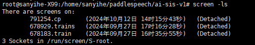
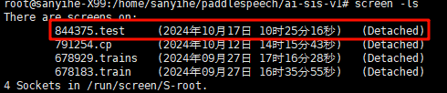
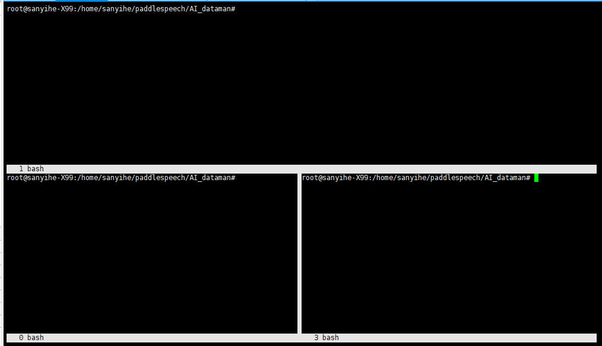

### 一、背景

系统管理员经常需要SSH 或者telent 远程登录到Linux 服务器，经常运行一些需要很长时间才能完成的任务，比如系统备份、ftp 传输等等。通常情况下我们都是为每一个这样的任务开一个远程终端窗口，因为它们执行的时间太长了。必须等待它们执行完毕，在此期间不能关掉窗口或者断开连接，否则这个任务就会被杀掉，一切半途而废了。

### 二、简介

**GNU Screen**是一款由GNU计划开发的用于命令行终端切换的自由软件。用户可以通过该软件同时连接多个本地或远程的命令行会话，并在其间自由切换。

GNU Screen可以看作是窗口管理器的命令行界面版本。它提供了统一的管理多个会话的界面和相应的功能。

- 会话恢复

  只要Screen本身没有终止，在其内部运行的会话都可以恢复。这一点对于远程登录的用户特别有用——即使网络连接中断，用户也不会失去对已经打开的命令行会话的控制。只要再次登录到主机上执行**screen -r**就可以恢复会话的运行。同样在暂时离开的时候，也可以执行分离命令**detach**，在保证里面的程序正常运行的情况下让Screen挂起（切换到后台）。这一点和图形界面下的VNC很相似。

- 多窗口

  在Screen环境下，所有的会话都独立的运行，并拥有各自的编号、输入、输出和窗口缓存。用户可以通过快捷键在不同的窗口下切换，并可以自由的重定向各个窗口的输入和输出。Screen实现了基本的文本操作，如复制粘贴等；还提供了类似滚动条的功能，可以查看窗口状况的历史记录。窗口还可以被分区和命名，还可以监视后台窗口的活动。

- 会话共享

  screen可以让一个或多个用户从不同终端多次登录一个会话，并共享会话的所有特性（比如可以看到完全相同的输出）。它同时提供了窗口访问权限的机制，可以对窗口进行密码保护。

GNU's Screen 官方站点：http://www.gnu.org/software/screen/

### 三、安装

```shell
# CentOS
yum install screen
# Debian/Ubuntu
apt install screen
```

### 四、基本命令

- 帮助查询

  ```shell
  # 查询screen提示
  screen -help # 通过这个命令，可以查询到大部常用命令
  ```

- 查看会话列表

  ```shell
  # 查看已经存在的 screen 会话
  screen -ls
  ```

   

- 新建 screen 会话

  ```shell
  screen  # 创建一个会话, 系统自动命名(形如:XXXX.pts-53.ubuntu)
  
  screen -S name # 创建名为name的会话
  
  screen -R name # 先试图恢复离线的会话。若找不到离线的会话，即建立新的screen会话。
  # 也就是 使用 -R 创建，如果之前有创建唯一一个同名的screen，则直接进入之前创建的screen
  # 而使用 -S 创建和直接输入 screen 创建，不会检录之前创建的screen（也就是会创建同名的screen)
  ```

- 退出当前 screen 会话， 并保存到后台运行

  在当前screen会话中，键盘按下 `Ctrl + a` 再按 `d` 即可保持这个screen到后台并回到主终端;

- 进入（恢复） 某一个 screen 会话

  ```shell
  screen -r <pid/name> # pid/name：为虚拟终端PID或Name
  ```

   

  其中 `844375` 为PID， `test` 为 Name

  那么回到 名为test 的screen 会话的命令为：

  ```shell
  screen -r 844375
  # 或 （在没有重名的screen会话情况下）
  screen -r test
  ```

- 窗口操作

  ```shell
  Ctrl+a+w # 展示当前会话中的所有窗口;
  Ctrl+a+c # 创建新窗口;
  Ctrl+a+n # 切换至下一个窗口;
  Ctrl+a+p # 切换至上一个窗口;
  Ctrl+a+num # 切换至编号为num的窗口;
  Ctrl+a+k # 杀死当前窗口，同时也将杀死这个窗口中正在运行的进程，如果一个Screen会话中最后一个窗口被关闭了，那么整个Screen会话也就退出了，screen进程会被终止。
  ```

- 删除某个会话

  可以先进入某个会话当中，使用 `exit`

  也可以在会话外使用命令：

  ```shell
  # 使用-R/-r/-S均可
  screen -R <pid/Name> -X quit
  ```


### 五、高级应用

screen 的两种状态： `Attached` 与 `Detach` 

- Attached（附加）

  当你“附加”到一个screen会话时，意味着你正在与该会话进行交互。你可以看到会话中运行的命令的输出，可以向会话发送输入命令。

- Detach（分离）

  “分离”是指你暂时离开一个screen会话，但会话本身继续在后台运行。这意味着即使你关闭了终端窗口或断开了与远程服务器的连接，screen会话中的进程仍然在运行。

screen 语法

`screen [-AmRvx -ls -wipe][-d <会话名称>][-h <行数>][-r <会话名称>][-s ][-S <会话名称>]`


| 参数选项      | 参数说明                                                     |
| ------------- | ------------------------------------------------------------ |
| -A            | 将所有的视窗都调整为目前终端机的大小                         |
| -d <pid/name> | 将指定的screen会话离线。                                     |
| -h <行数>     | 指定视窗的缓冲区行数。缓冲区用于存储窗口中的输出内容，以便在用户滚动查看时能够显示。 |
| -r <pid/name> | 恢复离线的screen会话。                                       |
| -R <name>     | 先试图恢复离线的作业。若找不到离线的作业，即建立新的screen作业。 |
| -s            | 指定建立新视窗时，所要执行的shell。例如bash(默认)，zsh，fish等 |
| -S <name>     | 创建名为name的screen                                         |
| -v            | 显示版本信息                                                 |
| -x            | 恢复之前离线的`screen`作业。与`-r`参数类似，但`-x`参数允许用户恢复之前因网络问题或其他原因而意外离线的`screen`会话。 |
| -X            | 用于发送特定的命令到已经存在的`screen`会话中                 |
| -ls 或 --list | 显示目前所有的`screen`作业。                                 |
| -wipe         | 检查目前所有的screen作业，并删除已经无法使用的screen作业     |


#### 会话共享

假设你在和朋友在不同地点以相同用户登录一台机器，然后你创建一个screen会话，你朋友可以在他的终端上命令

```shell
screen -x
```

这个命令会将你朋友的终端Attach到你的Screen会话上，并且你的终端不会被Detach。这样你就可以和朋友共享同一个会话了，如果你们当前又处于同一个窗口，那就相当于坐在同一个显示器前面，你的操作会同步演示给你朋友，你朋友的操作也会同步演示给你。当然，如果你们切换到这个会话的不同窗口中去，那还是可以分别进行不同的操作的。

#### 会话锁定与解锁

- 通过 `Ctrl + a + s` 可以锁定当前会话，锁定以后，任何输入都不会有反应，但是要注意虽然屏幕上看不到反应，但你的输入都会被Screen中的进程接收到。 `Ctrl + a + q` 进行解锁。
- 通过 `Ctrl + a + x` 锁定当前会话，不同的是，会话会被Screen所属用户的密码保护，需要输入密码进行解锁。

#### 屏幕切割

在当前会话中，使用 `Ctrl + a + S` 可以将显示器水平分割，然后 按 `Ctrl + a + <tab>`  在各个区块切换，每一个区块都可以创建窗口 `Ctrl + a + c ` 并在其中运行进程。

使用 `Ctrl + a + | ` 可以将显示器垂直分割。



使用 `Ctrl + a + X` 可以将当前焦点所在的屏幕区块进行关闭， 也可以使用 `Ctrl + a + Q` 关闭除当前区块之外其他的所有区块。

注意，关闭的区块中的窗口并不会关闭，还可以通过窗口切换找到它。


### 六、问题解决


#### screen内中文输出乱码

中文输出乱码，主要还是编码问题。一般旧版本screen会有这个问题，两个解决方法：

##### 方法一：修改配置文件

创建文件，并加入设置：

```shell
# 新建或修改文件
 vim ~/.screenrc
```

加入以下设置：

```txt
# 设置编码
defutf8 on
defencoding utf8
encoding UTF-8 UTF-8
```

再次开启虚拟终端，就可以看到中文不乱码了。

##### 方法二：单次设置编码

在创建和查看虚拟终端时，加上`-U`参数：

```shell
# 新建对话
screen -U -S new_screen
#切换会话(utf8编码查看)
screen -U -r new_screen
```


