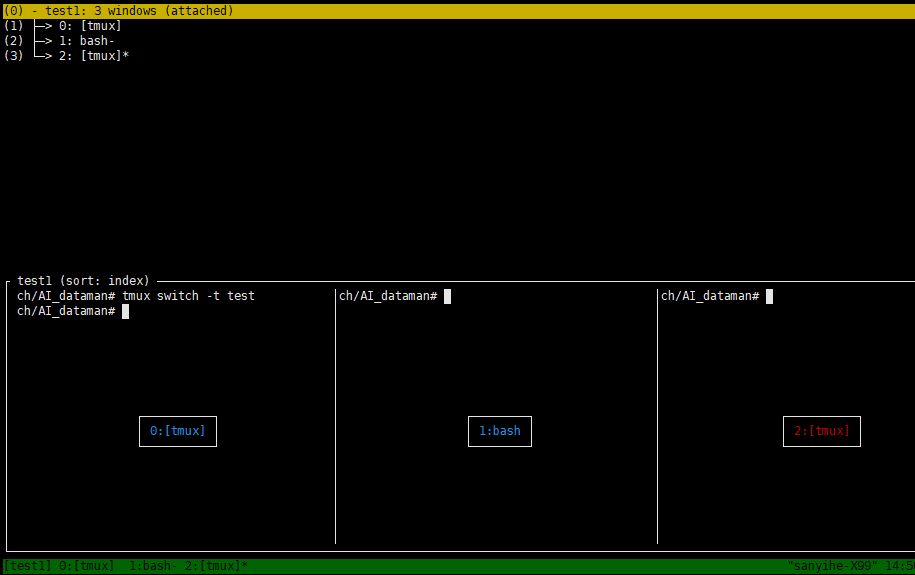

### 一、简介

tmux 和 screen 都是用于在 Unix-like 系统中进行终端多路复用的工具，它们具有类似的功能，但也有一些区别。下面是它们的优点和区别：

tmux 的优点和特点：

- 更现代的代码：tmux 是一个相对较新的项目，代码更现代化、维护更活跃，具有更好的可扩展性和可定制性。

- 更丰富的功能：tmux 提供了更丰富的功能集，包括窗格（panes）、窗口（windows）、会话（sessions）等，可以更灵活地管理多个终端会话。

- 更好的自定义性：tmux 支持通过配置文件进行各种自定义设置，用户可以根据自己的喜好和需求来配置键绑定、外观等。

- 更强大的脚本支持：tmux 提供了丰富的命令行接口和 API，可以通过脚本来实现更复杂的操作和自动化任务。

screen 的优点和特点：

- 成熟稳定：screen 是一个非常成熟且稳定的项目，已经存在了很长时间，并被广泛应用于各种 Unix-like 系统中。

- 易于上手：screen 的基本用法相对简单，易于上手，适合新手用户快速上手使用。

- 广泛支持：由于 screen 的历史悠久，它被广泛支持和集成到了许多 Linux 发行版和 Unix-like 系统中，几乎可以在任何系统中找到。

- 兼容性好：由于 screen 的普及程度和长期存在，它的配置文件格式和用法在不同系统之间基本保持一致，具有很好的兼容性。

区别：

- 配置和定制：tmux 提供了更灵活和丰富的配置选项，用户可以更精细地定制各种设置，而 screen 则相对简单直接，定制性不如 tmux。

- 键绑定：tmux 和 screen 的键绑定有所不同，tmux 的键绑定更符合现代习惯，而 screen 的键绑定则相对较老式。

- 性能：一般认为 tmux 在性能方面略优于 screen，尤其是在大规模或者复杂任务下，tmux 的性能更好一些。

总的来说，tmux 和 screen 都是非常强大的工具，选择使用哪个取决于个人偏好、需求和对功能的要求。新用户可能更倾向于使用 screen，而对于需要更丰富功能和定制性的用户，则可能更倾向于选择 tmux。

### 二、 安装tmux

```shell
# Ubuntu or Debian
sudo apt-get install tmux

# CentOS or Fedora
sudo yum install tmux

# Mac
brew install tmux
```


### 三、命令操作

基本概念

- session 会话

  会话是一个独立的终端环境，可以包含多个窗口和窗格，每个会话有独立的进程和状态。

- windows 窗口

  窗口允许用户在一个会话中运行多个不同的任务或程序。

- pane 窗格

  窗格是窗口一个独立的区域，可以看作是子窗口。允许用户在一个窗口中同时查看和运行多个不同的任务或程序


#### session 会话操作

- 新建session会话

  ```shell
  tmux # 会自动生成一个id为0的session
  tmux new -s <your-session-name>
  ```

   

  [test] 是当前会话的名称，如果未指定名称的话，默认从零开始编号

  0:bash*  表示当前会话中的第一个窗口，运行的唯一进程是bash。如果您运行一个程序，它的名称将出现在这里。星号 (*) 表示这是您正在查看的窗口

  

- 查看会话列表

  ```shell
  tmux ls # 列出已创建的会话，会话名称，会话含有窗口数，创建时间
  ```

   

  如果已经在tmux创建的会话中的话也可以依次按下键盘 `Ctrl + b + s` 进行查看，这个功能比较厉害，还可以预览各个会话的内容，并选择切换；

  

  > [!NOTE]
  >
  > 如果当前用户没有足够的权限访问 tmux 服务器套接字文件, 则会显示
  >
  >  .png)

  

- 分离session会话

  在tmux会话中， 按下 `Ctrl + b + d` 或输入以下命令，就将当前会话进行分离，转到后台运行

  ```shell
  tmux detach
  ```

   `tmux` 有一条消息告诉我们会话已分离。

   

- 附加session会话 （重新连接会话）

  ```shell
  tmux attach -t <your-session-name>
  tmux a -t <your-session-name> # 简写
  ```

- 切换session会话

  在tmux会话里面，使用以下指令，可以切换到另一个session会话

  ```shell
  tmux switch -t <your-session-name>
  ```

  也可以使用快捷键 `Ctrl + b + s ` 进行切换不同session会话，同时还可以预览session会话窗口的内容。

   

- 重命名session会话

  ```shell
  tmux rename-session -t <old-your-session-name> <new-your-session-name>
  ```

  也可以使用快捷键 `Ctrl + b + $` 来对当前session会话进行重命名

- 关闭session会话（杀死会话）

  ```shell
  tmux kill-session -t <your-session-name>
  ```

  如果已经在tmux创建的会话中的并且只有一个窗口和窗格的情况下可以按下键盘 `Ctrl + d` 关闭当前会话；

  


#### windows 窗口操作

- 新建窗口

  ```shell
  tmux new-window -n <your-window-name> # 新建一个指定名称的窗口
  ```

  也可以使用快捷键 `Ctrl + b + c` 来创建新窗口，默认从零开始编号。

- 切换窗口

  ```shell
  # 切换到指定编号的窗口
  tmux select-window -t <your-window-number>
  
  # 切换到指定名称的窗口
  tmux select-window -t <your-window-name>
  ```

  - `ctrl + b + p`: 切换到上一个窗口（按照状态栏的顺序）
  - `ctrl + b + n`: 切换到下一个窗口
  -  `ctrl + b + [0~9]` : 切换到编号为[0~9]的窗口
  - `ctrl + b + w`: 从列表中选择窗口（这个最好用）

   

- 重命名窗口

  ```shell
  tmux rename-window <new-your-window-name> # 为当前窗口重命名
  ```

  也可以使用快捷键 `Ctrl + b + , ` 为当前窗口重命名

- 关闭窗口

  使用快捷键 `Ctrl + b + &` 关闭当前窗口，会有提示，按y确定；

  当前窗口只有一个窗格的情况下可以按下键盘 `ctrl + d` 关闭当前窗口；

  当前窗口只有一个窗格的情况下可以按下键盘 `ctrl + b + x` 关闭当前窗格，由于只有一个窗格，关闭窗格后，窗口也会被关闭；


#### pane 窗格操作


- 划分窗格（新建窗格）

  ```shell
  # 划分为上下两个窗格
  tmux split-window
  
  # 划分左右两个窗格
  tmux split-window -h
  ```

  快捷键

  `Ctrl + b + %` : 左右划分

  `Ctrl + b + ''` : 上下划分

- 切换窗格

  `Ctrl + b + ↑`  光标切换到上方窗格

  `Ctrl + b + ↓`  光标切换到下方窗格

  `Ctrl + b + ←`  光标切换到左边窗格

  `Ctrl + b + →`  光标切换到右边窗格

  `Ctrl + b + o` 在当前窗口中选择下一窗格

  > [!NOTE]
  >
  > 在` tmux.conf` 添加如下命名，可以实现鼠标选中窗格和移动
  >
  > `set -g mouse on`

  

- 调整窗格

  `Ctrl + b + space` 依次切换窗格布局 依次包括even-horizontal、even-vertical、main-horizontal、main-vertical、tiled

  `Ctrl + b + {` 当前窗格与上一个窗格交换位置

  `Ctrl + b + }` 当前窗格与下一个窗格交换位置

  `Ctrl + b + z` 当前窗格全屏显示，再使用一次会变回原来大小

  `Ctrl + b + !` 将当前窗格拆分为一个独立窗口

  长按 `Ctrl + b`  再按 方向键，可以为当前窗格以1个单元格为单位移动边缘以调整当前窗格大小

- 窗格显示信息

  `Ctrl + b + q` 短暂显示当前窗口的每个窗格编号

  `Ctrl + b + t` 当前窗格显示小时钟 任意按键退出时钟

- 关闭窗格

  `Ctrl + b + x` 关闭当前窗格，有提示，按y确认关闭

  `Ctrl + d` 关闭当前窗格，不会提示，如果只有一个窗格，那么就会关闭窗口。

`screen` 命令也有窗格，但同样，它们使用起来不太直观。 `screen` 让我们烦恼的是，如果您分离带有窗格的会话，它们会在您重新附加该会话时消失。


#### 其他操作

```
# 列出所有快捷键，及其对应的 Tmux 命令
tmux list-keys

# 列出所有 Tmux 命令及其参数
tmux list-commands

# 列出当前所有 Tmux 会话的信息
tmux info

# 重新加载当前的 Tmux 配置
tmux source-file ~/.tmux.conf

# 上下翻屏
ctrl + b + [ , 然后通过方向键 上下移动 和 通过 PageUp,PageDown 上下翻页， q 退出翻屏模式。mac可以用fn + ↑ ↓实现上下翻页

# 帮助页面
ctrl + b + ? 
```


